## 01: pytest介绍及基本使用

官网：https://www.osgeo.cn/pytest/contents.html

pytest是python语言下的一种单元测试框架，与python自带的unittest单元测试框架类似，相比于unittest框架使用起来更简洁，效率更高。

（补充：java语言下的单元测试框架是junit和testng）

pytest可以结合requests实现接口测试，结合selenium/playwright、appium实现自动化功能测试。

 

### pytest特点

```py
具有unittest绝大部分功能，非常容易上手，入门简单，功能灵活，文档丰富，文档中有很多实例可以参考
具有强大灵活的fixture固件，支持简单的单元测试和复杂的功能测试；
支持参数化（parametrize）、数据驱动
执行测试过程中可以将某些测试跳过（skip），或者对某些预期失败的case标记成失败（xfail）
支持重复执行（rerun）失败的case
支持运行由nose ，unittest编写的测试case
支持执行部分用例（比如：根据标记，或者features、stories，后者一来allure-pytest插件）
具有很多第三方插件（顺序控制pytest-ordering、allure报告allure-pytest、多线程pytest-xdist、......），并且可以自定义开发插件
可生成html报告，也可以结合allure生成精美的测试报告10.方便的和持续集成工具jenkins集成
```

#### 和unittest区别

| **不同点** | **unittest**                                     | **pytest**                                                   |
| ---------- | ------------------------------------------------ | ------------------------------------------------------------ |
| 命名       | 测试方法以test开头                               | 模块名必须以test_开头，或者_test结尾类以Test开头方法/函数以test开头 |
| 框架结构   | 写case必须定义类，测试类要继承unitttest.TestCase | 不需要继承，可以是函数也可以是类中方法                       |
| 测试报告   | 使用HTMLTestRunner                               | 使用allure-pytest                                            |
| 数据驱动   | 参数化使用第三方ddt                              | 参数化使用自带的parametrize                                  |
| 断言       | 断言库丰富                                       | 采用python断言：使用assert关键字                             |
| 失败重试   | 不支持                                           | 支持                                                         |
| 固件       | -                                                | 灵活的fixture固件                                            |
| 扩展性     | -                                                | 快速自定义插件开发                                           |

#### pytest测试用例编写规则

测试框架在识别、加载用例的过程，称之为:**用例发现**
pytest的用例发现步骤:
	1.遍历所有的目录，例外: venv，.开头的目录
	2.打开**python文件**，test_开头 或  _test结尾
	3.遍历所有的Test开头**类**
	4.收集所有的 test_开头 的**函数或方法**

2.用例内容规则

pytest8.4增加了一个强制要求
pytest对用例的要求:
	1.可调用的(函数、方法、类、对象)
	2.名字test_开头
	3.没有参数(参数有另外含义)


| **类型**  | **规则**                                                     |
| --------- | ------------------------------------------------------------ |
| 模块      | 模块名必须以test_开头 或者  _test结尾：test_XXXXXX.py  或 XXXX_test.py |
| 类        | 测试类类名以Test开头：测试类中不能包含__init__构造方法，添加构造方法后就不是测试类了，里面的测试方法都识别不到 |
| 方法/函数 | test_开头：test_xxxxx                                        |
| 包        | 包名无特殊要求包必项要有__init__.py文件                      |
| 其他规则  | 1.执行时会遍历所有的目录，例外: venv，.开头的目录            |

 

### 安装pytest

前提：已经安装、配置python环境

参考：https://www.cnblogs.com/uncleyong/p/10778792.html

#### 通过命令安装

安装命令：pip install pytest

如果安装不了，请更换pip源，参考：https://www.cnblogs.com/uncleyong/p/17997261

如果已经安装，升级到最新版本：pip install -U pytest

#### 通过pycharm安装

pycharm中安装需要的包，在settings中，选择Python Interpreter，然后点击“+”

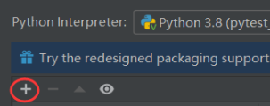

 

搜索要安装的包，右下角可以选择需要的版本，最后左下角安装即可

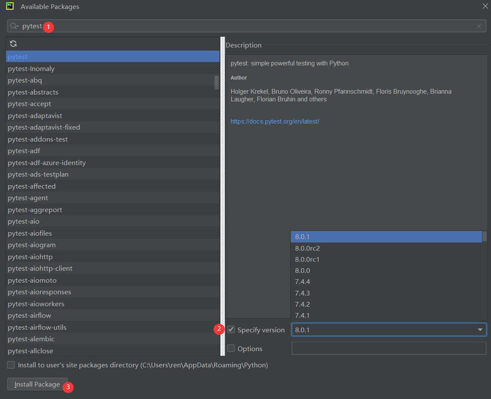

 

#### 验证是否安装成功

pytest --version


 

#### pycharm默认测试执行器

settings中，进入Tools -> Python Intergrated Tools，Default test runner默认是自动发现的，可以直接选择pytest

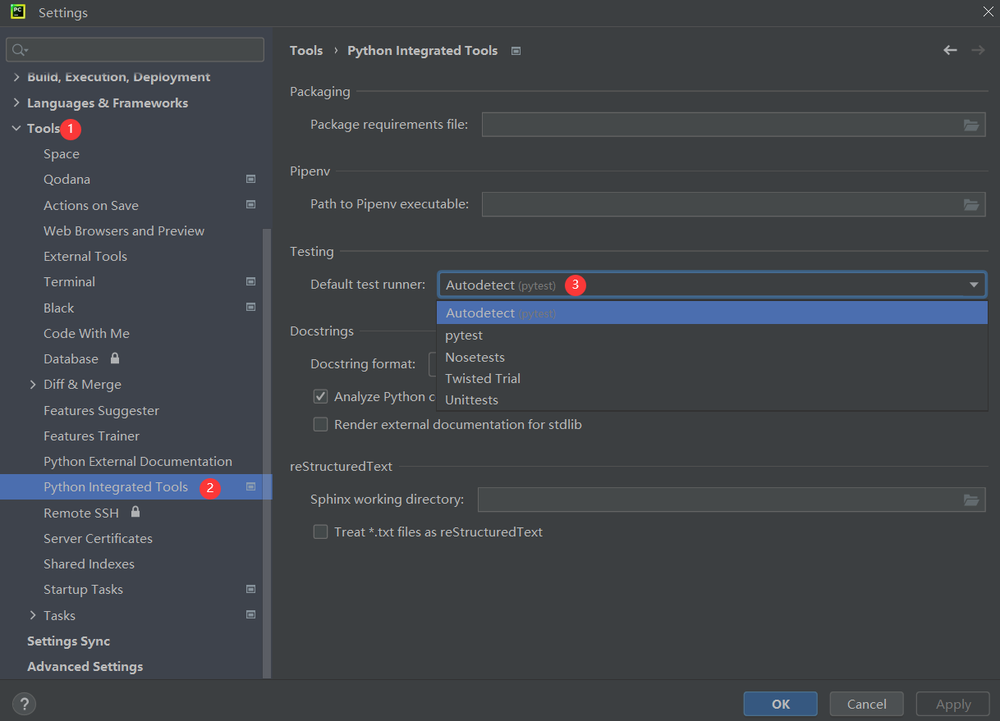

也可以settings中搜索pytest快速进入Python Intergrated Tools

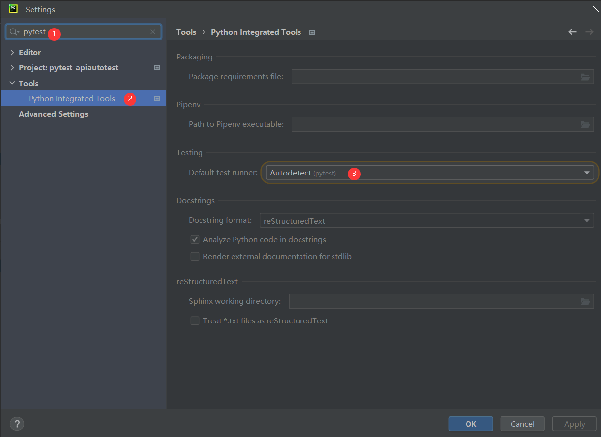

 总结

- 用pytest的解释器执行用例：1、命令行中直接执行pytest；2、pycharm中方法和类，直接点绿色执行按钮运行；模块和包，选中模块或者包，然后右键运行；或者非测试方法处点右键执行（因为pycharm已设置默认测试执行器是pytest）


- 用python的解释器执行用例：1、命令中执行python -m pytest调用pytest（jenkins持续集成可用到，可指定不同版本的python）；2、有main函数，命令中执行python xxx.py，调用py文件中main函数中的pytest.main()；说明：直接执行这个模块，被执行的模块是main（可print(__name__)查看结果），如果此模块被其它模块导入，这个模块就不是main了。

### pytest执行主要命令参数

| 参数           | 说明                                                         |
| -------------- | ------------------------------------------------------------ |
| --help         | 查看帮助，等同-h                                             |
| -q             | 简化控制台的输出，只输出执行结果，几条用例通过或不通过       |
| -v             | 详细输出，打印详细日志，可以看到用例执行的先后顺序、结果；如果不加-v，成功看到的是绿色.，失败看到的是红色F |
| -s             | 调试输出，就是输出print的内容，等价于pytest --capture=no，可以捕获print函数的输出一般和-v一起用，-vs |
| -k             | 测试方法名中包含指定关键字的测试用例，支持and、or、not比如：　　pytest -k test_2，或者pytest -k "test_2"　　pytest -k "test_2 or test_1"，这里要用双引号　　pytest -k "not test_1" |
| -m             | 通过标志表达式运行比如：pytest -m user，pytest -m "user"，将运行 @pytest.mark.user装饰器修饰的所有用例　　等价main中，pytest.main(["-m","user"])，一般加上-vs，pytest.main(["-vs","-m","user"]) |
| -n=2           | 多线程运行(依赖于插件)                                       |
| -x             | 用例一旦失败(fail/error)就立即停止测试（相当于冒烟测试，失败就停止，哪怕没执行完，也不用关心后面的执行结果），等价于pytest --exitfirst |
| --maxfail=n    | 在第n次失败后停止测试，也就是失败数达到num就停止             |
| --lf           | 重跑上次失败用例，等价于--last-failed；命令行参数使用缓存状态如果这些失败的都成功了，再次运行，会把所有成功的都运行，而不是没有失败的了就不运行了 |
| --collect-only | 收集测试用例(不执行)                                         |

#### 1、命令行参数

用于pytest运行时的参数，比如-k、-m等，有通用类、报告类、收集类、调试类、日志类等

==-h参数:pytest -h的结果分类：==

通用类


 

报告类

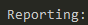

 

告警

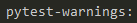

 

收集

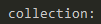

 

调试

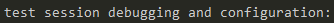

 

日志

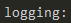

 

#### 2、元数据

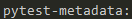


#### 3、配置参数：pytest.ini中配置的参数

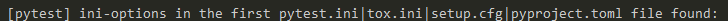

 

4.环境变量

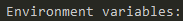

 

5.重跑失败

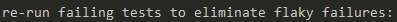

 

#### -s参数

示例：上面示例发现，如果用例执行成功，print内容没显示，可以加-s参数捕获print函数的输出

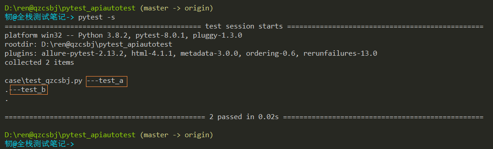

 

## 02: 用例查找规则

### 规则

pytest命令方式运行时，用例查找规则如下：

| **命令**                               | **说明**                        |
| -------------------------------------- | ------------------------------- |
| pytest（等价于：python -m pytest）     | 运行当前目录及子目录下所有用例  |
| pytest ./                              | 运行当前目录及子目录下所有用例  |
| pytest .\test_00.py -vs                | 指定模块运行                    |
| pytest -k test_2                       | 按关键字（函数/方法名）匹配运行 |
| pytest .\test_00.py::test_a            | 指定函数运行                    |
| pytest .\test_00.py::TestDemo1         | 指定类运行                      |
| pytest .\test_00.py::TestDemo1::test_c | 指定类方法运行                  |

### 执行演示

创建My_Pytest工程，添加测试Demo。以测试add函数为例子，创建测试用例


`Testcase/test_00.py`

```python
import pytest

def inc (x):
    return x + 1

def test_a ( ):
    print("---test_a")
    assert inc(0) == 1


class TestDemo1:
    def test_b (self):
        print("---test_b")
        assert "D" in "Demo"

    def test_c (self):
        print("---test_c")
        assert "em" in "Demo"


class TestDemo2:
    def test_d (self):
        print("---test_d")
        assert "mo" in "Demo"


def add(a,b):
    return a + b

class TestAdd:
    def test_add_int(self):
        print("---test_add_int")
        res = add(1,3)
        assert res == 4

    def test_add_str(self):
        print("---test_add_str")
        res = add("aaa","bbb")
        assert res == "aaabbb"

    def test_add_list(self):
        print("---test_add_list")
        res = add([1],[2,3,4])
        assert res == [1,2,3,4]
```

`Testcase/test_01.py`

```python
import pytest

def test_1():
    print("---test_1")
    assert 1 == 1
```

`Testcase/test_02.py`

```python
import pytest

def test_2 ( ):
    print("---test_2")
    assert 1 == 1
```


测试结果：下面命令都统一加上了-vs参数

(1) pytest

运行当前目录及子目录下所有用例 

(2) pytest ./ -vs

运行了当前目录及子目录下所有用例

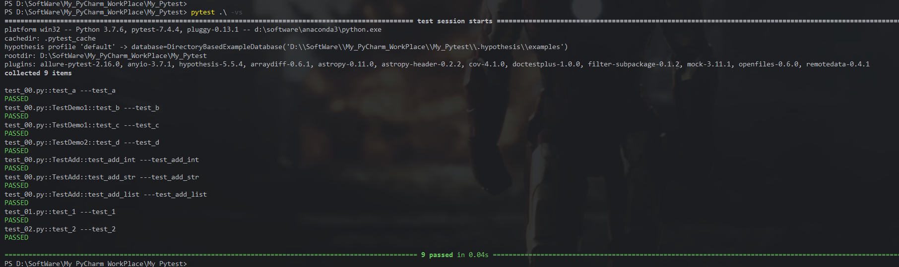

(3) pytest .\test_00.py -vs

指定模块运行 


(4) pytest -k test_2 -vs

按关键字（函数/方法名）匹配运行


(5) pytest .\test_00.py::test_a

指定函数运行


(6) pytest .\test_00.py::TestDemo1

指定类运行


(7) pytest .\test_00.py::TestDemo1::test_c

指定方法运行


## 03: pytest固件、及用例执行顺序

### 固件分类

固件用于执行前的初始化参数、执行后的清理动作。

| 类型                                          | 规则                                                         |
| --------------------------------------------- | ------------------------------------------------------------ |
| setup_module/teardown_module                  | 全局模块级模块运行前/后运行（只运行一次）                    |
| setup_function/teardown_function              | 函数级每个函数用例运行前/后运行                              |
| setup_class/teardown_class                    | 类级每个class运行前/后运行(只运行一次)                       |
| setup_method(setup)/teardown_method(teardown) | 方法级类中每个方法用例执行前/后运行，setup_method和setup、teardown_method和teardown二选一即可 |


示例（Testcase/test_03.py）：一个module，两个函数，两个类，每个类两个方法

```python
## 一个module，两个函数，两个类，每个类两个方法

import pytest

def setup_module ( ):
    print("初始化：setup_module")

def teardown_module ( ):
    print("清理：teardown_module")

def setup_function ( ):
    print("初始化：setup_function")

def teardown_function ( ):
    print("清理：teardown_function")


def test_f ( ):
    print("--------------test_f")

class Test01:
    def setup_class (self):
        print("初始化：setup_class1")

    def teardown_class (self):
        print("清理：teardown_class1")

    def setup_method (self):
        print("初始化：setup_method1")

    def teardown_method (self):
        print("清理：teardown_method1")

    def test_c (self):
        print("--------------test_c")

    def test_d (self):
        print("--------------test_d")


class Test02:
    def setup_class (self):
        print("初始化：setup_class2")

    def teardown_class (self):
        print("清理：teardown_class2")

    def setup_method (self):
        print("初始化：setup_method2")

    def teardown_method (self):
        print("清理：teardown_method2")

    def test_a (self):
        print("--------------test_a")

    def test_b (self):
        print("--------------test_b")


def test_e ( ):
    print("--------------test_e")
```


运行结果：通过结果可以看到，固件执行规则和我们最开始描述的一致

全集模块级(setup/teardown)  --> 函数级别(setup/teardown)  --> 模块级(setup/teardown)

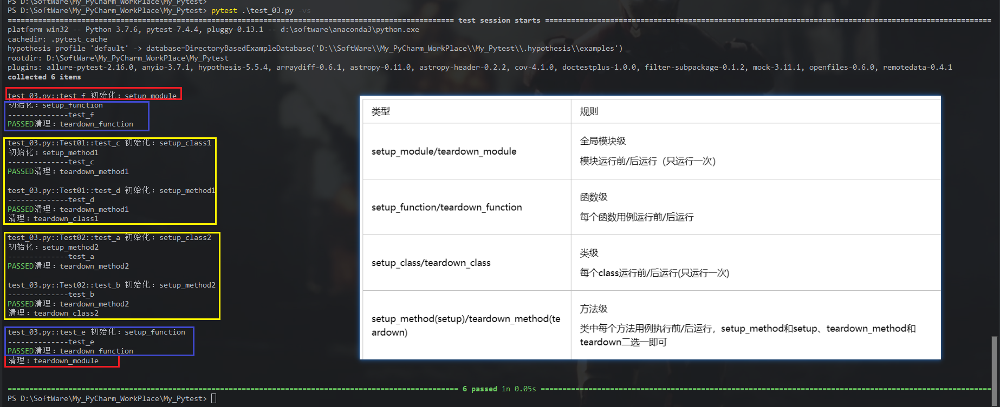


默认用例执行顺序

**pytest框架默认根据书写代码的先后顺序来执行**

```python
## 默认用例执行顺序

import pytest

def setup_module ():
    print("初始化：setup_module")

def teardown_module ():
    print("清理：teardown_module")

def setup_function ():
    print("初始化：setup_function")

def teardown_function ():
    print("清理：teardown_function")


def test_f ( ):
    print("--------------test_f")


class Test01:
    def setup_class (self):
        print("初始化：setup_class1")

    def teardown_class (self):
        print("清理：teardown_class1")

    def setup_method (self):
        print("初始化：setup_method1")

    def teardown_method (self):
        print("清理：teardown_method1")

    def test_d (self):
        print("--------------test_d")

    def test_c (self):
        print("--------------test_c")


class Test02:
    def setup_class (self):
        print("初始化：setup_class2")

    def teardown_class (self):
        print("清理：teardown_class2")

    def setup_method (self):
        print("初始化：setup_method2")

    def teardown_method (self):
        print("清理：teardown_method2")

    def test_b (self):
        print("--------------test_b")

    def test_a (self):
        print("--------------test_a")


def test_e ():
    print("--------------test_e")
```

执行结果：pytest框架默认根据书写代码的先后顺序来执行


## 04: mark标记测试用例

### 前言

通常，我们通过分包或者分模块来对用例进行分类管理，如果只想执行符合某要求的部分用例，该如何实现呢？

可以使用装饰器@pytest.mark.xxx给用例打标签（自定义标记）。

### 1、用户自定义标记

**作用**：只能用于实现用例筛选（既类似 -m 参数的的作用）

> **使用流程**：
>
> 1、注册自定义标记（通过pytest.ini进行管理）/ 直接在命令参数中使用
> 2、将模块、函数、类、方法进行业务标记
> 3、根据自定义标记运行用例

（1）命令参数配置

```python
## 常用参数
-v : 增加结果详细程度
-s : 在用例中正常使用输入输出
-x : 当遇到失败用例时，快速推出
-m : 用例筛选（指定执行哪些用例）
```

（2）pytest.ini 配置

```python
pytest
```

查看配置

```python
pytest -h
## 以 -/--开头：命令行参数
## 小写字母开头：ini配置
## 大写字母开头：环境遍历
```

- 以 -/--开头：命令行参数

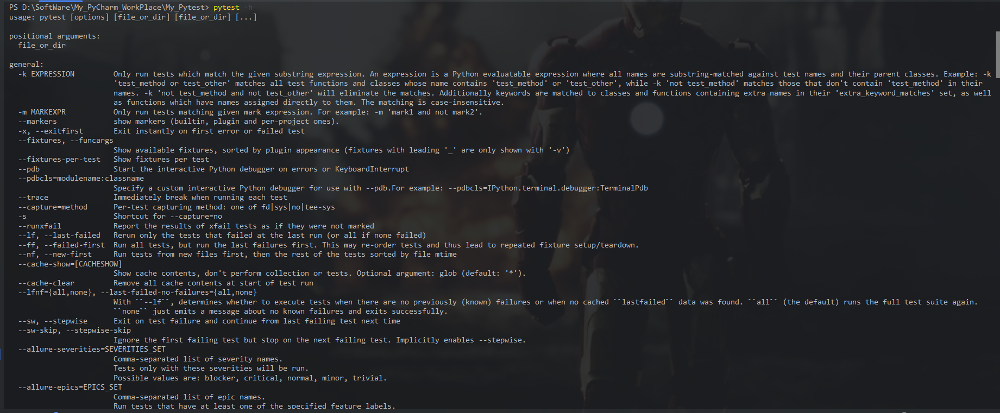

- 小写字母开头：ini配置


- 大写字母开头：环境遍历


#### Demo:注册自定义标记

> **步骤：**
>
> （1）先注册：在ini文件中进行声明
> （2）再标记：在用例文件中，对用例进行标记
> （3）后筛选

##### (1) 注册自定义标记

在pytest.ini文件中注册

```python
[pytest]
markers =
    api:接口相关
    web:UI相关
    ut:单元测试
    login:登陆相关
    pay:支付相关
```

说明：

```
1.标记名要是英文命名，建议参考模块命名，要有业务含义
2.所有自定义标记，建议在pytest.ini中进行统一管理，并通过命令参数--strict-markers进行授权（非必须）
3.pytest中的markers配置相当于我们对用例的一种归类
```

###### 获取现有标记（所有）

```python
pytest --markers
```

 包含自定义和内置，前面几个是我们刚刚创建的


开启严格标记，如果标记不在配置文件中，会报错；

不开启严格标记，如果标记不在配置文件中，会warning；

```python
[pytest]
addopts = --strict-markers
markers =
    user: user marker
    product: product marker
    findproduct
    deleteproduct
    modulex: modulex marker
```

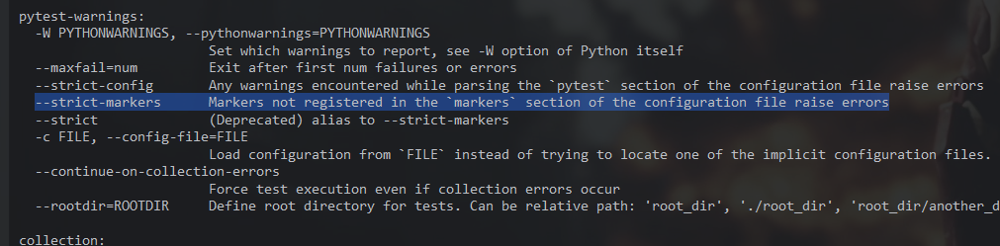


##### (2) 在测试用例中，使用自定义标记

Testcase/test_04.py

```python
import pytest
# 使用用户自定义标记

def add(a,b):
    return a + b

class TestAdd:
    @pytest.mark.api
    def test_add_int(self):
        print("---test_add_int")
        res = add(1,3)
        assert res == 4

    @pytest.mark.web
    def test_add_str(self):
        print("---test_add_str")
        res = add("aaa","bbb")
        assert res == "aaabbb"

    @pytest.mark.ut
    def test_add_list(self):
        print("---test_add_list")
        res = add([1],[2,3,4])
        assert res == [1,2,3,4]

    @pytest.mark.login
    def test_add_float(self):
        print("---test_add_float")
        res = add(1.2,3.4)
        assert res == 3.6

    @pytest.mark.pay
    def test_add_number(self):
        print("---test_add_number")
        res = add(11,33)
        assert res == 44
```

##### (3) 执行用例

###### (A) 直接执行，无 `-m`参数

作用： 与pytest直接运行类似，**没有起到筛选功能**


###### (B) 使用 -m 参数，加上自定义标记，起到筛选功能

命令：`pytest -vs test_04.py -m [自定义标记名]`

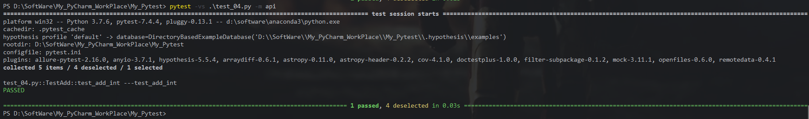


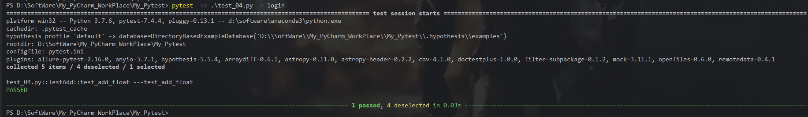


### 2、框架内置标记使用流程

框架内置标记可以为用例增加特殊执行效果

和用户自定义标记区别:

> 1.无需注册，直接使用
> 2.不仅可以筛选，还可以增加特殊效果
> 3.不同标记，增加不同的特殊效果

💡常用的几个内置标记及其含义如下：

| 标记 (Marker)                     | 含义与核心作用                                               |
| :-------------------------------- | :----------------------------------------------------------- |
| **`@pytest.mark.parametrize`**    | **参数化测试**：允许用一个测试函数，通过传入不同的参数组合来执行多次，能极大地减少重复代码。 |
| **`@pytest.mark.skip`**           | **无条件跳过**：无论什么情况，都会跳过被标记的测试用例，可以指定跳过的原因 。 |
| **`@pytest.mark.skipif`**         | **条件跳过**：只有当给定的条件为 `True` 时，才会跳过该测试用例，用于处理环境依赖等问题 。 |
| **`@pytest.mark.xfail`**          | **预期失败**：用于标记一个预期会失败的测试。这个标记主要用于测试某个已知但尚未修复的缺陷 。<br>如果它真的失败了，结果会被记录为 `xfail`；<br>如果它意外成功了，结果会记录为 `xpass`。 |
| **`@pytest.mark.usefixtures`**    | **自动使用夹具**：为被标记的测试函数或类，自动应用指定的夹具（fixture），即使测试函数本身的参数列表里没有显式声明要用它 。 |
| **`@pytest.mark.filterwarnings`** | **过滤警告**：在测试函数级别，对执行期间产生的警告进行过滤，可以忽略某些已知的、不重要的警告信息 。 |

#### 测试用例

Testcase/test_05.py

```python

import pytest

# 使用pytest框架内置标记

def add(a,b):
    return a + b

class TestAdd:
    @pytest.mark.skip
    def test_add_int(self):
        print("---test_add_int")
        res = add(1,3)
        assert res == 4

    # 使用满足条件跳过，其中条件为1=2，显然是不满足的，因此该用例仍会执行
    @pytest.mark.skipif("1==2")
    def test_add_str(self):
        print("---test_add_str")
        res = add("aaa","bbb")
        assert res == "aaabbb"

    # 断言相等，用例通过
    @pytest.mark.xfail
    def test_add_list_01(self):
        print("---test_add_list_01")
        res = add([1],[2,3,4])
        assert res == [1,2,3,4]

    # 断言不相等，用例失败
    @pytest.mark.xfail
    def test_add_list_02(self):
        print("---test_add_list_02")
        res = add([1],[2,3,4])
        assert res != [1,2,3,4]
```

#### 运行结果

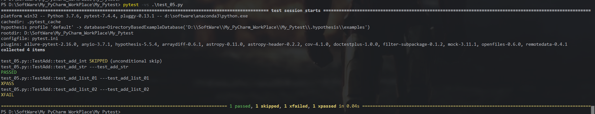

 

## 05: pytest的配置文件pytest.ini

### 简介

pytest.ini是pytest的主配置文件，可以添加配置改变pytest的默认行为，这样不用我们每次执行都在命令行中指定很多参数；

此配置文件通常放到项目根目录下。

### 配置项

行`pytest -h`,查看可用于pytest.ini的配置

```python
PS D:\SoftWare\My_PyCharm_WorkPlace\My_Pytest> pytest -h
usage: pytest [options] [file_or_dir] [file_or_dir] [...]

positional arguments:
  file_or_dir

general:
  -k EXPRESSION         Only run tests which match the given substring expression. An expression is a Python evaluatable expression where all names are substring-matched against test names and their parent classes. Example: -k
                        'test_method or test_other' matches all test functions and classes whose name contains 'test_method' or 'test_other', while -k 'not test_method' matches those that don't contain 'test_method' in their
                        names. -k 'not test_method and not test_other' will eliminate the matches. Additionally keywords are matched to classes and functions containing extra names in their 'extra_keyword_matches' set, as well
                        as functions which have names assigned directly to them. The matching is case-insensitive.
  -m MARKEXPR           Only run tests matching given mark expression. For example: -m 'mark1 and not mark2'.
  --markers             show markers (builtin, plugin and per-project ones).
  -x, --exitfirst       Exit instantly on first error or failed test
  --fixtures, --funcargs
                        Show available fixtures, sorted by plugin appearance (fixtures with leading '_' are only shown with '-v')
  --fixtures-per-test   Show fixtures per test
  --pdb                 Start the interactive Python debugger on errors or KeyboardInterrupt
  --pdbcls=modulename:classname
                        Specify a custom interactive Python debugger for use with --pdb.For example: --pdbcls=IPython.terminal.debugger:TerminalPdb
  --trace               Immediately break when running each test
  --capture=method      Per-test capturing method: one of fd|sys|no|tee-sys
  -s                    Shortcut for --capture=no
  --runxfail            Report the results of xfail tests as if they were not marked
  --lf, --last-failed   Rerun only the tests that failed at the last run (or all if none failed)
  --ff, --failed-first  Run all tests, but run the last failures first. This may re-order tests and thus lead to repeated fixture setup/teardown.
  --nf, --new-first     Run tests from new files first, then the rest of the tests sorted by file mtime
  --cache-show=[CACHESHOW]
                        Show cache contents, don't perform collection or tests. Optional argument: glob (default: '*').
  --cache-clear         Remove all cache contents at start of test run
  --lfnf={all,none}, --last-failed-no-failures={all,none}
                        With ``--lf``, determines whether to execute tests when there are no previously (known) failures or when no cached ``lastfailed`` data was found. ``all`` (the default) runs the full test suite again.
                        ``none`` just emits a message about no known failures and exits successfully.
  --sw, --stepwise      Exit on test failure and continue from last failing test next time
  --sw-skip, --stepwise-skip
                        Ignore the first failing test but stop on the next failing test. Implicitly enables --stepwise.
  --allure-severities=SEVERITIES_SET
                        Comma-separated list of severity names.
                        Tests only with these severities will be run.
                        Possible values are: blocker, critical, normal, minor, trivial.
  --allure-epics=EPICS_SET
                        Comma-separated list of epic names.
                        Run tests that have at least one of the specified feature labels.
  --allure-features=FEATURES_SET
                        Comma-separated list of feature names.
                        Run tests that have at least one of the specified feature labels.
  --allure-stories=STORIES_SET
                        Comma-separated list of story names.
                        Run tests that have at least one of the specified story labels.
  --allure-ids=IDS_SET  Comma-separated list of IDs.
                        Run tests that have at least one of the specified id labels.
  --allure-label=LABELS_SET
                        List of labels to run in format label_name=value1,value2.
                        "Run tests that have at least one of the specified labels.
  --allure-link-pattern=LINK_TYPE:LINK_PATTERN
                        Url pattern for link type. Allows short links in test,
                        like 'issue-1'. Text will be formatted to full url with python
                        str.format().
  --arraydiff           Enable comparison of arrays to reference arrays stored in files
  --arraydiff-generate-path=ARRAYDIFF_GENERATE_PATH
                        directory to generate reference files in, relative to location where py.test is run
  --arraydiff-reference-path=ARRAYDIFF_REFERENCE_PATH
                        directory containing reference files, relative to location where py.test is run
  --arraydiff-default-format=ARRAYDIFF_DEFAULT_FORMAT
                        Default format for the reference arrays (can be 'fits' or 'text' currently)

Reporting:
  --durations=N         Show N slowest setup/test durations (N=0 for all)
  --durations-min=N     Minimal duration in seconds for inclusion in slowest list. Default: 0.005.
  -v, --verbose         Increase verbosity
  --no-header           Disable header
  --no-summary          Disable summary
  -q, --quiet           Decrease verbosity
  --verbosity=VERBOSE   Set verbosity. Default: 0.
  -r chars              Show extra test summary info as specified by chars: (f)ailed, (E)rror, (s)kipped, (x)failed, (X)passed, (p)assed, (P)assed with output, (a)ll except passed (p/P), or (A)ll. (w)arnings are enabled by
                        default (see --disable-warnings), 'N' can be used to reset the list. (default: 'fE').
  --disable-warnings, --disable-pytest-warnings
                        Disable warnings summary
  -l, --showlocals      Show locals in tracebacks (disabled by default)
  --no-showlocals       Hide locals in tracebacks (negate --showlocals passed through addopts)
  --tb=style            Traceback print mode (auto/long/short/line/native/no)
  --show-capture={no,stdout,stderr,log,all}
                        Controls how captured stdout/stderr/log is shown on failed tests. Default: all.
  --full-trace          Don't cut any tracebacks (default is to cut)
  --color=color         Color terminal output (yes/no/auto)
  --code-highlight={yes,no}
                        Whether code should be highlighted (only if --color is also enabled). Default: yes.
  --pastebin=mode       Send failed|all info to bpaste.net pastebin service
  --junit-xml=path      Create junit-xml style report file at given path
  --junit-prefix=str    Prepend prefix to classnames in junit-xml output

pytest-warnings:
  -W PYTHONWARNINGS, --pythonwarnings=PYTHONWARNINGS
                        Set which warnings to report, see -W option of Python itself
  --maxfail=num         Exit after first num failures or errors
  --strict-config       Any warnings encountered while parsing the `pytest` section of the configuration file raise errors
  --strict-markers      Markers not registered in the `markers` section of the configuration file raise errors
  --strict              (Deprecated) alias to --strict-markers
  -c FILE, --config-file=FILE
                        Load configuration from `FILE` instead of trying to locate one of the implicit configuration files.
  --continue-on-collection-errors
                        Force test execution even if collection errors occur
  --rootdir=ROOTDIR     Define root directory for tests. Can be relative path: 'root_dir', './root_dir', 'root_dir/another_dir/'; absolute path: '/home/user/root_dir'; path with variables: '$HOME/root_dir'.

collection:
  --collect-only, --co  Only collect tests, don't execute them
  --pyargs              Try to interpret all arguments as Python packages
  --ignore=path         Ignore path during collection (multi-allowed)
  --ignore-glob=path    Ignore path pattern during collection (multi-allowed)
  --deselect=nodeid_prefix
                        Deselect item (via node id prefix) during collection (multi-allowed)
  --confcutdir=dir      Only load conftest.py's relative to specified dir
  --noconftest          Don't load any conftest.py files
  --keep-duplicates     Keep duplicate tests
  --collect-in-virtualenv
                        Don't ignore tests in a local virtualenv directory
  --import-mode={prepend,append,importlib}
                        Prepend/append to sys.path when importing test modules and conftest files. Default: prepend.
  --doctest-modules     Run doctests in all .py modules
  --doctest-report={none,cdiff,ndiff,udiff,only_first_failure}
                        Choose another output format for diffs on doctest failure
  --doctest-glob=pat    Doctests file matching pattern, default: test*.txt
  --doctest-ignore-import-errors
                        Ignore doctest ImportErrors
  --doctest-continue-on-failure
                        For a given doctest, continue to run after the first failure

test session debugging and configuration:
  --basetemp=dir        Base temporary directory for this test run. (Warning: this directory is removed if it exists.)
  -V, --version         Display pytest version and information about plugins. When given twice, also display information about plugins.
  -h, --help            Show help message and configuration info
  -p name               Early-load given plugin module name or entry point (multi-allowed). To avoid loading of plugins, use the `no:` prefix, e.g. `no:doctest`.
  --trace-config        Trace considerations of conftest.py files
  --debug=[DEBUG_FILE_NAME]
                        Store internal tracing debug information in this log file. This file is opened with 'w' and truncated as a result, care advised. Default: pytestdebug.log.
  -o OVERRIDE_INI, --override-ini=OVERRIDE_INI
                        Override ini option with "option=value" style, e.g. `-o xfail_strict=True -o cache_dir=cache`.
  --assert=MODE         Control assertion debugging tools.
                        'plain' performs no assertion debugging.
                        'rewrite' (the default) rewrites assert statements in test modules on import to provide assert expression information.
  --setup-only          Only setup fixtures, do not execute tests
  --setup-show          Show setup of fixtures while executing tests
  --setup-plan          Show what fixtures and tests would be executed but don't execute anything

logging:
  --log-level=LEVEL     Level of messages to catch/display. Not set by default, so it depends on the root/parent log handler's effective level, where it is "WARNING" by default.
  --log-format=LOG_FORMAT
                        Log format used by the logging module
  --log-date-format=LOG_DATE_FORMAT
                        Log date format used by the logging module
  --log-cli-level=LOG_CLI_LEVEL
                        CLI logging level
  --log-cli-format=LOG_CLI_FORMAT
                        Log format used by the logging module
  --log-cli-date-format=LOG_CLI_DATE_FORMAT
                        Log date format used by the logging module
  --log-file=LOG_FILE   Path to a file when logging will be written to
  --log-file-level=LOG_FILE_LEVEL
                        Log file logging level
  --log-file-format=LOG_FILE_FORMAT
                        Log format used by the logging module
  --log-file-date-format=LOG_FILE_DATE_FORMAT
                        Log date format used by the logging module
  --log-auto-indent=LOG_AUTO_INDENT
                        Auto-indent multiline messages passed to the logging module. Accepts true|on, false|off or an integer.
  --log-disable=LOGGER_DISABLE
                        Disable a logger by name. Can be passed multiple times.

reporting:
  --alluredir=DIR       Generate Allure report in the specified directory (may not exist)
  --clean-alluredir     Clean alluredir folder if it exists
  --allure-no-capture   Do not attach pytest captured logging/stdout/stderr to report
  --inversion=INVERSION
                        Run tests not in testplan

Hypothesis:
  --hypothesis-profile=HYPOTHESIS_PROFILE
                        Load in a registered hypothesis.settings profile
  --hypothesis-verbosity={quiet,normal,verbose,debug}
                        Override profile with verbosity setting specified
  --hypothesis-show-statistics
                        Configure when statistics are printed
  --hypothesis-seed=HYPOTHESIS_SEED
                        Set a seed to use for all Hypothesis tests

astropy header options:
  --astropy-header      Show the pytest-astropy header
  --astropy-header-packages=ASTROPY_HEADER_PACKAGES
                        Comma-separated list of packages to include in the header

coverage reporting with distributed testing support:
  --cov=[SOURCE]        Path or package name to measure during execution (multi-allowed). Use --cov= to not do any source filtering and record everything.
  --cov-reset           Reset cov sources accumulated in options so far.
  --cov-report=TYPE     Type of report to generate: term, term-missing, annotate, html, xml, json, lcov (multi-allowed). term, term-missing may be followed by ":skip-covered". annotate, html, xml, json and lcov may be followed
                        by ":DEST" where DEST specifies the output location. Use --cov-report= to not generate any output.
  --cov-config=PATH     Config file for coverage. Default: .coveragerc
  --no-cov-on-fail      Do not report coverage if test run fails. Default: False
  --no-cov              Disable coverage report completely (useful for debuggers). Default: False
  --cov-fail-under=MIN  Fail if the total coverage is less than MIN.
  --cov-append          Do not delete coverage but append to current. Default: False
  --cov-branch          Enable branch coverage.
  --cov-context=CONTEXT
                        Dynamic contexts to use. "test" for now.

Custom options:
  --run-slow            run slow tests
  --run-hugemem         run memory intensive tests
  -R [{astropy,any,github,none}]
                        run tests with online data, requires pytest-remotedata
  --doctest-plus        enable running doctests with additional features not found in the normal doctest plugin
  --doctest-ufunc       enable running doctests in docstrings of Numpy ufuncs
  --doctest-rst         Enable running doctests in .rst documentation. This is no longer recommended, use --doctest-glob instead.
  --text-file-format=TEXT_FILE_FORMAT
                        Text file format for narrative documentation. Options accepted are 'txt', 'tex', and 'rst'. This is no longer recommended, use --doctest-glob instead.
  --doctest-plus-atol=DOCTEST_PLUS_ATOL
                        set the absolute tolerance for float comparison
  --doctest-plus-rtol=DOCTEST_PLUS_RTOL
                        set the relative tolerance for float comparison
  --doctest-only        Test only doctests. Implies usage of doctest-plus.
  -P PACKAGE, --package=PACKAGE
                        The name of a specific package to test, e.g. 'io.fits' or 'utils'. Accepts comma separated string to specify multiple packages.
  --open-files          fail if any test leaves files open
  --remote-data=[{astropy,any,github,none}]
                        run tests with online data

[pytest] ini-options in the first pytest.ini|tox.ini|setup.cfg|pyproject.toml file found:

  markers (linelist):   Markers for test functions
  empty_parameter_set_mark (string):
                        Default marker for empty parametersets
  norecursedirs (args): Directory patterns to avoid for recursion
  testpaths (args):     Directories to search for tests when no files or directories are given on the command line
  filterwarnings (linelist):
                        Each line specifies a pattern for warnings.filterwarnings. Processed after -W/--pythonwarnings.
  usefixtures (args):   List of default fixtures to be used with this project
  python_files (args):  Glob-style file patterns for Python test module discovery
  python_classes (args):
                        Prefixes or glob names for Python test class discovery
  python_functions (args):
                        Prefixes or glob names for Python test function and method discovery
  disable_test_id_escaping_and_forfeit_all_rights_to_community_support (bool):
                        Disable string escape non-ASCII characters, might cause unwanted side effects(use at your own risk)
  console_output_style (string):
                        Console output: "classic", or with additional progress information ("progress" (percentage) | "count" | "progress-even-when-capture-no" (forces progress even when capture=no)
  xfail_strict (bool):  Default for the strict parameter of xfail markers when not given explicitly (default: False)
  tmp_path_retention_count (string):
                        How many sessions should we keep the `tmp_path` directories, according to `tmp_path_retention_policy`.
  tmp_path_retention_policy (string):
                        Controls which directories created by the `tmp_path` fixture are kept around, based on test outcome. (all/failed/none)
  enable_assertion_pass_hook (bool):
                        Enables the pytest_assertion_pass hook. Make sure to delete any previously generated pyc cache files.
  junit_suite_name (string):
                        Test suite name for JUnit report
  junit_logging (string):
                        Write captured log messages to JUnit report: one of no|log|system-out|system-err|out-err|all
  junit_log_passing_tests (bool):
                        Capture log information for passing tests to JUnit report:
  junit_duration_report (string):
                        Duration time to report: one of total|call
  junit_family (string):
                        Emit XML for schema: one of legacy|xunit1|xunit2
  doctest_optionflags (args):
                        option flags for doctests
  doctest_encoding (string):
                        Encoding used for doctest files
  cache_dir (string):   Cache directory path
  log_level (string):   Default value for --log-level
  log_format (string):  Default value for --log-format
  log_date_format (string):
                        Default value for --log-date-format
  log_cli (bool):       Enable log display during test run (also known as "live logging")
  log_cli_level (string):
                        Default value for --log-cli-level
  log_cli_format (string):
                        Default value for --log-cli-format
  log_cli_date_format (string):
                        Default value for --log-cli-date-format
  log_file (string):    Default value for --log-file
  log_file_level (string):
                        Default value for --log-file-level
  log_file_format (string):
                        Default value for --log-file-format
  log_file_date_format (string):
                        Default value for --log-file-date-format
  log_auto_indent (string):
                        Default value for --log-auto-indent
  pythonpath (paths):   Add paths to sys.path
  faulthandler_timeout (string):
                        Dump the traceback of all threads if a test takes more than TIMEOUT seconds to finish
  addopts (args):       Extra command line options
  minversion (string):  Minimally required pytest version
  required_plugins (args):
                        Plugins that must be present for pytest to run
  astropy_header (bool):
                        Show the pytest-astropy header
  astropy_header_packages (linelist):
                        Comma-separated list of packages to include in the header
  text_file_format (string):
                        Default format for docs. This is no longer recommended, use --doctest-glob instead.
  doctest_optionflags (args):
                        option flags for doctests
  doctest_plus (string):
                        enable running doctests with additional features not found in the normal doctest plugin
  doctest_ufunc (string):
                        enable running doctests in docstrings of Numpy ufuncs
  doctest_norecursedirs (args):
                        like the norecursedirs option but applies only to doctest collection
  doctest_rst (string): Run the doctests in the rst documentation
  doctest_plus_atol (string):
                        set the absolute tolerance for float comparison
  doctest_plus_rtol (string):
                        set the relative tolerance for float comparison
  text_file_comment_chars (linelist):
                        list of pairs in format file_extension=comment_chars, eg: .rst=..
  doctest_subpackage_requires (linelist):
                        A list of paths to skip if requirements are not satisfied.Each item in the list should have the syntax path=req1;req2
  mock_traceback_monkeypatch (string):
                        Monkeypatch the mock library to improve reporting of the assert_called_... methods
  mock_use_standalone_module (string):
                        Use standalone "mock" (from PyPI) instead of builtin "unittest.mock" on Python 3
  open_files_ignore (args):
                        when used with the --open-files option, allows specifying names of files that may be ignored when left open between tests--files in this list are matched may be specified by their base name (ignoring
                        their full path) or by absolute path
  remote_data_strict (bool):
                        If 'True', tests will fail if they attempt to access the internet but are not explicitly marked with 'remote_data'

Environment variables:
  PYTEST_ADDOPTS           Extra command line options
  PYTEST_PLUGINS           Comma-separated plugins to load during startup
  PYTEST_DISABLE_PLUGIN_AUTOLOAD Set to disable plugin auto-loading
  PYTEST_DEBUG             Set to enable debug tracing of pytest's internals


to see available markers type: pytest --markers
to see available fixtures type: pytest --fixtures
(shown according to specified file_or_dir or current dir if not specified; fixtures with leading '_' are only shown with the '-v' option
PS D:\SoftWare\My_PyCharm_WorkPlace\My_Pytest> 
```

### 配置文件样例

```python
[pytest]
# 命令行执行参数
addopts = -vs --strict-markers
# 排除目录
norecursedirs = xxx
# 默认执行目录
testpaths = case
# 执行规则：class
python_classes = Test*
# 执行规则：py文件
python_files = test_* *_test
# 执行规则：function
python_functions = test_*
# 自定义注册标记
markers =
    user: 用户模块
    order: 订单模块
```

### addopts：命令行参数

pytest命令行运行参数可以写入到pytest.ini中的addopts参数值中，addopts参数几乎支持所有参数，这样避免每一次运行的时候都需要输入参数；

多个参数用空格分隔。

```python
[pytest]
addopts = -vs --strict-markers
 
## 等价于命令行参数：
pytest -vs --strict-markers
 
## 等价于main：
if __name__ == "__main__":
    pytest.main(["-vs","--strict-markers"])
```

### 目录规则

```python
norecursedirs = sub_case
testpaths = case
```

#### 规则

> norecursedirs：配置测试不搜索路径（也就是不访问哪些目录）
> testpaths：配置测试搜索路径（也就是要访问的目录）
> 当两者有冲突时，比如二者配置的一样，testpaths优先，也就是执行testpaths下的所有用例
> testpaths包含norecursedirs，执行testpaths下除了norecursedirs的用例
> norecursedirs包含testpaths，不执行任何用例，并给出警告
> testpaths可以配置多个路径，用空格分隔

#### 验证

pytest.ini配置文件内容：

```python
[pytest]
# 命令行执行参数
addopts = -vs --strict-markers
# 排除目录
; norecursedirs = case
norecursedirs = sub_case
# 默认执行目录
testpaths = case
; testpaths = sub_case
# 执行规则：class
python_classes = Test*
# 执行规则：py文件
python_files = test_* *_test
# 执行规则：function
python_functions = test_*
```

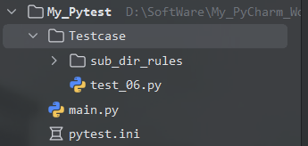

Testcase/test_06.py

```python
import pytest
 
class Test01:
    def test_case2(self):
        print("--------------test_case2")
 
    def test_case1(self):
        print("--------------test_case1")
```

Testcase/sub_dir_rules/test_01.py

```python
import pytest
 
class TestCase:
    def test_a(self):
        print("---test_a")
    def test_b(self):
        print("---test_b")
```

Testcase/sub_dir_rules/test_02.py

```python
def test_c():
    print("---test_c")
    assert 1 == 1
```


##### (1) testpaths 包含 norecursedirs

结果是：**执行Testcase下除了sub_dir_rules目录的用例**

```python
norecursedirs = sub_dir_rules
testpaths = Testcase
```

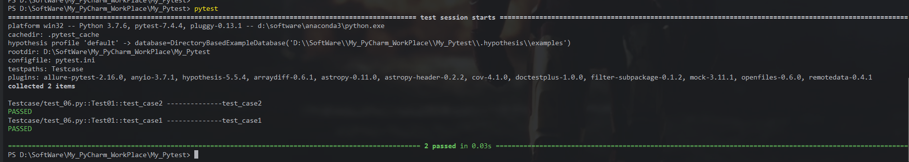

##### (2) testpaths  == norecursedirs

当两者有冲突时，比如二者配置的一样，testpaths优先，也就是执行testpaths下的所有用例.（实际不会这么配置，这里只是为了测试）

结果是：**执行Testcase目录下的用例**

```python
norecursedirs = Testcase
testpaths = Testcase
```

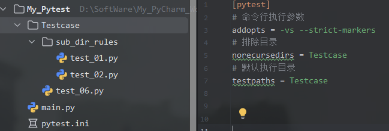

结果：测试所有用例


##### (3) norecursedirs 包含 testpaths

norecursedirs包含testpaths，不执行任何用例，并给出警告

结果是：**不执行任何用例**

```python
norecursedirs = case
testpaths = sub_case
```

结果：不执行任何用例

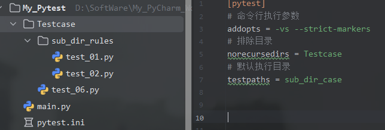

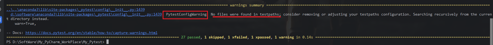


### 执行规则

```python
[pytest]
python_classes = Test*
python_files = test_*.py *_test.py
python_functions = test_*
```

说明：

python_files = test_*.py，表示配置测试搜索的文件名

python_classes = Test*，表示配置测试搜索的类名

python_functions = test_*，表示配置测试搜索的函数名

我们可以修改规则，比如function除了 test_ 开头，还可以 ceshi_ 开头，不过，不建议修改。

另外，如果不加通配符，表示执行指定内容，比如python_files = test_qzcsbj.py，表示执行test_qzcsbj.py文件。


### xfail：标志规则

Testcase/test_05.py

```python
import pytest
# 使用pytest框架内置标记

def add(a,b):
    return a + b

class TestAdd:
    # 断言相等，用例通过
    @pytest.mark.xfail
    def test_add_list_01(self):
        print("---test_add_list_01")
        res = add([1],[2,3,4])
        assert res == [1,2,3,4]

    # 断言不相等，用例失败
    @pytest.mark.xfail
    def test_add_list_02(self):
        print("---test_add_list_02")
        res = add([1],[2,3,4])
        assert res != [1,2,3,4]
```

(1) xfail_strict默认是false，标记为@pytest.mark.xfail的测试用例，如果是通过，显示XPASS

```python
[pytest]
xfail_strict = false
```

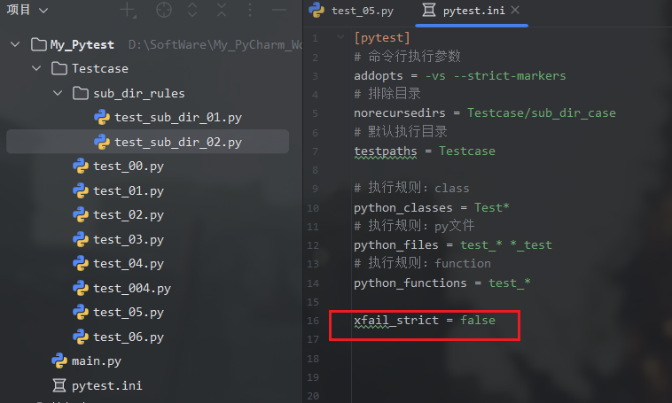

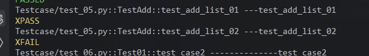

(2) 设置xfail_strict = true，标记为@pytest.mark.xfail且实际是通过（显示XPASS）的测试用例会被报告为失败FAILED

```python
[pytest]
xfail_strict = true
```


### markers：自定义注册标志

测试用例加了@pytest.mark.xxx修饰器，如果配置文件中没有配置markers就会报warnings **见04节**


### log-cli：控制台实时输出日志

默认是false，log-cli=false，等价于：log_cli=0

#### (1) 输出到控制台

```python
[pytest]
# 日志开关 true/false、1/0
log_cli = 1
# 输出到terminal
# 日志级别
log_cli_level = info
# 打印详细日志，相当于命令行加 -vs
# 日志格式
log_cli_format = %(asctime)s [%(levelname)s] %(message)s (%(filename)s:%(lineno)s)
# 日志时间格式
log_cli_date_format = %Y-%m-%d %H:%M:%S
```

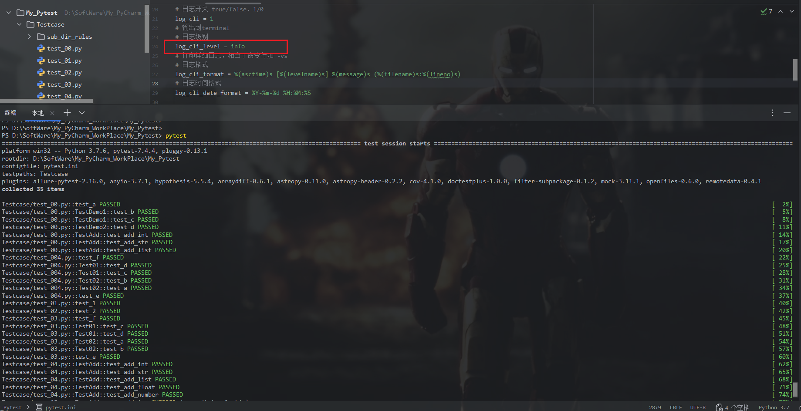


```python
[pytest]
# 日志开关 true/false、1/0
log_cli = 1
# 输出到terminal
addopts = --capture=no # 打印详细日志，相当于命令行加 -vs
# 日志级别
log_cli_level = info
# 打印详细日志，相当于命令行加 -vs
# 日志格式
log_cli_format = %(asctime)s [%(levelname)s] %(message)s (%(filename)s:%(lineno)s)
# 日志时间格式
log_cli_date_format = %Y-%m-%d %H:%M:%S
```

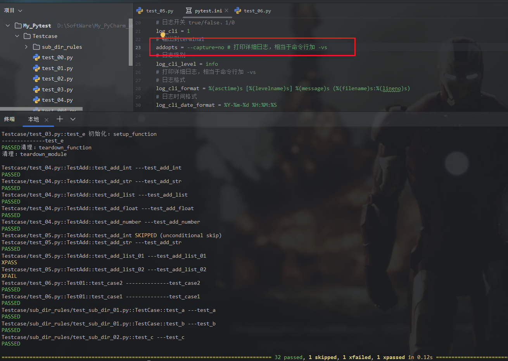

#### (2) 输出到日志文件

```python
# 输出到文件
#日志文件位置
log_file = ./log/test.log
#日志文件等级
log_file_level = info
#日志文件格式
log_file_format = %(asctime)s [%(levelname)s] %(message)s (%(filename)s:%(lineno)s)
#日志文件日期格式
log_file_date_format = %Y-%m-%d %H:%M:%S
```

说明：

1、日志文件以写入模式打开，每次运行测试都会覆盖上一次日志文件内容
2、日志输出的时候不要用print，要采用logger进行输出

详情见 11-日志配置

## 06: 跳过用例 - skip、skipif

### 应用场景

1、受限环境，某些用例无法运行

2、功能未开发完成，但是用例写了，可以不运行这些用例

### 实现方案

1、加装饰器，被修饰函数/方法中代码不会被执行，也就是说不会进入方法；也可以加在类上，类中所有方法均跳过

```python
@pytest.mark.skip
@pytest.mark.skip(reason="")
@pytest.mark.skipif(condition, reason="")
```

2、代码中添加跳过（也就是用例执行过程中跳过），会进入被修饰函数/方法，但是函数/方法中pytest.skip后面代码不会被执行

```python
pytest.skip(reason="")
pytest.skip(reason="",allow_module_level=False)
```

### skip

无条件跳过，也就是始终跳过该测试用例

#### 函数/方法级跳过

方法：skip(reason=None)
参数：可选参数reason，用于标注跳过的原因，会在测试结果中显示
使用方法：@pytest.mark.skip(reason="xxx")

示例：`test_07.py`

##### 无参数reason

```python
import pytest
 
@pytest.mark.skip
def test_case_01():
    print("代码开发中")
```

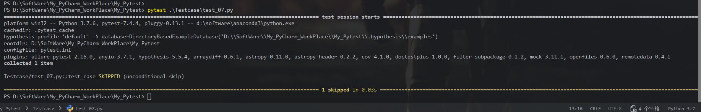

##### 有参数reason

```python
@pytest.mark.skip(reason="代码开发中")
def test_case_02():
    print("---skip")
```

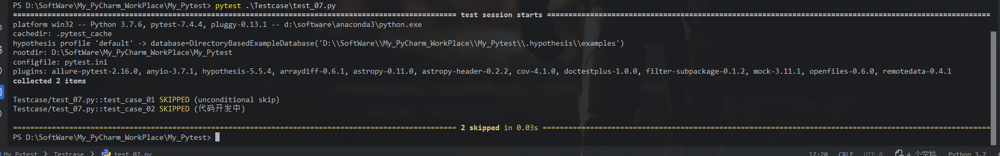


#### 函数/方法执行过程中跳过

##### 代码中添加跳过

结果：pytest.skip后面代码没执行

```python
import pytest
import platform

def test_case_03():
    if platform.system() == "Windows":
        pytest.skip("win下跳过")
        print("---skip")
    else:
        print("不跳过")
```

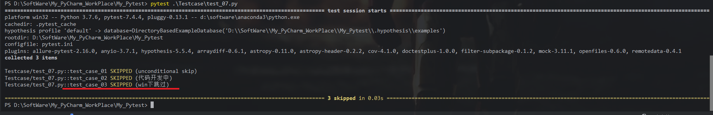

#### 类级跳过

##### 修饰器加在类上

```python
@pytest.mark.skip(reason="代码开发中")
class TestCase04:
    def test_case_04_1(self):
        print("test_case1---skip")
    def test_case_04_2(self):
        print("test_case2---skip")
```

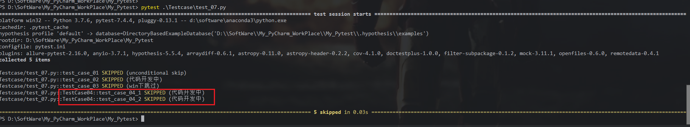

#### 模块级跳过

##### 方式1

`pytest.skip(msg="原因描述", allow_module_level=True)`

```python
import pytest

# 在条件满足时跳过整个模块
if sys.platform=="win32":
    pytest.skip('win中该模块跳过', allow_module_level=True)
class TestCase05:
    def test_case_05_1(self):
        print("test_case1---skip")
    def test_case_05_2(self):
        print("test_case2---skip")
 
def test_case_05_3():
    print("test_case3---skip")
def test_case_05_4():
    print("test_case4---skip")
```

结果：**allow_module_level为True时，跳过当前模块**

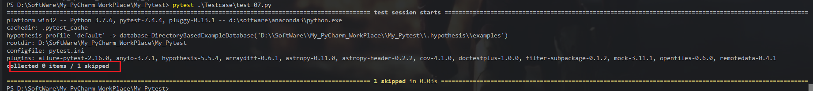

结果：**allow_module_level为False时，报错**

🔍 错误原因

pytest 检测到你在模块顶层（全局作用域）调用了 `pytest.skip()`，但**没有设置** `allow_module_level=True` 参数。

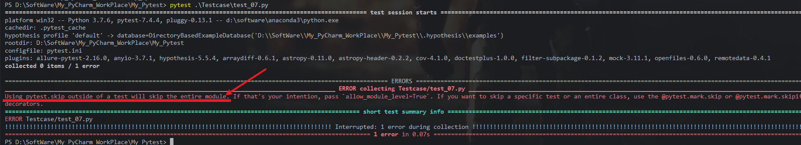


##### 方式2

```python
import pytest
# 在模块顶层使用 skip
pytestmark = pytest.mark.skip(reason="win中该模块跳过")

class TestCase:
    def test_case_06_1(self):
        print("test_case1---skip")
    def test_case_06_2(self):
        print("test_case2---skip")

def test_case_06_3():
    print("test_case3---skip")
def test_case_06_4():
    print("test_case4---skip")
```

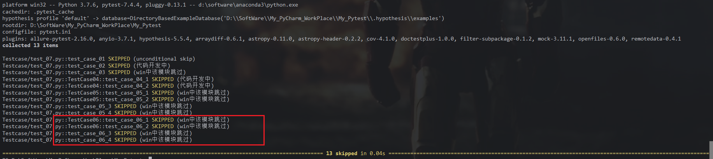

### skipif

condition条件为True跳过该测试用例

源码：

```python
class _SkipifMarkDecorator(MarkDecorator):
    def __call__(  # type: ignore[override]
        self,
        condition: Union[str, bool] = ...,
        *conditions: Union[str, bool],
        reason: str = ...,
    ) -> MarkDecorator:
        ...
```

#### 函数/方法级跳过

方法：skipif(condition, reason=None)
参数：
　　condition：跳过的条件，可选
　　reason：标注跳过的原因，可选
使用方法：@pytest.mark.skipif(condition, reason="xxx")

##### condition和reason都不填

```python
import pytest
 
@pytest.mark.skipif
def test_case_07():
    print("---skipif")
    assert 1==1
```

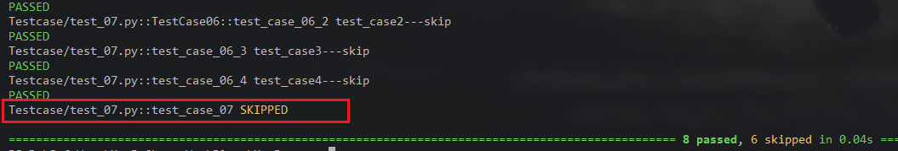

##### condition和reason都填

```python
import pytest

@pytest.mark.skipif(sys.platform.startswith("win"), reason="win环境中跳过")
def test_case_08_1():
    pass

@pytest.mark.skipif(sys.version_info < (3, 9), reason="python3.9以下跳过")
def test_case_08_2():
    pass
```

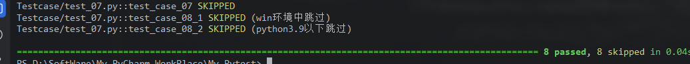

#### 类级跳过

```python
@pytest.mark.skipif(sys.platform.startswith("win"), reason="win环境中跳过")
class TestCase09:
    def test_case_09_1(self):
        print("test_case1---skip")
    def test_case_09_2(self):
        print("test_case2---skip")
 
def test_case_09_3():
    print("test_case3---skip")
def test_case_09_4():
    print("test_case4---skip")
```

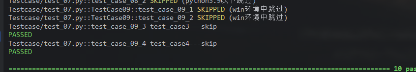

#### 模块级跳过

下面只能是pytestmark，不能改为其它的

```python
import pytest

pytestmark = pytest.mark.skipif(sys.platform=="win32", reason="win中该模块跳过")
def test_case_10_1():
    print("test_case1---skip")
def test_case_10_2():
    print("test_case2---skip")
```

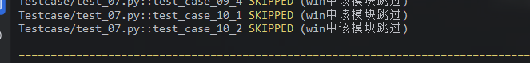

### 📝 正确的跳过用法对比

| 使用方式               | 代码示例                                       | 作用范围               |
| :--------------------- | :--------------------------------------------- | :--------------------- |
| **函数级 skip 装饰器** | `@pytest.mark.skip("原因")`                    | 只跳过单个测试函数     |
| **类级 skip 装饰器**   | `@pytest.mark.skip("原因")`                    | 跳过整个测试类         |
| **模块级 skip 调用**   | `pytest.skip("原因", allow_module_level=True)` | 跳过整个测试文件       |
| **条件跳过函数**       | `@pytest.mark.skipif(条件, reason="原因")`     | 条件满足时跳过测试函数 |
| **函数内部 skip**      | `if condition: pytest.skip("原因")`            | 在测试函数内部动态跳过 |


### 补充：importorskip

缺少模块或者版本低于参数值就跳过

参数：

> modname：模块名
> minversion：要求的最低版本
> reason：跳过原因

#### modname不满足

```python
@pytest.importorskip("requestsx", minversion="2.31.0")
def test_case11():
    print("---importorskip")
```

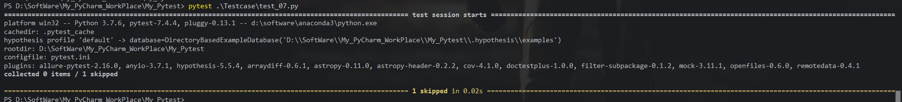

#### minversion不满足

```python
@pytest.importorskip("requests", minversion="3.31.0")
def test_case12():
    print("---importorskip")
```

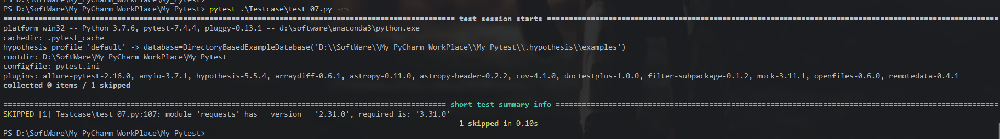

#### modname和minversion都满足

```python
@pytest.importorskip("requests", minversion="2.26.0")
def test_case13():
    print("---importorskip")
```

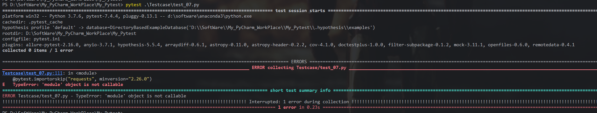

## 07: 标记为预期失败 - xfail

### 应用场景

功能未开发完成，但是用例写了；

环境限制，已经知道会失败，也可以预期失败。

### 源码

```python
class _XfailMarkDecorator(MarkDecorator):
    @overload  # type: ignore[override,misc,no-overload-impl]
    def __call__(self, arg: Markable) -> Markable:
        ...
 
    @overload
    def __call__(
        self,
        condition: Union[str, bool] = ...,
        *conditions: Union[str, bool],
        reason: str = ...,
        run: bool = ...,
        raises: Union[Type[BaseException], Tuple[Type[BaseException], ...]] = ...,
        strict: bool = ...,
    ) -> MarkDecorator:
        ...
```

方法：`xfail(condition=None, reason=None, raises=None, run=True, strict=False)`

常用参数：

- condition：预期失败的条件
- reason：失败的原因
- run：布尔值，是否运行
- raises：抛出某类型异常，和用例中raise的异常类型一样，结果就是FAILED，否则结果是XFAIL
- strict，默认是False，strict=False，断言成功结果是XPASS，断言失败结果是XFAIL；strict=True，断言成功结果是FAILED，断言失败结果是XFAIL 

使用方法：
　　`@pytest.mark.xfail(condition, reason="xxx" )`

### 函数/方法级预期失败

#### assert成功

```python
import pytest
 
@pytest.mark.xfail
def test_case_01():
    print("代码开发中")
    assert 1==1
```

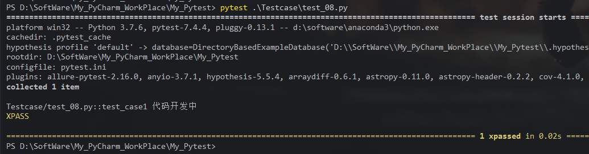

#### assert失败

```python
@pytest.mark.xfail
def test_case_02():
    print("代码开发中")
    assert 1==2
```

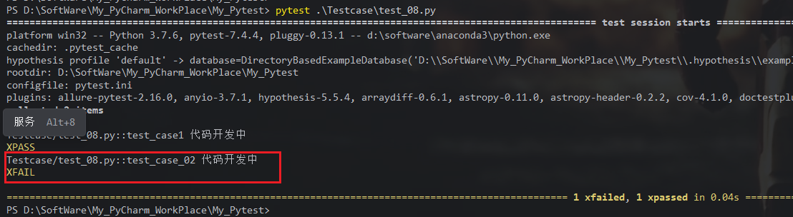

#### condition为true

```python
@pytest.mark.xfail(1==1, reason="代码开发中")
def test_case_03():
    print("---xfail")
    assert 1==1
```

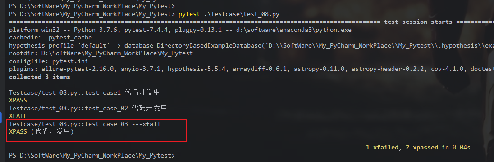

#### condition为false

```python
@pytest.mark.xfail(1==2, reason="代码开发中")
def test_case_04():
    print("---xfail")
    assert 1==1
```

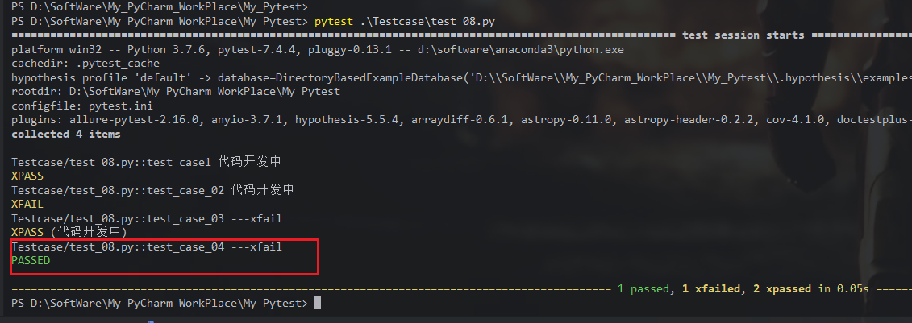

### 函数/方法执行过程中预期失败

```python
def test_case_05():
    pytest.xfail("代码开发中")
    print("---xfail")
    assert 1 == 1
```

结果：pytest.xfail后面代码没执行

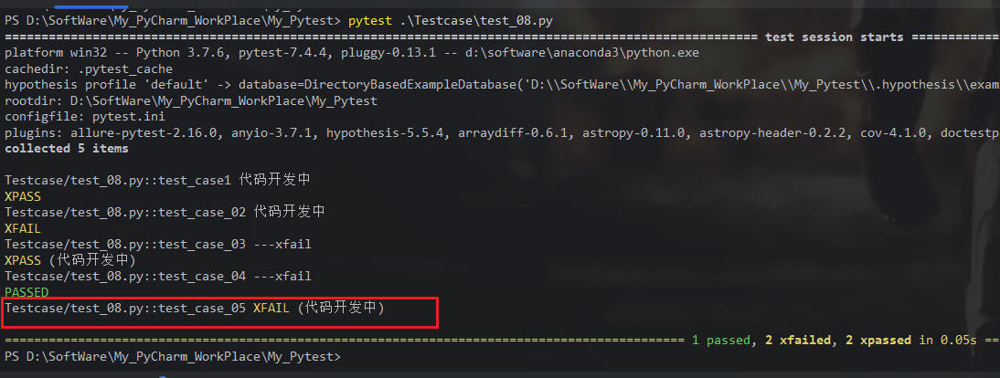

### 类级预期失败

```python
@pytest.mark.xfail(reason="当前环境没法测试")
class Test06:
    def test_06_b(self):
        print("---test_b")
        assert 1==1
 
    def test_06_a(self):
        print("---test_a")
        assert 1==2
```

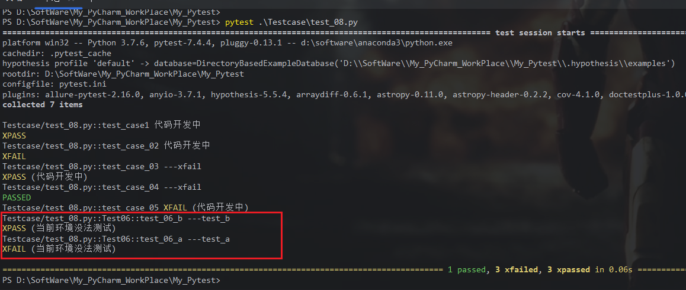

### 模块级预期失败

```python
pytestmark = pytest.mark.xfail(reason="当前环境没法测试")
class Test07:
    def test_07_b(self):
        print("---test_b")
        assert 1==1
 
    def test_07_a(self):
        print("---test_a")
        assert 1==2
```

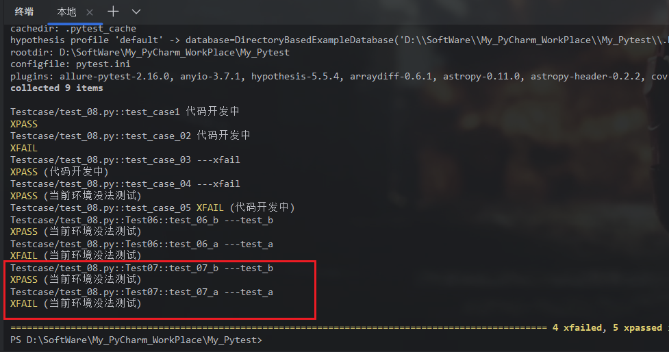

### xfail方法run参数

默认是True

run=False不会执行方法

```python
@pytest.mark.xfail()
def test_09_c():
    print("---test_c")
    assert 1==1
@pytest.mark.xfail(run=True)
def test_09_b():
    print("---test_b")
    assert 1==1
 
@pytest.mark.xfail(run=False)
def test_09_a():
    print("---test_a")
    raise Exception("异常")
```

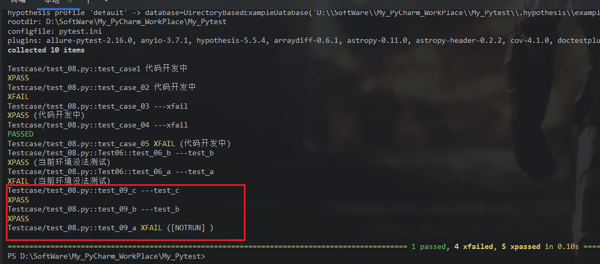

### xfail方法raises参数

raises：抛出某类型异常，和用例中raise的异常类型一样，结果就是FAILED，否则结果是XFAIL

```python
@pytest.mark.xfail
def test_10_d():
    print("---test_d")
    raise Exception("异常")
 
@pytest.mark.xfail(reason="异常了")
def test_10_c():
    print("---test_c")
    raise Exception("异常")<br>
@pytest.mark.xfail(raises=RuntimeError)
def test_10_b():
    print("---test_b")
    raise RuntimeError("运行时异常")
 
@pytest.mark.xfail(raises=RuntimeError)
def test_10_a():
    print("---test_a")
    raise Exception("异常")
```

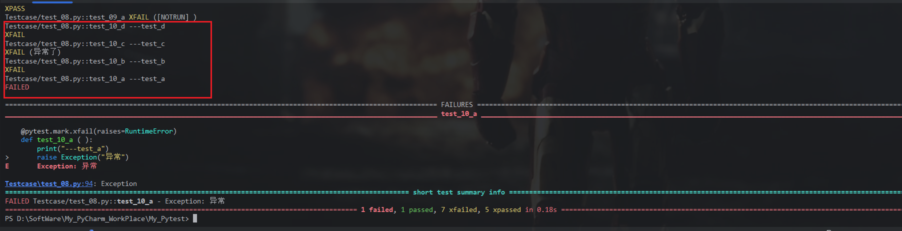

### xfail方法strict参数

strict默认是False，strict=False，断言成功结果是XPASS，断言失败结果是XFAIL；strict=True，断言成功结果是FAILED，断言失败结果是XFAIL

```python
@pytest.mark.xfail
def test_11_f():
    print("---test_f")
    assert 1==1
@pytest.mark.xfail
def test_11_e():
    print("---test_e")
    assert 1==2
 
@pytest.mark.xfail(strict=False)
def test_11_d():
    print("---test_d")
    assert 1==1
@pytest.mark.xfail(strict=False)
def test_11_c():
    print("---test_c")
    assert 1==2
@pytest.mark.xfail(strict=True)
def test_11_b():
    print("---test_b")
    assert 1==1
 
@pytest.mark.xfail(strict=True)
def test_11_a():
    print("---test_a")
    assert 1==2
```

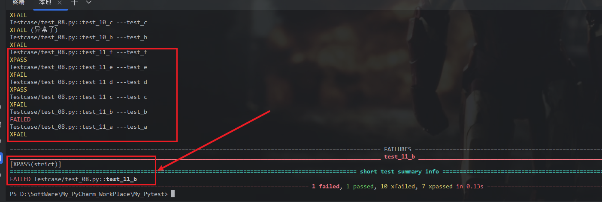

## 08: pytest中配置过滤警告

### 关于警告

如果警告不重要，可以忽略，如果警告很重要，可以提升为异常。

### 实现一：配置过滤警告

1、命令行参数，pytest case\test_qzcsbj.py -vs -W error::UserWarning，表示将UserWarning警告转换为错误

2、pytest.ini配置文件

表示将UserWarning警告转换为错误，其它忽略

```python
[pytest]
filterwarnings =
    ignore
    error::UserWarning
```

#### 无参数

`Testcase/test_09.py`

```python
import warnings
 
def test_01_a():
    print("---test_a")
    assert fun()==1

def fun():
    print("---fun")
    warnings.warn(UserWarning("自定义warning"))
    return 1
```

#### 无-W参数

`pytest Testcase/test_09.py -vs`

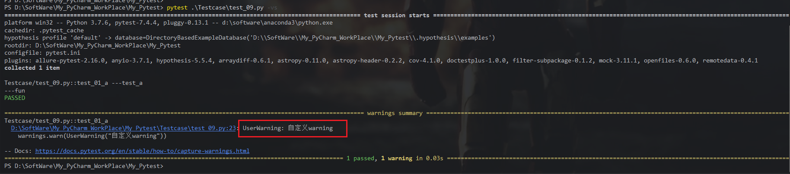

#### 有 -W 参数

##### error：将警告转换为错误

`pytest Testcase/test_09.py -vs -W error::UserWarning`

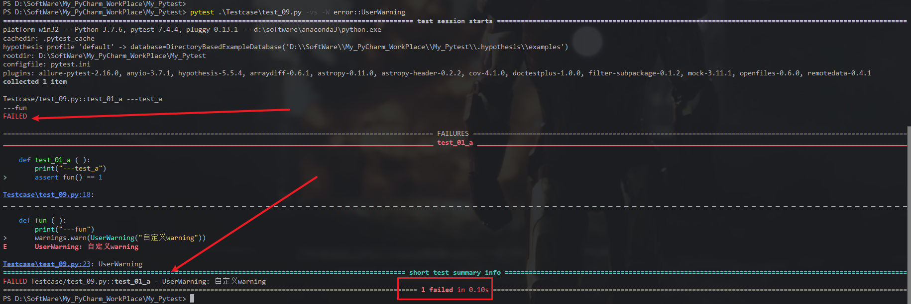

##### ignore：忽略所有警告

`pytest Testcase/test_09.py -vs -W ignore::UserWarning`

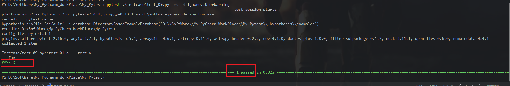

##### default：打印每个警告

`pytest Testcase/test_09.py -vs -W default::UserWarning`

```python
def test_02_b():
    print("---test_b")
    warnings.warn(UserWarning("自定义warning"))
    assert 1==1
def test_02_a():
    print("---test_a")
    assert fun()==1
 
def fun_02():
    print("---fun")
    warnings.warn(UserWarning("自定义warning"))
    warnings.warn(UserWarning("自定义warning"))
    return 1
```

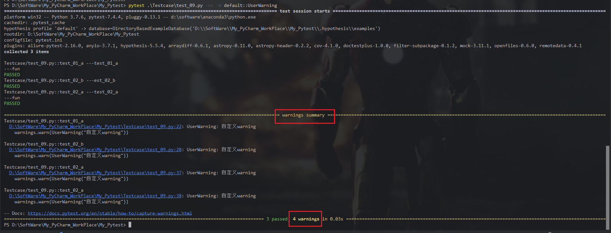

##### --disable-warnings：不显示警告摘要

`pytest Testcase/test_09.py -vs -W default::UserWarning --disable-warnings`

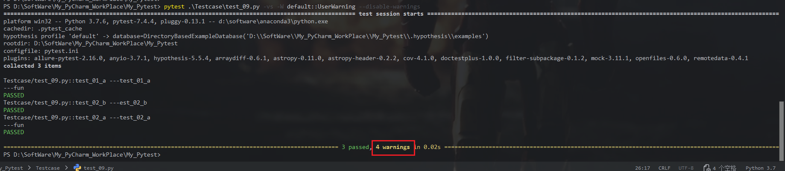

### 实现二：装饰器（filterwarnings过滤）

我们可以使用@pytest.mark.filterwarnings向特定测试项添加警告筛选器，这样可以做到更细节的控制警告

#### 函数、方法级过滤

##### 方式1

调用fun会产生警告，但是可以设置忽略警告

```python
import warnings
import pytest

@pytest.mark.filterwarnings("ignore:.*自定义.*")
def test_03_a():
    print("---test_a")
    assert fun_03()==1
 
def fun_03():
    print("---fun_03")
    warnings.warn(UserWarning("自定义warning"))
    return 1
```

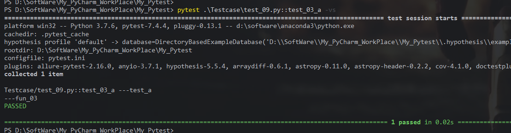

##### 方式2

描述警告过滤器的写法

```python
@pytest.mark.filterwarnings("ignore::UserWarning")
def test_04_a():
    print("---test_04_a")
    assert fun_04()==1
 
def fun_04():
    print("---fun_04")
    warnings.warn(UserWarning("自定义warning"))
    return 1
```

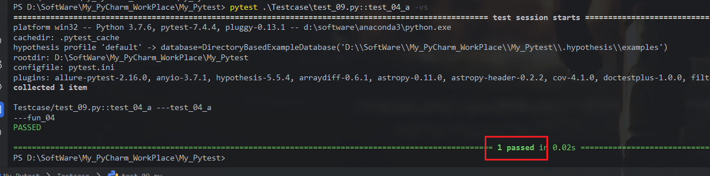

#### 类级过滤

忽略含有“自定义”的

```python
@pytest.mark.filterwarnings("ignore:自定义")
class Test05:
    def test_05_a(self):
        print("---test_05_a")
        assert self.fun()==1
 
    def fun_05(self):
        print("---fun_05")
        warnings.warn(UserWarning("自定义warning"))
        return 1
```

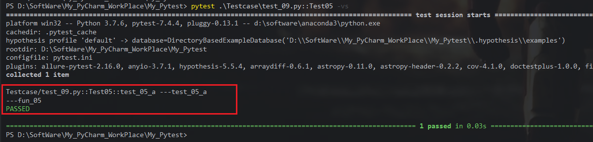


#### 模块级过滤

下面只能是pytestmark，不能改为其它的

```python
pytestmark = pytest.mark.filterwarnings("ignore")
class Test06:
    def test_06_a (self):
        print("---test_06_a")
        assert self.fun_06() == 1

    def fun_06(self):
        print("---fun_06")
        warnings.warn(UserWarning("自定义warning"))
        return 1
```

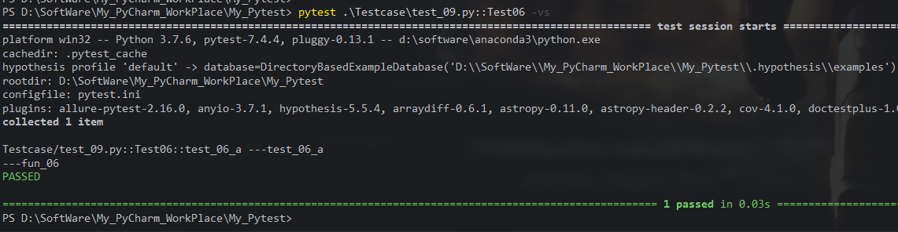


## 09: pytest中异常处理

### 常用异常处理方法

1. try...except
2. pytest.raises()

### try...except

```python
print("begin")
try:
    a = int(input("请输入被除数："))
    b = int(input("请输入除数："))
    res = a/b
    print(f"res={res}")
except(ValueError, ArithmeticError):
    print("发生数字格式异常或算数异常")
except:
    print("发生其它异常")
print("finish")
```

右键：


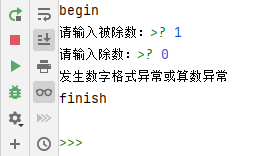

#### 在测试用例中使用

`Testcase/test_10.py`

```python
def test_01_a():
    try:
        assert 1/0 == 1
    except(ValueError, ArithmeticError):
        print("发生数字格式异常或算数异常")
    except:
        print("发生其它异常")
    print("---test_a")
```

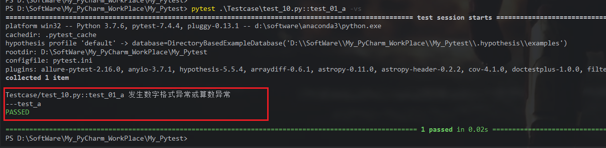

### pytest.raises()

参考：[https://www.osgeo.cn/pytest/reference.html?highlight=pytest%20raises#pytest-raises](https://www.osgeo.cn/pytest/reference.html?highlight=pytest raises#pytest-raises)

作用：

> 可以捕获特定的异常
>
> 可以获取捕获的异常的细节(异常类型， 异常信息)
>
> 可以match匹配异常信息
>
> 发生异常，后面的代码将不会被执行

示例

```python
class Test02():
    # 捕获特定的异常：哪怕with下面的代码发生了ZeroDivisionError类型的异常，整个用例不会认为是异常用例，认为是正常的
    def test_raises1(self):
        with pytest.raises(ZeroDivisionError):
            1/0

    # match是正则匹配
    def test_raises2(self):
        with pytest.raises(ValueError, match='must be 0 or None'):
            raise ValueError("value must be 0 or None")

    # 没有预期的异常就报错，同时，后面的代码不会被执行
    def test_raises2_2(self):
        with pytest.raises(ValueError, match='must be 0 or None'):
            raise ZeroDivisionError("除数为0")
        print("finish")

    # 多个异常放元组中
    def test_raises2_3(self):
        with pytest.raises((ValueError, ZeroDivisionError)):
            raise ZeroDivisionError("除数为0")

    # match是正则匹配，可以使用正则表达式
    def test_raises3(self):
        with pytest.raises(ValueError, match=r'must be \d+$'):
            raise ValueError("value must be 42")

    # 获取捕获的异常的细节(异常类型， 异常信息)
    def test_raises4(self):
        with pytest.raises(ValueError) as exc_info:
            raise ValueError("value must be 42")
        assert exc_info.type is ValueError
        assert exc_info.value.args[0] == "value must be 42"
```

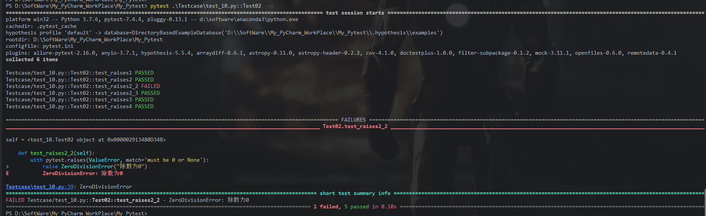


## 10: pytest断言

断言是验证软件实际结果是否和预期结果一致，如果不一致，程序会中止执行并给出失败信息

### assert断言

pytest使用的是python自带的assert关键字来进行断言

如果断言失败，assert后面的代码不会执行	

语法

```python
assert <表达式>
assert <表达式>,<描述>，如果断言失败，描述作为AssertionError的内容展示
```

示例一

`Testcase/test_11.py`

```python
import pytest

def test_01_1_x():
    assert True
def test_01_2_x():
    assert 'fsdkgitndcsdf'
def test_01_3_in():
    assert 'cs' in 'fsdkgitndcsdf'
def test_01_4_not():
    assert not True
```

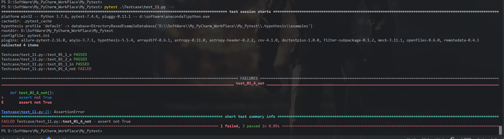

示例二

```python
def test_02_1_num():
    assert 1 == 1
def test_02_2_str():
    assert "1" == "1"
def test_02_3_dic():
    assert {"name": "ren"} == {"name": "qzcsbj"}, "---fail"
def test_02_4_list():
    assert [1, 2] == [1, 2], "---fail"
def test_02_5_tuple():
    assert (1, 2) == (1, 3)
```

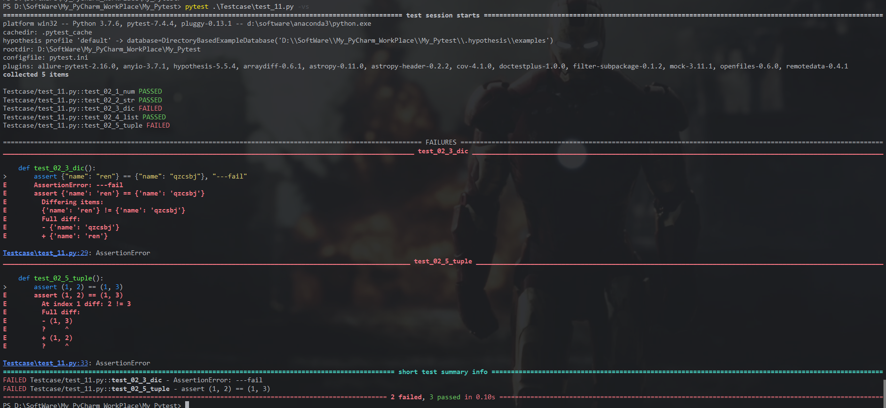

### 断言装饰器

详见：xfail方法raises参数

raises：抛出某类型异常，和用例中raise的异常类型一样，结果就是FAILED，否则结果是XFAIL

```python
@pytest.mark.xfail
def test_03_d():
    print("---test_d")
    raise Exception("异常")

@pytest.mark.xfail(reason="异常了")
def test_03_c():
    print("---test_c")
    raise Exception("异常")
@pytest.mark.xfail(raises=RuntimeError)
def test_03_b():
    print("---test_b")
    raise RuntimeError("运行时异常")

@pytest.mark.xfail(raises=RuntimeError)
def test_03_a():
    print("---test_a")
    raise Exception("异常")
```

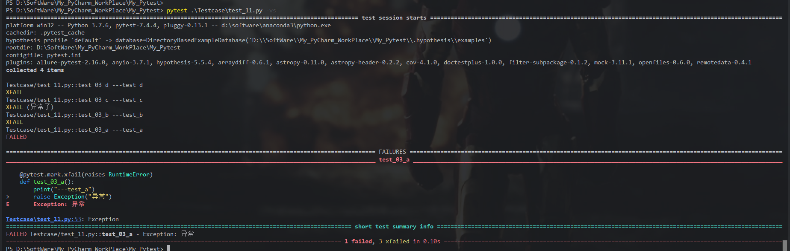

### 预期异常断言

编写引发异常的断言，可以使用pytest.raises()作为上下文管理器

```python
def test_04_a():
    # 捕获特定异常；采用pytest.raises上下文管理预期异常
    # 哪怕with下面的代码发生了ZeroDivisionError类型的异常，整个用例不会认为是异常用例，认为是正常的
    with pytest.raises(ZeroDivisionError):
        1 / 0

def test_04_b():
    #  可以捕获异常，获取细节（异常类型、异常信息），后面使用
    #  下面通过ex来访问异常信息
    with pytest.raises(ZeroDivisionError) as ex:
        1 / 0
    print("---ex:",ex.value)
    # 断言异常value值
    assert "division" in str(ex.value)
    # 断言异常类型
    assert ex.type == ZeroDivisionError

def test_04_c():
    # 用正则匹配异常信息
    with pytest.raises(ZeroDivisionError, match=".*division.*") as ex:
        1 / 0
    pass
```

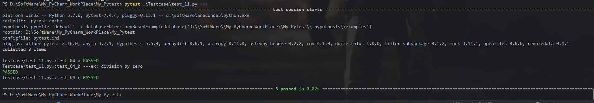


### 预期警告断言

警告断言与异常断言比较类似

```python
import pytest
import warnings
 
# 下面写法，产生的警告不会打印出来
def test_warning_assert():
    with pytest.warns(UserWarning):
        warnings.warn("自定义警告1", UserWarning)
 
# 可以使用record获取警告信息
def test_warning_assert2():
    with pytest.warns(RuntimeWarning) as record:
        warnings.warn("自定义警告2", RuntimeWarning)
    assert len(record) == 1
    assert record[0].message.args[0] == "自定义警告2"
 
# match通过正则匹配异常信息中的关键字
def test_warning_assert3():
    with pytest.warns(UserWarning, match=".*自定义.*3"):
        warnings.warn("自定义警告3", UserWarning)
```

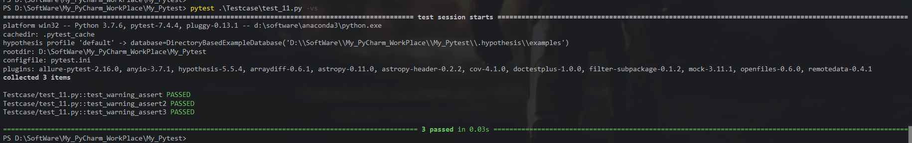


## 11: pytest中日志配置

### 日志格式配置

pytest.ini，内容包含terminal和日志文件

```python
[pytest]
addopts = --capture=no

# 日志开关 true/false、1/0
log_cli = 1

# 输出到terminal
# 日志级别
log_cli_level = info
# 打印详细日志，相当于命令行加 -vs
# addopts = --capture=no
# 日志格式
log_cli_format = %(asctime)s [%(levelname)s] %(message)s (%(filename)s:%(lineno)s)
# 日志时间格式
log_cli_date_format = %Y-%m-%d %H:%M:%S

# 输出到文件
# 日志文件位置
log_file = ./log/test.log
# 日志文件等级
log_file_level = info
# 日志文件格式
log_file_format = %(asctime)s [%(levelname)s] %(message)s (%(filename)s:%(lineno)s)
# 日志文件日期格式
log_file_date_format = %Y-%m-%d %H:%M:%S
```

说明：

1、日志文件以写入模式打开，每次运行测试都会覆盖上一次日志文件内容
2、日志输出的时候不要用print，要采用logger进行输出

### 使用

`Tesecase\test_12.py`

```python
import logging
logger = logging.getLogger(__name__)
 
def test_case():
    logger.info("断言1==1")
    assert 1==1
```

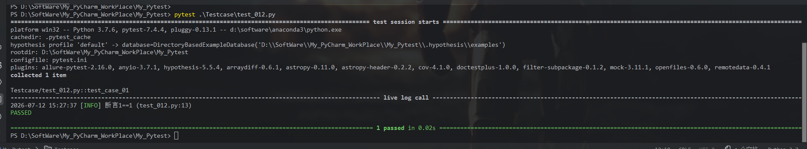


## 12: fixture简介及调用

### 1、fixture介绍

前面介绍了固件，通过示例可以看到，一个模块中，固件会对其作用范围内的所有用例起作用；

其实这样很不灵活，比如我们只希望部分测试用例执行某个固件，通过setup和teardown是实现不了的；

但是，**通过fixture就可以根据需要自定义测试用例的前置、后置操作**；本质上是一个**装饰器函数**（通过 `@pytest.fixture` 标记）

fixture是**通过yield来区分前后置**的，前后置均可以单独存在，fixture如果有后置，前置不报错就都会执行，前置报错后置就不会执行。

#### fixture 的核心作用

| 作用                 | 说明                                                         |
| :------------------- | :----------------------------------------------------------- |
| **提供测试前置条件** | 在测试执行前自动准备数据或初始化对象                         |
| **资源管理与清理**   | 通过 `yield` 实现 teardown（后置清理），避免资源泄露         |
| **复用测试逻辑**     | 将重复的初始化代码抽离，多个测试函数共享                     |
| **依赖注入**         | 测试函数通过参数名直接声明所需 fixture，pytest 自动查找并注入 |
| **灵活的作用域控制** | 可控制 fixture 的生命周期（函数、类、模块、会话级别）        |
| **参数化支持**       | 同一个 fixture 可返回不同配置，实现多场景测试                |


#### fixture的优势

1、与setup、teardown类似，fixture提供了测试执行前和测试执行后的处理，但是又比setup、teardown更灵活好用，比如：fixture命名更加灵活，不局限于setup和teardown

2、conftest.py配置里可以实现数据共享，可以方便管理、修改和查看fixture函数，并且不需要import就能自动找到fixture

3、fixture可用于封装数据，也可用于封逻辑动作，使用范围非常广

fixture装饰器来标记固定的工厂函数，在其他函数、类、模块或整个工程调用它时会被激活并优先执行，通常会被用于完成预置处理和重复操作。

==源码==：

```python
def fixture(  # noqa: F811
    fixture_function: Optional[FixtureFunction] = None,
    *,
    scope: "Union[_ScopeName, Callable[[str, Config], _ScopeName]]" = "function",
    params: Optional[Iterable[object]] = None,
    autouse: bool = False,
    ids: Optional[
        Union[Sequence[Optional[object]], Callable[[Any], Optional[object]]]
    ] = None,
    name: Optional[str] = None,
) -> Union[FixtureFunctionMarker, FixtureFunction]:
```

==调用方法==：

```python
fixture(scope="function", params=None, autouse=False, ids=None, name=None)
```

==常用参数==：

- **scope**：被@pytest.fixture标记的方法的作用域，默认是function，还可以是class、module、package、session。（注：下一篇详解）
- **params**：用于给fixture传参，可实现数据基于fixture的数据驱动，接收一个可以迭代的对象，比如列表[]、元组()、字典列表{[],[],[]}、字典元组{(),(),()}，提供参数数据供调用fixture的用例使用；传进去的参数，可以用request.param调用
- **autouse**：是否自动运行，是一个布尔值，默认为False不会自动执行，需要手动调用；当它为True时，作用域内的测试用例都会自动调用该fixture
- **ids**：用例标识id，每个ids和params一一对应，如果没有id，将从params自动产生
- **name**：给被@pytest.fixture标记的方法取一个别名，如果使用了name，那只能将name传入，函数名不再生效

#### fixture作用域（scope）控制

| scope 值           | 生命周期                               |
| :----------------- | :------------------------------------- |
| `function`（默认） | 每个测试函数执行一次                   |
| `class`            | 每个测试类执行一次                     |
| `module`           | 每个模块（.py 文件）执行一次           |
| `session`          | 整个 pytest 会话执行一次（跨多个文件） |


### 2、fixture的创建

1、创建函数

2、天骄装饰器

3、添加yield装饰器

```python
## 创建fixture
def fun():
  ## 前置操作
  yield ## 开始执行用例
  ## 后置操作
```


### 3、fixture的调用

#### 1、函数/方法中的参数列表引用

`Testcase/test_13.py`

再函数/方法的参数列表中，将fixture名称作为测试用例函数/方法的参数；

> 注意：如果fixture有返回值，必须用这种方式，否则获取不到返回值（比如：@pytest.mark.usefixtures()这种方式就获取不到返回值，详见：https://www.cnblogs.com/uncleyong/p/17957896）

==函数引用==：测试类中测试方法形参是**测试类外被@pytest.fixture()标记的测试函数**，也就是说，fixture标记的函数可以应用于测试类内部

==参数引用==：测试类中测试方法形参是**当前测试类中被@pytest.fixture()标记的方法**

```python
"""
fixture 调用
"""
import pytest

# 定义 fixture
@pytest.fixture()
def fun_01_01():
    print("--fun_01_01()中fixture")

# 定义 fixture
@pytest.fixture()
def fun_01_02 ( ):
    print("--fun_01_02()中fixture2")

# 测试函数使用 fixture（通过参数名注入），即“函数引用”
def test_01_a (fun_01_01):
    print("--------------test_01_a")

class Test01:
    # 函数引用：引用的方法是在 本测试类外 被fixture标记的方法。
    def test_01_b (self, fun_01_02):
        print("--------------test_01_b")

    # 测参数引用：引用的方法是在 本测试类中 被fixture标记的方法。
    def test_01_c (self, fun_01_03):
        print("--------------test_01_c")

    @pytest.fixture()
    def fun_01_03 (self):
        print("--fun_01_03()中fixture3")
```

通过加过可以看出：

1、被fixture标记的函数，可以作为测试函数/方法入参进行调用
2、在测试函数/方法 被执行时，首先执行它所引用的fixture（主要是执行被fixture标记的函数的操作）
3、执行完第2步之后，再执行具体的测试用例中的内容

具体来看：

> 1、test_01_a：先执行fun_01_01() 中的 fixture，再执行本测试用例中的内容
>
> 2、test_01_b：先执行fun_01_02() 中的 fixture，再执行本测试用例中的内容
>
> 3、test_01_c：先执行fun_01_03() 中的 fixture，再执行本测试用例中的内容

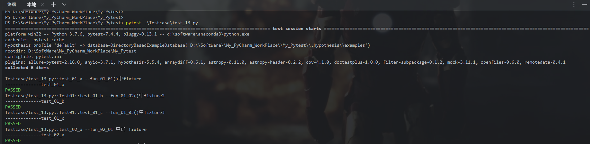


#### 2、函数/方法加`usefixtures`标记

`@pytest.mark.usefixtures(fixture_name, ...)`

##### (1) 函数/方法上加`usefixtures`标记

可以多个fixture参数，放前面的先执行，放后面的后执行，即：**执行顺序和usefixtures后面引用顺序对应**

```python
import pytest
 
@pytest.fixture()
def fun_02_01 ( ):
    print("--fun_02_01 中的 fixture")

@pytest.fixture()
def fun_02_02 ( ):
    print("--fun_02_02 中的 fixture2")

# 先执行fun_02_01 中的 fixture，再执行本测试用例中的内容
def test_02_a (fun_02_01):
    print("--------------test_02_a")

class Test02:
    # 先执行fun_02_01 中的 fixture，再执行本测试用例中的内容
    def test_02_b (self, fun_02_01):
        print("--------------test_02_b")

    # 先执行fun_02_02 中的 fixture，再执行执行fun_02_01 中的 fixture，最后执行本测试用例中的内容
    @pytest.mark.usefixtures('fun_02_02', 'fun_02_01')
    def test_02_c (self):
        print("--------------test_02_c")
```

结果：

> 1、test_02_a：先执行fun_02_01() 中的 fixture，再执行本测试用例中的内容
>
> 2、test_02_b：先执行fun_02_01() 中的 fixture，再执行本测试用例中的内容
>
> 3、test_02_c：先执行fun_02_02() 中的 fixture，再执行执行fun_02_01() 中的 fixture，最后执行本测试用例中的内容

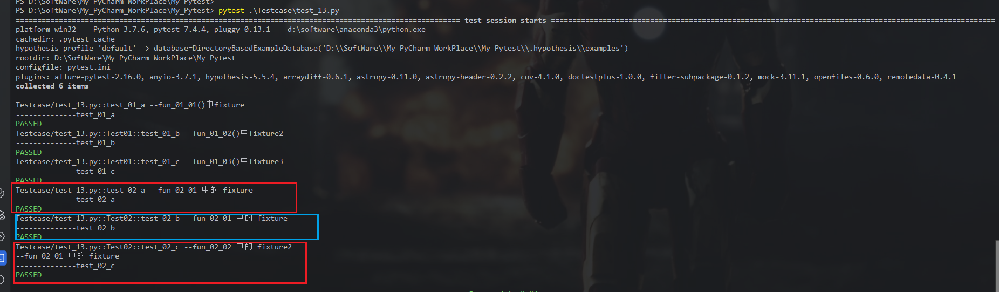

##### (2) 可以多个`usefixtures`标记，先执行的放底层，后执行的放上层

```python
import pytest

@pytest.fixture()
def fun_03_1():
    print("--fun_03_1 fixture")
 
@pytest.fixture()
def fun_03_2():
    print("--fun_03_2 fixture2")
 
def test_03_a(fun):
    print("--------------test_03_a")
 
@pytest.mark.usefixtures('fun_03_1')
@pytest.mark.usefixtures('fun_03_2')
class Test03:
    def test_03_b(self):
        print("--------------test_03_b")
 
    def test_03_c(self):
        print("--------------test_03_c")
```

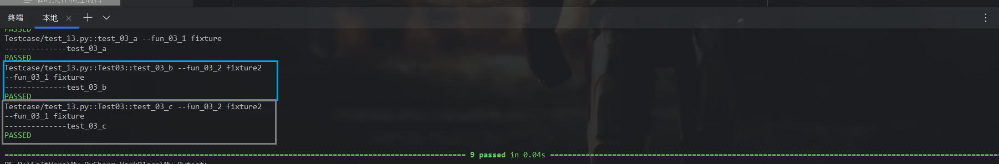

##### (3) 同时在函数参数列表中引用&使用`usefixtures`标记

同时有装饰器和引用，装饰器先执行

```python
@pytest.fixture()
def fun_04_1():
    print("---fixture")
 
@pytest.fixture()
def fun_04_2():
    print("---fixture2")
 
def test_04_a(fun_04_1):
    print("--------------test_a")
 
class Test04:
    def test_04_b(self):
        print("--------------test_b")
 
    @pytest.mark.usefixtures('fun_04_1')
    def test_04_c(self, fun_04_2):
        print("--------------test_c")
```

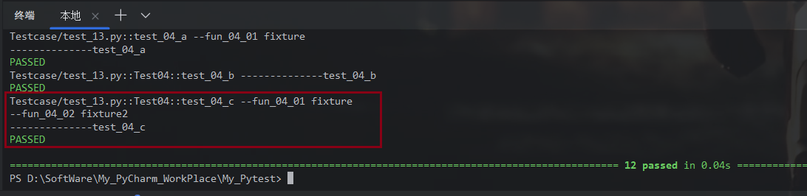


#### 3、测试类加`usefixtures`标记

类中所有测试用例都会调用该fixture

##### (1) 同时有`usefixtures`标记和引用，装饰器先执行

```python
@pytest.fixture()
def fun_05_01():
    print("--fun_05_01 fixture")
 
@pytest.fixture()
def fun_05_02():
    print("--fun_05_02 fixture2")
 
def test_05_a(fun_05_01):
    print("--------------test_05_a")
 
@pytest.mark.usefixtures('fun_05_01')
class Test05:
    def test_05_b(self):
        print("--------------test_05_b")
    def test_05_c(self, fun_05_01):
        print("--------------test_05_c")
```

结果：

> 1、test_05_a：先执行函数参数引用列表中的fun_05_01，后执行用例
>
> 2、test_05_b：先执行函数参数引用列表中的fun_05_02，后执行用例
>
> 3、test_05_c：先执行函数参数引用列表中的fun_05_01，再执行标记中的fun_05_02，最后执行用例

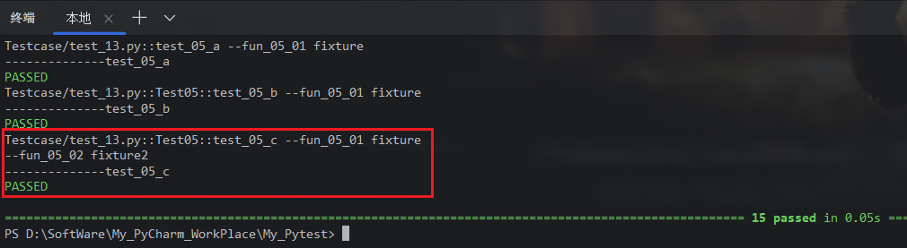


##### (2) 方法和类上都有装饰器，方法上装饰器优先执行

```python
@pytest.fixture()
def fun_06_01():
    print("--fun_06_01 fixture")

@pytest.fixture()
def fun_06_02():
    print("--fun_06_02 fixture2")

def test_06_a(fun_06_01):
    print("--------------test_06_a")

@pytest.mark.usefixtures('fun_06_02')
class Test06:
    def test_06_b (self):
        print("--------------test_06_b")

    ## 先执行测试方法`test_06_c`中的标记`fun_06_01`，再执行测试类Test06中的标记`fun_06_02`，最后执行用例
    @pytest.mark.usefixtures('fun_06_01')
    def test_06_c (self):
        print("--------------test_06_c")
```

结果：

> 1、test_06_a：先执行函数参数引用列表中的`fun_06_01`，后执行用例
>
> 2、test_06_b：先执行测试类Test06中的标记`fun_06_02`，后执行用例
>
> 3、test_06_c：先执行测试方法`test_06_c`中的标记`fun_06_01`，再执行测试类Test06中的标记`fun_06_02`，最后执行用例

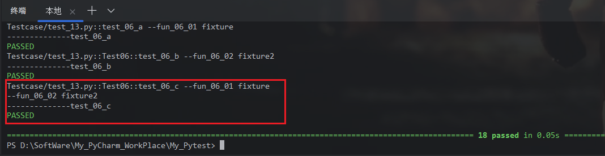

### fixture调用总结：

@pytest.mark.usefixtures('fun2')
@pytest.mark.usefixtures('fun')
等价于：
@pytest.mark.usefixtures('fun','fun2')


### 4、自动适配：fixture设置autouse=True

影响作用域内所有用例

```python
@pytest.fixture()
def fun_07_01():
    print("---fixture")
 
@pytest.fixture(autouse=True)
def fun_07_02():
    print("---fixture2")

def test_07_a():
    print("--------------test_a")

class Test07:
    def test_07_b(self):
        print("--------------test_b")
    def test_07_c(self):
        print("--------------test_c")
```

结果：

> 每个测试用例都执行了标记`fun_06_02`，后执行用例

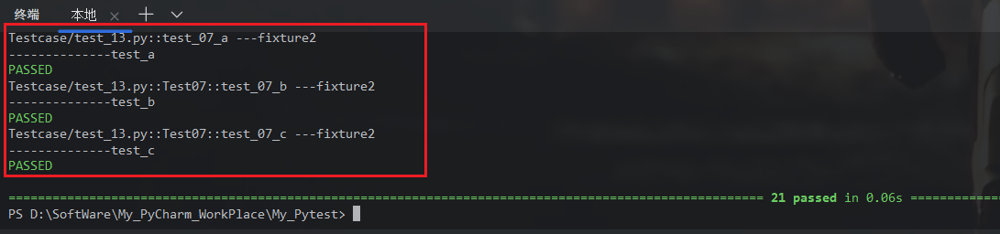


### 5、fixture嵌套

#### 嵌套时，只能使用函数/方法参数引用的方式，不能用`@pytest.mark.usefixtures`标记

示例：两个fixture，fun_08_02依赖fun_08_01

```python
@pytest.fixture()
def fun_08_01():
    print("---fun_08_01")
 
@pytest.fixture()
def fun_08_02(fun_08_01):
    print("---fun_08_02")

# @pytest.mark.usefixtures(fun_08_01)  # 报错
def test_08_a():
    print("--------------test_a")


def test_08_a(fun_08_01):
    print("--------------test_a")
```

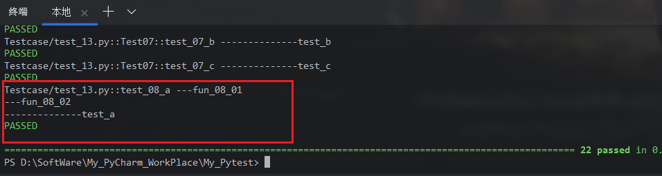

#### 两种错误示例

##### 1、错误嵌套定义（混合使用`usefixtures标记`和参数引用）

```python
# 下面写法报错
"""
❌  1、错误嵌套：不能使用usefixtures标记来嵌套不同的fixture
"""
@pytest.fixture()
def fun_08_01 ( ):
    print("---fun_08_01")

@pytest.fixture()
@pytest.mark.usefixtures(fun_08_01)
def fun_08_02():
    print("---fun_08_02")
```

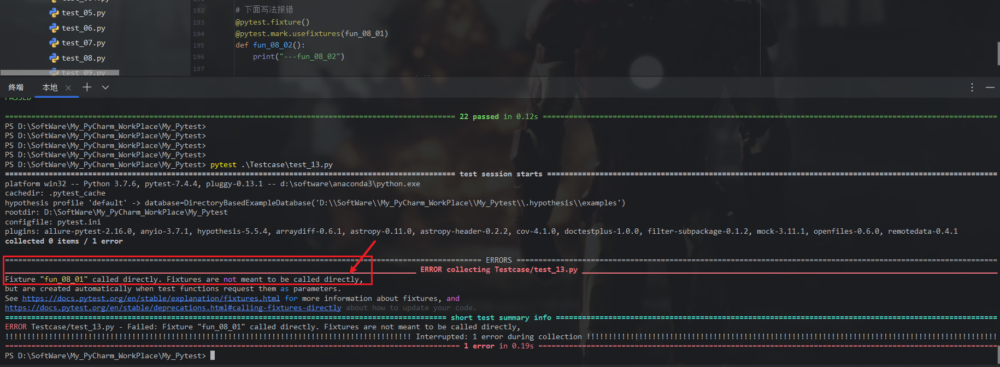

##### 2、错误嵌套使用（混合使用`usefixtures标记`和参数引用）

```python
# 错误用法
"""
❌ 错误：2、错误用法：@pytest.mark.usefixtures() 接收的是 fixture 的名称（字符串），而不是 fixture 函数本身。
"""
@pytest.fixture()
def fun_08_01():
    print("---fun_08_01")

@pytest.fixture()
def fun_08_02(fun_08_01):
    print("---fun_08_02")

@pytest.mark.usefixtures(fun_08_02)
def test_08_a():
    print("--------------test_08_a")
```

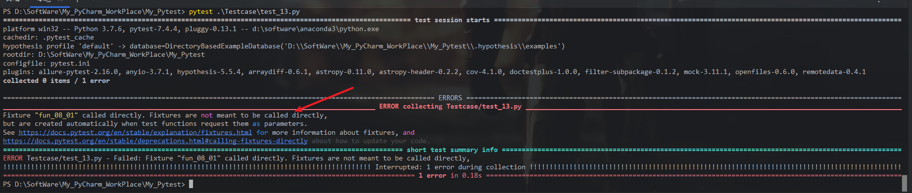

针对错误原因进行分析

#### 💡 为什么会报"直接调用"错误？

在 pytest 的设计中，`@pytest.fixture` 装饰的函数**不是一个普通的函数**，它是一个被 pytest 框架管理的"资源提供者"。pytest 会在测试运行时自动创建和管理这些资源。

当你显式地写 `fun_08_02()` 时，你是在把它当作普通函数调用，pytest 检测到这种行为后会报错并阻止你，因为：

1. **参数依赖无法解析**：`fun_08_02` 依赖 `fun_08_01`，直接调用无法自动注入依赖
2. **生命周期管理失效**：fixture 的作用域（scope）和自动清理（teardown）功能无法正常运作
3. **设计理念违背**：fixture 应该由框架管理，而不是用户手动调用


## 13: fixture实现自定义前置、后置

### 自定义前置(setup)、后置(teardown)

fixture可以实现自定义测试用例的前置、后置，是通过yield来区分前后置的，前后置均可以单独存在；

写在yield前面的就是前置条件，写在后面的就是后置条件；

如果yield前面的代码出异常了，yield后面的代码不会执行；但是，如果是测试用例出异常，yield前后的代码还是都会执行。

`Testcase/test_14.py`

```python
import pytest

@pytest.fixture()
def fun():
		## 前置操作
    yield  ## 在此处执行用例中的具体内容
    ## 后置操作
```

### 情况1：前置代码控制用例行为

#### (1) 通过`yield`控制测试用例的前后置操作

仅test_a和test_b需要前置登录后置退出

```python
import pytest
 
@pytest.fixture()
def fun_01():
    print("---前置：登录")
    yield
    print("---后置：退出")

def test_01_a(fun_01):
    print("--------------test_01_a")

class Test01:
    def test_01_b (self, fun_01):
        print("--------------test_01_b")

    def test_01_c (self):
        print("--------------test_01_c")
```

结果：

> 1、test_01_a：先执行`fun_01`的前置操作，然后执行`test_01_a`用例，最后执行后置操作
>
> 2、test_01_b：先执行`fun_01`的前置操作，然后执行`test_01_b`用例，最后执行后置操作
>
> 3、test_01_c：直接执行用例`test_01_c`

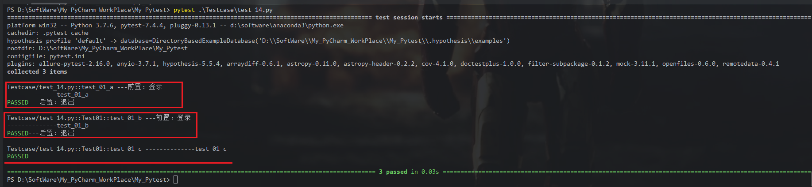

#### (2) addfinalizer终结函数

```python
import pytest
 
@pytest.fixture()
def fun_02(request):
    print("---前置：登录")
    def after():
        print("---后置：退出")
    request.addfinalizer(after)
 
def test_02_a(login):
    print("--------------test_a")
 
class Test02:
    def test_02_b(self, fun_02):
        print("--------------test_b")
 
    def test_02_c(self):
        print("--------------test_c")
```

结果：

> 1、test_02_a：先执行`fun_02`的前置操作，然后执行`test_02_a`用例，最后执行后置操作
>
> 2、test_02_b：先执行`fun_02`的前置操作，然后执行`test_02_b`用例，最后执行后置操作
>
> 3、test_02_c：直接执行用例`test_02_c`

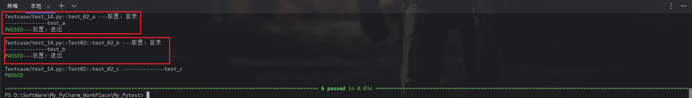

### 情况2：前置代码异常

如果yield前面的代码出异常了，yield后面的代码不会执行

```python
import pytest
 
@pytest.fixture()
def fun_03():
    print("---前置")
    raise Exception("自定义异常")
    yield
    print("---后置")
 
def test_03_a(fun_03):
    print("--------------test_03_a")
```

前置操作异常，则用例异常。后置操作不执行

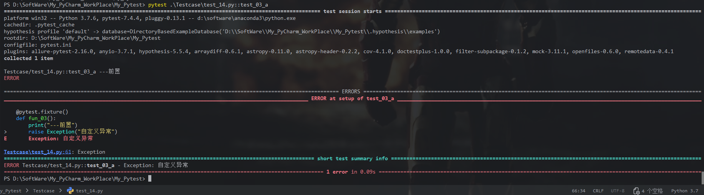

### 情况3：测试用例异常

如果是测试用例出异常，yield前后的代码都会执行

```python
import pytest
 
@pytest.fixture()
def fun_04():
    print("---前置")
    yield
    print("---后置")
 
def test_04_a(fun_04):
    print("--------------test_04_a")
    raise Exception("自定义异常")
```


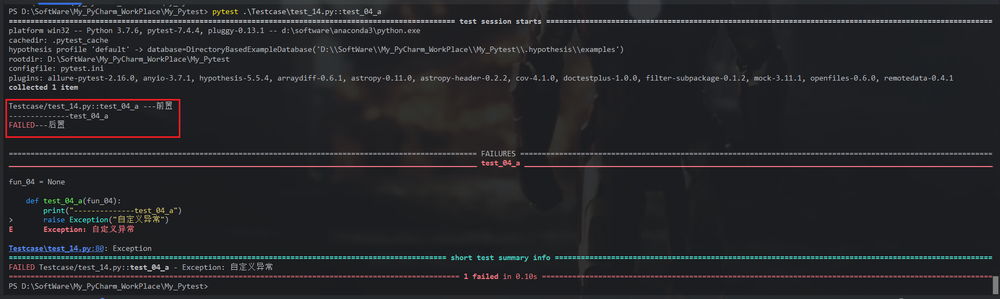


## 14: fixture作用域(scope)详解

### scope参数

#### 📌 基本语法

```python
@pytest.fixture(scope="function")  # scope 的默认值
def my_fixture():
    return some_value
```

#### 🎯 scope 的 5 种取值

```
"function"：默认值，作用于每个测试用例（包含函数/方法），每个用例执行前都会运行一次
"class"：作用于整个类，每个测试类/测试函数执行前都会运行一次
"module"：作用于整个模块（多个类），每个module（每个py文件）执行前都会运行一次；可以实现多个.py跨文件共享前置
"package"：每个python包执行前都会运行一次
"session"：作用于整个session，整个测试前运行一次
```

| scope 值                     | 生命周期                                        | 适用场景                             |
| :--------------------------- | :---------------------------------------------- | :----------------------------------- |
| **`function`**（默认）       | 每个测试函数执行**一次**，函数结束后销毁        | 大部分通用场景，每次测试需要独立数据 |
| **`class`**                  | 每个测试类执行**一次**，类中所有测试方法共享    | 同一个测试类中需要共享状态           |
| **`module`**                 | 每个模块(多个类)（.py 文件）执行**一次**        | 模块级别的配置，如加载配置文件       |
| **`package`**（pytest 7.2+） | 每个包（包含 `__init__.py` 的目录）执行**一次** | 包级别的共享资源                     |
| **`session`**                | 整个 pytest session执行**一次**（跨多个文件）   | 全局资源，如数据库连接、浏览器驱动   |

------

如果fixture放`conftest.py`中，可以这么说：

```python
scope参数为function：每一个测试文件中的所有测试用例执行前都会执行一次conftest文件中的fixture
scope参数为class：每一个测试文件中的测试类执行前都会执行一次conftest文件中的fixture
scope参数为module：每一个测试文件执行前都会执行一次conftest文件中的fixture
scope参数为session：所有测试py文件执行前执行一次conftest文件中的fixture
```

### 用法总结

```python
(1) 默认范围是function
(2) 执行顺序遵循：sesstion->package->module->class->function
(3) 每一个函数前后均会执行模块中的class
(4) 模块中的fixture对函数、方法均有效
(5) 测试类中的fixture只对方法有效
(6) 在模块和类中有同名的fixture存在时：局部优先，也就是类中fixture优先
```

#### (1) 默认范围是function

设置默认运行，未指定scope

```python
import pytest
 
@pytest.fixture(autouse=True)
def fun_01():
    print("---fixture")
 
def test_01_a():
    print("--------------test_01_a")
 
class Test01:
    def test_01_b(self):
        print("--------------test_01_b")
 
    def test_01_c(self):
        print("--------------test_01_c")
```

指定`autouse=True`，在默认scope作用域下，每个测试function都会执行

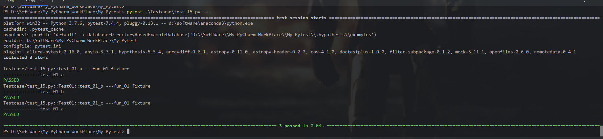

#### (2) 执行顺序遵循：sesstion->package->module->class->function

```python
import pytest
 
@pytest.fixture(autouse=True, scope="function")
def fun_02_1():
    print("--fun_02_1 fixture : function-前")
    yield
    print("--fun_02_1 fixture : function-后")
 
@pytest.fixture(autouse=True, scope="class")
def fun_02_2():
    print("--fun_02_2 fixture : class-前")
    yield
    print("--fun_02_2 fixture : class-后")
 
@pytest.fixture(autouse=True, scope="module")
def fun_02_3():
    print("--fun_02_3 fixture : module-前")
    yield
    print("--fun_02_3 fixture : module-后")
 
@pytest.fixture(autouse=True, scope="package")
def fun_02_4():
    print("--fun_02_4 fixture : package-前")
    yield
    print("--fun_02_4 fixture : package-后")
 
@pytest.fixture(autouse=True, scope="session")
def fun_02_5():
    print("--fun_02_5 fixture : session-前")
    yield
    print("--fun_02_5 fixture : session-后")
 
def test_02_a():
    print("--------------test_02_a")
 
def test_02_b():
    print("--------------test_02_b")
 
class Test01Scope:
    def test_02_c(self):
        print("--------------test_02_c")
 
    def test_02_d(self):
        print("--------------test_02_d")
```

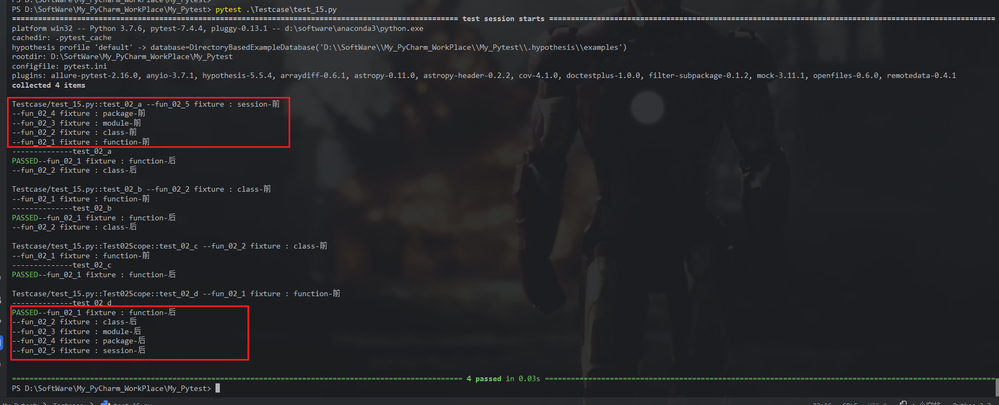

> ## 📌 核心前置知识
>
> 1. **`autouse=True`**：表示该 fixture 会自动对**作用域内**的所有测试生效，无需显式声明。
> 2. **作用域嵌套关系**：`function` ⊂ `class` ⊂ `module` ⊂ `package` ⊂ `session`
> 3. **执行顺序**：
>    - **前置（yield 前）**：从**高作用域到低作用域**（session → package → module → class → function）
>    - **后置（yield 后）**：从**低作用域到高作用域**（function → class → module → package → session），呈**堆栈式**（后进先出）
> 4. **autouse 的作用范围**：只对其所在作用域及其**子作用域**的测试生效。

#### 结果分析

##### 🧪 测试1：`test_02_a`

```python
--fun_02_5 fixture : session-前      ← 1. 最外层
--fun_02_4 fixture : package-前      ← 2. 
--fun_02_3 fixture : module-前       ← 3. 
--fun_02_2 fixture : class-前        ← 4. 
--fun_02_1 fixture : function-前     ← 5. 最内层
--------------test_02_a              ← 6. 测试函数执行
PASSED
--fun_02_1 fixture : function-后     ← 7. 最先清理
--fun_02_2 fixture : class-后        ← 8. 
```

**为什么 `class` 级别的 fixture 会执行？**

- `test_02_a` 是一个**独立的函数**，不属于任何类。
- 理论上 `scope="class"` 的 fixture 只对类生效，但**由于 `autouse=True`**，它会对当前作用域及**所有子作用域**生效。`function` 是 `class` 的子作用域，所以 `fun_02_2` 也对 `test_02_a` 生效。

**为什么 `module`、`package`、`session` 也执行了？**

- 同理，`function` 也是 `module`、`package`、`session` 的子作用域，`autouse=True` 让它们全部自动生效。

**为什么没有 `class-后` 紧接着 `function-后`？**

- 因为 `fun_02_2`（class 级别）虽然因 `autouse` 对函数生效了，但它的**生命周期依然是 class 级别**——pytest 会等到整个类的作用域结束时才执行清理。
- 但 `test_02_a` 是一个独立的函数，没有 class 包裹，pytest 认为 `fun_02_2` 的“class 作用域”在这个函数执行完毕后就应该结束了，所以 `function-后` 执行完紧接着就执行了 `class-后`。

##### 🧪 测试2：`test_02_b`

```python
--fun_02_2 fixture : class-前        ← 1. 
--fun_02_1 fixture : function-前     ← 2. 
--------------test_02_b              ← 3. 测试函数执行
PASSED
--fun_02_1 fixture : function-后     ← 4. 先清理 function
--fun_02_2 fixture : class-后        ← 5. 再清理 class
```

**为什么 `session`、`package`、`module` 没有再次打印？**

- 因为 `fun_02_5`（session）、`fun_02_4`（package）、`fun_02_3`（module）在 `test_02_a` 执行时已经执行过前置，且由于它们的生命周期还没结束（`session` 要到所有测试结束才清理），所以**不会重复执行**。

**为什么 `class` 级别的 fixture 又执行了一次前置？**

- 因为 `test_02_a` 执行完毕后，`fun_02_2` 的 `class` 作用域已经结束并清理了。
- 现在执行 `test_02_b`，是一个新的独立函数，pytest 认为这是一个新的 `class` 作用域开始，所以 `fun_02_2` 再次执行前置。

##### 🧪 测试3：`Test02Scope::test_02_c`

```python
--fun_02_2 fixture : class-前        ← 1. 类级别前置
--fun_02_1 fixture : function-前     ← 2. 函数级别前置
--------------test_02_c              ← 3. 测试方法执行
PASSED
--fun_02_1 fixture : function-后     ← 4. 函数清理
```

**为什么 `class-后` 没有出现？**

- 因为 `scope="class"` 的 `fun_02_2` 的生命周期是整个 `Test02Scope` 类。现在类中还有 `test_02_d` 没有执行，所以 `class` 作用域**还没有结束**，`class-后` 不会执行。

##### 🧪 测试4：`Test02Scope::test_02_d`

```python
--fun_02_1 fixture : function-前     ← 1. 函数级别前置
--------------test_02_d              ← 2. 测试方法执行
PASSED
--fun_02_1 fixture : function-后     ← 3. 函数清理
--fun_02_2 fixture : class-后        ← 4. 类清理
--fun_02_3 fixture : module-后       ← 5. 模块清理
--fun_02_4 fixture : package-后      ← 6. 包清理
--fun_02_5 fixture : session-后      ← 7. 会话清理
```

**为什么 `class-前` 没有再次出现？**

- `fun_02_2` 的前置在 `test_02_c` 执行时已经执行过了，`class` 作用域还没结束，所以 `test_02_d` 直接复用了同一个 fixture 实例，不需要再次执行前置。

**为什么最后所有 `-后` 集中出现了？**

- `test_02_d` 是 `Test02Scope` 类中的最后一个测试方法。执行完毕后，`class` 作用域结束，触发 `fun_02_2` 的 `class-后`。
- 同时，`test_02_d` 也是当前模块 `test_15.py` 的最后一个测试，`module` 作用域结束 → `module-后`。
- 同理，`package` 和 `session` 作用域也在此刻结束（因为 pytest 运行完所有测试），依次执行 `package-后` 和 `session-后`。

##### 💡 关键结论

1. **`autouse=True` 会让 fixture 穿透作用域边界**，对其作用域的所有子作用域自动生效。
   - 例如：`scope="class"` 的 autouse fixture 会对独立的测试函数也生效（因为函数是类的子作用域）。
2. **作用域决定了 fixture 的实例化和清理时机**，即使 `autouse=True`，`scope` 的语义依然保持不变。
   - `class` 级别的 fixture 只会创建一次，所有类内方法共享。
   - 独立函数会被视为一个"临时类"，执行完后立即清理。
3. **清理顺序严格遵循堆栈原则**：后创建的先清理（yield 后的代码先执行低作用域，再执行高作用域）。
4. **高作用域 fixture 只创建一次**，在其生命周期内被所有子测试共享，不会重复执行前置代码。


#### (3) 每一个函数前后均会执行模块中的class

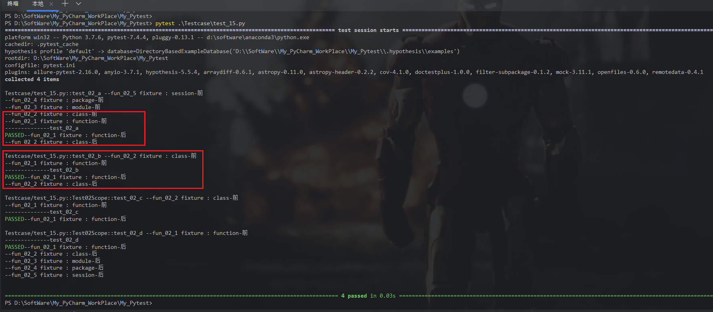

#### (4) 模块中的fixture对函数、方法均有效

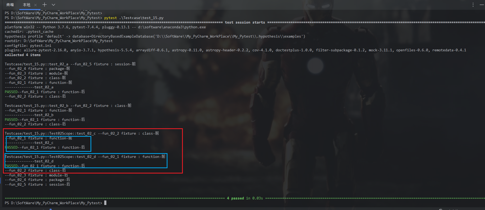


#### (5) 测试类中的fixture只对方法有效

```python
import pytest

def test_03_a():
    print("--------------test_03_a")
    
def test_03_b():
    print("--------------test_03_b")
    
class Test03Scope:
    def test_03_c(self):
        print("--------------test_03_c")
 
    def test_03_d(self):
        print("--------------test_03_d")
 
    @pytest.fixture(autouse=True, scope="function")
    def fun_03_01(self):
        print("---fixture : function-前")
        yield
        print("---fixture : function-后")
 
    @pytest.fixture(autouse=True, scope="class")
    def fun_03_02(self):
        print("---fixture : class-前")
        yield
        print("---fixture : class-后")
 
    @pytest.fixture(autouse=True, scope="module")
    def fun_03_03(self):
        print("---fixture : module-前")
        yield
        print("---fixture : module-后")
 
    @pytest.fixture(autouse=True, scope="package")
    def fun_03_04(self):
        print("---fixture : package-前")
        yield
        print("---fixture : package-后")
 
    @pytest.fixture(autouse=True, scope="session")
    def fun_03_05(self):
        print("---fixture : session-前")
        yield
        print("---fixture : session-后")
```

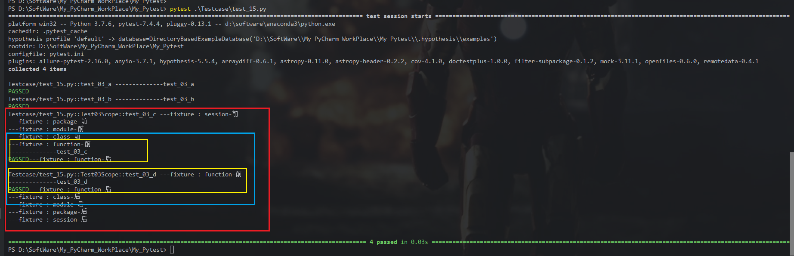

##### 🔍 核心规则分析

###### 关键规则1：**fixture 的 `autouse=True` 只对定义它的作用域及其子作用域生效**

在代码中，**所有 fixture 都定义在 `Test03Scope` 类内部**，这意味着：

- 这些 fixture 的"定义作用域"是 **`Test03Scope` 类**
- `autouse=True` 只会对**该类内部**的测试方法自动生效
- **类外部的独立函数（`test_03_a`、`test_03_b`）不受影响**

###### 关键规则2：**作用域决定了 fixture 的创建和销毁时机**

即使 fixture 定义在类内部，其 `scope` 参数依然决定了它的生命周期：

| fixture     | scope    | 创建时机                     | 销毁时机                       |
| :---------- | :------- | :--------------------------- | :----------------------------- |
| `fun_03_01` | function | 每个测试方法执行前           | 每个测试方法执行后             |
| `fun_03_02` | class    | 类中第一个测试方法执行前     | 类中最后一个测试方法执行后     |
| `fun_03_03` | module   | 模块中第一个测试执行前       | 模块中最后一个测试执行后       |
| `fun_03_04` | package  | 包中第一个测试执行前         | 包中最后一个测试执行后         |
| `fun_03_05` | session  | 整个测试会话第一个测试执行前 | 整个测试会话最后一个测试执行后 |

------


##### 结果分析

##### 🧪 测试1：`test_03_a`（独立函数，类外部）

**为什么没有任何 fixture 输出？**

- 所有 fixture 都定义在 `Test03Scope` 类内部
- `autouse=True` 只对类内部的测试方法生效
- `test_03_a` 在类外部，无法"看见"这些 fixture
- 即使 `scope="session"` 的 `fun_03_05` 也没执行，因为它定义在类内部，不会对类外部的测试生效

##### 🧪 测试2：`test_03_b`（独立函数，类外部）

**为什么没有任何 fixture 输出？**

- 原因与 `test_03_a` 完全相同
- 即使 `fun_03_05` 是 `scope="session"`，但它定义在类内部，autouse 只对类内部生效

##### **结论①**

> **定义在类内部的 autouse fixture，只对该类的方法生效，对外部函数无效。**
>
> **autouse 的生效范围由 fixture 的定义位置决定，而不是由 scope 决定。**


##### 🧪 测试3：`Test03Scope::test_03_c`（类内部第一个方法）

```
---fixture : session-前          ← 1. 最外层，整个会话级别
---fixture : package-前          ← 2. 
---fixture : module-前           ← 3. 
---fixture : class-前            ← 4. 
---fixture : function-前         ← 5. 最内层
--------------test_03_c          ← 6. 测试方法执行
PASSED
---fixture : function-后         ← 7. 最先清理（function 作用域结束）
```

**为什么 `session`、`package`、`module`、`class` 的前置都在这里执行了？**

因为 `test_03_c` 是：

- 整个测试会话的**第一个**测试（前面 `test_03_a` 和 `test_03_b` 因为没触发 fixture，所以不算真正"使用"了这些 fixture）
- `Test03Scope` 类的**第一个**测试方法
- 当前模块 `test_15.py` 中**第一个**触发 fixture 的测试

所以：

- `scope="session"`：整个会话第一次使用 fixture → 执行 `session-前`
- `scope="package"`：整个包第一次使用 fixture → 执行 `package-前`
- `scope="module"`：当前模块第一次使用 fixture → 执行 `module-前`
- `scope="class"`：当前类第一次使用 fixture → 执行 `class-前`
- `scope="function"`：当前方法执行前 → 执行 `function-前`

**为什么 `class-后` 没有在 `test_03_c` 后立即执行？**

- 因为 `scope="class"` 的生命周期是整个类，`test_03_d` 还没有执行，所以 `class` 作用域尚未结束
- 同理，`module`、`package`、`session` 也还没结束

##### 🧪 测试4：`Test03Scope::test_03_d`（类内部第二个方法）

```
---fixture : function-前         ← 1. function 级别重新创建
--------------test_03_d          ← 2. 测试方法执行
PASSED
---fixture : function-后         ← 3. function 清理
---fixture : class-后            ← 4. class 清理（类中所有方法执行完毕）
---fixture : module-后           ← 5. module 清理（模块所有测试执行完毕）
---fixture : package-后          ← 6. package 清理
---fixture : session-后          ← 7. session 清理（整个测试会话结束）
```

**为什么 `class-前`、`module-前`、`package-前`、`session-前` 没有再次打印？**

- 因为高作用域的 fixture 在 `test_03_c` 时已经创建，在整个生命周期内**复用同一个实例**
- 只有 `scope="function"` 的 `fun_03_01` 会在每个测试方法前重新创建

**为什么最后所有 `-后` 集中出现了？**

- `test_03_d` 是 `Test03Scope` 类的**最后一个**测试方法 → `class` 作用域结束 → `class-后`
- `test_03_d` 也是当前模块的**最后一个**测试 → `module` 作用域结束 → `module-后`
- 整个测试会话结束 → `package` 和 `session` 作用域结束 → 依次清理

**清理顺序**：从低作用域到高作用域（堆栈式，后进先出）

function → class → module → package → session

##### 📊 可视化执行流程

```
测试执行时间线
━━━━━━━━━━━━━━━━━━━━━━━━━━━━━━━━━━━━━━━━━━━━━━━━━━━━━━━━━━━━━━━━━━━━━━━━━━━━━━━

test_03_a (类外部)
  └─ 无 fixture 执行

test_03_b (类外部)
  └─ 无 fixture 执行

Test03Scope.test_03_c (类内部 - 第一个方法)
  ├─ fun_03_05.session-前   ← 整个会话第一次使用
  ├─ fun_03_04.package-前   ← 整个包第一次使用
  ├─ fun_03_03.module-前    ← 当前模块第一次使用
  ├─ fun_03_02.class-前     ← 当前类第一次使用
  ├─ fun_03_01.function-前  ← 当前方法前
  ├─ test_03_c 执行
  └─ fun_03_01.function-后  ← function 清理（但 class/module/package/session 未结束）

Test03Scope.test_03_d (类内部 - 第二个方法)
  ├─ fun_03_01.function-前  ← function 重新创建
  ├─ test_03_d 执行
  └─ fun_03_01.function-后  ← function 清理
  └─ fun_03_02.class-后     ← class 结束（类中所有方法执行完毕）
  └─ fun_03_03.module-后    ← module 结束（模块所有测试执行完毕）
  └─ fun_03_04.package-后   ← package 结束
  └─ fun_03_05.session-后   ← session 结束（整个测试会话结束）
```

##### 💡 核心结论

###### 结论1：**autouse 的生效范围由 fixture 的定义位置决定**

| fixture 定义位置 | autouse 生效范围          |
| :--------------- | :------------------------ |
| 全局（模块顶层） | 整个模块的所有测试        |
| 类内部           | **仅该类内部的测试方法**  |
| 函数内部         | ❌ 不允许（pytest 会报错） |

**在上述代码中**：所有 fixture 都在 `Test03Scope` 类内部定义，所以 `autouse=True` 只对 `test_03_c` 和 `test_03_d` 生效，对 `test_03_a` 和 `test_03_b` 无效。

###### 结论2：**高作用域 fixture 在其生命周期内只会创建一次**

- `scope="session"` 的 fixture 在整个测试会话中只执行一次前置
- `scope="package"` 的 fixture 在整个包中只执行一次前置
- `scope="module"` 的 fixture 在整个模块中只执行一次前置
- `scope="class"` 的 fixture 在整个类中只执行一次前置
- 它们都被**所有子作用域的测试共享**

###### 结论3：**执行顺序固定**

**前置（创建）顺序**：从高作用域到低作用域

```
session → package → module → class → function
```

**后置（清理）顺序**：从低作用域到高作用域（堆栈式）

```
function → class → module → package → session
```

------

  

#### (6) 在模块和类中有同名的fixture存在时：局部优先，也就是类中fixture优先

```python
import pytest

def test_04_a ():
    print("--------------test_04_a")

def test_04_b():
    print("--------------test_04_b")

@pytest.fixture(autouse=True, scope="function")
def fun_04_01():
    print("---fixture : function-前")
    yield
    print("---fixture : function-后")

@pytest.fixture(autouse=True, scope="class")
def fun_04_02():
    print("---fixture : class-前")
    yield
    print("---fixture : class-后")

@pytest.fixture(autouse=True, scope="module")
def fun_04_03():
    print("---fixture : module-前")
    yield
    print("---fixture : module-后")

@pytest.fixture(autouse=True, scope="package")
def fun_04_04():
    print("---fixture : package-前")
    yield
    print("---fixture : package-后")

@pytest.fixture(autouse=True, scope="session")
def fun_04_05():
    print("---fixture : session-前")
    yield
    print("---fixture : session-后")

class Test04Scope:
    def test_04_c (self):
        print("--------------test_04_c")

    def test_04_d (self):
        print("--------------test_04_d")

    @pytest.fixture(autouse=True, scope="function")
    def fun_04_01 (self):
        print("---fixture : function-前(类中)")
        yield
        print("---fixture : function-后(类中)")

    @pytest.fixture(autouse=True, scope="class")
    def fun_04_02 (self):
        print("---fixture : class-前(类中)")
        yield
        print("---fixture : class-后(类中)")

    @pytest.fixture(autouse=True, scope="module")
    def fun_04_03 (self):
        print("---fixture : module-前(类中)")
        yield
        print("---fixture : module-后(类中)")

    @pytest.fixture(autouse=True, scope="package")
    def fun_04_04 (self):
        print("---fixture : package-前(类中)")
        yield
        print("---fixture : package-后(类中)")

    @pytest.fixture(autouse=True, scope="session")
    def fun_04_05 (self):
        print("---fixture : session-前(类中)")
        yield
        print("---fixture : session-后(类中)")
```

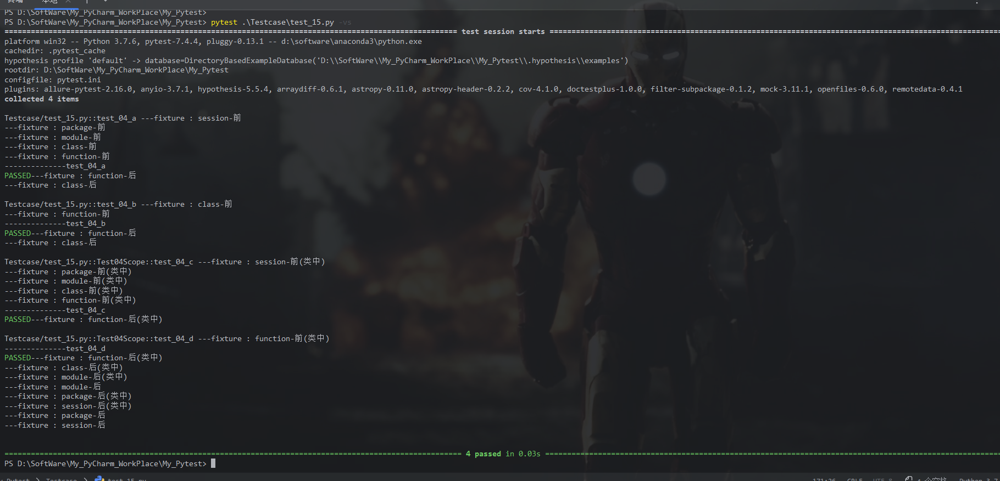

##### 🔍 核心原因分析

###### 关键规则1：**同名 fixture 会被覆盖（就近原则）**

在代码中：

- **全局定义**了 `fun_04_01`、`fun_04_02`、`fun_04_03`、`fun_04_04`、`fun_04_05`
- **类内部**也定义了同名的 `fun_04_01` ~ `fun_04_05`

**pytest 的规则**：当 fixture 同名时，**内部（子作用域）的 fixture 会覆盖外部（父作用域）的 fixture**。

因此：

- 对于 `Test04Scope` 类内部的测试方法（`test_04_c`、`test_04_d`），使用的是**类内部定义的 fixture**（带 `(类中)` 标记的）
- 对于类外部的独立函数（`test_04_a`、`test_04_b`），使用的是**全局定义的 fixture**（不带 `(类中)` 标记的）

###### 关键规则2：**autouse 的生效范围由定义位置决定**

| fixture 定义位置     | autouse 生效范围                       |
| :------------------- | :------------------------------------- |
| **全局（模块顶层）** | 整个模块的所有测试（包括独立函数和类） |
| **类内部**           | **仅该类内部的测试方法**               |

###### 关键规则3：**作用域决定了生命周期**

即使在类内部定义，`scope` 依然决定了 fixture 的创建和销毁时机。

------

##### 🧪 测试1：`test_04_a`（独立函数，使用全局 fixture）

```
---fixture : session-前          ← 1. 全局 session
---fixture : package-前          ← 2. 全局 package
---fixture : module-前           ← 3. 全局 module
---fixture : class-前            ← 4. 全局 class
---fixture : function-前         ← 5. 全局 function
--------------test_04_a
PASSED
---fixture : function-后         ← 6. 全局 function 清理
---fixture : class-后            ← 7. 全局 class 清理
```

**为什么执行了全局 fixture？**

- `test_04_a` 是类外部的独立函数
- 它"看见"的是全局定义的 fixture（`fun_04_01` ~ `fun_04_05`）
- 类内部的同名 fixture 对它不可见

**为什么 `class-后` 紧接着 `function-后` 就执行了？**

- 独立函数 `test_04_a` 被 pytest 视为一个"临时的 class 作用域"
- `test_04_a` 执行完毕后，这个"临时 class"结束，所以 `class` 作用域立即清理
- 但 `module`、`package`、`session` 还没结束（还有其他测试未执行）

##### 🧪 测试2：`test_04_b`（独立函数，使用全局 fixture）

```
---fixture : class-前            ← 1. 全局 class 重新创建
---fixture : function-前         ← 2. 全局 function 重新创建
--------------test_04_b
PASSED
---fixture : function-后         ← 3. 全局 function 清理
---fixture : class-后            ← 4. 全局 class 清理
```

**为什么 `session`、`package`、`module` 没有再次打印前置？**

- `scope="session"`、`package`、`module` 的 fixture 在 `test_04_a` 时已经创建
- 生命周期还没结束，所以**复用同一个实例**，不会重复执行前置

**为什么 `class` 又执行了一次前置？**

- `test_04_a` 执行完毕后，`class` 作用域已经清理
- `test_04_b` 是一个新的独立函数，pytest 认为这是一个新的"临时 class"
- 所以 `class` 级别 fixture 重新创建

##### 🧪 测试3：`Test04Scope::test_04_c`（类内部第一个方法，使用类内 fixture）

```
---fixture : session-前(类中)    ← 1. 类内 session
---fixture : package-前(类中)    ← 2. 类内 package
---fixture : module-前(类中)     ← 3. 类内 module
---fixture : class-前(类中)      ← 4. 类内 class
---fixture : function-前(类中)   ← 5. 类内 function
--------------test_04_c
PASSED
---fixture : function-后(类中)   ← 6. 类内 function 清理
```

**为什么切换到类内 fixture？**

- `test_04_c` 在 `Test04Scope` 类内部
- 类内部定义的同名 fixture **覆盖**了全局的 fixture
- 所以执行的是带 `(类中)` 标记的版本

**为什么 `class-后(类中)` 没有出现？**

- 因为 `scope="class"` 的生命周期是整个类
- `test_04_d` 还没有执行，`class` 作用域未结束
- 所以 `class-后(类中)` 会延迟到 `test_04_d` 执行完后才执行

**为什么 `session`、`package`、`module` 的全局版本没有执行？**

- 因为 `test_04_c` 使用的是类内 fixture
- 类内 fixture 是**独立的**，与全局 fixture 没有任何关联

##### 🧪 测试4：`Test04Scope::test_04_d`（类内部第二个方法，使用类内 fixture）

```
---fixture : function-前(类中)   ← 1. 类内 function 重新创建
--------------test_04_d
PASSED
---fixture : function-后(类中)   ← 2. 类内 function 清理
---fixture : class-后(类中)      ← 3. 类内 class 清理（类结束）
---fixture : module-后(类中)     ← 4. 类内 module 清理
---fixture : module-后           ← 5. ⚠️ 全局 module 清理
---fixture : package-后(类中)    ← 6. 类内 package 清理
---fixture : session-后(类中)    ← 7. 类内 session 清理
---fixture : package-后          ← 8. ⚠️ 全局 package 清理
---fixture : session-后          ← 9. ⚠️ 全局 session 清理
```

**为什么 `class-前(类中)` 没有再次出现？**

- `class` 作用域的 fixture 在 `test_04_c` 时已经创建
- 所有类内方法共享同一个实例，不会重新创建

**为什么最后出现了"混合清理"（类内 + 全局）？**

清理顺序是**堆栈式（后进先出）**：

1. `function-后(类中)` — 类内 function 清理（当前方法结束）
2. `class-后(类中)` — 类内 class 清理（类中所有方法执行完毕）
3. `module-后(类中)` — 类内 module 清理（类内 module 结束）
4. **`module-后`** — **⚠️ 全局 module 清理**（整个模块的测试结束）
5. `package-后(类中)` — 类内 package 清理
6. `session-后(类中)` — 类内 session 清理
7. **`package-后`** — **⚠️ 全局 package 清理**（整个包的测试结束）
8. **`session-后`** — **⚠️ 全局 session 清理**（整个会话结束）

**为什么全局的清理在类内清理之间穿插？**

因为类内 fixture 和全局 fixture 是**完全独立的两个体系**，它们在同一个时间线上运行：

```
时间线 
━━━━━━━━━━━━━━━━━━━━━━━━━━━━━━━━━━━━━━━━━━━━━━━━━━━━━━━━━━━━━━━━━

类内 session/package/module/class/function 前置
  ↓
test_04_c 执行
  ↓
类内 function 清理（test_04_c 结束）
  ↓
test_04_d 执行
  ↓
类内 function 清理（test_04_d 结束）
  ↓
类内 class 清理          ← 类结束
  ↓
类内 module 清理         ← 类内 module 结束
  ↓
全局 module 清理         ← 全局 module 结束（整个模块测试完）
  ↓
类内 package 清理        ← 类内 package 结束
  ↓
类内 session 清理        ← 类内 session 结束
  ↓
全局 package 清理        ← 全局 package 结束
  ↓
全局 session 清理        ← 全局 session 结束（整个会话完）
```

------

##### 📊两个体系的对比

| 维度                      | 全局 fixture（模块顶层）              | 类内 fixture（Test04Scope 内部）   |
| :------------------------ | :------------------------------------ | :--------------------------------- |
| **定义位置**              | 模块顶层                              | 类内部                             |
| **生效范围**              | 整个模块（包括独立函数和类）          | **仅该类内部**                     |
| **覆盖关系**              | 被类内同名 fixture 覆盖（对类内方法） | 覆盖全局同名 fixture（对类内方法） |
| **对 `test_04_a/b` 生效** | ✅ 是                                  | ❌ 否（类外不可见）                 |
| **对 `test_04_c/d` 生效** | ❌ 否（被覆盖）                        | ✅ 是                               |
| **生命周期**              | 独立管理                              | 独立管理（与全局无关）             |

------

##### 💡 核心结论

###### 结论1：**同名 fixture 就近覆盖（作用域遮蔽）**

类似于 Python 的**变量作用域规则**：局部变量覆盖全局变量。

```python
# 全局 fixture（对类外有效）
@pytest.fixture(autouse=True, scope="class")
def fun_04_02():
    print("全局 class")

class TestClass:
    # 类内 fixture（对类内有效，覆盖全局）
    @pytest.fixture(autouse=True, scope="class")
    def fun_04_02(self):
        print("类内 class")
    
    def test_method(self):
        # 这里使用的是"类内 class"，不是"全局 class"
        pass
```

------

###### 结论2：**全局 fixture 和类内 fixture 是独立的两个体系**

它们各自管理自己的生命周期：

> - 全局的 `scope="session"` 和类内的 `scope="session"` 是**两个不同的 fixture 实例**
> - 它们的创建和销毁是独立的
> - 清理顺序取决于各自的结束时机

------

###### 结论3：**清理顺序遵循"堆栈式"原则**

在同一时间线上，多个 fixture 体系可以共存：

```
前置顺序（从外到内）：
  全局 session → 全局 package → 全局 module → 全局 class → 全局 function
  → 类内 session → 类内 package → 类内 module → 类内 class → 类内 function

清理顺序（从内到外，反向堆栈）：
  类内 function → 类内 class → 类内 module → 类内 package → 类内 session
  → 全局 function → 全局 class → 全局 module → 全局 package → 全局 session
```

##### 🎯 实际应用建议

| 场景                                           | 建议                                                    |
| :--------------------------------------------- | :------------------------------------------------------ |
| **需要在所有测试中自动执行**（如环境变量设置） | 定义**全局** `autouse=True` fixture                     |
| **需要仅在特定类中自动执行**（如类内共享资源） | 定义**类内** `autouse=True` fixture                     |
| **需要全局 fixture 对类内方法也生效**          | 不要在类内定义同名 fixture，或者使用不同的名称          |
| **需要类内 fixture 覆盖全局**                  | 使用相同的名称，类内定义会自动覆盖                      |
| **需要两者都用**                               | 使用**不同名称**，通过参数注入或 `usefixtures` 显式使用 |

------

##### 🎯 总结

| 关键点       | 代码表现                                                     |
| :----------- | :----------------------------------------------------------- |
| **类外函数** | 使用全局定义的 fixture                                       |
| **类内方法** | 使用类内定义的 fixture（覆盖全局）                           |
| **同名覆盖** | 类内 fixture 优先级更高                                      |
| **生命周期** | 全局和类内独立管理，各自按 scope 执行                        |
| **清理顺序** | 堆栈式：类内 function → class → module → package → session → 全局 module → package → session |


## 15: fixture跨模块共享conftest.py

### 1、关于conftest.py

如果多个模块使用的fixture相同，那么，我们可以将fixture写在conftest.py中（通过conftest.py管理共享的fixture），这样达到跨模块和文件的效果

conftest的特点：

> 1、文件名称默认为conftest.py，是pytest里面固定的名字，不能随意更改，通常在里面写用例执行前的一些初始化操作
>
> 2、conftest.py文件可以有多个(全局、局部)，搜索优先级自底而上（从和模块同级目录开始找，一直到项目根目录），遵循就近原则
>
> 3、conftest.py中的fixture可以跨文件调用，支持函数引用、通过装饰器调用，也可以自动适配（此时autouse要改为True；如果就近的一个都是False，远的一个都是True，此时还是会自动适配近的，详见文末示例）
>
> 4、conftest.py文件作用范围是它同级test文件，或者下面的test文件
>
> 5、不需要import导入conftest.py，pytest用例会自动识别该文件，放到项目的根目录下就可以全局目录调用
>
> 6、conftest.py文件不能被其他文件导入

### 2、不同作用域的`conftest.py`

#### (1) 仅局部`conftest.py`

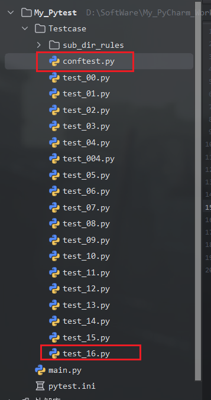

##### 测试用例文件夹下，局部`Testcase/conftest.py`

```python
import pytest

@pytest.fixture()
def fun_login():
    print("--fun_login 登录(局部conftest.py)")
    yield
    print("--fun_login 登出(局部conftest.py)")

@pytest.fixture()
def fun_16_01(fun_login):
    print("---fun_16_01 ")
```

##### 测试用例`Testcase/test_16.py`

```python
import pytest

## 1、使用局部的conftest.py
def test_16_a(fun_login):
    print("--------------test_16_a")
```

##### 测试结果

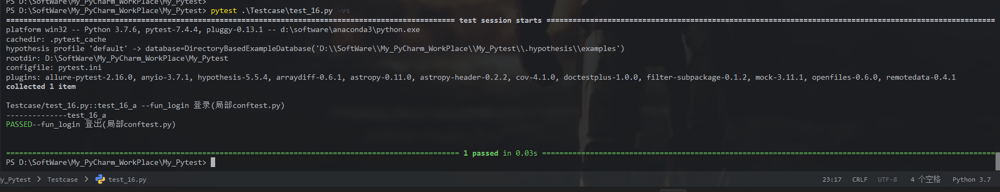


#### (2) 全局`conftest.py`

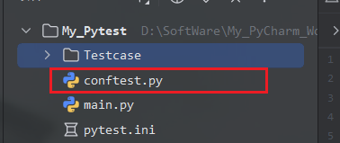

##### 局部`Testcase/conftest.py`

```python
import pytest

@pytest.fixture()
def fun_login():
    print("--fun_login 登录(局部conftest.py)")
    yield
    print("--fun_login 登出(局部conftest.py)")

@pytest.fixture()
def fun_16_01(fun_login):
    print("---fun_16_01 ")
```

##### 全局`conftest.py`

```python
"""
全局conftest.py,配置管理共享的fixture
"""
import pytest

@pytest.fixture(autouse=True, scope="function")
def f():
    print("---fixture : function-前")
    yield
    print("---fixture : function-后")

@pytest.fixture(autouse=True, scope="class")
def f2():
    print("---fixture : class-前")
    yield
    print("---fixture : class-后")

@pytest.fixture(autouse=True, scope="module")
def f3():
    print("---fixture : module-前")
    yield
    print("---fixture : module-后")

@pytest.fixture(autouse=True, scope="package")
def f4():
    print("---fixture : package-前")
    yield
    print("---fixture : package-后")

@pytest.fixture(autouse=True, scope="session")
def f5():
    print("---fixture : session-前")
    yield
    print("---fixture : session-后")
```

##### 测试用例`Testcase/test_16.py`

```python
## 2、使用全局的conftest.py
def test_16_b(fun_login):
    print("--------------test_16_b")
```

##### 测试结果

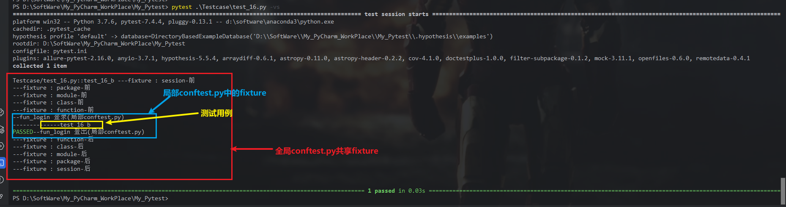

#### (3) 全局和局部的`conftest.py`有同名fixture

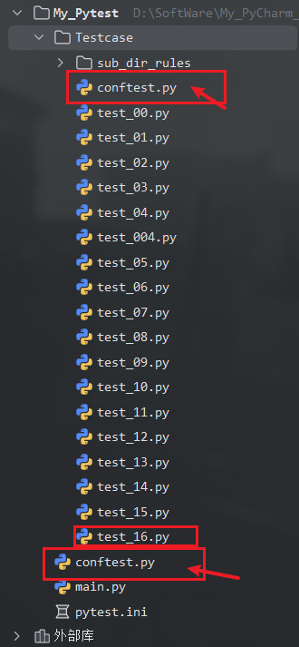

##### 情况1：局部和全局`conftest.py`有同名fixture，局部`conftest.py`的`autouse=False`，全局`conftest.py`的`autouse=True`

###### 全局`conftest.py`

```python
import pytest

@pytest.fixture(autouse=True, scope="function")
def f0():
    print("---fixture : function-前（全局f0）")
    yield
    print("---fixture : function-后（全局f0）")
```

###### 局部`Testcase/conftest.py`

```python
import pytest

@pytest.fixture()
def fun_login():
    print("--fun_login 登录(局部conftest.py)")
    yield
    print("--fun_login 登出(局部conftest.py)")

@pytest.fixture()
def fun_16_01(fun_login):
    print("---fun_16_01 ")


@pytest.fixture(autouse=False, scope="function")
def f0():
    print("---fixture : function-前(局部f0)")
    yield
    print("---fixture : function-后(局部f0)")
```

###### 测试用例`Testcase/test_16.py`

```python
## 3、当全局和局部conftest.py都有同名fixture时
def test_16_c(fun_login):
    print("--------------test_16_c")
```

###### 测试结果

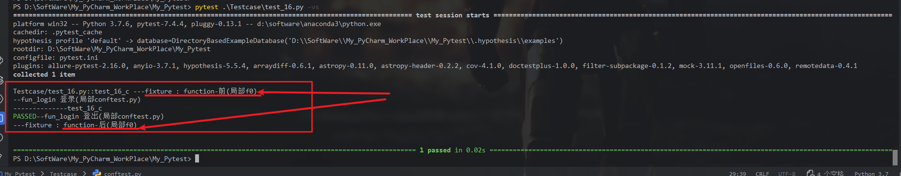

###### 🔍 核心原因：conftest.py 的层级覆盖规则

pytest 的 `conftest.py` 遵循**就近覆盖（近者优先）**原则

**规则**：当存在同名 fixture 时，**目录层级更低的 `conftest.py` 中的 fixture 会覆盖层级更高的**。

```
项目根目录/
├── conftest.py              ← 全局（最远，优先级最低）
└── Testcase/                ← 测试目录
    ├── conftest.py          ← 局部（更近，优先级最高）✅ 
    └── test_16.py           ← 测试用例
```

###### 💡 结论

**当局部 `conftest.py` 中的 fixture 与全局 `conftest.py` 中的 fixture 同名时，会发生以下情况：**

1. **完全覆盖**：全局 fixture 对局部目录下的测试不可见
2. **autouse 属性继承**：局部 fixture 的 `autouse` 属性**实际上继承了全局 fixture 的 `autouse` 值**
3. 也就是说，你的 `autouse=False` 在覆盖时被**忽略**了，实际使用的是全局 `autouse=True`

------

##### 情况2：局部和全局`conftest.py`有同名fixture，局部`conftest.py`的`autouse=True`，全局`conftest.py`的`autouse=False`

###### 全局`conftest.py`

```python
import pytest

@pytest.fixture(autouse=False, scope="function")
def f0():
    print("---fixture : function-前（全局f0）")
    yield
    print("---fixture : function-后（全局f0）")
```

###### 局部`Testcase/conftest.py`

```python
import pytest

@pytest.fixture()
def fun_login():
    print("--fun_login 登录(局部conftest.py)")
    yield
    print("--fun_login 登出(局部conftest.py)")

@pytest.fixture()
def fun_16_01(fun_login):
    print("---fun_16_01 ")


@pytest.fixture(autouse=True, scope="function")
def f0():
    print("---fixture : function-前(局部f0)")
    yield
    print("---fixture : function-后(局部f0)")
```

###### 测试用例`Testcase/test_16.py`

```python
## 3、当全局和局部conftest.py都有同名fixture时
def test_16_c(fun_login):
    print("--------------test_16_c")
```

###### 测试结果

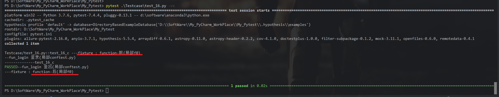

###### 🎯 结论

| 关键点           | 说明                                                         |
| :--------------- | :----------------------------------------------------------- |
| **覆盖规则**     | 局部 `conftest.py` 中的 fixture 会覆盖全局的**同名** fixture |
| **autouse 行为** | 覆盖时，局部 fixture 的 `autouse` 属性**会继承**全局 fixture 的 `autouse` 值 |
| **你的代码中**   | 全局 `f0` 是 `autouse=True`，局部 `f0` 虽然写了 `autouse=False`，但实际运行时是 `autouse=True` |
| **建议**         | 避免在多个 `conftest.py` 中使用同名 fixture，或者明确设置 `autouse` 值 |


### 3、指定引用全局fixture

在用例中可以通过`@pytest.mark.usefixtures()`指定引用全局`autouse=False`的fixture


## 16: fixture标志传参

### 特点

1. 采用`pytest.mark.xxx(参数)`标志所需要的参数，然后在fixture中可以做一些逻辑处理
2. fixture采用`request`获取参数
3. 传参的个数可以是多个，类型可以为简单类型或者复杂对象

| 关键点               | 说明                                             |
| :------------------- | :----------------------------------------------- |
| **标记的作用**       | 向测试函数附加元数据，被 fixture 读取和处理      |
| **fixture 访问标记** | 通过 `request.node.get_closest_marker("标记名")` |
| **标记参数**         | `args`（位置参数）和 `kwargs`（关键字参数）      |
| **标记继承**         | 方法级 > 类级 > 模块级 > 全局级                  |
| **适用场景**         | 配置传递、数据准备、测试分类、条件执行           |

### 示例

#### 1、简单类型

`Testcase/test_17.py`

```python
import pytest
 
@pytest.fixture
def fun_01(request):
    # request.node: 当前测试节点（包含所有元数据）
    marker = request.node.get_closest_marker("mydata")
    if marker is None:
        data = None
    else:
        # marker.args: 位置参数元组，如 (1,)
        # marker.kwargs: 关键字参数字典，如 {"key": "value"}
        data = marker.args[0] + 1
    return data

## 需要在pytest.ini 中进行marker注册
@pytest.mark.mydata(1)
def test_data_01(fun_01):
    print("fun_01={}".format(fun_01))
 
if __name__ == '__main__':
    pytest.main(['-vs'])
```

`pytest.ini`

```python
[pytest]
……
markers =
    ……
    mydata: 自定义标记，用于传递数据到 fixture
```

结果

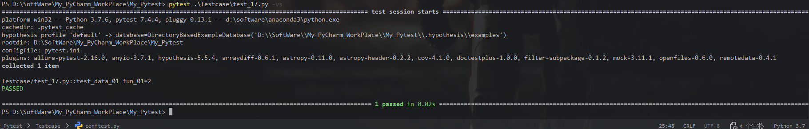

##### 📊 执行流程拆解

```python
1. pytest 收集测试用例
   └── 发现 test_data_01 使用了 @pytest.mark.mydata(1)

2. pytest 解析测试函数依赖
   └── test_data_01 依赖 fixture fun_01

3. 执行 fixture fun_01 的前置逻辑
   ├── request.node 指向当前测试节点 (test_data_01)
   ├── 调用 get_closest_marker("mydata")
   ├── 找到标记 mydata，其 args = (1,)
   ├── data = marker.args[0] + 1 = 1 + 1 = 2
   └── 返回 data = 2

4. 执行测试函数 test_data_01
   └── 接收 fun_01 的返回值 2
   └── print("fun_01=2")

5. 测试通过 ✅
```

##### 🔍 核心机制详解

###### 1️⃣ 标记（Marker）如何传递数据

```python
@pytest.mark.mydata(1)          # ← 标记携带参数 1
def test_data_01(fun_01):       # ← fixture 注入
    print("fun_01={}".format(fun_01))  # ← 输出 2
```

**数据流向：**

```python
标记参数 (1) 
    ↓
fixture 通过 request.node.get_closest_marker() 获取
    ↓
fixture 处理数据 (1 + 1 = 2)
    ↓
fixture 返回处理后的数据给测试函数
    ↓
测试函数使用该数据
```

###### 2️⃣ `request.node.get_closest_marker()` 的工作原理

```python
@pytest.fixture
def fun_01(request):
    # request.node: 当前测试节点（包含所有元数据）
    marker = request.node.get_closest_marker("mydata")
    
    if marker is None:
        data = None
    else:
        # marker.args: 位置参数元组，如 (1,)
        # marker.kwargs: 关键字参数字典，如 {"key": "value"}
        data = marker.args[0] + 1
    return data
```

**关键属性：**

| 属性            | 类型  | 说明       | 示例               |
| :-------------- | :---- | :--------- | :----------------- |
| `marker.name`   | str   | 标记名称   | `"mydata"`         |
| `marker.args`   | tuple | 位置参数   | `(1, 2, 3)`        |
| `marker.kwargs` | dict  | 关键字参数 | `{"key": "value"}` |

###### 3️⃣ 多种标记使用方式对比

```python
import pytest

@pytest.fixture
def process_marker(request):
    marker = request.node.get_closest_marker("mydata")
    return marker

# 方式1：单个参数
@pytest.mark.mydata(10)
def test_single(process_marker):
    print(process_marker.args[0])  # 输出: 10

# 方式2：多个参数
@pytest.mark.mydata(10, 20, 30)
def test_multiple(process_marker):
    print(process_marker.args)  # 输出: (10, 20, 30)
    print(process_marker.args[1])  # 输出: 20

# 方式3：关键字参数
@pytest.mark.mydata(a=1, b=2, c=3)
def test_kwargs(process_marker):
    print(process_marker.kwargs)  # 输出: {'a': 1, 'b': 2, 'c': 3}
    print(process_marker.kwargs["b"])  # 输出: 2

# 方式4：混合使用
@pytest.mark.mydata(100, x=200, y=300)
def test_mixed(process_marker):
    print(process_marker.args)     # 输出: (100,)
    print(process_marker.kwargs)   # 输出: {'x': 200, 'y': 300}
    print(process_marker.args[0] + process_marker.kwargs["x"])  # 输出: 300
```

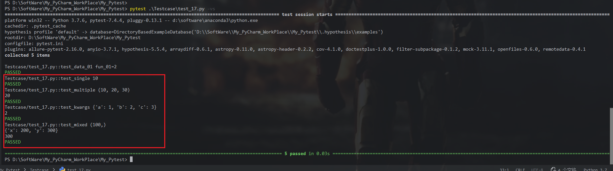

###### 4️⃣ 标记的继承与覆盖

```python
@pytest.fixture
def get_marker(request):
    return request.node.get_closest_marker("mydata")

# 类级别的标记
@pytest.mark.mydata(100)
class TestClass:
    
    # 方法级别的标记会覆盖类级别的
    @pytest.mark.mydata(200)
    def test_method_1(self, get_marker):
        print(get_marker.args[0])  # 输出: 200（方法标记覆盖类标记）
    
    # 没有方法级别标记时，使用类级别的
    def test_method_2(self, get_marker):
        print(get_marker.args[0])  # 输出: 100（继承类标记）
    
    # 多个标记可以叠加
    @pytest.mark.mydata(300)
    @pytest.mark.mydata(500)
    def test_method_3(self, get_marker):
        print(get_marker.args[0])  # 输出: 300
```

**覆盖规则：**

```
方法级别标记 > 类级别标记 > 模块级别标记 > 全局标记
```

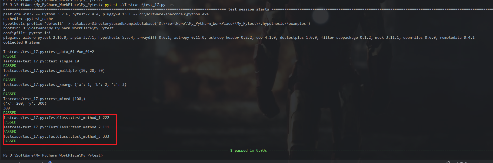


###### 5️⃣ 标记不存在时的处理

```python
@pytest.fixture
def safe_marker(request):
    marker = request.node.get_closest_marker("mydata")
    if marker is None:
        return 0  # 默认值
    return marker.args[0]

# 没有标记
def test_no_marker(safe_marker):
    print(safe_marker)  # 输出: 0（使用默认值）

# 有标记
@pytest.mark.mydata(10)
def test_with_marker(safe_marker):
    print(safe_marker)  # 输出: 10
```

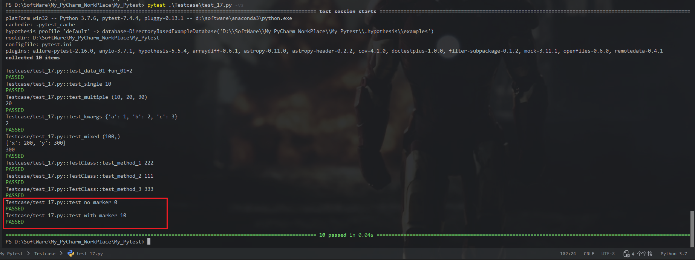

##### 💡 核心结论

###### 结论1：**标记（Marker）是测试的"元数据携带者"**

- 标记可以将数据附加到测试函数上
- fixture 可以通过 `request.node` 访问这些数据
- 实现了**测试数据与 fixture 的解耦**

###### 结论2：**标记 + fixture = 强大的数据传递机制**

| 方式                       | 适用场景                 |
| :------------------------- | :----------------------- |
| `@pytest.mark.xxx(value)`  | 向 fixture 传递配置数据  |
| `@pytest.mark.parametrize` | 参数化测试（数据驱动）   |
| `@pytest.mark.slow`        | 标记测试类型，选择性执行 |
| `@pytest.mark.skipif`      | 条件跳过测试             |

###### 结论3：**`get_closest_marker()` 支持标记继承**

- 方法级标记覆盖类级标记
- 类级标记覆盖模块级标记
- 模块级标记覆盖全局标记


#### 2、复杂类型

```python
@pytest.fixture
def fun_02(request):
    marker = request.node.get_closest_marker("mydata")
    if marker is None:
        data = None
    else:
        data = marker.args[0]
        data[-1]=666
    return data
 
@pytest.mark.mydata([1,2,3])  # ← 传递一个列表对象（可变）.标记传递的是一个列表对象，而不是副本。fixture 接收到的是同一个对象的引用。
def test_data_02(fun_02):
    print("fun_02={}".format(fun_02))
```

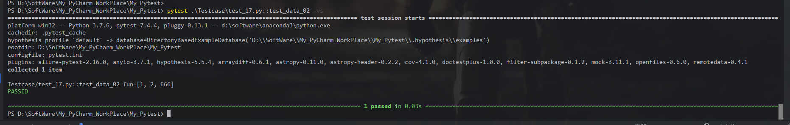

##### 📊 执行流程拆解

```
测试函数上的标记
    ↓
@pytest.mark.mydata([1, 2, 3])     ← 标记传递一个列表 [1, 2, 3]
    ↓
fixture fun_02 接收标记数据
    ↓
marker.args[0] = [1, 2, 3]        ← 获取列表
    ↓
data[-1] = 666                     ← 修改列表最后一个元素
    ↓
data = [1, 2, 666]                ← 列表被修改
    ↓
return data                        ← 返回修改后的列表
    ↓
测试函数 test_data_02 接收
    ↓
print("fun={}".format(fun_02))    ← 输出: fun=[1, 2, 666]
    ↓
测试通过 ✅
```

#### 3、可以传多个

```python
@pytest.fixture
def fun_03(request):
    marker = request.node.get_closest_marker("mydata")
    marker2 = request.node.get_closest_marker("mydata2")
    if marker is None:
        data = None
    else:
        data = marker.args[0]
        data[-1]=666
    if marker2 is None:
        data2 = None
    else:
        data2 = marker2.args[0] + 1
    return data,data2
 
@pytest.mark.mydata([1,2,3])
@pytest.mark.mydata2(1)
def test_data_03(fun_03):
    print("fun_03={}".format(fun_03))
```

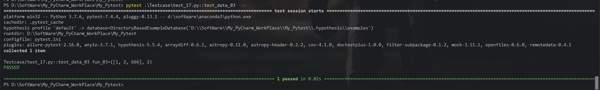

##### 📊 执行流程拆解

```
1. pytest 收集测试用例
   └── 发现 test_data_03 使用了两个标记：
       ├── @pytest.mark.mydata([1, 2, 3])
       └── @pytest.mark.mydata2(1)

2. pytest 解析测试函数依赖
   └── test_data_03 依赖 fixture fun_03

3. 执行 fixture fun_03
   ├── 获取标记 mydata
   │   └── marker.args[0] = [1, 2, 3]
   │   └── data = [1, 2, 3]
   │   └── data[-1] = 666  → 修改为 [1, 2, 666]
   │
   ├── 获取标记 mydata2
   │   └── marker2.args[0] = 1
   │   └── data2 = 1 + 1 = 2
   │
   └── return data, data2  → 返回元组 ([1, 2, 666], 2)

4. 执行测试函数 test_data_03
   └── 接收 fun_03 返回的元组
   └── print("fun_03=([1, 2, 666], 2)")
   └── 测试通过 ✅
```

##### 💡 核心机制解析

###### 1️⃣ 多个标记可以共存

```python
@pytest.mark.mydata([1, 2, 3])    # 标记1：传递列表
@pytest.mark.mydata2(1)           # 标记2：传递数字
def test_data_03(fun_03):
    ...
```

**关键点：**

- 一个测试函数可以**同时使用多个标记**
- 每个标记**独立存在**，互不干扰
- fixture 可以通过 `request.node.get_closest_marker()` 分别获取每个标记

------

###### 2️⃣ fixture 可以返回多个值（元组）

```python
@pytest.fixture
def fun_03(request):
    # ... 处理标记1 ...
    # ... 处理标记2 ...
    return data, data2   # 返回元组
```

**返回形式：**

- `return data, data2` 等价于 `return (data, data2)`
- 测试函数接收时得到的是一个**元组**


### 🧪 多种接收方式对比

#### 1️⃣ 基本接收方式

| 方式               | 代码示例                                              | 使用场景       |
| :----------------- | :---------------------------------------------------- | :------------- |
| **直接接收单个值** | `def test(fixture_name):`                             | 只需要一个数据 |
| **接收元组**       | `def test(fixture_name): data1, data2 = fixture_name` | 返回多个值     |
| **接收字典**       | `def test(fixture_name): data = fixture_name["key"]`  | 返回结构化数据 |
| **接收自定义对象** | `def test(fixture_name): fixture_name.method()`       | 返回类实例     |

#### 2️⃣ 单标记接收

```python
@pytest.fixture
def single_marker(request):
    marker = request.node.get_closest_marker("mydata")
    return marker.args[0] if marker else None

@pytest.mark.mydata(100)
def test_single(single_marker):
    print(single_marker)  # 输出: 100
```

#### 3️⃣ 多标记分别接收（返回元组）

```python
@pytest.fixture
def multiple_markers(request):
    marker1 = request.node.get_closest_marker("data1")
    marker2 = request.node.get_closest_marker("data2")
    
    data1 = marker1.args[0] if marker1 else None
    data2 = marker2.args[0] if marker2 else None
    
    return data1, data2  # 返回元组

@pytest.mark.data1(10)
@pytest.mark.data2(20)
def test_multiple(multiple_markers):
    data1, data2 = multiple_markers  # 解包
    print(f"data1={data1}, data2={data2}")  # 输出: data1=10, data2=20
```

#### 4️⃣ 多标记接收（返回字典 - 更清晰）

```python
@pytest.fixture
def dict_markers(request):
    marker1 = request.node.get_closest_marker("user")
    marker2 = request.node.get_closest_marker("role")
    
    return {
        "user": marker1.args[0] if marker1 else None,
        "role": marker2.args[0] if marker2 else None,
        "processed": True
    }

@pytest.mark.user({"name": "Alice"})
@pytest.mark.role("admin")
def test_dict(dict_markers):
    assert dict_markers["user"]["name"] == "Alice"
    assert dict_markers["role"] == "admin"
    assert dict_markers["processed"] is True
```

#### 5️⃣ 可变对象修改

```python
@pytest.fixture
def modify_list(request):
    marker = request.node.get_closest_marker("data")
    if marker is None:
        return None
    
    data = marker.args[0]  # 获取列表引用
    data.append(999)       # 修改原始列表
    return data

@pytest.mark.data([1, 2, 3])
def test_modify(modify_list):
    print(modify_list)  # 输出: [1, 2, 3, 999]
```

#### 6️⃣ 不可变对象处理

```python
@pytest.fixture
def process_int(request):
    marker = request.node.get_closest_marker("number")
    if marker is None:
        return 0
    
    data = marker.args[0]  # 数字是不可变对象
    return data + 10       # 返回新值

@pytest.mark.number(5)
def test_int(process_int):
    print(process_int)  # 输出: 15
```

### 📋 多个标记的协同工作

#### 1️⃣ 数据组合模式

```python
@pytest.fixture
def combined(request):
    config = request.node.get_closest_marker("config")
    data = request.node.get_closest_marker("data")
    
    config_data = config.args[0] if config else {}
    test_data = data.args[0] if data else None
    
    # 组合数据
    return {
        "config": config_data,
        "data": test_data,
        "full": {**config_data, "data": test_data} if isinstance(config_data, dict) else None
    }

@pytest.mark.config({"env": "test", "debug": True})
@pytest.mark.data({"id": 1, "name": "test"})
def test_combined(combined):
    assert combined["config"]["env"] == "test"
    assert combined["data"]["id"] == 1
```

#### 2️⃣ 数据转换链

```python
@pytest.fixture
def transform_chain(request):
    raw = request.node.get_closest_marker("raw")
    transform = request.node.get_closest_marker("transform")
    
    raw_data = raw.args[0] if raw else None
    transform_func = transform.args[0] if transform else lambda x: x
    
    # 应用转换
    return transform_func(raw_data)

@pytest.mark.raw([1, 2, 3])
@pytest.mark.transform(lambda x: [i * 2 for i in x])
def test_transform(transform_chain):
    print(transform_chain)  # 输出: [2, 4, 6]
```

#### 3️⃣ 条件标记处理

```python
@pytest.fixture
def conditional(request):
    env = request.node.get_closest_marker("env")
    data = request.node.get_closest_marker("data")
    
    env_name = env.args[0] if env else "default"
    test_data = data.args[0] if data else None
    
    # 根据环境处理数据
    if env_name == "prod":
        return {"data": test_data, "safe": True}
    else:
        return {"data": test_data, "debug": True}

@pytest.mark.env("test")
@pytest.mark.data({"user": "admin"})
def test_conditional(conditional):
    assert conditional["debug"] is True
    assert conditional["safe"] is False
```

#### 4️⃣ 标记继承

```python
# 类级别标记
@pytest.mark.mydata(100)
class TestClass:
    
    @pytest.mark.mydata(200)  # 覆盖类标记
    def test_override(self, single_marker):
        print(single_marker)  # 输出: 200
    
    def test_inherit(self, single_marker):
        print(single_marker)  # 输出: 100（继承类标记）
    
    @pytest.mark.mydata(300)
    @pytest.mark.mydata2(50)  # 多标记叠加
    def test_multiple(self, multiple_markers):
        data1, data2 = multiple_markers
        print(f"{data1}, {data2}")  # 输出: 300, 50
```


#### 场景1：配置 + 数据分离

```python
@pytest.fixture
def test_config(request):
    config_marker = request.node.get_closest_marker("config")
    data_marker = request.node.get_closest_marker("data")
    
    config = config_marker.args[0] if config_marker else {}
    data = data_marker.args[0] if data_marker else None
    
    # 根据配置处理数据
    if config.get("transform", False):
        data = data * 2
    return config, data

@pytest.mark.config({"transform": True})
@pytest.mark.data(10)
def test_transform(test_config):
    config, data = test_config
    assert config["transform"] is True
    assert data == 20  # 10 * 2
```

#### 场景2: 多数据源合并

```python
@pytest.fixture
def combined_data(request):
    marker1 = request.node.get_closest_marker("user")
    marker2 = request.node.get_closest_marker("role")
    
    user_data = marker1.args[0] if marker1 else {}
    role_data = marker2.args[0] if marker2 else {}
    
    # 合并数据
    return {**user_data, **role_data}

@pytest.mark.user({"name": "Alice", "age": 30})
@pytest.mark.role({"role": "admin", "permissions": ["read", "write"]})
def test_user_role(combined_data):
    assert combined_data["name"] == "Alice"
    assert combined_data["role"] == "admin"
    assert combined_data["permissions"] == ["read", "write"]
```

### ⚠️ 注意事项

#### ⚠️ 注意点1：标记必须在 pytest.ini 中注册

#### ⚠️ 注意点2：标记不存在时的安全处理

```python
@pytest.fixture
def safe_markers(request):
    marker1 = request.node.get_closest_marker("mydata")
    marker2 = request.node.get_closest_marker("mydata2")
    
    # 安全处理：如果标记不存在，使用默认值
    data1 = marker1.args[0] if marker1 else None
    data2 = marker2.args[0] if marker2 else 0
    
    return data1, data2
```

#### ⚠️ 注意点3：标记的顺序不影响结果

```python
# 以下两种写法效果相同：
@pytest.mark.mydata2(1)
@pytest.mark.mydata([1, 2, 3])
def test_order_1(fun_03):
    pass

@pytest.mark.mydata([1, 2, 3])
@pytest.mark.mydata2(1)
def test_order_2(fun_03):
    pass
```

#### ⚠️ 注意点4：可变对象的副作用

```python
shared_list = [1, 2, 3]

@pytest.mark.mydata(shared_list)
def test_1(fixture_modify):
    # 这里修改了 shared_list
    pass

@pytest.mark.mydata(shared_list)
def test_2(fixture_modify):
    # 这里看到的是被 test_1 修改后的 shared_list
    # ⚠️ 测试之间相互影响！
    pass

# ✅ 安全做法：在 fixture 中复制
@pytest.fixture
def safe_modify(request):
    marker = request.node.get_closest_marker("mydata")
    if marker is None:
        return None
    data = marker.args[0].copy()  # 复制一份
    data[-1] = 666
    return data
```


#### 3️⃣ fixture 返回复杂结构

```python
@pytest.fixture
def complex_fixture(request):
    marker1 = request.node.get_closest_marker("data")
    marker2 = request.node.get_closest_marker("config")
    
    # 返回字典（比元组更清晰）
    return {
        "data": marker1.args[0] if marker1 else None,
        "config": marker2.args[0] if marker2 else {},
        "processed": True
    }

@pytest.mark.data([1, 2, 3])
@pytest.mark.config({"debug": True})
def test_complex(complex_fixture):
    assert complex_fixture["processed"] is True
    assert complex_fixture["data"] == [1, 2, 3]
```

### 🎯 核心结论

| 维度           | 关键点                                                       |
| :------------- | :----------------------------------------------------------- |
| **标记的本质** | 测试函数的元数据携带者，通过 `request.node.get_closest_marker()` 获取 |
| **标记注册**   | 必须在 `pytest.ini` 或 `pyproject.toml` 中注册，否则报错     |
| **单标记**     | 一个测试函数可以有一个或多个标记                             |
| **多标记**     | 多个标记独立存在，fixture 可以分别获取并组合<br>一个测试函数可以同时使用多个标记<br/>每个标记独立存在，互不干扰 |
| **返回值**     | fixture 可以返回单个值、元组、字典或自定义对象               |
| **可变对象**   | list、dict 等可以在 fixture 中被修改，但需要注意副作用       |
| **不可变对象** | int、str、tuple 等不能被修改，只能返回新值                   |
| **安全性**     | 始终检查标记是否存在，提供默认值                             |
| **测试隔离**   | 避免在 fixture 中修改共享数据，必要时复制数据                |
| **标记继承**   | 方法级标记 > 类级标记 > 模块级标记                           |


## 17: fixture返回值实现参数化

### 特点

1. fixture可以通过设计params，让依赖该fixture的用例迭代执行
2. params数据可以为[列表]，(元组)，{集合}，{字典}
3. params数据在fixture中通过request变量来接收

### 1、fixture返回值

#### (1) 通过参数注入获取`fixture`返回值

`Testcase/test_18.py`

```python
import pytest
 
@pytest.fixture
def fun_01():
    return 666

## 通过参数注入（推荐，可以获取返回值）
class Test01:
    def test_case_01(self, fun_01):  ##  fixture作为参数注入
        print("---test_case_01")
        print(f"data={fun_01}") # 输出: data=666
```

##### 返回结果

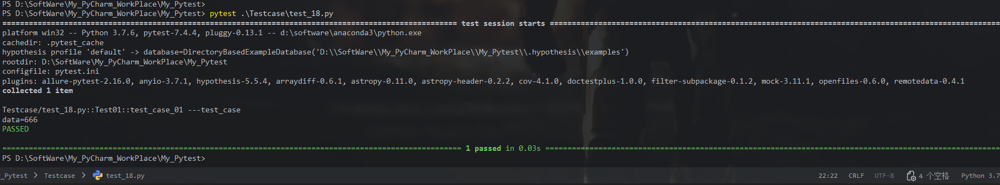


#### (2) 使用`usefixtures`，无法获取返回值

如果fixture有返回值，用@pytest.mark.usefixtures()报错，无法获取到返回值

```python
import pytest
 
@pytest.fixture
def fun_02():
    return 999

@pytest.mark.usefixtures(fun_02)
class Test02:
    def test_case_02 (self):
        print("---test_case_02")
        print(f"data={fun_02}")
```

##### 返回结果

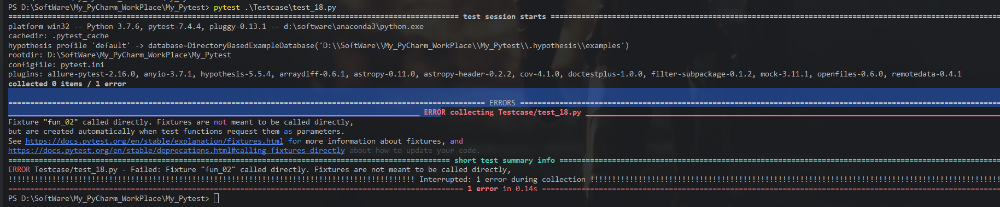

##### 错误分析

##### 问题1：`@pytest.mark.usefixtures` 使用错误

`@pytest.mark.usefixtures` 接收的是**夹具名称的字符串**，而不是夹具函数本身。

```python
## 错误写法：
@pytest.mark.usefixtures(fun_02)  # ❌ 传入了函数对象

## 正确写法：
@pytest.mark.usefixtures("fun_02")  # ✅ 传入字符串
```

##### 问题2：在测试方法中直接调用夹具

在 `test_case_02` 中，使用了 `print(f"data={fun_02}")`，这相当于直接调用了夹具函数，而夹具应该通过参数注入的方式使用。

```python
## 错误写法：
def test_case_02(self):
    print(f"data={fun_02}")  # ❌ 直接调用夹具

## 正确写法：
def test_case_02(self, fun_02):  # ✅ 通过参数注入
    print(f"data={fun_02}")
```

##### 问题3：代码中两个问题的组合

即使把问题1改成 `@pytest.mark.usefixtures("fun_02")`，问题2仍然存在：

```python
@pytest.mark.usefixtures("fun_02")  # 问题1：应传字符串 "fun_02"
class Test02:
    def test_case_02(self):
        print(f"data={fun_02}")   # 问题2：直接调用夹具
```

- 使用 `usefixtures` 时，fixture被执行但**返回值不会被传递给测试函数**
- 所以 `fun_02` 在测试函数的作用域中**不存在**，无法直接调用

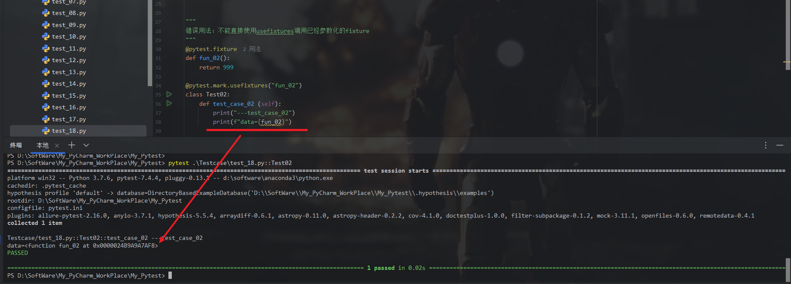

##### 为什么现在能运行了？

你修改后的代码能够运行，但输出的结果 `data=<function fun_02 at 0x...>` 说明问题依然存在，只是从**报错**变成了**逻辑错误**。

##### 执行流程：

1. `@pytest.mark.usefixtures("fun_02")`
   - 在测试执行**之前**运行 `fun_02` 夹具
   - 夹具执行 `return 999`，但返回值被**丢弃**了
2. `print(f"data={fun_02}")`
   - 此时 `fun_02` 在测试函数的作用域中**并未被注入**
   - 但 Python 在**函数定义时**（不是运行时）会在全局作用域中查找 `fun_02`
   - 发现它是一个**函数对象**，所以输出了它的内存地址


### 2、fixture返回params中的值

#### (1) 使用 `params` 参数

```python
@pytest.fixture(params=[1, 2, 3, 4])
def number(request):
    return request.param  # # request.param 会自动遍历 params 列表的每个元素,依次返回 1, 2, 3, 4

# 测试函数会被执行 4 次，每次传入不同的参数
def test_numbers(number):
    print(f"number={number}")
    assert number > 0
```

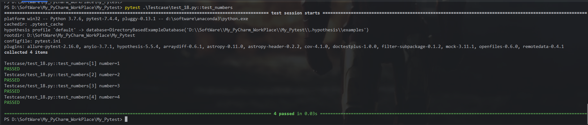

#### (2) 返回复杂数据结构

##### a) 返回元组/列表

```python
@pytest.fixture(params=[
    (1, 2, 3),
    (4, 5, 6),
    (7, 8, 9)
])
def tuple_data(request):
    return request.param  # 返回元组

def test_tuple(tuple_data):
    a, b, c = tuple_data
    assert a + b == c
    print(f"{a} + {b} = {c}")
```

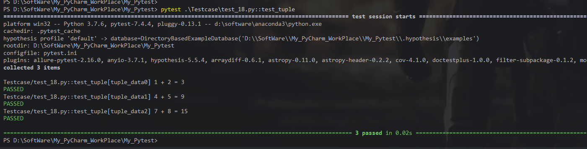

##### b) 返回字典

```python
@pytest.fixture(params=[
    {"name": "Alice", "age": 25},
    {"name": "Bob", "age": 30},
    {"name": "Charlie", "age": 35}
])
def dict_data(request):
    return request.param  # 返回字典

def test_dict(dict_data):
    print(f"User: {dict_data['name']}, Age: {dict_data['age']}")
    assert dict_data["age"] >= 18
```

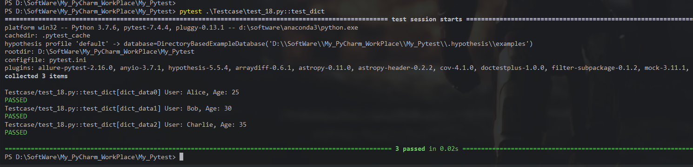

##### c) 返回自定义对象

```python
class User:
    def __init__(self, name, age):
        self.name = name
        self.age = age

@pytest.fixture(params=[
    User("Alice", 25),
    User("Bob", 30),
    User("Charlie", 35)
])
def user_define_obj(request):
    return request.param

def test_user_define_obj(user_define_obj):
    print(f"User: {user_define_obj.name}, Age: {user_define_obj.age}")
    assert user_define_obj.age >= 18
```

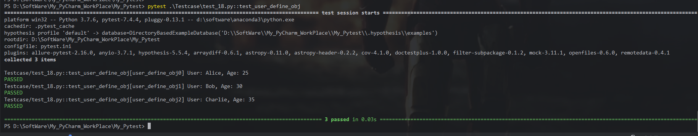

#### (3) 使用 `@pytest.mark.parametrize` 间接参数化

```python
# fixture 定义一个参数名
@pytest.fixture
def test_data(request):
    return request.param  # 接收 parametrize 传递的值

# 使用 indirect=True，让 parametrize 的值传给 fixture
# 注意：使用parametrize标记传fixture要加双引号
@pytest.mark.parametrize("test_data", [
    {"name": "Alice", "age": 25},
    {"name": "Bob", "age": 30},
    {"name": "Charlie", "age": 35}
], indirect=True)
def test_user(test_data):
    print(f"User: {test_data['name']}, Age: {test_data['age']}")
    assert test_data["age"] >= 18
```

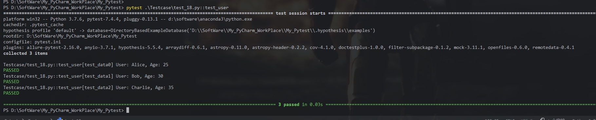

#### 📊 对比：`params` vs `parametrize(indirect=True)`

| 方式                             | 代码示例                                                    | 适用场景                           |
| :------------------------------- | :---------------------------------------------------------- | :--------------------------------- |
| **`params`**                     | `@pytest.fixture(params=[...])`                             | fixture 被**多个测试函数**共享参数 |
| **`parametrize(indirect=True)`** | `@pytest.mark.parametrize("fixture", [...], indirect=True)` | 每个测试函数**独立指定**参数       |


#### (4) 结合多个 fixture 参数化

##### a) 多 fixture 组合

```python
@pytest.fixture(params=[1, 2])
def a(request):
    return request.param

@pytest.fixture(params=[3, 4])
def b(request):
    return request.param

def test_multiply(a, b):
    result = a * b
    print(f"{a} × {b} = {result}")
    # 执行 2×2=4 次
    # 1×3, 1×4, 2×3, 2×4
```

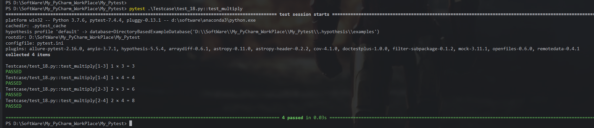

##### b) 复杂的多参数组合

```python
@pytest.fixture(params=["username", "email"])
def login_field(request):
    return request.param

@pytest.fixture(params=[
    {"valid": True, "value": "correct"},
    {"valid": False, "value": "wrong"}
])
def credential(request):
    return request.param

def test_login(login_field, credential):
    print(f"Field: {login_field}, Credential: {credential}")
    # 2×2=4 种组合
```

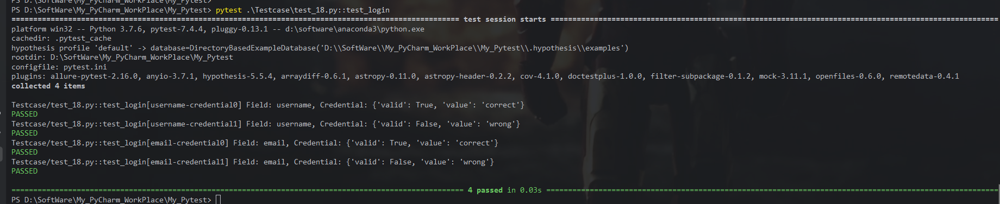


#### (5) 动态生成参数

##### a) 从文件读取

```python
import pytest
import json

@pytest.fixture(params=json.load(open("test_data.json")))
def test_data(request):
    return request.param

def test_from_file(test_data):
    print(f"Test data: {test_data}")
```

##### b) 从函数生成

```python
import pytest

def generate_params():
    """动态生成参数列表"""
    params = []
    for i in range(10):
        params.append({"id": i, "value": i * 2})
    return params

@pytest.fixture(params=generate_params())
def dynamic_data(request):
    return request.param

def test_dynamic(dynamic_data):
    print(f"ID: {dynamic_data['id']}, Value: {dynamic_data['value']}")
    assert dynamic_data["value"] == dynamic_data["id"] * 2
```

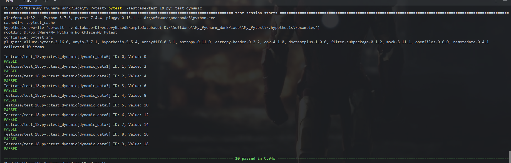

#### (6) 参数化 + 数据转换

```python
import pytest 
@pytest.fixture(params=[1, 2, 3])
def processed_data(request):
    # 对参数进行预处理
    raw = request.param
    return {
        "original": raw,
        "squared": raw ** 2,
        "cubed": raw ** 3
    }

def test_processed(processed_data):
    print(f"Original: {processed_data['original']}")
    print(f"Squared: {processed_data['squared']}")
    print(f"Cubed: {processed_data['cubed']}")
    assert processed_data["squared"] == processed_data["original"] ** 2
    assert processed_data["cubed"] == processed_data["original"] ** 3
```

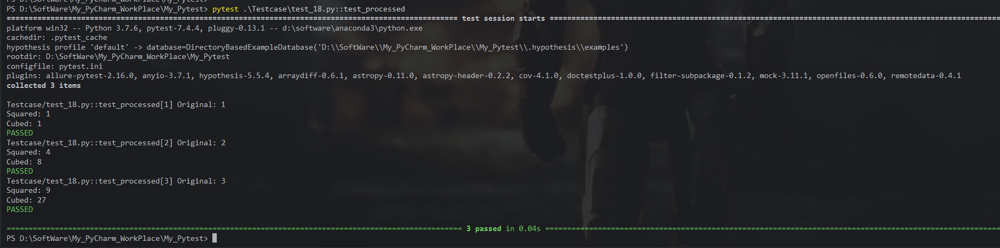

#### (7) 结合标记（Marker）参数化

```python
@pytest.fixture(params=[1, 2, 3])
def number_with_marker(request):
    # 获取测试函数上的标记
    marker = request.node.get_closest_marker("multiplier")
    multiplier = marker.args[0] if marker else 1
    
    # 参数化数据 × 标记数据
    return request.param * multiplier

@pytest.mark.multiplier(10)
def test_with_marker(number_with_marker):
    print(f"Result: {number_with_marker}")
    # 输出: 10, 20, 30
```

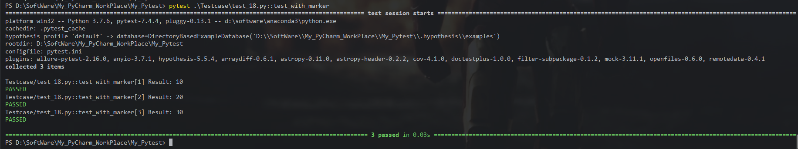

#### 📊 完整对比表

| 方式                             | 语法                                                 | 适用场景         | 优点             | 缺点                       |
| :------------------------------- | :--------------------------------------------------- | :--------------- | :--------------- | :------------------------- |
| **`params`**                     | `@pytest.fixture(params=[])`                         | 多个测试共享参数 | 代码简洁         | 所有测试固定使用同一参数集 |
| **`parametrize(indirect=True)`** | `@pytest.mark.parametrize("fix", [], indirect=True)` | 每个测试独立参数 | 灵活控制         | 代码稍复杂                 |
| **动态生成**                     | `params=generate_params()`                           | 参数需动态计算   | 灵活             | 运行时计算有开销           |
| **多 fixture**                   | 多个 fixture 各带 `params`                           | 组合测试         | 自动生成笛卡尔积 | 测试数量会膨胀             |
| **标记结合**                     | `params` + `request.node.get_closest_marker()`       | 参数需结合标记   | 灵活组合         | 理解成本稍高               |


### 3、yield返回params中的值

```python
import pytest

@pytest.fixture(params=['111', '222', '333', '444', '555'])
def fun_03(request):  # 必须是request这个参数名
    print("---前置")
    yield request.param  # 依次取列表中的每个值返回
    print("---后置")
 
class Test03:
    def test_case(self, fun_03):
        print(f"---test_case，data={fun_03}")
```

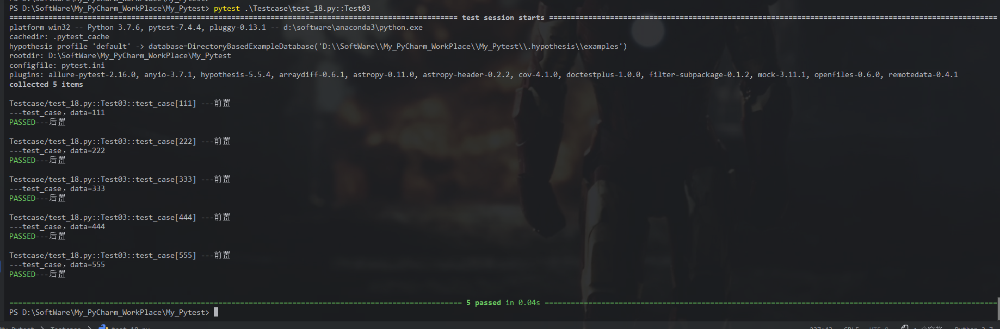


### 🎯 核心结论总结

| 关键点              | 说明                                        |
| :------------------ | :------------------------------------------ |
| **`params` 参数**   | 最常用方式，支持列表、元组、生成器等        |
| **`request.param`** | 在 fixture 中访问当前参数值                 |
| **`indirect=True`** | 将 `parametrize` 的数据传递给 fixture       |
| **动态生成**        | 可以从函数、文件、数据库动态生成参数        |
| **多 fixture 组合** | 多个 fixture 各带 params 自动生成笛卡尔积   |
| **数据预处理**      | 在 fixture 中处理原始参数，返回处理后的数据 |
| **结合标记**        | 参数化数据 + 标记数据组合使用               |


## 18: fixture对用例重命名、给函数取别名

### 1、默认用例名称

#### 一个参数

`Testcase/test_19.py`

```python
import pytest

@pytest.fixture(params=['a', 'b', 'c'])
def fun_01(request):  # 必须是request这个参数名
    return request.param  # 依次取列表中的每个值返回

class Test01:
    def test_case_01(self, fun_01):
        print(f"---test_case_01，data={fun_01}")
```

结果：可以看到，只有一个参数，执行结果是根据传递进来的参数进行命名的

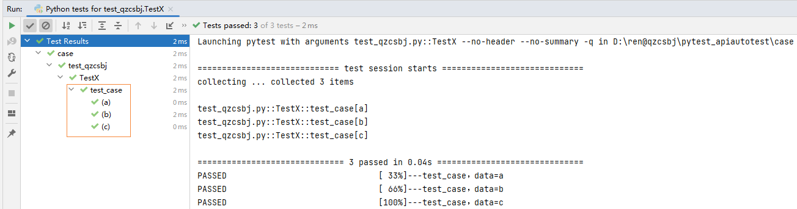

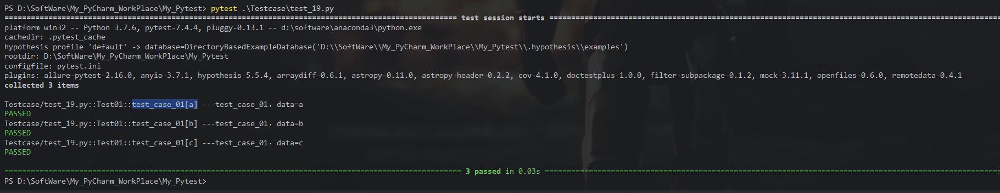

#### 多个参数

```python
import pytest

data = ['a', 'b', 'c']
data2 = [1, 2, 3]

@pytest.fixture(params=data)
def fun_02_01(request):  # 必须是request这个参数名
    return request.param  # 依次取列表中的每个值返回

@pytest.fixture(params=data2)
def fun_02_02(request):
    return request.param

class Test02:
    def test_case_02(self, fun_02_01, fun_02_02):
        print(f"---test_case_02，data={fun_02_01},{fun_02_02}")
```

结果：可以看到，执行结果是根据传递进来的参数通过-拼接进行命名的

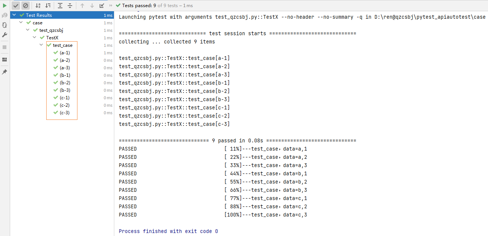

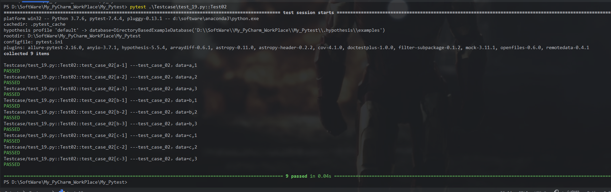

### 2、重命名用例

上面展示不直观，我们可以通过ids重命名，ids个数要和参数个数一样，否则会报错

#### 一个参数

```python
import pytest
 
data = ['product1', 'product2', 'product3']
 
@pytest.fixture(params=data, ids=['add product success','add product fail','update product success'])
def fun_04(request):  # 必须是request这个参数名
    return request.param  # 依次取列表中的每个值返回
 
class Test04:
    def test_case(self, fun_04):
        print(f"---test_case，data={fun_04}")
```

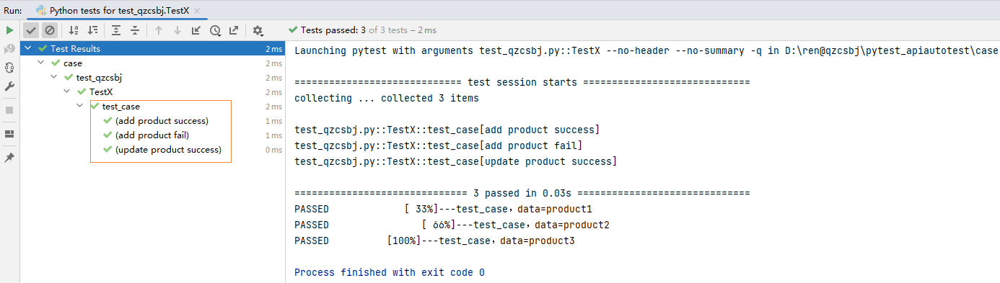

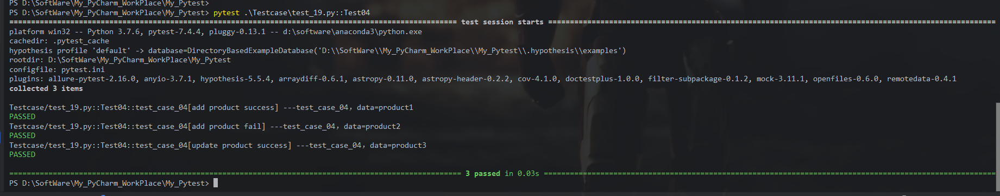

#### 多个参数

```python
import pytest
 
data = ['a', 'b', 'c']
data2 = [1, 2, 3]

@pytest.fixture(params=data, ids=['role1','role2','role2'])
def fun_03_01(request):  # 必须是request这个参数名
    return request.param  # 依次取列表中的每个值返回

@pytest.fixture(params=data2, ids=['user','product','stock'])
def fun_03_02(request):
    return request.param

class Test03:
    def test_case_03(self, fun_03_01, fun_03_02):
        print(f"---test_case，data={fun_03_01},{fun_03_02}")
```

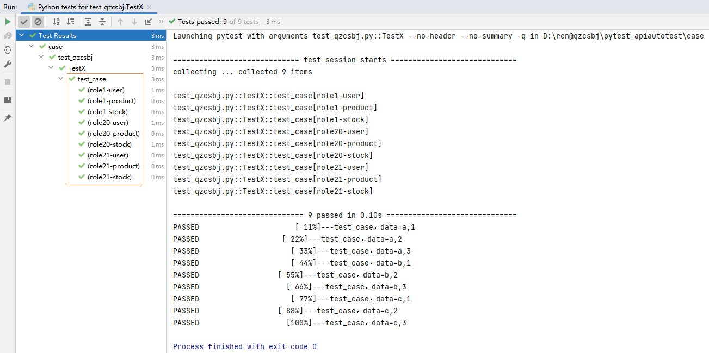

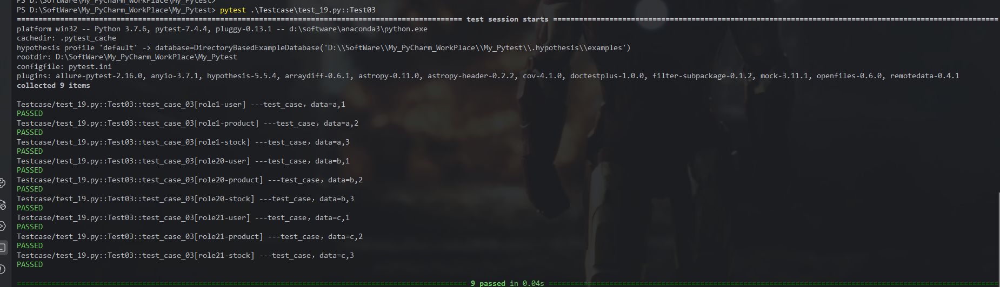

#### 如果ids和参数个数不一样就会报错

```python
import pytest

data05 = ['product1', 'product2', 'product3']

@pytest.fixture(params=data05, ids=['add product success','add product fail'])
def fun_05(request):  # 必须是request这个参数名
    return request.param  # 依次取列表中的每个值返回
 
class Test05:
    def test_case_05(self, fun_05):
        print(f"---test_case_05，data={fun_05}")
```

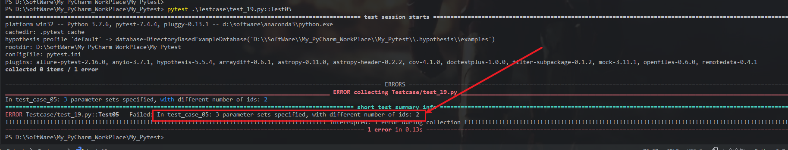

### 3、重命名fixture名称

给被`@pytest.fixture`标记的函数取一个别名，如果使用了`name`，那只能将`name`传入，函数名(原始fixture名字)不再生效

#### 1、传入函数名

```python
import pytest

data06 = ['product1', 'product2', 'product3']

@pytest.fixture(params=data06, ids=['add product success','add product fail','update product success'], name="product")
def fun_06(request):  # 必须是request这个参数名
    return request.param  # 依次取列表中的每个值返回

class Test06:
    def test_case_06(self, fun_06):
        print(f"---test_case_06，data={fun_06}")
```

##### 结果：报错

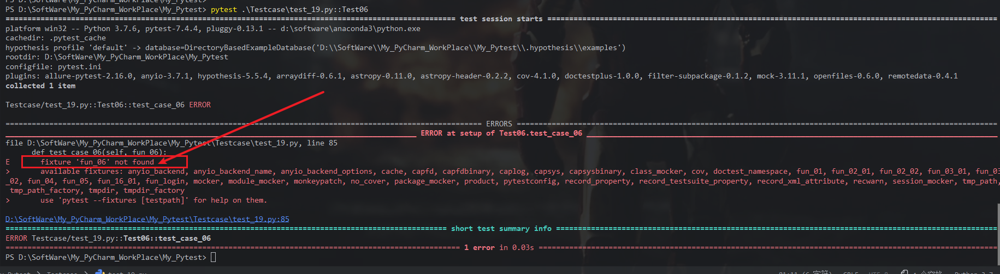

#### 2、传入`name`(函数别名)

##### (1) 只给测试用例传`name`(函数别名),用例中使用时传入原始fixture名`fun_06`

```python
import pytest

data06 = ['product1', 'product2', 'product3']

@pytest.fixture(params=data06, ids=['add product success','add product fail','update product success'], name="product")
def fun_06(request):  # 必须是request这个参数名
    return request.param  # 依次取列表中的每个值返回

class Test06:
    def test_case_06(self, product):
        print(f"---test_case_06，data={fun_06}")
```

###### 结果：此时没报错，但是打印的参数值是函数地址

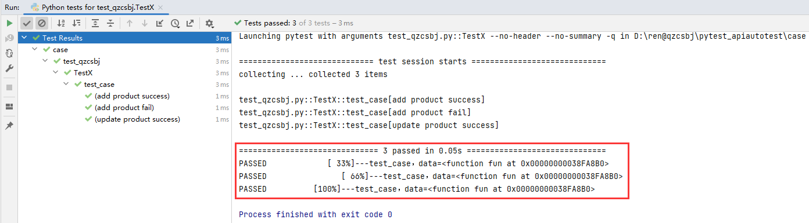

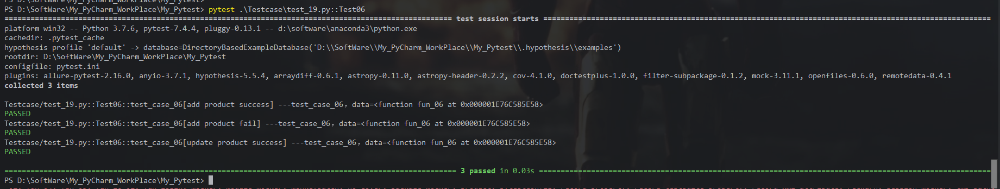


##### (2) 给测试用例和用例中使用fixture的地方都传`name`(函数别名)

```python
data06 = ['product1', 'product2', 'product3']

@pytest.fixture(params=data06, ids=['add product success','add product fail','update product success'], name="product")
def fun_06(request):  # 必须是request这个参数名
    return request.param  # 依次取列表中的每个值返回

class Test06:
    def test_case_06(self, product):
        print(f"---test_case_06，data={product}")
```

###### 结果：正常

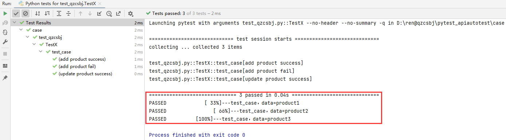

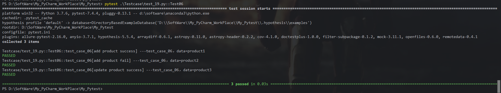

### 🎯 核心结论

1. **Fixture 重命名**：使用 `@pytest.fixture(name="别名")`，使测试代码更简洁易懂
2. **用例重命名**：使用 `ids` 或 `pytest.param`，让测试报告更清晰
3. **重命名目的**：
   - 提高代码可读性
   - 让测试报告更友好
   - 避免名称冲突
4. **注意事项**：
   - 重命名后原始名称失效
   - ID 必须唯一
   - 避免使用特殊字符


## 19: parametrize参数化

### 1、概述：什么是参数化？

之前我分享了通过**fixture返回值实现参数化**，还可以通过parametrize参数化实现。`@pytest.mark.parametrize` 是 pytest 中最实用的功能之一，它允许你用**同一套测试逻辑**测试**多组不同的输入数据**，每个数据组合都作为独立的测试用例运行。

parametrize是一个内置标记，在命令pytest --markers结果中可以看到@pytest.mark.parametrize(argnames, argvalues)

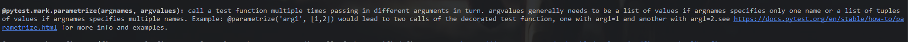

#### 源码

```python
class _ParametrizeMarkDecorator(MarkDecorator):
    def __call__(  # type: ignore[override]
        self,
        argnames: Union[str, Sequence[str]],
        argvalues: Iterable[Union[ParameterSet, Sequence[object], object]],
        *,
        indirect: Union[bool, Sequence[str]] = ...,
        ids: Optional[
            Union[
                Iterable[Union[None, str, float, int, bool]],
                Callable[[Any], Optional[object]],
            ]
        ] = ...,
        scope: Optional[_ScopeName] = ...,
    ) -> MarkDecorator:
        ...
```

#### 方法：

parametrize(argnames, argvalues, indirect=False, ids=None, scope=None)

#### 常用参数：

- **argnames**：参数名，格式为：`arg1,arg2,arg3,...`，通过逗号分隔多个参数

```python
## 多参数写法汇总：参数名可以是字符串、元组、列表、字符串放元组中

@pytest.mark.parametrize("input,expected", [("1+1", 2), ("2-4", -2), ("2*3", 6)])

@pytest.mark.parametrize(("input","expected"), [("1+1", 2), ("2-4", -2), ("2*3", 6)])

@pytest.mark.parametrize(["input","expected"], [("1+1", 2), ("2-4", -2), ("2*3", 6)])

@pytest.mark.parametrize(("input,expected"), [("1+1", 2), ("2-4", -2), ("2*3", 6)])
```

- **argvalues**：参数对应值，类型必须为list

　　　　当参数为一个时格式：[v1]
　　　　当参数个数大于一个时，格式为：[(v1_1, v2_1, ...), (v1_2, v2_2, ...)]，一组参数值放元组或者列表中，也就是说，最外层列表可以嵌套元组或者列表

```python
@pytest.mark.parametrize("name,technology",[['韧','测试开发'],['全栈测试笔记','性能测试']])  # 列表嵌列表

@pytest.mark.parametrize("name,technology",[('韧','测试开发'),('全栈测试笔记','性能测试')])  # 列表嵌套元组
```

- **indirect**：默认是False，如果设置成True，表示把被parametrize修饰器修饰的方法形参当函数执行（parametrize中参数名和这个形参同名），同时，必须有这个函数，且被@pytest.fixture()修饰，否则报错：fixture 'xxx' not found，xxx表示形参名
- **ids**：用例id，用于标识用例，增加可读性（测试结果中会展示id），是字符串列表，ids的长度要与测试数据列表长度一致

#### 使用方法：

> 1、@pytest.mark.parametrize(argnames, argvalues)可以修饰函数、方法、测试类
>
> 2、修饰测试类时，会将测试数据传给此类下所有测试方法
>
> 3、函数、方法、测试类上可以加多个参数化修饰器
>
> 4、如果只有一个修饰器，参数值为N个（也就是列表长度），测试方法就会运行N次
>
> 5、如果多个修饰器，参数个数分别是X、Y、Z，会运行X*Y*Z次 

### 2、为什么需要参数化？

### 参数化的核心价值

| 问题场景         | 使用参数化之前                             | 使用参数化之后                     |
| :--------------- | :----------------------------------------- | :--------------------------------- |
| **for 循环测试** | 第一个失败断言会停止循环，无法发现后续问题 | 每个输入独立报告，所有失败一目了然 |
| **重复测试函数** | 需要为每个输入复制测试函数，维护困难       | 一个函数覆盖所有输入，易于扩展     |
| **故障诊断**     | 只知道"某个输入失败了"                     | 精确显示哪个输入值导致了失败       |

```python
# ❌ 传统方式：重复代码
def test_add_1():
    assert add(1, 2) == 3

def test_add_2():
    assert add(3, 4) == 7

def test_add_3():
    assert add(5, 6) == 11

# ✅ 参数化方式：一行搞定
@pytest.mark.parametrize("a,b,expected", [
    (1, 2, 3),
    (3, 4, 7),
    (5, 6, 11)
])
def test_add(a, b, expected):
    assert add(a, b) == expected
```

### 3、基础用法

`Testcase/test_20.py`

#### 1️⃣ 单参数参数化

参数化允许我们使用**多组数据**对同一个测试函数进行多次测试，避免编写重复的测试代码。

```python
import pytest
## 测试方法形参名要和parametrize里面的参数一样
@pytest.mark.parametrize("name", ["Alice", "Bob", "Charlie"])
def test_greeting(name):
    assert len(name) > 0
    print(f"Hello, {name}!")
```

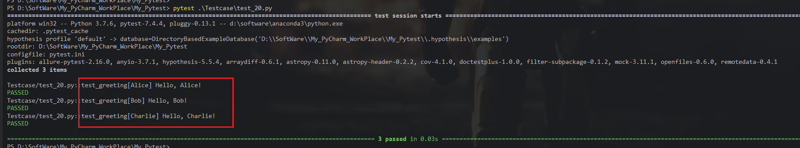

#### 2️⃣ 多参数参数化

##### (1) 修饰器放函数上，参数值是基本类型

```python
import pytest

# 修饰器放在函数上，参数值为基本类型（int/str/bool等）
@pytest.mark.parametrize("a, b, expected", [
    (1, 2, 3),
    (4, 5, 9),
    (10, 20, 30)
])
def test_add(a, b, expected):
    """测试加法运算"""
    result = a + b
    assert result == expected

# 字符串示例
@pytest.mark.parametrize("username, password", [
    ("admin", "123456"),
    ("user1", "abc123"),
    ("guest", "guest123")
])
def test_login(username, password):
    """测试登录功能"""
    print(f"用户名: {username}, 密码: {password}")
    assert len(username) > 0
    assert len(password) >= 6
```

###### 结果：

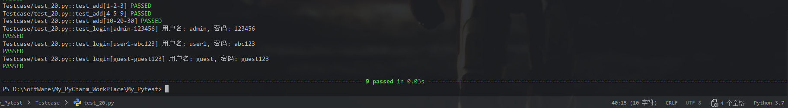

###### 参数化测试机制

`@pytest.mark.parametrize` 装饰器实现了**数据驱动测试**，每个参数组合生成一个独立的测试用例：

| 测试函数     | 参数组合数 | 生成的测试用例                                               |
| :----------- | :--------- | :----------------------------------------------------------- |
| `test_add`   | 3组        | `test_add[1-2-3]`、`test_add[4-5-9]`、`test_add[10-20-30]`   |
| `test_login` | 3组        | `test_login[admin-123456]`、`test_login[user1-abc123]`、`test_login[guest-guest123]` |


##### (2) 修饰器放函数上，参数值是字典

```python
import pytest

## 1.使用字典作为参数值，数据更结构化
@pytest.mark.parametrize("user_info", [
    {"name": "张三", "age": 25, "city": "北京"},
    {"name": "李四", "age": 30, "city": "上海"},
    {"name": "王五", "age": 28, "city": "深圳"}
])
def test_user_info(user_info):
    """测试用户信息验证"""
    # 通过字典key访问数据
    name = user_info["name"]
    age = user_info["age"]
    city = user_info["city"]
    
    print(f"姓名: {name}, 年龄: {age}, 城市: {city}")
    
    # 断言验证
    assert name is not None
    assert 0 < age < 150
    assert city in ["北京", "上海", "深圳", "广州"]


## 2.更复杂的字典结构（嵌套）
@pytest.mark.parametrize("order", [
    {
        "order_id": "ORD001",
        "customer": {"name": "张三", "phone": "13800138001"},
        "items": [{"name": "苹果", "price": 5.0}],
        "total": 5.0
    },
    {
        "order_id": "ORD002", 
        "customer": {"name": "李四", "phone": "13800138002"},
        "items": [{"name": "香蕉", "price": 3.0}, {"name": "橙子", "price": 4.0}],
        "total": 7.0
    }
])
def test_order_processing(order):
    """测试订单处理"""
    # 访问嵌套字典数据
    assert order["order_id"].startswith("ORD")
    assert order["customer"]["phone"].startswith("138")
    assert len(order["items"]) > 0
    
    # 计算总价验证
    calculated_total = sum(item["price"] for item in order["items"])
    assert calculated_total == order["total"]
```

###### 结果：

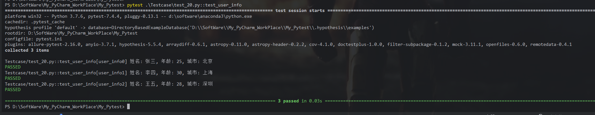

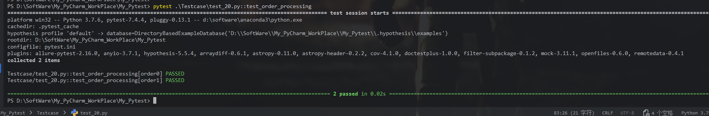


##### (3) 修饰器放测试类上

```python
import pytest

# 将参数化修饰器放在测试类上
@pytest.mark.parametrize("a, b", [
    (10, 20),
    (100, 200),
    (1, 99)
])
class TestMathOperations:
    """测试类级别的参数化"""
    
    def test_addition(self, a, b):
        """测试加法 - 自动接收类级别的参数"""
        result = a + b
        print(f"加法测试: {a} + {b} = {result}")
        assert result > 0
    
    def test_multiplication(self, a, b):
        """测试乘法 - 自动接收类级别的参数"""
        result = a * b
        print(f"乘法测试: {a} * {b} = {result}")
        assert result > 0

    def test_comparison(self, a, b):
        """测试比较运算 - 自动接收类级别的参数"""
        # 注意：参数会依次传入每个测试方法
        assert a != b  # 使用 (10,20) 时，10 != 20 为 True
        # 但如果参数是 (10,10)，这个测试就会失败
```

###### 结果

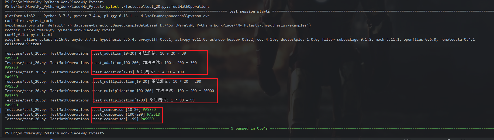

##### (4) 测试类下多个方法，会将测试数据传给此类下所有测试方法

```python
import pytest

# 测试类级别的参数化 - 所有方法共享参数
@pytest.mark.parametrize("username, password, expected", [
    ("admin", "admin123", True),
    ("user1", "pass123", True),
    ("invalid", "wrong", False)
])
class TestUserAuthentication:
    """用户认证测试 - 多个方法共享参数"""
    def test_validate_username(self, username, password, expected):
        """验证用户名格式"""
        # 用户名必须包含字母或数字
        is_valid = username.isalnum() or username == "admin"
        print(f"用户名验证: {username} -> {is_valid}")
        # 注意：这里使用expected来验证期望结果
    
    def test_password_strength(self, username, password, expected):
        """验证密码强度"""
        has_length = len(password) >= 6
        has_digit = any(c.isdigit() for c in password)
        has_letter = any(c.isalpha() for c in password)
        is_strong = has_length and (has_digit or has_letter)
        print(f"密码强度: {password} -> {is_strong}")
    
    def test_login_flow(self, username, password, expected):
        """测试完整的登录流程"""
        # 模拟登录验证
        login_result = self._mock_login(username, password)
        print(f"登录测试: {username}/{password} -> {login_result}")
        assert login_result == expected
    
    def _mock_login(self, username, password):
        """模拟登录验证逻辑"""
        valid_users = {
            "admin": "admin123",
            "user1": "pass123"
        }
        return valid_users.get(username) == password
```

###### 结果：

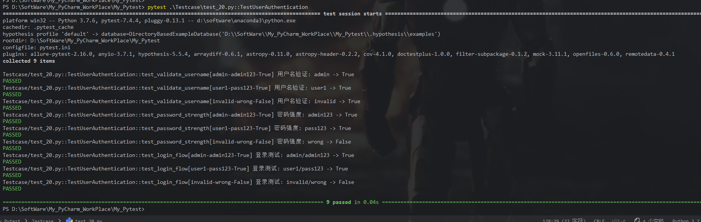

##### (5) 参数放变量中

```python
import pytest
 
data = [('韧','测试开发'),('全栈测试笔记','性能测试')]
@pytest.mark.parametrize("name,technology",data)
class TestQzcsbj:
    def test_case(self, name, technology):
        print(f"name={name}, technology={technology}")
```

###### 结果

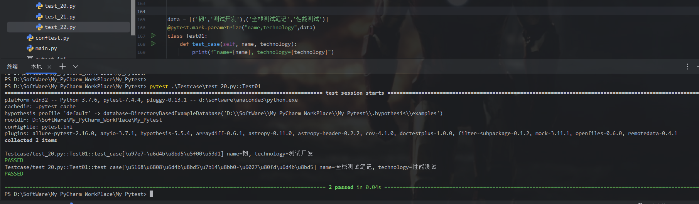

##### pytest参数化时出现unicode编码问题

如上结果显示，执行时会出现unicode编码问题

配置文件pytest.ini中添加：

```python
[pytest]
    disable_test_id_escaping_and_forfeit_all_rights_to_community_support = True
```


#### 3️⃣ 参数名的三种写法

```python
# 方式1：逗号分隔的字符串
@pytest.mark.parametrize("a,b,expected", [(1,2,3), (4,5,9)])

# 方式2：列表形式
@pytest.mark.parametrize(["a", "b", "expected"], [(1,2,3), (4,5,9)])

# 方式3：元组形式
@pytest.mark.parametrize(("a", "b", "expected"), [(1,2,3), (4,5,9)])
```


### 4、高级用法

#### 1️⃣ 自定义测试 ID（`ids` 参数）

默认情况下，pytest 使用参数值作为测试 ID。对于复杂对象，可以通过 `ids` 自定义：

```python
@pytest.mark.parametrize(
    "user,expected_age",
    [
        ({"name": "Alice", "age": 25}, 25),
        ({"name": "Bob", "age": 30}, 30),
        ({"name": "Charlie", "age": 35}, 35)
    ],
    ids=["Alice_25", "Bob_30", "Charlie_35"]
)
def test_user_age(user, expected_age):
    assert user["age"] == expected_age
```

##### 结果

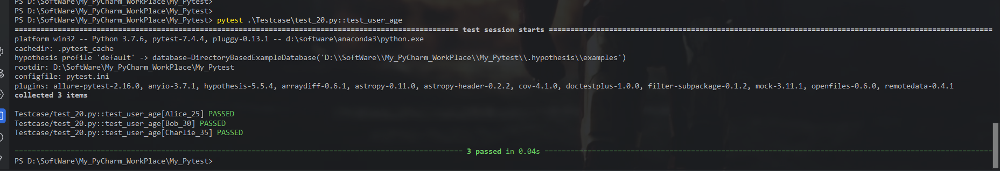


#### 2️⃣ 使用 `pytest.param` 标记单个用例

```python
@pytest.mark.parametrize(
    "test_input,expected",
    [
        ("3+5", 8),
        ("2+4", 6),
        pytest.param("6*9", 42, marks=pytest.mark.xfail),  # 预期失败
        pytest.param("1/0", 0, marks=pytest.mark.skip(reason="避免除零错误"))
    ]
)
def test_eval(test_input, expected):
    assert eval(test_input) == expected
```

##### 结果

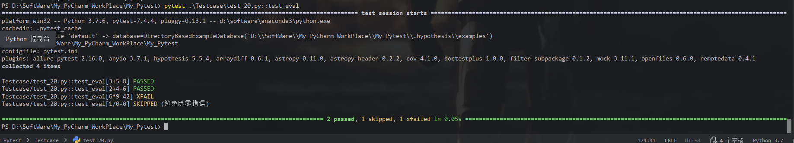

##### 测试用例状态对比

| 用例               | 输入    | 期望值 | 实际结果 | 状态      | 说明                      |
| :----------------- | :------ | :----- | :------- | :-------- | :------------------------ |
| `test_eval[3+5-8]` | `"3+5"` | 8      | 8        | ✅ PASSED  | 正常通过                  |
| `test_eval[2+4-6]` | `"2+4"` | 6      | 6        | ✅ PASSED  | 正常通过                  |
| `test_eval[6*9-4]` | `"6*9"` | 42     | 54       | ❌ FAILED  | **预期失败**（xfail标记） |
| `test_eval[1/0-0]` | `"1/0"` | 0      | 未执行   | ⏭️ SKIPPED | 主动跳过（除零错误）      |

#### 3️⃣ 堆叠参数化（笛卡尔积）

多个 `parametrize` 叠加会生成**笛卡尔积**组合：

```python
@pytest.mark.parametrize("x", [1, 2])
@pytest.mark.parametrize("y", [3, 4])
def test_combination(x, y):
    print(f"x={x}, y={y}")
    # 生成 4 个测试用例：
    # x=1, y=3
    # x=1, y=4
    # x=2, y=3
    # x=2, y=4
```

##### 结果

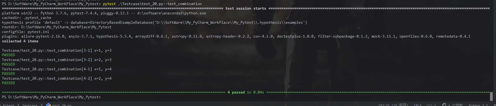

#### 4️⃣ 类级别参数化

```python
@pytest.mark.parametrize("n,expected", [
    (1, 2),
    (2, 4),
    (3, 6)
])
class TestMath:
    def test_double(self, n, expected):
        assert n * 2 == expected
    
    def test_add_one(self, n, expected):
        assert n + n == expected  # 也使用同样的参数
```

##### 结果

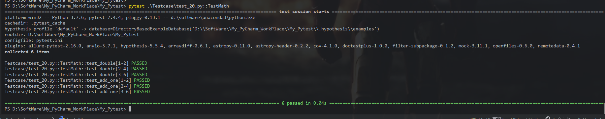

#### 5️⃣ 模块级别参数化

`Testcase/test_21.py`

```python
import pytest 
pytestmark = pytest.mark.parametrize("env", ["dev", "test", "prod"])
def test_config(env):
    print(f"Testing environment: {env}")
    assert env in ["dev", "test", "prod"]
```

##### 结果

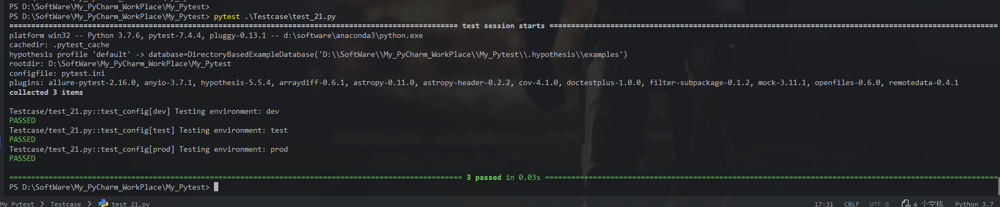


### 5、与 Fixture 结合使用

#### 1️⃣ 间接参数化（`indirect=True`）

将参数值传递给 fixture，由 fixture 进行预处理：

`Testcase/test_22.py`

```python
import pytest

@pytest.fixture
def processed_data(request):
    # request.param 接收 parametrize 传递的值
    raw = request.param
    return raw * 2  # 预处理：乘以2

@pytest.mark.parametrize("processed_data", [1, 2, 3, 4], indirect=True)
def test_processed(processed_data):
    print(f"Processed: {processed_data}")
    # 输出: 2, 4, 6, 8
```

##### 结果

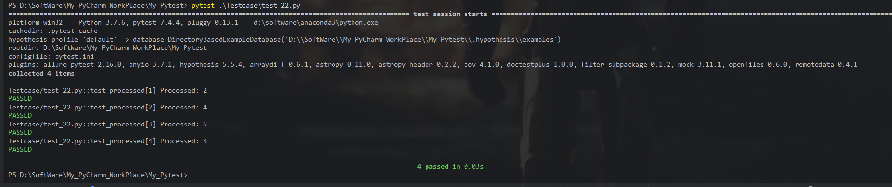

##### 结果分析

###### 1. `indirect=True` 的作用

```python
@pytest.mark.parametrize("processed_data", [1, 2, 3, 4], indirect=True)
```

- **`indirect=True`** 告诉 pytest：参数 `processed_data` 的值应该通过 fixture 来获取
- 每个参数值（1, 2, 3, 4）会作为 `request.param` 传递给 fixture

###### 2. 详细步骤

| 步骤 | 操作                         | 说明                     |
| :--- | :--------------------------- | :----------------------- |
| 1    | `@parametrize` 提供值        | `[1, 2, 3, 4]`           |
| 2    | `indirect=True` 触发         | 告诉 pytest 使用 fixture |
| 3    | Fixture 接收 `request.param` | 依次接收 1, 2, 3, 4      |
| 4    | Fixture 处理数据             | `raw * 2` → 2, 4, 6, 8   |
| 5    | 测试函数接收处理后的值       | 执行断言和打印           |


#### 2️⃣ 多个 fixture 间接参数化

`Testcase/test_22.py`

```python
@pytest.fixture
def factor(request):
    return request.param

@pytest.fixture
def number(request):
    return request.param

@pytest.mark.parametrize("factor", [2, 3], indirect=True) # 外层装饰器（后执行）
@pytest.mark.parametrize("number", [10, 20], indirect=True)# 内层装饰器（先执行）
def test_multiply(number, factor):
    result = number * factor
    print(f"{number} × {factor} = {result}")
    # 生成 4 个测试：
    # 10×2, 20×2, 10×3, 20×3
```

##### 结果

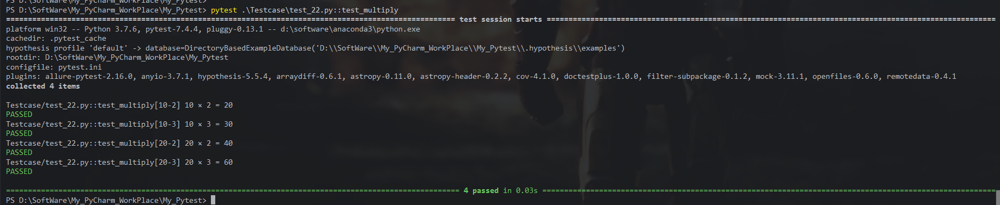

##### 结果分析

##### (1) 参数含义详解

###### 1. 装饰器参数

```
@pytest.mark.parametrize("factor", [2, 3], indirect=True)
```

- **`"factor"`**：参数名称，对应测试函数的参数名
- **`[2, 3]`**：参数值列表，每个值会生成一个测试用例
- **`indirect=True`**：告诉 pytest 通过 fixture 获取参数值

###### 2. Fixture 参数

```
@pytest.fixture
def factor(request):
    return request.param  # 接收参数化传入的值（2 或 3）
```

- **`request.param`**：pytest 内置对象，用于接收 `@parametrize` 传递的值
- **返回值**：fixture 的返回值会传递给测试函数

###### 3. 测试函数参数

```
def test_multiply(number, factor):
    result = number * factor
```

- **`number`**：由 `number` fixture 提供（值为 10 或 20）
- **`factor`**：由 `factor` fixture 提供（值为 2 或 3）

##### (2) 组合生成过程

```
第1步：处理内层 @parametrize("number", [10, 20])
       → 生成 2 个参数组合：number=10, number=20

第2步：处理外层 @parametrize("factor", [2, 3])
       → 对每个 number 值，都应用 factor 的所有值
       → 笛卡尔积：2 × 2 = 4 个组合

组合顺序：
┌─────────────┬─────────────┬──────────────┐
│ 组合编号    │ number 值   │ factor 值    │
├─────────────┼─────────────┼──────────────┤
│ 1           │ 10          │ 2            │
│ 2           │ 10          │ 3            │
│ 3           │ 20          │ 2            │
│ 4           │ 20          │ 3            │
└─────────────┴─────────────┴──────────────┘
```


#### 关键要点总结

1. **`indirect=True`** 让参数化数据通过 fixture 传递
2. **Fixture 中使用 `request.param`** 接收参数化值
3. **预处理逻辑放在 fixture 中**，实现代码复用
4. **测试函数接收处理后的数据**，保持简洁
5. **适用场景**：数据清洗、格式转换、复杂计算、依赖注入


### 6、实战示例

#### 示例1：测试字符串处理函数

`Testcase/test_22.py`

```python
def capitalize_words(text):
    return ' '.join(word.capitalize() for word in text.split())

@pytest.mark.parametrize("input_text,expected", [
    ("hello world", "Hello World"),
    ("python testing", "Python Testing"),
    ("", ""),
    ("single", "Single"),
    ("multiple   spaces", "Multiple   Spaces")  # 保留多个空格
])
def test_capitalize_words(input_text, expected):
    assert capitalize_words(input_text) == expected
```

##### 结果

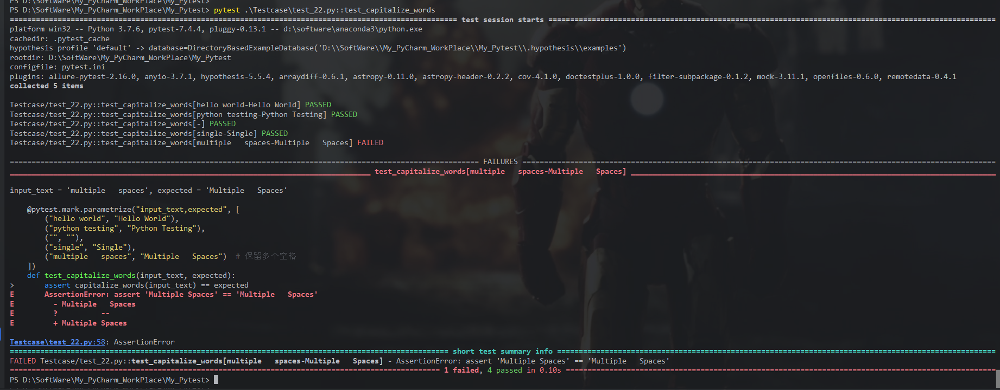

#### 示例2：测试异常处理

`Testcase/test_22.py`

```python
def divide(a, b):
    if b == 0:
        raise ValueError("Cannot divide by zero")
    return a / b

@pytest.mark.parametrize("a,b,expected", [
    (10, 2, 5),
    (9, 3, 3),
    (7, 2, 3.5)
])
def test_divide_normal(a, b, expected):
    assert divide(a, b) == expected

@pytest.mark.parametrize("a,b", [
    (10, 0),
    (5, 0),
    (0, 0)
])
def test_divide_by_zero(a, b):
    with pytest.raises(ValueError, match="Cannot divide by zero"):
        divide(a, b)
```

##### 结果

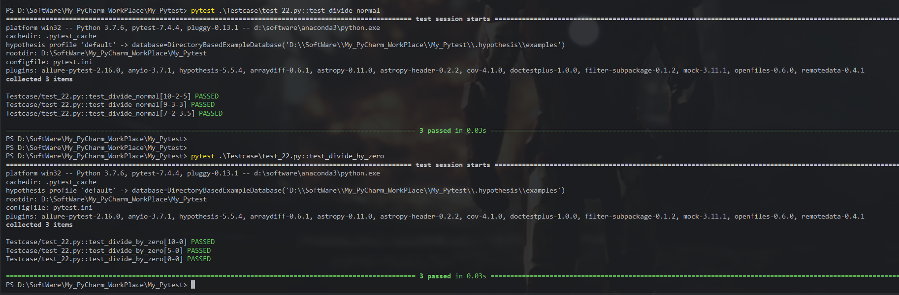

#### 示例3：API 测试（实际项目场景）

`Testcase/test_22.py`

```python
import pytest
import requests

# 1. 定义 base_url fixture
@pytest.fixture
def base_url():
    """提供基础 URL"""
    return "https://jsonplaceholder.typicode.com"  # 示例 API

# 2. 参数化测试
@pytest.mark.parametrize("endpoint,expected_status", [
    ("/users", 200),
    ("/users/1", 200),
    ("/invalid", 404),
    ("/users/999", 404)
])
def test_api_endpoints(base_url, endpoint, expected_status):
    response = requests.get(f"{base_url}{endpoint}")
    assert response.status_code == expected_status
```


### 7、重要注意事项

#### ⚠️ 注意点1：可变对象的副作用

参数值是**直接传递**的，不会创建副本：

```python
# ❌ 危险：修改可变对象会影响后续测试
@pytest.mark.parametrize("data", [
    [1, 2, 3],
    [4, 5, 6]
])
def test_modify_list(data):
    data.append(999)  # 修改了原始列表
    # 下一个测试用例会看到被修改后的列表！

# ✅ 安全：使用 copy()
@pytest.mark.parametrize("data", [
    [1, 2, 3],
    [4, 5, 6]
])
def test_safe_modify(data):
    data_copy = data.copy()
    data_copy.append(999)
    # 原始数据保持不变
```


#### ⚠️ 注意点2：参数数量必须匹配

```python
# ❌ 参数名数量与数据长度不匹配
@pytest.mark.parametrize("a,b,c", [(1, 2)])  # 错误！

# ✅ 正确
@pytest.mark.parametrize("a,b", [(1, 2)])    # 2个参数
```


#### ⚠️ 注意点3：空参数集的处理

如果参数列表为空，pytest 不会执行测试：

```python
@pytest.mark.parametrize("data", [])  # 空列表
def test_empty(data):
    # 这个测试不会执行
    pass
```

可通过配置控制行为：

```python
[pytest]
empty_parameter_set_mark = xfail  # 或 skip, fail_at_collect
```


#### ⚠️ 注意点4：`ids` 必须唯一

```python
# ❌ 重复 ID 会导致警告
@pytest.mark.parametrize("data", [
    pytest.param(1, id="case"),
    pytest.param(2, id="case")  # 重复 ID
])

# ✅ 使用唯一 ID
@pytest.mark.parametrize("data", [
    pytest.param(1, id="case_1"),
    pytest.param(2, id="case_2")
])
```


### 8、总结

#### (1) 参数化作用

`@pytest.mark.parametrize` 是 pytest 中最实用的功能之一，它让你能够：

- ✅ **用一行代码覆盖多个测试场景**，避免重复
- ✅ **精确诊断失败**：每个输入值都作为独立测试项报告
- ✅ **轻松扩展**：添加新用例只需在参数列表中添加一项
- ✅ **与其他功能无缝集成**：可与 fixtures、标记（marks）等配合使用

| 维度         | 关键点                                            |
| :----------- | :------------------------------------------------ |
| **核心作用** | 用同一套测试逻辑测试多组数据                      |
| **独立运行** | 每个参数组合都是独立的测试用例                    |
| **故障诊断** | 精确定位哪个输入值导致了失败                      |
| **数据来源** | 支持列表、元组、生成器、文件读取等                |
| **组合能力** | 可与 fixtures、标记（marks）、类级别等无缝集成    |
| **最佳实践** | 保持用例独立、使用有意义的 ID、避免可变对象副作用 |


#### (2) 参数化三种方式对比

| 特性           | 直接参数化         | indirect=True    | fixture params        |
| :------------- | :----------------- | :--------------- | :-------------------- |
| **预处理位置** | 测试函数内         | fixture 中       | fixture 中            |
| **代码复用**   | ❌ 每个测试都要重复 | ✅ 多个测试可复用 | ✅ 多个测试可复用      |
| **参数化方式** | `@parametrize`     | `@parametrize`   | `fixture(params=...)` |
| **适用场景**   | 简单测试           | 需要复杂预处理   | 固定数据集            |
| **灵活性**     | 中等               | 高               | 中等                  |


## 20: parametrize中indirect详解间接参数

### 简介

`indirect` 参数是 `@pytest.mark.parametrize` 装饰器中的一个重要参数，它控制着参数值是以**普通数据**的形式直接传递给测试函数，还是**先传递给同名的 fixture**，由 fixture 处理后再交给测试函数。

简单来说，它是一个用于**参数化 fixture** 的开关。


### 1、`indirect=False`（默认行为）：直接传递数据

当 `indirect=False` 时，`parametrize` 的参数值会**直接**作为参数传递给测试函数。这是最常用的方式。

2、如果设置成True，表示把被parametrize修饰器修饰的方法形参当函数执行（parametrize中参数名和这个形参同名），此时必须有被`@pytest.fixture()`修饰的和形参名同名的函数（可以对参数做一些加工处理），否则报错：fixture 'xxx' not found，xxx表示形参名；简单说，为True时，形参被当成是一个fixture函数

3、fixture修饰器中没有params参数

4、可以通过indirect指定间接参数


#### 验证：indirect默认值是False

`Testcase/test_23.py`

```python
import pytest

"""
indirect 默认为 False
"""
data = ["aaa", "ren", "jack"]
@pytest.mark.parametrize("register", data)
def test_case_01 (register):
    print(f"register={register}")

"""
indirect设置为False，和不指定时结果一致
"""
@pytest.mark.parametrize("register", data, indirect=False)
def test_case_02 (register):
    print(f"register={register}")
```

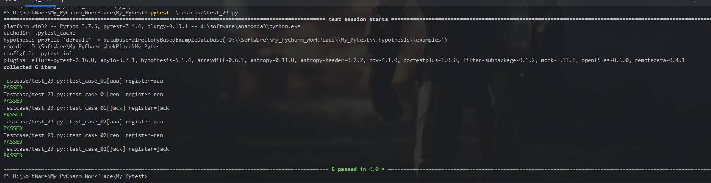

### 2、`indirect=True`：数据先交给 Fixture 处理

当 `indirect=True` 时，`parametrize` 中的参数名（`argnames`）**必须**是一个已定义的 fixture 名称。参数值会作为 `request.param` 传入这个 fixture，由 fixture 加工处理后再返回给测试函数。

#### 工作流程：

1. 你传递的参数值（如 `"user1"`）会作为 `request.param` 进入 fixture `db_query`。
2. Fixture 根据 `request.param` 执行逻辑（如查询数据库或处理数据）。
3. Fixture 将**处理后的结果**返回给测试函数。

#### 验证：indirect默认值是True

`Testcase/test_23.py`

```python
import pytest

# 1. 定义一个 fixture
@pytest.fixture
def db_query(request):
    # request.param 接收从 parametrize 传来的值
    query_param = request.param
    if query_param == "user1":
        return {"id": 1, "name": "Alice"}
    elif query_param == "user2":
        return {"id": 2, "name": "Bob"}

# 2. 在 parametrize 中引用这个 fixture，并设置 indirect=True
@pytest.mark.parametrize("db_query", ["user1", "user2"], indirect=True)
def test_user_query(db_query):
    # db_query 现在已经是 fixture 返回的字典了，而不是字符串 "user1" 或 "user2"
    print(db_query)  # 输出: {'id': 1, 'name': 'Alice'} 等
    assert "name" in db_query
```

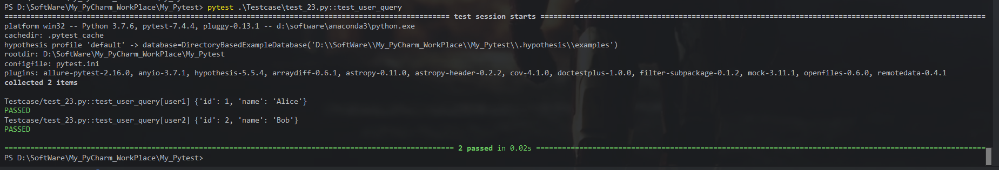

### 总结与对比

| 特性               | `indirect=False` (默认)      | `indirect=True`                                              |
| :----------------- | :--------------------------- | :----------------------------------------------------------- |
| **数据流向**       | 参数值 **直接** 传给测试函数 | 参数值 **先传给** fixture，fixture 的返回值再传给测试函数    |
| **参数名**         | 可以是测试函数中任意参数名   | 必须对应一个**已定义的 fixture 名称**                        |
| **Fixture 中访问** | N/A                          | 通过 `request.param` 获取参数化传入的值                      |
| **核心价值**       | 数据驱动测试，简单直接       | 复用同一测试逻辑，为不同的 fixture（如不同配置、不同资源）提供数据，增加灵活性 |


## 21: parametrize中给用例取别名

在fixture中可以使用ids给用例取别名。类似的，parametrize中也可以使用ids给用例取别名，从而增加可读性。

在 `pytest` 中给参数化测试用例取别名，标准做法是使用 `@pytest.mark.parametrize` 装饰器中的 `ids` 参数，或者在参数值中使用 `pytest.param` 并指定 `id`。这两种方法能让测试报告和失败信息更清晰易读

`Testcase/test_23.py`

### 方法一：使用 `ids` 参数

`ids` 参数接收一个与参数值列表一一对应的字符串列表。

```python
import pytest

# 参数值列表
testdata = [
    (datetime(2001, 12, 12), datetime(2001, 12, 11), timedelta(1)),
    (datetime(2001, 12, 11), datetime(2001, 12, 12), timedelta(-1)),
]

# 方式一： 通过 ids 列表指定别名
@pytest.mark.parametrize("a,b,expected", testdata, ids=["forward", "backward"])
def test_timedistance_v1(a, b, expected):
    diff = a - b
    assert diff == expected
```

执行 `--collect-only` 后可以看到，测试用例的名称变成了 `test_timedistance_v1[forward]` 和 `test_timedistance_v1[backward]`。

#### 结果

##### 仅执行 `--collect-only`

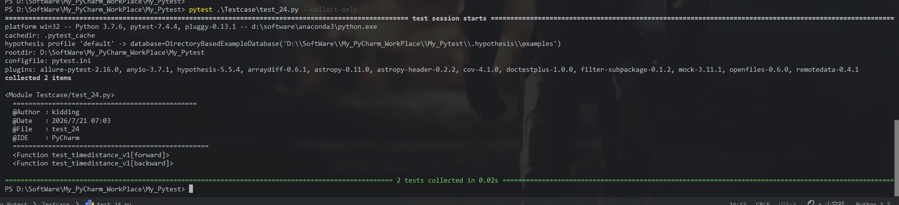

##### 执行完整测试

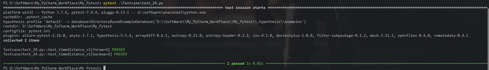


### 方法二：使用 `pytest.param` 指定 `id`

这种方式是将每个参数组合用 `pytest.param()` 包裹起来，直接在内部指定 `id`。

```python
import pytest
from datetime import datetime, timedelta

# 方式二：使用 pytest.param 为每个用例单独指定 id
@pytest.mark.parametrize(
    "a, b, expected",
    [
        pytest.param(
            datetime(2001, 12, 12), 
            datetime(2001, 12, 11), 
            timedelta(1),
            id="forward"  # 正向测试用例
        ),
        pytest.param(
            datetime(2001, 12, 11), 
            datetime(2001, 12, 12), 
            timedelta(-1),
            id="backward"  # 反向测试用例
        ),
        pytest.param(
            datetime(2001, 12, 12), 
            datetime(2001, 12, 12), 
            timedelta(0),
            id="same_time"  # 相同时间测试用例
        ),
    ]
)
def test_timedistance_v2(a, b, expected):
    diff = a - b
    assert diff == expected
```

#### 结果

##### 仅执行`--collect-only`

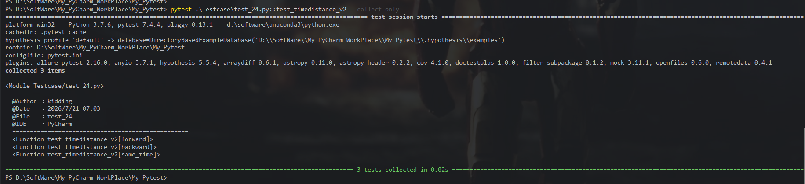

##### 执行完整测试

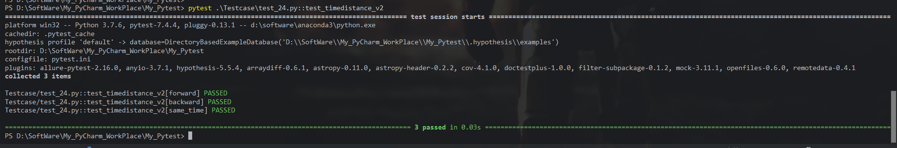

### 两种方法的对比

**方法一（`ids` 列表）**：

- ✅ 简洁，适合参数值较少的场景
- ❌ 必须保持 `ids` 列表与参数值列表一一对应，容易出错

**方法二（`pytest.param` 指定 `id`）**：

- ✅ 每个用例的 `id` 紧挨着参数值，更清晰直观
- ✅ 可以单独为某些用例指定 `id`，其他用例可以不指定
- ✅ 适合参数组合较多或复杂的情况
- ❌ 代码稍显冗长


## 22: parametrize参数化数据来自yaml文件

### 前置基础

python操作yaml

### 关于数据驱动

数据驱动就是通过数据的改变从而驱动自动化测试的执行，最终引起测试结果的改变。简单来说，就是参数化的应用。

数据量小的测试用例可以使用代码的参数化来实现数据驱动，数据量大的情况下建议使用一一种结构化的文件(例如yaml、json等) 来对数据进行存储，然后在测试用例中读取这些数据。

但是，建议不管数据多少，都要数据和代码的分离，方便维护。

```
测试步骤的数据驱动：ui自动化
测试数据的数据驱动：接口自动化
配置的数据驱动：比如切换环境
```

### 测试示例

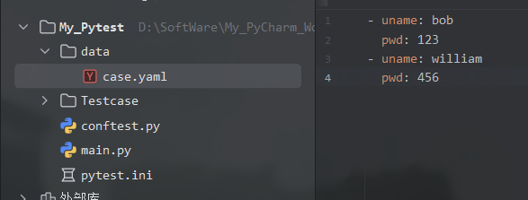

`Testcase/test_yamldata.py`

```python
import pytest
import yaml
import os
 
# 获取项目路径
BASE_PATH = os.path.dirname(os.path.dirname(os.path.abspath(__file__)))
 
def read_data_from_yaml(file_path):
    f = open(file_path, "r", encoding="utf-8")
    res = yaml.load(f, yaml.FullLoader)
    f.close()
    print(f"返回的参数：{res}")
    return res
 
@pytest.mark.parametrize("param", read_data_from_yaml(BASE_PATH+"/data/case.yaml"))
def test_case(param):
    print(f"uname={param['uname']}, pwd={param['pwd']}")
```

### 结果

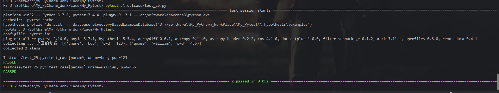

## 23: parametrize参数化数据来自json文件

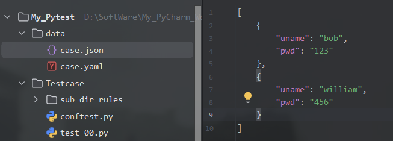

### 测试数据

`Data/case.json`

```json
[
    {
        "uname": "ren",
        "pwd": "123"
    },
    {
        "uname": "qzcsbj",
        "pwd": "456"
    }
]
```

### parametrize从json获取数据

`Testcase/test_jsondata.py`

```python
import pytest
import json
import os
 
# 获取项目路径
BASE_PATH = os.path.dirname(os.path.dirname(os.path.abspath(__file__)))

def read_data_from_json(file_path):
    data = {}
    with open(file_path, 'r', encoding="utf-8") as fp:
        data = json.load(fp)
    print(f"返回的参数：{data}")
    return data

@pytest.mark.parametrize("param", read_data_from_json(BASE_PATH+"/data/case.json"))
def test_case(param):
    print(f"uname={param['uname']}, pwd={param['pwd']}")
```

#### 结果

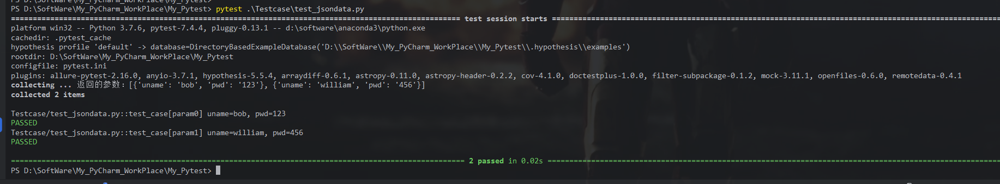


## 24: parametrize参数化数据来自excle文件

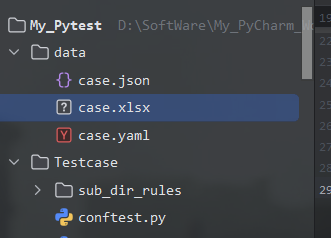

### 测试数据

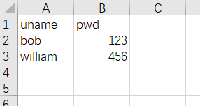

### 模块安装（读excel）

```shell
pip install xlrd==1.0.0
```

### parametrize从excel获取数据

### 方式一：

```python
"""
pytest 使用parameter参数化获取excel文件数据进行测试
"""

import xlrd
import pytest
import os

# 获取项目路径
BASE_PATH = os.path.dirname(os.path.dirname(os.path.abspath(__file__)))


def read_data_from_excel (file_path, sheet_name="Sheet1"):
    # 打开文件
    workbook = xlrd.open_workbook(file_path)

    # 获取所有sheet
    # sheets = workbook.sheet_names()
    # print(sheets) # ['Sheet1', 'Sheet2', 'Sheet3']

    # 根据sheet名称获取sheet内容(也可以格局索引，从0开始)
    sheet = workbook.sheet_by_name(sheet_name)

    # 获取第一行作为key
    first_row = sheet.row_values(0)

    # 获取行数
    rows_length = sheet.nrows

    all_rows = []
    rows_dict = []

    # 获取excel行数据
    for i in range(rows_length):
        if i < 1:
            continue
        all_rows.append(sheet.row_values(i))

    # 遍历行数据列表，生成字典
    for row in all_rows:
        # print('=========',type(row))  # row是list类型

        # zip()函数用于将可迭代的对象作为参数，将对象中对应的元素（索引相同的元素）打包成一个个元组，然后返回由这些元组组成的列表
        # 然后通过dict转换为字典
        lis = dict(zip(first_row, row))
        # 每行字典数据放到列表
        rows_dict.append(lis)
    return rows_dict

@pytest.mark.parametrize("param", read_data_from_excel(BASE_PATH + "/data/case.xlsx"))
def test_case (param):
    print(param)
    print(f"uname={param['uname']}, pwd={param['pwd']}")
```

#### 结果

存在warning。具体原因是由于使用的是 `xlrd` 库来读取 `.xlsx` 文件。`xlrd` 从 **2.0.0 版本开始已停止支持 `.xlsx` 格式**（仅保留对旧 `.xls` 的支持）。虽然你当前能读取（可能因版本较低），但其内部的 `.xlsx` 解析模块长久未更新，依赖了过时的第三方库和 Python API，导致这些警告。

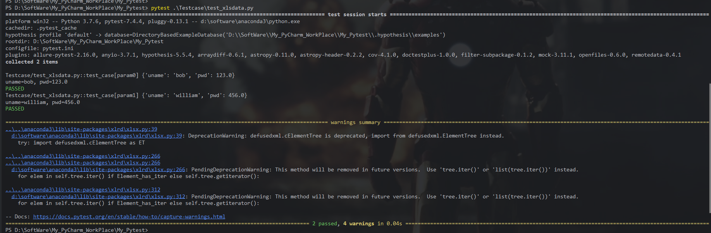


### 方式二：

```python
"""
pytest 使用parameter参数化获取excel文件数据进行测试
"""

import xlrd
import pytest
import os
import openpyxl

# 获取项目路径
BASE_PATH = os.path.dirname(os.path.dirname(os.path.abspath(__file__)))

def read_data_from_excel (file_path, sheet_name="Sheet1"):
    wb = openpyxl.load_workbook(file_path, data_only=True)
    sheet = wb[sheet_name]

    # 获取第一行作为键（取实际值，跳过空单元格）
    headers = [cell.value for cell in sheet[1] if cell.value is not None]

    rows_dict = []
    # 从第二行开始读取
    for row in sheet.iter_rows(min_row=2, values_only=True):
        # 只取有数据的列（与headers长度一致）
        row_data = [cell for cell in row[:len(headers)] if cell is not None]
        if not row_data:  # 跳过全空行
            continue
        # 补齐长度（若某列值为None，用空字符串代替）
        while len(row_data) < len(headers):
            row_data.append('')
        rows_dict.append(dict(zip(headers, row_data)))
    return rows_dict

@pytest.mark.parametrize("param", read_data_from_excel(BASE_PATH + "/data/case.xlsx"))
def test_case (param):
    print(param)
    print(f"uname={param['uname']}, pwd={param['pwd']}")
```

#### 结果

没有warning，运行结果正确

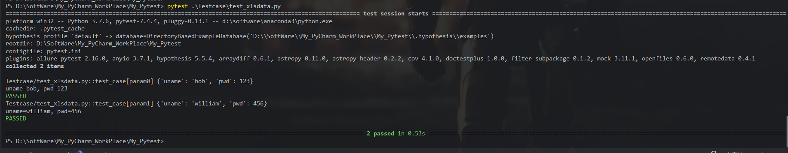

## 25: parametrize参数化数据来自csv文件

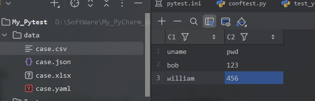

### 测试数据

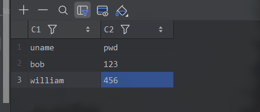

### parametrize从csv获取数据

```python
"""
pytest 使用parameter参数化获取csv文件数据进行测试
"""

import pytest
import csv
import os

# 获取项目路径
BASE_PATH = os.path.dirname(os.path.dirname(os.path.abspath(__file__)))


def read_data_from_csv (file_path):
    item = []
    c = csv.reader(open(file_path, "r", encoding='utf-8'))
    for i in c:
        item.append(i)
    print(f"返回的参数：{item}")
    return item

@pytest.mark.parametrize("param", read_data_from_csv(BASE_PATH + "/data/case.csv"))
def test_case (param):
    print(f"uname={param[0]}, pwd={param[1]}")
```

### 结果

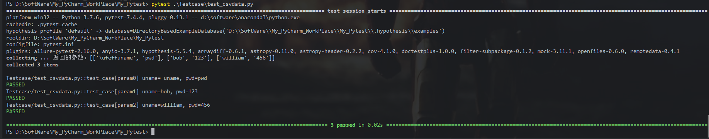


# pytest常用插件

### 关于插件

pytest有很多第三方插件：https://docs.pytest.org/en/latest/reference/plugin_list.html#plugin-list

总共1300多个，一般最近1年内有更新的都是常用的。

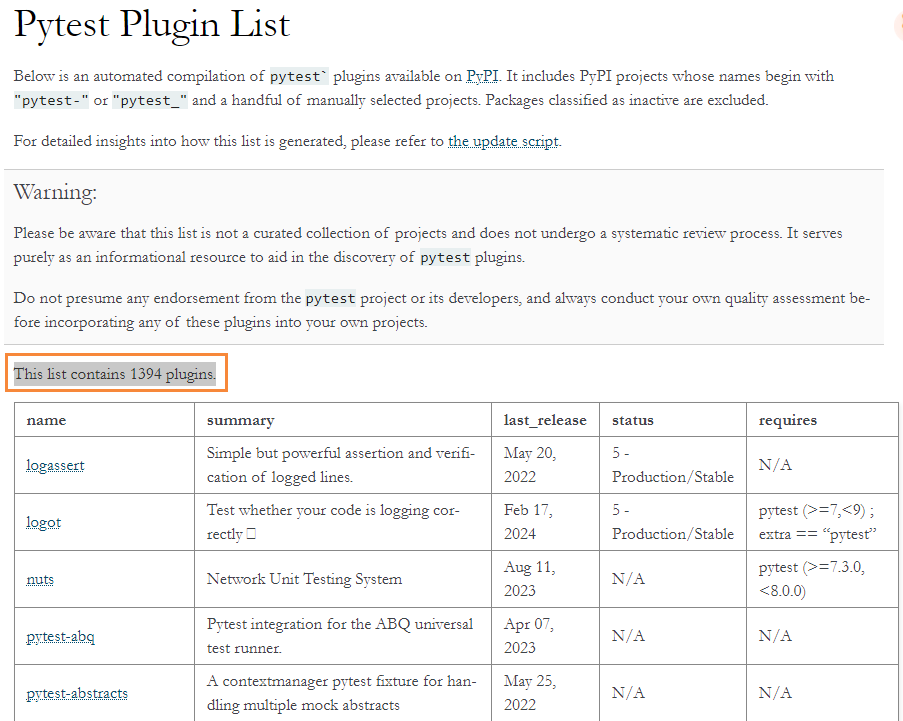

## 01: pytest常用插件 - 失败重试pytest-rerunfailures

### 1. 概述

`pytest-rerunfailures` 是一个基于 pytest 框架的插件，用于在测试用例失败时自动重新运行，直到达到预定的重试次数或测试用例通过为止。

**适用场景**：在自动化测试中，部分用例失败并非代码问题，而是由于网络波动、服务重启、资源暂时不可用等偶发性因素导致。通过失败重试机制，可以有效减少因环境不稳定造成的“假阴性”结果，提升测试的稳定性和可靠性。

### 2.插件安装

```shell
##1、直接pip安装
pip install pytest-rerunfailures

## 2、使用包管理器anconda进行安装
```

### 3. 核心特性详解

参数：

- `--reruns n`，表示运行不通过，最多重试次数；必填
- `--reruns-delay m`，表示重试前等待秒数；可选参数

命令：

　　`pytest --reruns n`　或    ` pytest --reruns=n`

#### 3.1 全局重试所有失败用例

使用 `--reruns` 命令行选项，指定测试运行的最大次数（首次运行 + 重试次数）：

```shell
pytest --reruns 3
```

**重要特性**：运行失败的 fixture 或 `setup_class` 也将被重新执行。

##### 用例

`Testcase/test_plugins/test_rerun.py`

```python
"""
测试pytest常用插件 - 失败重试pytest-rerunfailures
"""

def test_b ( ):
    print("---test_b")
    assert 1 == 1


def test_a ( ):
    print("---test_a")
    assert 1 == 2
```

##### 结果

`test_a` 断言失败（`assert 1 == 2`），触发了 `pytest-rerunfailures` 的重试机制，重试了 3 次（因为命令行指定了 `--reruns 3`），最终仍然失败，符合预期行为。

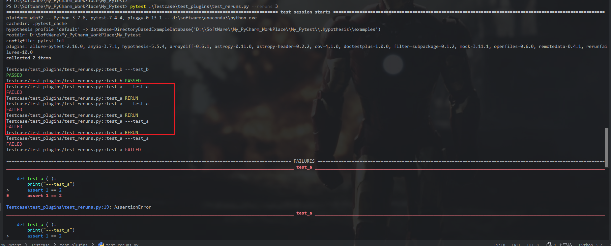

#### 3.2 重试延迟控制

##### 3.2.1 固定延迟

使用 `--reruns-delay` 选项，在每次重试之前增加固定等待时间（单位：秒）：

```shell
## 命令表示：失败用例最多重试 3 次，每次重试前等待 1 秒。
pytest --reruns 3 --reruns-delay 1
```

###### 用例

`Testcase/test_plugins/test_rerun.py`

```python
"""
测试pytest常用插件 - 失败重试pytest-rerunfailures
"""

def test_b ( ):
    print("---test_b")
    assert 1 == 1


def test_a ( ):
    print("---test_a")
    assert 1 == 2
```

###### 结果

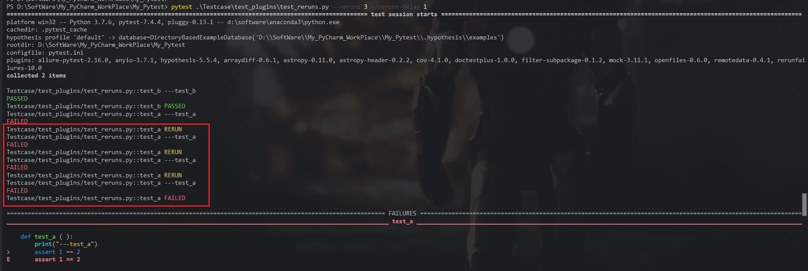

##### 3.2.2 指数退避延迟

###### 用例

`Testcase/test_plugins/test_rerun.py`

使用 `--reruns-delay-backoff-factor` 选项，实现延迟时间指数增长：

```shell
pytest --reruns 3 --reruns-delay 1 --reruns-delay-backoff-factor 2
```

延迟计算公式为：`delay_n = reruns_delay * backoff_factor ** (n - 1)`。

以上示例中，三次重试前的等待时间分别为：1 秒、2 秒、4 秒。该特性对于需要等待服务恢复的场景尤为实用

###### 结果

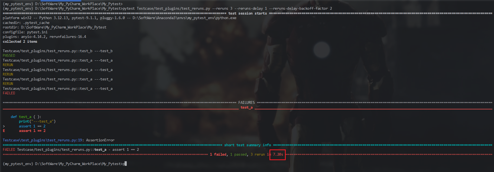

#### 3.3 条件重试

##### 3.3.1 仅重试匹配特定异常的用例

###### 用例

`Testcase/test_plugins/test_rerun.py`

使用 `--only-rerun` 标志，只重试匹配指定正则表达式的错误：

```python
# 仅重试 AssertionError
pytest  --reruns 3 --reruns-delay 1 --only-rerun AssertionError
```

###### 结果

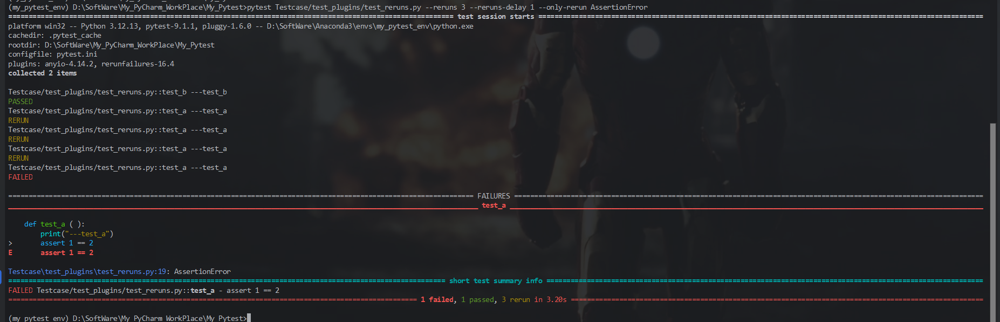

##### 3.3.2 排除特定异常进行重试

###### 用例

`Testcase/test_plugins/test_rerun.py`

使用 `--rerun-except` 标志，排除匹配指定正则表达式的错误，对其他错误进行重试：

```python
# 除 AssertionError 外的其他错误均重试
pytest --reruns 5 --rerun-except AssertionError
```

###### 结果

针对本用例的`AssertionError`没有启动重跑

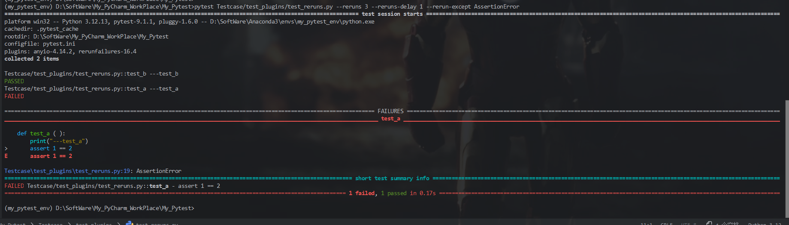

#### 3.4 单个用例级别重试

##### 3.4.1 基础装饰器用法

使用 `@pytest.mark.flaky` 装饰器标记单个测试用例，并指定重试次数：

```python
import pytest

@pytest.mark.flaky(reruns=5)
def test_example(request):
    print("--通过用例")
    assert 1 == 1
    print("--失败用例")
    assert 1 == 2
```

###### 结果

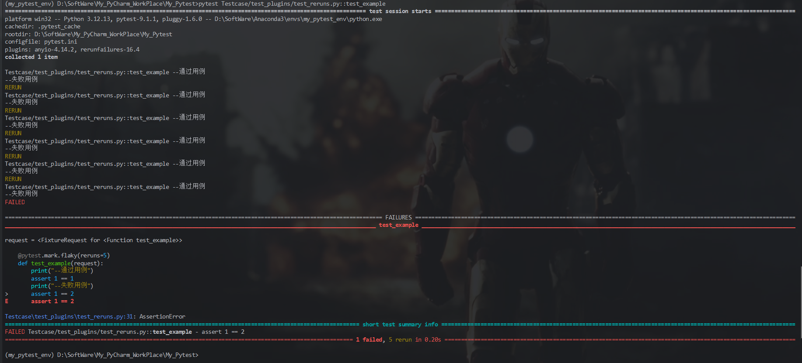

##### 3.4.2 带延迟的装饰器

```python
@pytest.mark.flaky(reruns=5, reruns_delay=2)
def test_example(request):
    print("--通过用例")
    assert 1 == 1
    print("--失败用例")
    assert 1 == 2
```

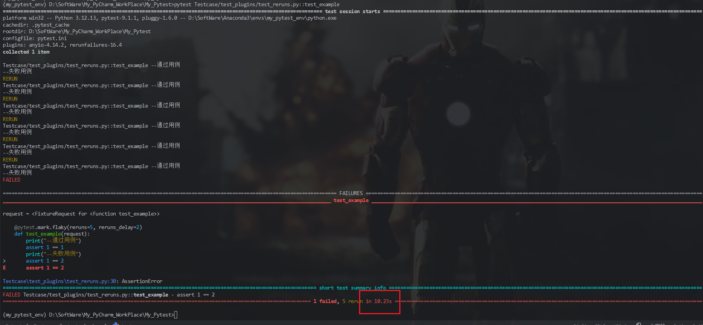

##### 3.4.3 条件重试装饰器

```python
import sys
import pytest

# 仅在特定条件下启用重试
@pytest.mark.flaky(reruns=5, condition=sys.platform.startswith("win32"))
def test_windows_only():
    pass
```

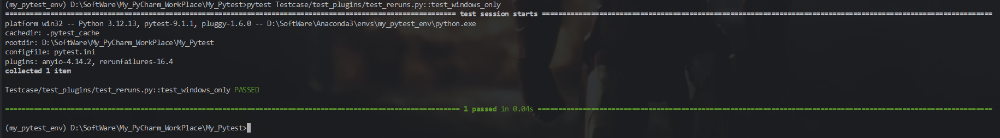

##### 3.4.4 指定重试的异常类型

```python
# 只对 AssertionError 和 ValueError 进行重试
@pytest.mark.flaky(reruns=5, only_rerun=["AssertionError", "ValueError"])
def test_specific_errors():
    pass

# 排除 AssertionError，其他错误均重试
@pytest.mark.flaky(reruns=5, rerun_except="AssertionError")
def test_except_errors():
    pass
```

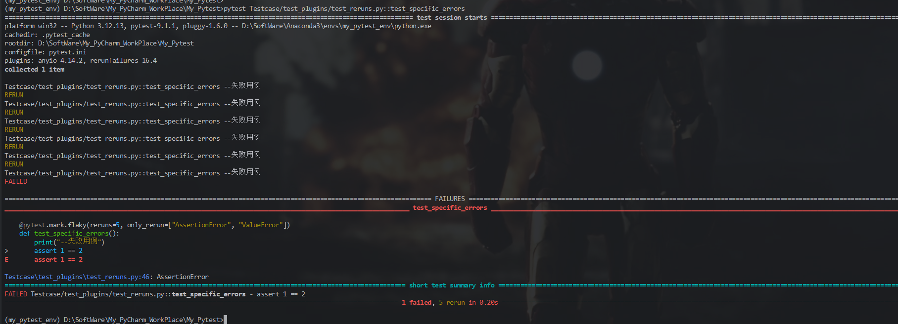

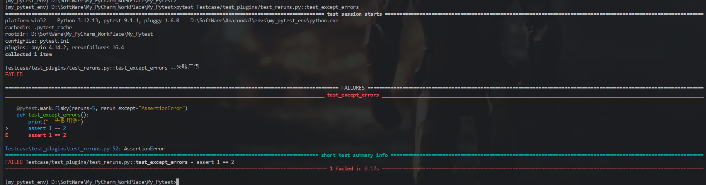

#### 3.5 配置文件方式

在 `pytest.ini` 中配置全局重试参数：

```python
[pytest]
reruns = 3
reruns_delay = 1
```


### 4. 优先级与覆盖规则

当同时使用命令行和装饰器配置时，遵循以下规则：

| 配置方式                    | 优先级 | 说明                                     |
| :-------------------------- | :----- | :--------------------------------------- |
| `@pytest.mark.flaky` 装饰器 | **高** | 单个用例的装饰器配置优先于命令行全局配置 |
| 命令行 `--reruns`           | 中     | 作用于所有未使用装饰器指定重试次数的用例 |
| 配置文件（pytest.ini）      | **低** | 作为全局默认值                           |

> **重要**：如果用例已使用 `@pytest.mark.flaky` 指定了重试次数，则命令行的 `--reruns` 对该用例不会生效。


### 5. 总结

`pytest-rerunfailures` 是一个功能完善的失败重试插件，核心能力包括：

| 特性         | 说明                                 |
| :----------- | :----------------------------------- |
| ✅ 全局重试   | 通过 `--reruns` 对所有失败用例生效   |
| ✅ 单用例重试 | 通过 `@pytest.mark.flaky` 精细控制   |
| ✅ 延迟控制   | 支持固定延迟和指数退避               |
| ✅ 条件重试   | 按异常类型精确控制重试范围           |
| ✅ 硬崩溃恢复 | 配合 pytest-xdist 可恢复段错误等崩溃 |
| ✅ 配置灵活   | 支持命令行、装饰器、配置文件三种方式 |

合理利用该插件，可以显著提升自动化测试在 CI/CD 环境中的稳定性和可靠性，减少因偶发因素导致的无效失败排查成本。


## 02: pytest常用插件 - 重复测试pytest-repeat

### 使用场景

某功能不稳定，重复执行多次，以便复现问题。

### 插件安装

```shell
conda install pytest-repeat
# 或
pip install pytest-repeat
```

### 2.1 命令行方式 — 全局重复执行

`Testcase/test_plugins/test_repeat.py`

参数：

- `--count`：重复运行次数，必填
- `--repeat-scope`：默认function，还可以是class、module、session，表示重复运行的维度，比如session，表示所有用例执行完一次，然后再执行第二次；选填

```python
## 使用 --count 命令行选项指定所有测试用例的执行次数：
pytest --count=count --repeat-scope=function
# 或
pytest --count count --repeat-scope function
```

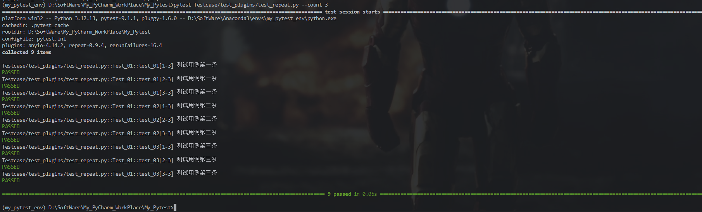

### 2.2 装饰器方式 — 单用例重复执行

#### (1) 让特定的测试用例重复执行

如果只想让特定的测试用例重复执行，可以使用 `@pytest.mark.repeat(count)` 装饰器

```python
import pytest

@pytest.mark.repeat(3)
def test_repeat_decorator():
    print("测试用例执行")
    
    
class TestCase:
    @pytest.mark.repeat(3)
    def test_02(self):
        print("---用例2执行---")
```

##### 结果

执行后，只有添加了装饰器的用例会重复运行指定次数。

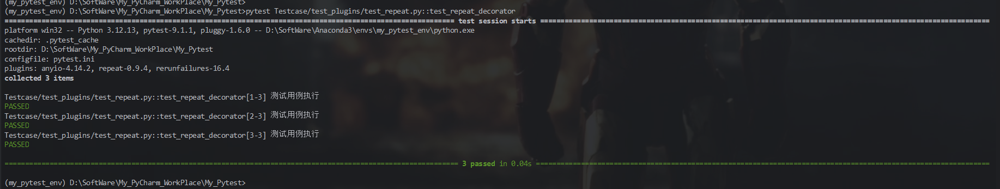

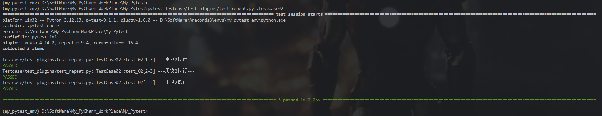	

#### (2) **多个用例不同次数**

可以给不同用例添加不同的装饰器，实现差异化重复执行：

```python
class TestCase03:
    @pytest.mark.repeat(2)
    def test_01(self):
        print('测试用例第一条')
    
    @pytest.mark.repeat(3)
    def test_02(self):
        print('测试用例第二条')
    
    @pytest.mark.repeat(4)
    def test_03(self):
        print('测试用例第三条')
```

##### 结果

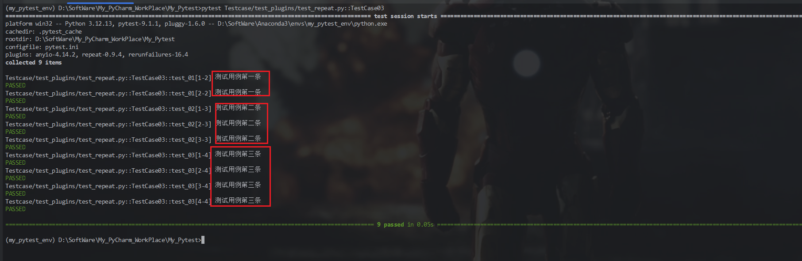


### 2.3 重复测试直到失败（重点特性）

在排查偶现问题或间歇性失败时，可以反复运行同一个测试直到它失败。结合 pytest 的 `-x` 选项（首次失败即停止），可以实现这一需求：

```python
## 命令
pytest --count=1000 -x `Testcase/test_plugins/test_repeat.py`
```

##### 用例

```python
import random
import time
import pytest

def TestCase04():
    computer = random.randint(0, 4)
    time.sleep(1)
    print(computer)
    assert computer < 3
```

##### 结果

当随机数 `computer` 大于等于 3 时，测试失败并立即停止，不再继续执行剩余次数。

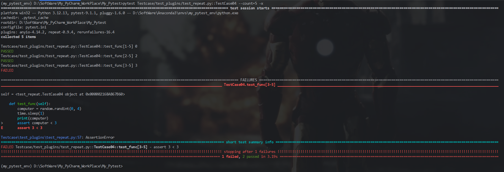

### 2.4 --repeat-scope — 控制重复执行顺序

`--repeat-scope` 参数用于控制测试用例的重复执行顺序，类似于 pytest fixture 的 scope 作用域。可选值包括：

| 值                 | 说明                                                         |
| :----------------- | :----------------------------------------------------------- |
| `function`（默认） | 每个测试用例重复执行完指定次数后，再执行下一个测试用例       |
| `class`            | 以 class 为单位，将一个 class 内的所有用例重复执行完，再执行下一个 class |
| `module`           | 以模块为单位，将一个模块内的所有用例重复执行完，再执行下一个模块 |
| `session`          | 重复整个测试会话——所有收集到的测试用例先全部执行一遍，然后再全部执行第二遍，以此类推 |

**使用示例**：

```python
# 以 class 为单位重复执行
pytest Testcase/test_plugins/test_repeat.py --count=2 --repeat-scope=class 
```

**默认行为（function）** ：以两个测试用例 `test_a1` 和 `test_a2` 为例，执行顺序为：`test_a1` 执行 3 次 → `test_a2` 执行 3 次。

**session 行为**：执行顺序为：所有用例执行第 1 遍 → 所有用例执行第 2 遍 → ……

### 3、注意事项

#### 3.1 命令行与装饰器同时使用

当同时使用命令行 `--count` 和装饰器 `@pytest.mark.repeat` 时，**装饰器的优先级更高**，会覆盖命令行的全局设置。命令行 `--count` 仅对没有装饰器的用例生效。


### 4、总结

pytest-repeat 提供了以下核心能力：

1. **全局重复**：通过 `--count` 命令行参数，让所有用例重复执行
2. **精准控制**：通过 `@pytest.mark.repeat` 装饰器，仅对特定用例重复执行
3. **失败即停**：结合 `-x` 选项，重复执行直到首次失败，高效定位偶现问题
4. **灵活顺序**：通过 `--repeat-scope` 控制重复执行的作用域和顺序


## 03: pytest常用插件 - 控制函数执行顺序pytest-ordering

### ⚠️ 重要提示：pytest-ordering 已不再维护

**pytest-ordering 原项目已停止维护**，官方推荐使用其分支项目 **pytest-order**。

两个插件的主要区别：

- 标记名称不同：`pytest-ordering` 使用 `@pytest.mark.run`，而 `pytest-order` 使用 `@pytest.mark.order`
- 特殊标记（如 `@pytest.mark.first`、`@pytest.mark.last`）在 pytest-order 中已被移除，统一使用 `order` 标记
- pytest-order 提供了更多高级特性，如**相对顺序**、**作用域控制**等

**本文档将以 pytest-order 为主进行介绍**，同时兼容说明 pytest-ordering 的用法。

### 一、应用场景

用例执行顺序，默认是按照从上到下的顺序进行执行的。如果想自定义执行顺序，也就是改变执行优先级，那么可以使用pytest-ordering

#### 插件安装

```shell
pip install pytest-ordering / pip install pytest-order
## 或
conda install pytest-ordering / pip install pytest-order
```

### 二、核心特性

pytest-order 提供了以下核心功能：

| 特性               | 说明                                              |
| :----------------- | :------------------------------------------------ |
| **序号排序**       | 使用正整数或负整数指定执行顺序                    |
| **相对排序**       | 使用 `before` 和 `after` 指定测试间的相对执行关系 |
| **作用域控制**     | 支持 session、module、class 级别的作用域          |
| **负索引排序**     | 支持从末尾开始计数（如 `-1` 表示最后一个执行）    |
| **稀疏排序**       | 仅对部分测试指定顺序，其余保持默认                |
| **自定义标记前缀** | 支持使用自定义的标记名称                          |

### 三、使用示例

#### 3.1 基础用法：按序号排序

使用 `@pytest.mark.order(n)` 装饰器，**数字越小越先执行**。

```python
import pytest

@pytest.mark.order(2)
def test_login():
    print("执行登录")

@pytest.mark.order(1)
def test_register():
    print("执行注册")

@pytest.mark.order(3)
def test_create_order():
    print("创建订单")
```

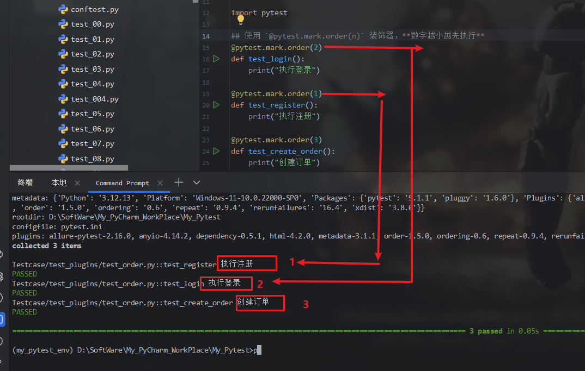

#### 3.2 负索引：从末尾排序

使用负数可以从末尾开始指定顺序。

```python
import pytest

## 执行顺序：test_login → test_cleanup → test_logout
@pytest.mark.order(-1)      # 最后一个执行
def test_logout():
    print("登出")

@pytest.mark.order(1)       # 第一个执行
def test_login():
    print("登录")

@pytest.mark.order(-2)      # 倒数第二个执行
def test_cleanup():
    print("清理数据")
```

执行顺序：`test_login` → `test_cleanup` → `test_logout`

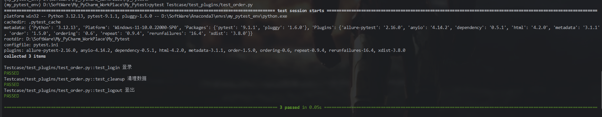

#### 3.3 使用序数词

pytest-order 支持使用 `"first"`、`"second"`、`"last"` 等序数词。

```python
import pytest

@pytest.mark.order("last")
def test_create_order():
    print("创建订单")

@pytest.mark.order("second")
def test_login():
    print("登录")

@pytest.mark.order("first")
def test_register():
    print("注册")
```

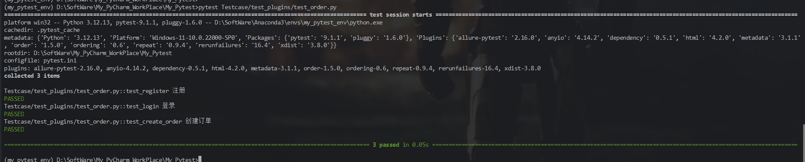

#### 3.4 相对排序：before 和 after

这是 pytest-order **独有的高级特性**，可以指定某个测试在另一个测试之前或之后执行

```python
import pytest

@pytest.mark.order(1)
def test_register():
    print("注册")

@pytest.mark.order(after="test_register")
def test_login():
    print("登录（在注册之后执行）")

@pytest.mark.order(before="test_logout")
def test_create_order():
    print("创建订单（在登出之前执行）")

@pytest.mark.order(2)
def test_logout():
    print("登出")
```

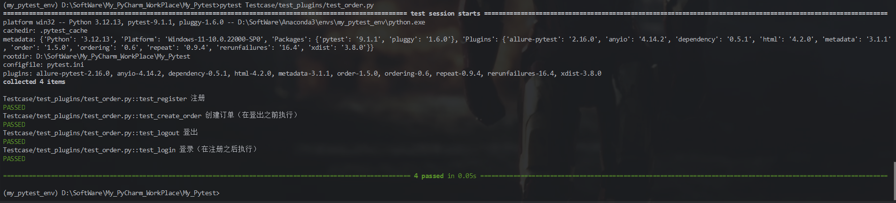

#### 3.5 混合使用：序号 + 相对排序

相对排序可以与其他排序方式混合使用，实现更灵活的控制

```python
import pytest

@pytest.mark.order(1)
def test_a():
    print("测试A")

@pytest.mark.order(2)
def test_b():
    print("测试B")

@pytest.mark.order(after="test_b")
def test_c():
    print("测试C（在B之后执行）")

# 未指定顺序的用例默认排在最后
def test_d():
    print("测试D（默认最后执行）")
```

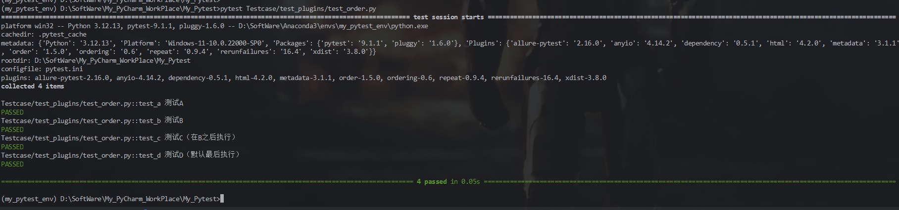

### 四、pytest-ordering（原版）的用法

如果仍在使用原版 pytest-ordering，用法如下：

#### 方式一：使用 `order` 参数

python

```python
import pytest

@pytest.mark.run(order=2)
def test_login():
    print("登录")

@pytest.mark.run(order=1)
def test_register():
    print("注册")
```

#### 方式二：使用 `after` / `before` 参数

```python
import pytest

@pytest.mark.run(order=1)
def test_register():
    print("注册")

@pytest.mark.run(after='test_register')
def test_login():
    print("登录")
```

#### 方式三：使用序数词

```python
import pytest

@pytest.mark.run('first')
def test_register():
    print("注册")

@pytest.mark.run('second')
def test_login():
    print("登录")

@pytest.mark.run('last')
def test_create_order():
    print("创建订单")
```

### 五、高级配置

#### 5.1 作用域控制（order-scope）

通过配置可以控制排序的作用域级别：

```bash
# 以 module 为单位排序
pytest --order-scope=module

# 以 class 为单位排序
pytest --order-scope=class
```

#### 5.2 稀疏排序（sparse-ordering）

如果只对部分测试指定了顺序，其余测试可以通过配置决定如何处理：

```bash
# 未指定顺序的测试保持默认位置
pytest --sparse-ordering
```

### 六、注意事项

#### 6.1 依赖测试需谨慎

**通常认为编写相互依赖的测试是一种不良实践**。在使用本插件之前，建议先评估是否可以通过重构测试来消除依赖关系。仅在因性能、遗留代码或其他限制无法避免时才使用顺序控制。

#### 6.2 避免插件混用

**不要同时安装 pytest-ordering 和 pytest-order**，两者可能产生冲突。建议卸载原版后安装新版：

```bash
pip uninstall pytest-ordering
pip install pytest-order
```

#### 6.3 优先级规则

pytest-order 的优先级规则：

- `order=0` 最先执行
- `order=正数` 其次执行
- `未指定 order` 默认执行
- `order=负数` 最后执行

#### 6.4 版本兼容性

- pytest-order 支持 Python 3.7+ 和 pytest 5.0+
- 对于 Python 3.10+，需要 pytest >= 6.2.4

### 七、总结

pytest-order（及原版 pytest-ordering）提供了以下核心能力：

| 能力           | 说明                                          |
| :------------- | :-------------------------------------------- |
| **序号排序**   | 通过 `@pytest.mark.order(n)` 精确控制执行顺序 |
| **相对排序**   | 通过 `before`/`after` 指定测试间的执行关系    |
| **负索引**     | 支持从末尾计数，灵活指定最后执行的测试        |
| **作用域控制** | 支持 session、module、class 级别的排序范围    |
| **稀疏排序**   | 仅对部分测试指定顺序，其余保持默认            |


## 05: pytest常用插件 - 并发执行pytest-xdist

### 一、应用条件

无依赖：用例间没有关系

无顺序：用例可以不按顺序随机执行

此时，就可以并发执行，节约测试时间

注意：并发执行会打乱执行顺序，与`pytest-ordering`/`pytest-order`插件是冲突的

### 插件安装

```bash
pip install pytest-xdist 
## 或者
conda install pytest-xdist

## 安装 psutil 扩展可以更精确地检测 CPU 核心数，从而优化并行进程数：
conda install pytest-xdist[psutil]
```

### 二、核心特性总览

| 特性                          | 说明                                                   |
| :---------------------------- | :----------------------------------------------------- |
| **多 CPU 并行执行**           | 在多核 CPU 上同时运行测试，大幅缩短执行时间            |
| **多种分发模式（--dist）**    | 支持 load、loadscope、loadfile、loadgroup 四种调度策略 |
| **自定义分组（xdist_group）** | 通过装饰器将相关用例分配到同一 worker 执行             |
| **远程 SSH 执行**             | 将测试分发到远程主机执行，支持跨平台测试               |
| **--looponfail（已弃用）**    | 文件变更后自动重跑失败用例（已弃用，不推荐使用）       |
| **Worker 崩溃自动重启**       | 测试导致 worker 崩溃时自动重启并继续执行               |

### 三、核心特性详解

#### 3.1 多 CPU 并行执行 — 最常用功能

使用 `-n`（或 `--numprocesses`）选项指定并行执行的 worker 进程数

```python
# 自动使用所有物理 CPU 核心
pytest -n auto

# 使用逻辑核心数（需安装 `psutil`，否则回退到 `auto` 行为）
pytest -n logical

# 手动指定 4 个 worker 进程
pytest -n 4

# 禁用 xdist，所有测试在主进程执行
pytest -n 0
```

**自定义 worker 数量**：可以通过环境变量或 pytest hook 自定义 `-n auto` 和 `-n logical` 的行为：

```bash
# 环境变量方式
export PYTEST_XDIST_AUTO_NUM_WORKERS=8
pytest -n auto
```

或在 `conftest.py` 中实现 hook 函数定义`-n auto`的行为（如使用几个线程）：

```python
# conftest.py
def pytest_xdist_auto_num_workers(config):
    if config.option.numprocesses == "auto":
        return 6  # 自定义 auto 的 worker 数量
    return None  # 使用默认值
```

##### 示例

```python
import pytest

class Test01:
    def test_d (self):
        print("--test_d")

    @pytest.mark.run(order=-3)
    def test_c (self):
        print("--test_c")

    @pytest.mark.run(order=0)
    def test_b (self):
        print("--test_b")

    @pytest.mark.run(order=1)
    def test_a (self):
        print("--test_a")
```


##### (1) 不指定参数，直接运行

`pytest Testcase/test_plugins/test_xdist.py`

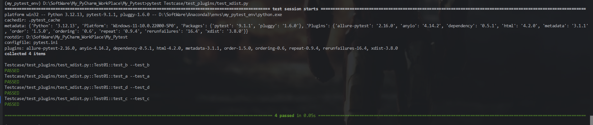

##### (2) 3个进程并发执行：gw0、gw1、gw2

`pytest Testcase/test_plugins/test_xdist.py -n 3`

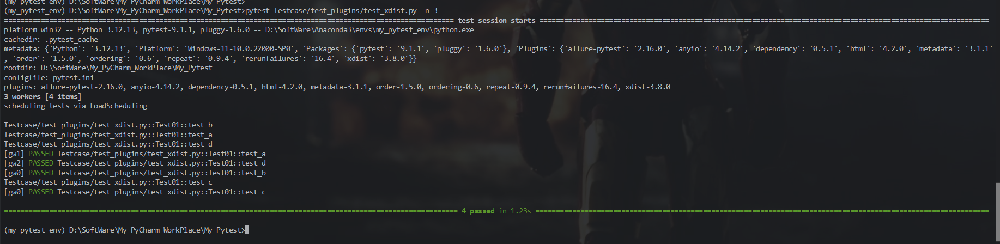

##### (3) 自动进程并发执行：gw0、gw1、gw2、gw3

`pytest Testcase/test_plugins/test_xdist.py -n auto`

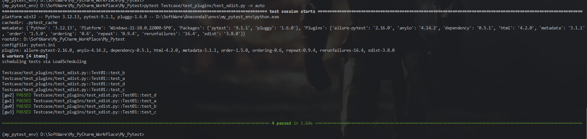

#### 3.2 分发模式（--dist）— 精细控制调度策略

pytest-xdist 提供了四种分发模式，通过 `--dist` 参数控制测试用例如何分配给各个 worker：

##### （1）`--dist load`（默认）

将待执行的测试用例发送给任意空闲的 worker，不保证任何顺序。这是最均衡的模式，适用于大多数场景。

```bash
pytest -n 4 --dist load
```

##### （2）`--dist loadscope`

按 **module**（测试函数）和 **class**（测试方法）分组，每组作为一个整体分配给 worker。这可以避免昂贵的模块级或类级 fixture 被重复执行。

```bash
pytest -n 4 --dist loadscope
```

##### （3）`--dist loadfile`

按**测试文件**分组，同一文件中的所有测试用例在同一个 worker 中执行。

```bash
pytest -n 4 --dist loadfile
```

##### （4）`--dist loadgroup`

按 `@pytest.mark.xdist_group` 标记分组，**相同组名的测试用例在同一个 worker 中顺序执行**。适用于需要共享资源或有依赖关系的测试场景。

```bash
pytest -n 4 --dist loadgroup
```

#### 3.3 自定义分组（xdist_group）— 精准控制依赖用例

使用 `@pytest.mark.xdist_group(name="组名")` 装饰器，将相关测试用例分配到同一个 worker

```python
import pytest

@pytest.mark.xdist_group(name="database")
def test_db_connection():
    print("数据库连接测试")

@pytest.mark.xdist_group(name="database")
def test_db_query():
    print("数据库查询测试")

@pytest.mark.xdist_group(name="api")
def test_api_login():
    print("API 登录测试")
```

执行 `pytest Testcase/test_plugins/test_xdist.py::Test02 -n 4 --dist loadgroup` 后，`test_db_connection` 和 `test_db_query` 会在同一个 worker 中顺序执行，确保数据库资源不会被并发访问破坏。

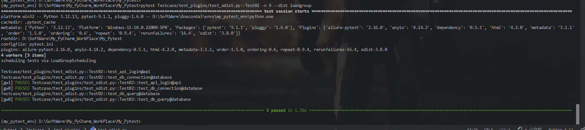

**多组标记合并**：如果一个测试用例有多个 `xdist_group` 标记，它们会被合并成一个新组

#### 3.4 远程 SSH 执行 — 跨主机分布式测试

pytest-xdist 支持将测试分发到远程 SSH 主机执行。执行前，pytest 会通过 **rsync** 将源代码同步到远程位置：

```bash
pytest --dist=loadscope --tx ssh=user@remote_host --rsyncdir mypkg mypkg/tests/
```

**多平台并行测试**：可以同时连接多个远程主机，在不同的 Python 解释器或不同平台上并行执行测试：

```bash
pytest --dist=each --tx ssh=host1 --tx ssh=host2 --rsyncdir package package/tests/
```

> **注意**：远程执行模式不会自动同步依赖包，需要在远程主机上预先安装好测试所需的依赖。官方文档也指出，此模式主要出于向后兼容考虑而保留，现代多平台测试更多依赖 CI 系统

#### 3.5 Worker 崩溃自动重启

如果某个测试导致 worker 进程崩溃（如段错误或 Python 解释器崩溃），pytest-xdist 会**自动重启该 worker** 并继续执行剩余测试，同时报告崩溃测试的失败信息。

```bash
# 限制最多允许 3 次 worker 重启
pytest -n 4 --max-worker-restart 3

# 完全禁用 worker 自动重启
pytest -n 4 --max-worker-restart 0
```


#### 3.6 限制最大 worker 数量（--maxprocesses）

使用 `--maxprocesses` 限制 worker 的最大数量，在 `-n auto` 探测到很多核心但不想全部使用时非常有用：

```bash
# 最多使用 8 个 worker，即使 CPU 有更多核心
pytest -n auto --maxprocesses 8
```


### 四、注意事项

#### 4.1 测试用例必须相互独立

并行执行时，**必须确保测试用例之间没有共享状态或依赖关系**，否则可能导致竞态条件。例如：

- 避免测试用例之间共享全局变量或文件
- 避免测试用例修改数据库中的同一条记录
- 确保每个测试用例可以独立运行

#### 4.2 `-s/--capture=no` 不生效

由于 pytest-xdist 的实现机制，`-s` 或 `--capture=no` 选项在并行模式下**无法正常工作**。如需查看详细的打印输出，建议使用 `-v` 或 `--tb=short` 等选项替代。

#### 4.3 插件兼容性

某些 pytest 插件可能不兼容多进程并发执行，使用前需确认插件之间的兼容性。

#### 4.4 并非所有场景都适合并行

如果单个进程的测试执行时间已经很短（如几秒），并行执行带来的提升有限。对于 I/O 密集型或需要长时间运行且有状态依赖的测试用例，并行执行反而可能导致结果不一致。

### 五、常用命令速查

| 场景                      | 命令                                                  |
| :------------------------ | :---------------------------------------------------- |
| 使用所有 CPU 核心并行执行 | `pytest -n auto`                                      |
| 使用 4 个 worker 并行执行 | `pytest -n 4`                                         |
| 按文件分组分发            | `pytest -n 4 --dist loadfile`                         |
| 按模块/类分组分发         | `pytest -n 4 --dist loadscope`                        |
| 按自定义组标记分发        | `pytest -n 4 --dist loadgroup`                        |
| 限制最大 worker 数量      | `pytest -n auto --maxprocesses 8`                     |
| 限制 worker 重启次数      | `pytest -n 4 --max-worker-restart 3`                  |
| 远程 SSH 执行             | `pytest --tx ssh=user@host --rsyncdir pkg pkg/tests/` |

### 六、总结

pytest-xdist 提供了以下核心能力：

| 能力               | 说明                                                         |
| :----------------- | :----------------------------------------------------------- |
| **多 CPU 并行**    | 通过 `-n` 参数在多核 CPU 上并行执行测试，大幅缩短执行时间    |
| **灵活分发策略**   | 四种 `--dist` 模式适配不同场景：load、loadscope、loadfile、loadgroup |
| **精准分组控制**   | 通过 `@pytest.mark.xdist_group` 将相关用例绑定到同一 worker  |
| **远程分布式执行** | 通过 SSH 将测试分发到远程主机，支持跨平台测试                |
| **高可用性**       | Worker 崩溃自动重启，确保测试会话不被中断                    |

在实际自动化测试中，pytest-xdist 是**加速测试执行**最直接有效的工具。无论是本地多核并行，还是跨主机分布式执行，它都能帮助团队显著缩短测试反馈周期，提升研发效率。


## 06: pytest常用插件 - 依赖执行pytest-dependency

### 一、应用场景

pytest-dependency 是一个用于管理测试用例之间**依赖关系**的 pytest 插件。在理想情况下，测试用例应该是独立、自包含的，可以以任意顺序执行。但在实际项目中，某些功能之间天然存在依赖（如功能 B 依赖功能 A），或测试会改变系统状态从而影响后续用例。此时，若依赖的用例失败，后续用例的失败信息只会干扰问题定位，并无实际帮助。

pytest-dependency 的解决思路是：**当依赖的用例失败或被跳过时，依赖它的用例将自动被跳过**，从而让测试报告聚焦于真正的问题根源

#### 插件安装

```bash
pip install pytest-dependency
## 或者
conda install pytest-dependency
```

### 二、核心特性

| 特性                 | 说明                                                      |
| :------------------- | :-------------------------------------------------------- |
| **声明式依赖标记**   | 通过 `@pytest.mark.dependency` 装饰器声明用例间的依赖关系 |
| **自动跳过依赖用例** | 依赖失败或被跳过时，所有依赖它的用例自动跳过执行          |
| **自定义依赖名称**   | 通过 `name` 参数为用例设置别名，方便其他用例引用          |
| **支持类级别标记**   | 装饰器可应用于整个测试类，自动作用于所有方法              |
| **多级依赖链**       | 支持一个用例依赖多个其他用例，形成依赖链                  |
| **作用域支持**       | 支持 session、package、module、class 等作用域             |

### 三、基本用法

#### 3.1 最简单的依赖关系

使用 `@pytest.mark.dependency()` 装饰被依赖的用例，在依赖它的用例上使用 `depends` 参数指定依赖项：

```python
import pytest

@pytest.mark.dependency()                      # 声明为可被依赖
def test_login():
    assert True

@pytest.mark.dependency(depends=["test_login"])  # 依赖 test_login
def test_create_order():
    assert True
```

执行时，`test_create_order` 仅在 `test_login` **成功执行后**才会运行。

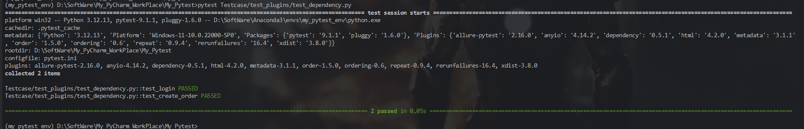

若 `test_login` 失败，`test_create_order` 将被跳过。

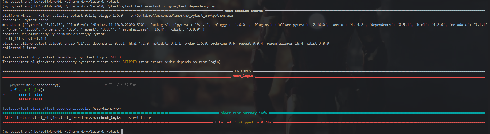

#### 3.2 依赖链与多依赖

一个用例可以依赖多个其他用例，且支持链式依赖

```python
import pytest

@pytest.mark.dependency()
def test_a():
    assert True

@pytest.mark.dependency()
def test_b():
    assert True

# 依赖 test_a 和 test_b，两者都成功才会执行
@pytest.mark.dependency(depends=["test_a", "test_b"])
def test_c():
    assert True

# 依赖 test_c，如果 test_c 被跳过，test_d 也会被跳过
@pytest.mark.dependency(depends=["test_c"])
def test_d():
    assert True
```

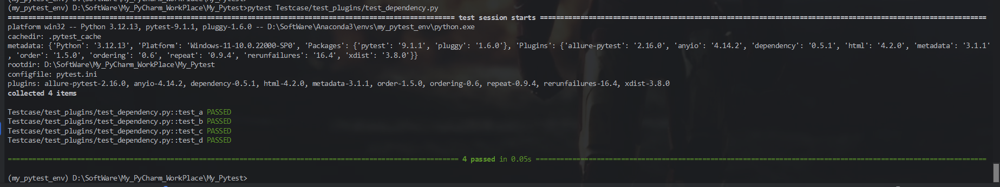

#### 3.3 完整示例与执行结果

以下示例展示了依赖失败时的完整执行效果：

```python
import pytest

@pytest.mark.dependency()
@pytest.mark.xfail(reason="deliberate fail")
def test_a():
    assert False

@pytest.mark.dependency()
def test_b():
    pass

@pytest.mark.dependency(depends=["test_a"])
def test_c():
    pass

@pytest.mark.dependency(depends=["test_b"])
def test_d():
    pass

@pytest.mark.dependency(depends=["test_b", "test_c"])
def test_e():
    pass
```

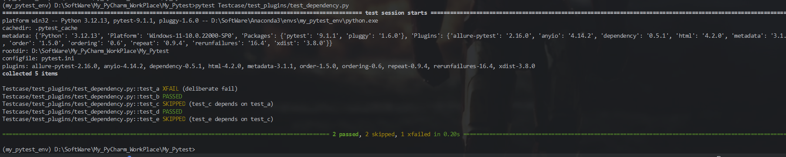

执行结果分析：

- **test_a**：故意失败（xfail）
- **test_b**：成功执行
- **test_c**：因依赖 test_a 失败而被**跳过**
- **test_d**：依赖 test_b（成功），正常执行
- **test_e**：依赖 test_b（成功）和 test_c（被跳过），因 test_c 被跳过而同样被**跳过**

### 四、命名测试（自定义依赖名称）

默认情况下，pytest-dependency 使用 pytest 的 **node ID**（即测试函数名）作为依赖引用名。但某些场景下（如参数化测试），node ID 难以预测，此时可以使用 `name` 参数为用例设置别名

**注意**：`name` 必须在整个测试会话中**唯一**。

```python
import pytest

@pytest.mark.dependency(name="a")
@pytest.mark.xfail(reason="deliberate fail")
def test_a():
    assert False

@pytest.mark.dependency(name="b")
def test_b():
    pass

@pytest.mark.dependency(name="c", depends=["a"])
def test_c():
    pass

@pytest.mark.dependency(name="d", depends=["b"])
def test_d():
    pass

@pytest.mark.dependency(name="e", depends=["b", "c"])
def test_e():
    pass
```

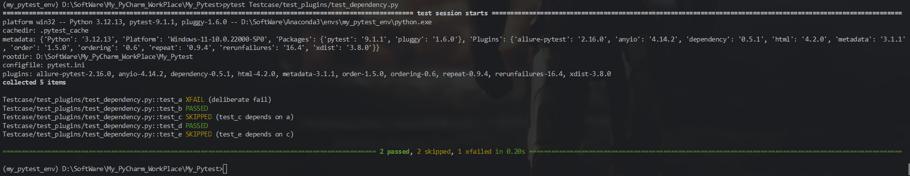

### 五、在测试类中使用

#### 5.1 类内方法依赖

在测试类中，默认的依赖名称由**类名 + 方法名**组成。在 `depends` 中引用时需包含类名

```python
import pytest

class TestOrder:
    @pytest.mark.dependency()
    def test_login(self):
        assert True

    # 依赖同类的 test_login，需使用 "TestOrder::test_login" 格式
    @pytest.mark.dependency(depends=["TestOrder::test_login"])
    def test_create_order(self):
        assert True
```

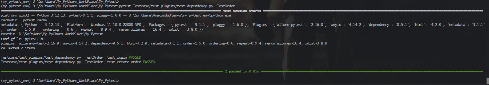


#### 5.2 显式命名简化引用

通过 `name` 参数可以简化跨方法引用

```python
import pytest

class TestOrder:
    @pytest.mark.dependency(name="login")
    def test_login(self):
        assert True

    @pytest.mark.dependency(name="create_order", depends=["login"])
    def test_create_order(self):
        assert True
```

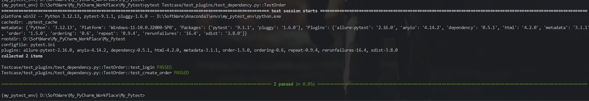


#### 5.3 类级别标记

`@pytest.mark.dependency` 装饰器可以应用于整个测试类，效果等同于将该标记（含相同参数）应用到类的**每个方法**上

```python
import pytest

@pytest.mark.dependency()  # 类级别标记，所有方法均可被依赖
class TestAPI:
    def test_login(self):
        assert True

    def test_logout(self):
        assert True
```

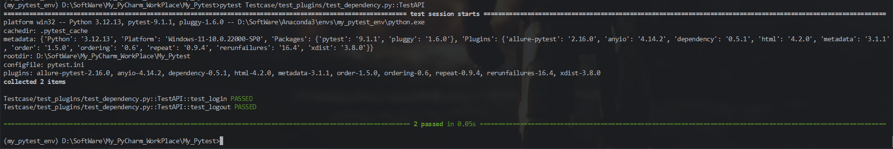

### 六、作用域（Scope）

pytest-dependency 支持 `session`、`package`、`module`、`class` 四种作用域，默认为 `session`。

作用域决定了依赖关系的**可见范围**。例如，若设置为 `module`，则只能在同一个模块内建立依赖关系；跨模块的依赖将无法识别。配置方式在 `pytest.ini` 中

```ini
[pytest]
dependency_scope = module
```

### 七、高级用法

#### 7.1 与 pytest-order 结合使用

pytest-dependency 可以与 `pytest-order`（或已废弃的 `pytest-ordering`）结合使用。前者管理"**是否执行**"（依赖失败则跳过），后者管理"**何时执行**"（执行顺序），两者互不冲突，可以协同工作。

#### 7.2 运行时动态标记依赖

官方文档中提到了运行时标记依赖的能力，适用于依赖关系过于复杂、无法在编译时静态声明的情况。

### 八、注意事项

#### 8.1 被依赖的用例必须先执行

依赖关系成立的前提是：**被依赖的用例必须在依赖它的用例之前执行**。如果执行顺序错误，pytest-dependency 将无法找到依赖项。建议配合 `pytest-order` 插件明确控制执行顺序。

#### 8.2 所有参与依赖的用例都需要标记

在依赖关系图中的**所有测试用例**都需要添加 `@pytest.mark.dependency` 装饰器——包括那些没有任何依赖项的用例。只有这样，测试结果才会被内部记录，其他用例才能依赖它们。

#### 8.3 依赖关系不等于执行顺序

pytest-dependency **只管理"是否执行"**，不管理"执行顺序"。它会在依赖用例执行完毕后检查其结果，再决定是否执行依赖用例。若要强制执行顺序，需配合 `pytest-order` 插件。

#### 8.4 谨慎使用依赖

**测试用例应尽量保持独立**。pytest-dependency 是处理**无法避免**的依赖关系的工具，而非鼓励编写耦合测试。在使用前，建议先审视测试设计，尽可能通过 fixture、参数化等方式减少依赖。

### 九、总结

pytest-dependency 提供了以下核心能力：

| 能力           | 说明                                                         |
| :------------- | :----------------------------------------------------------- |
| **声明式依赖** | 通过 `@pytest.mark.dependency` 装饰器清晰声明用例间的依赖关系 |
| **自动跳过**   | 依赖失败时，依赖它的用例自动跳过，避免无效失败信息干扰问题定位 |
| **自定义名称** | 通过 `name` 参数为用例设置别名，简化依赖引用                 |
| **类级别支持** | 装饰器可应用于整个测试类，自动作用于所有方法                 |
| **多依赖支持** | 一个用例可依赖多个其他用例，支持复杂依赖链                   |
| **作用域控制** | 支持 session、module、class 等作用域，控制依赖可见范围       |

在实际自动化测试中，当遇到不可避免的用例依赖时，pytest-dependency 能帮助团队**聚焦于真正的问题根源**，让测试报告更加清晰、有效。**但请始终记住：能用 fixture 或参数化解决的，就不要用依赖**。


## 07: pytest常用插件 - 多重校验pytest-assume

### 一、应用场景

pytest-assume 是一个用于实现**多重校验（软断言）** 的 pytest 插件。在自动化测试中，我们常常需要在同一个测试用例中执行多个断言。使用原生的 `assert` 语句时，一旦某个断言失败，后续的断言和代码都不会执行。而 `pytest-assume` 可以**让断言失败后继续执行后续断言**，在一个用例中汇总展示所有失败的断言信息。

#### 插件安装

```bash
pip install pytest-assume
## 或者
conda install pytest-assume
```

### 二、核心特性

| 特性                       | 说明                                             |
| :------------------------- | :----------------------------------------------- |
| **失败后继续执行**         | 断言失败不会立即抛出异常，后续断言和代码继续执行 |
| **汇总所有失败**           | 所有断言执行完毕后，统一报告所有失败的断言       |
| **两种使用方式**           | 支持函数调用式和上下文管理器式两种写法           |
| **与原生 assert 语法兼容** | 在上下文管理器中可直接使用 `assert` 语句         |
| **详细的失败报告**         | 清晰列出每个失败断言的位置和原因                 |


### 三、基本用法

#### 3.1 函数调用式（推荐）

直接使用 `pytest.assume(表达式)` 进行断言：

```python
import pytest

def test_assume():
    pytest.assume(1 == 1)      # 成功
    pytest.assume(1 == 2)      # 失败，但继续执行
    pytest.assume(2 == 2)      # 成功
    pytest.assume(2 == 3)      # 失败，但继续执行
    print("测试完成")           # 仍然会执行
```

执行后，所有断言都会执行，最后汇总报告失败信息。

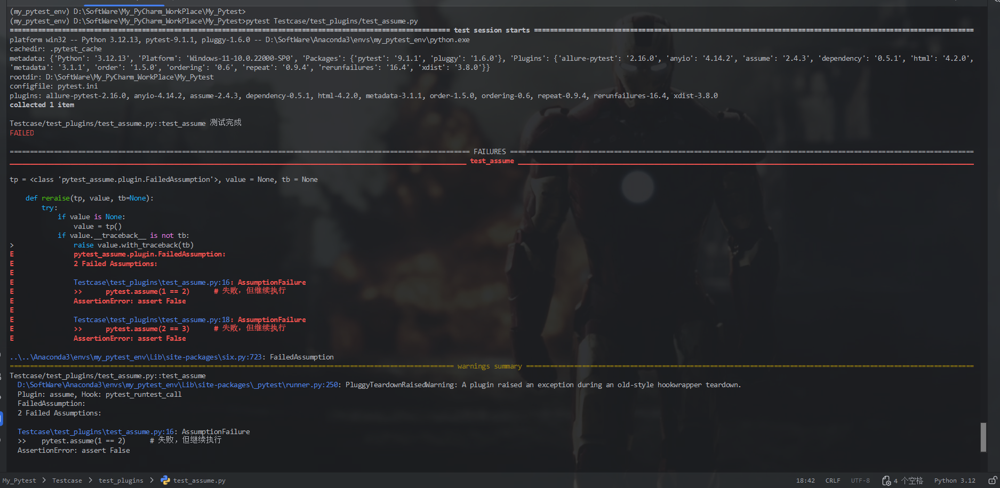

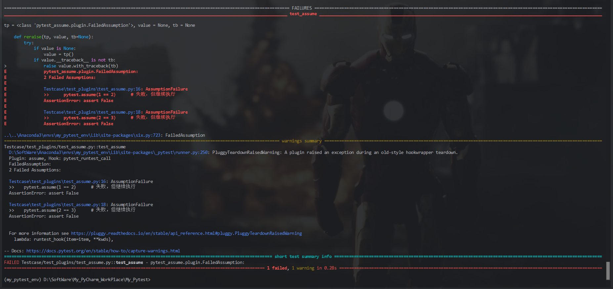

#### 3.2 上下文管理器式（with assume）

如果习惯使用 `assert` 语法，可以使用上下文管理器方式：

```python
import pytest
from pytest import assume

def test_assume_with_context():
    with assume:
        assert 1 == 1
    with assume:
        assert 1 == 2
    with assume:
        assert 2 == 2
```

> **⚠️ 重要**：每一个断言必须单独放在一个 `with assume` 块中。如果在同一个 `with assume` 下写多个 `assert`，前面的断言失败后，后面的断言**不会执行**。

**错误示例**（多个断言在同一个 with 块中）：

```python
def test_wrong():
    with pytest.assume:
        assert a > 0   # 失败后，下面的断言不会执行
        assert b > 0
        assert c < 0
```


### 四、与原生 assert 的对比

#### 4.1 使用原生 assert（硬断言）

```python
def test_assert():
    assert 1 == 1
    assert 1 == 2      # 失败，此处抛出异常
    assert 2 == 2      # 不会执行
    print("测试完成")   # 不会执行
```

执行到第二个断言失败后，测试立即终止，后续断言和代码均不执行。

#### 4.2 使用 pytest.assume（软断言）

```python
def test_assume():
    pytest.assume(1 == 1)
    pytest.assume(1 == 2)   # 失败，但继续执行
    pytest.assume(2 == 2)
    pytest.assume(2 == 3)   # 失败，但继续执行
    print("测试完成")        # 仍然执行
```

所有断言都会执行完毕，最后汇总报告所有失败信息。

#### 4.3 差异总结

| 对比项           | 原生 assert            | pytest.assume      |
| ---------------- | ---------------------- | ------------------ |
| 断言失败后的行为 | 立即抛出异常，终止测试 | 记录失败，继续执行 |
| 后续断言是否执行 | ❌ 不执行               | ✅ 继续执行         |
| 后续代码是否执行 | ❌ 不执行               | ✅ 继续执行         |
| 失败信息         | 只报告第一个失败       | 汇总报告所有失败   |


### 五、工作原理

`pytest.assume()` 的核心机制是：

1. **捕获而非抛出**：当断言失败时，`pytest.assume` 不会立即抛出 `AssertionError`，而是将失败信息记录下来
2. **继续执行**：测试用例中的后续代码（包括其他断言）正常执行
3. **延迟报告**：所有断言执行完毕后，`pytest.assume` 检查是否有失败记录
4. **汇总抛出**：如果有任何断言失败，统一抛出 `FailedAssumption` 异常，并在报告中列出所有失败的断言


### 六、实际应用场景

#### 6.1 接口测试中的多重校验

在接口自动化测试中，经常需要对同一个响应进行多维度校验：

```python
import pytest
import requests

def test_api_response():
    response = requests.get("https://api.example.com/user/1")
    data = response.json()
    
    # 即使某个断言失败，其他断言仍会执行，帮助全面定位问题
    pytest.assume(response.status_code == 200, "HTTP状态码校验失败")
    pytest.assume(data.get("code") == 0, "业务状态码校验失败")
    pytest.assume(data.get("data") is not None, "数据字段为空")
    pytest.assume(data["data"].get("name") == "张三", "用户名不匹配")
```

这样即使状态码校验失败，后续的业务状态码、数据字段等校验仍会执行，帮助快速定位接口的多个问题。

#### 6.2 数据验证场景

```python
def test_user_profile():
    user = get_user_profile()
    
    pytest.assume(user.id > 0, "用户ID无效")
    pytest.assume(user.name is not None, "用户名为空")
    pytest.assume(len(user.name) >= 2, "用户名长度不足")
    pytest.assume(user.email is not None, "邮箱为空")
    pytest.assume("@" in user.email, "邮箱格式不正确")
```


### 七、注意事项

#### 7.1 性能影响

使用 `pytest.assume` 会增加测试的执行时间，因为它需要**记录每个断言的结果**。对于断言数量极多的测试用例，需注意性能开销。

#### 7.2 不适用于有依赖关系的断言

如果后续断言依赖于前面断言的结果（例如前面断言失败会导致后续断言无法正常执行），则**不适合使用** `pytest.assume`。

**不适用场景示例**：

```python
def test_bad_example():
    result = complex_operation()
    pytest.assume(result is not None)   # 如果这里失败
    pytest.assume(result.status == "ok")  # result 为 None，这里会报 AttributeError
```

#### 7.3 测试最终状态

即使只有一个断言失败，整个测试函数也会被标记为 **FAILED**。

#### 7.4 上下文管理器中的注意事项

在 `with assume` 块中，**每个块只能包含一个断言**，否则无法实现失败后继续执行的效果。


### 八、相关插件对比

除了 `pytest-assume`，还有 `pytest-check` 等插件也能实现软断言功能。两者的主要区别：

| 特性         | pytest-assume              | pytest-check                    |
| ------------ | -------------------------- | ------------------------------- |
| 使用方式     | 函数调用 `pytest.assume()` | 函数调用 `pytest_check.check()` |
| 失败报告     | 汇总所有失败               | 汇总所有失败                    |
| 上下文管理器 | 支持 `with assume`         | 支持 `with check`               |

两者功能相似，可根据个人偏好选择。


### 九、总结

pytest-assume 提供了以下核心能力：

| 能力                   | 说明                                                         |
| ---------------------- | ------------------------------------------------------------ |
| **软断言机制**         | 断言失败不中断测试，继续执行后续断言和代码                   |
| **汇总失败报告**       | 所有断言执行完毕后，统一列出所有失败的断言                   |
| **两种使用方式**       | 支持函数调用式（`pytest.assume`）和上下文管理器式（`with assume`） |
| **与 assert 语法兼容** | 上下文管理器中可直接使用原生 `assert` 语法                   |
| **详细的失败信息**     | 清晰显示每个失败断言的位置和原因                             |

在实际自动化测试中，无论是接口测试的多维度校验，还是数据验证的全面检查，`pytest-assume` 都能帮助团队**一次性获取所有失败信息**，大幅提升问题定位效率。


## 08: pytest常用插件 - 测试报告pytest-html

pytest-html 是一个用于生成 **HTML 格式测试报告**的 pytest 插件。它可以将测试结果转化为结构清晰、视觉友好的网页报告，便于团队成员查看、归档和分享。与终端输出相比，HTML 报告支持更丰富的信息展示，如环境信息、额外附件、自定义样式等，是自动化测试体系中不可或缺的一环。

### 一、插件安装

```bash
pip install pytest-html
## 或者
conda install pytest-html
```

### 二、核心特性

| 特性               | 说明                                                     |
| :----------------- | :------------------------------------------------------- |
| **基础报告生成**   | 通过 `--html` 参数一键生成 HTML 测试报告                 |
| **自包含报告**     | 通过 `--self-contained-html` 生成单个独立 HTML 文件      |
| **ANSI 代码支持**  | 依赖 `ansi2html` 包，将终端彩色输出转换为 HTML           |
| **报告流式生成**   | 边执行边生成报告，无需等待全部测试完成                   |
| **自定义外观**     | 通过 `--css` 注入自定义样式表                            |
| **自定义报告标题** | 通过 `pytest_html_report_title` 钩子修改标题             |
| **环境信息展示**   | 集成 `pytest-metadata`，展示 Python 版本、插件等环境信息 |
| **额外内容附加**   | 支持为每个用例添加 HTML、文本、图片、URL 等额外信息      |
| **结果表格定制**   | 通过钩子增删列、修改单元格内容                           |
| **显示选项控制**   | 支持结果折叠、可见性过滤、列排序等交互功能               |

### 三、基础用法

#### 3.1 生成 HTML 报告

安装完成后，在运行 pytest 时添加 `--html` 参数指定报告输出路径即可：

```bash
pytest --html=report.html
```

执行后，会在当前目录生成一个 `report.html` 文件和一个 `assets` 文件夹（存放 CSS 等静态资源）。

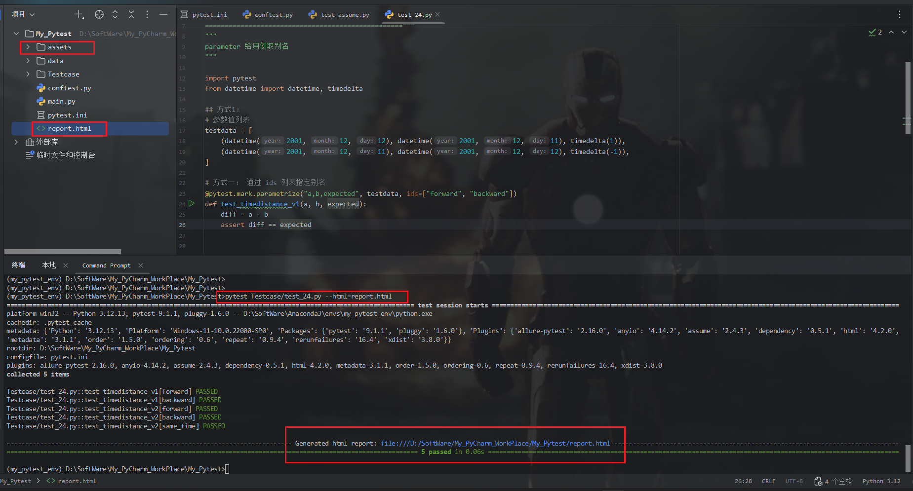

#### 3.2 打开报告查看

直接用浏览器打开生成的 HTML 文件即可查看报告。报告默认包含以下信息：

- **Summary（摘要）** ：测试总数、通过、失败、跳过等统计
- **Environment（环境）** ：Python 版本、pytest 版本、插件列表等
- **Results（结果表格）** ：每个测试用例的详细执行结果

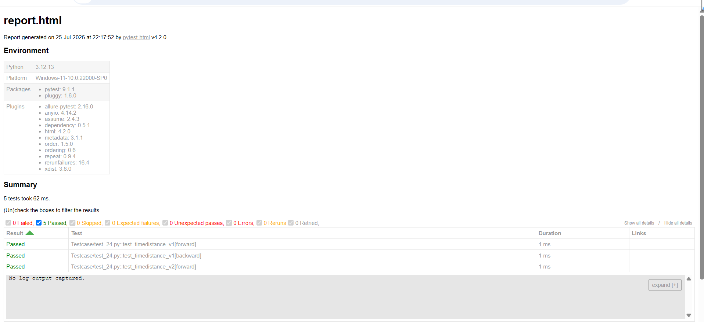

#### 3.3 在 pytest.ini 中配置报告路径

也可以将 `--html` 参数写入配置文件，避免每次手动输入：

```ini
[pytest]
addopts = --html=report.html
```


### 四、核心特性详解

#### 4.1 自包含报告（--self-contained-html）

默认生成的 HTML 报告会引用外部 CSS 文件，便于浏览器缓存和内容安全策略（CSP）的遵守。但如果需要**分享单个 HTML 文件**（如通过邮件发送），可以使用 `--self-contained-html` 将所有 CSS 和资源内嵌到 HTML 中：

```bash
pytest --html=report.html --self-contained-html
```

> **⚠️ 注意**：在自包含报告模式下，通过 `extras` 添加的图片（无论是本地文件还是外部链接）可能无法正常显示，插件会发出警告。

#### 4.2 ANSI 代码支持（ansi2html）

pytest 在终端输出中经常使用 ANSI 颜色代码（如红色表示失败、绿色表示通过）。pytest-html 支持将这些彩色输出**转换到 HTML 报告**中，但需要额外安装 `ansi2html` 包：

```bash
pip install ansi2html
```

由于 `ansi2html` 的许可证限制，该包**未被列为 pytest-html 的默认依赖**，需要手动安装。

#### 4.3 报告流式生成（generate_report_on_test）

默认情况下，pytest-html 会**等待所有测试执行完毕后**才生成完整的 HTML 报告。对于大型测试套件，这种等待可能会让人焦虑。

通过配置 `generate_report_on_test = true`，可以实现**边执行边生成报告**——每完成一个测试用例，报告就会立即更新.

**在 `pytest.ini` 中配置**：

```ini
[pytest]
generate_report_on_test = True
```

#### 4.4 自定义外观（--css）

默认的 pytest-html 报告采用简洁的蓝白配色。如果想更换为团队主题色或让某些信息更醒目，可以通过 `--css` 参数注入自定义样式表：

```bash
pytest --html=report.html --css=custom.css
```

支持同时指定多个 CSS 文件，按顺序应用：

```bash
pytest --html=report.html --css=theme.css --css=highlight.css
```

**自定义 CSS 示例**（`custom.css`）：

```css
/* 将报告标题改为红色并居中 */
h1 {
    color: #ff0000;
    text-align: center;
}

/* 调整环境信息表格行高 */
#environment_table td {
    padding: 12px 8px;
}

/* 失败用例高亮显示 */
.failed .col-result {
    background-color: #ffebee;
    font-weight: bold;
}
```

> **提示**：想知道要修改哪些元素的样式？先用默认命令生成一份报告，用浏览器打开并按下 F12 打开开发者工具，用元素检查器查看对应 HTML 标签和 CSS 类名。

#### 4.5 自定义报告标题

默认情况下，报告标题为报告文件的文件名。通过实现 `pytest_html_report_title` 钩子可以修改标题：

在 `conftest.py` 中添加：

```python
def pytest_html_report_title(report):
    report.title = "我的自动化测试报告"
```

#### 4.6 环境信息（Environment）

报告中的 **Environment 表格**由 `pytest-metadata` 插件提供，展示了 Python 版本、pytest 版本、系统信息、已安装插件等。

**添加自定义环境信息**：

在 `conftest.py` 中通过 `pytest_configure` 钩子添加：

```python
from pytest_metadata.plugin import metadata_key

def pytest_configure(config):
    config.stash[metadata_key]["测试环境"] = "预发布环境"
    config.stash[metadata_key]["构建编号"] = "2026-07-23-001"
```

**在测试执行后修改环境信息**：

如果需要在测试执行完成后（如动态获取某些信息）再修改环境表，需使用 `pytest_sessionfinish` 钩子并配合 `@pytest.hookimpl(tryfirst=True)`，确保在 pytest-html 生成报告**之前**执行：

```python
import pytest
from pytest_metadata.plugin import metadata_key

@pytest.hookimpl(tryfirst=True)
def pytest_sessionfinish(session, exitstatus):
    session.config.stash[metadata_key]["测试耗时"] = "120s"
    session.config.stash[metadata_key]["分支"] = "main"
```

> **关键点**：`tryfirst=True` 确保此钩子在 pytest-html 和 pytest-metadata 的钩子之前执行，否则环境信息的修改将不会被报告捕获。

**脱敏敏感信息**：

如果环境表中包含敏感信息（如 API Key、密码等），可以通过 `environment_table_redact_list` 配置脱敏：

```ini
[pytest]
environment_table_redact_list =
    ^api_key$
    .*password.*
    ^secret_
```

匹配这些正则表达式的环境变量，其值将显示为灰色遮罩。

#### 4.7 额外内容（Extras）— 为单个用例添加附件

这是 pytest-html **最强大的特性之一**。可以为每个测试用例附加额外的内容，如截图、日志、URL 链接等。

#### 支持的内容类型：

| 类型             | 示例                                        |
| :--------------- | :------------------------------------------ |
| **Raw HTML**     | `extras.html('<div>Additional HTML</div>')` |
| **JSON**         | `extras.json({'name': 'pytest'})`           |
| **Plain Text**   | `extras.text('Add some simple Text')`       |
| **URL**          | `extras.url('http://www.example.com/')`     |
| **Image (通用)** | `extras.image('/path/to/file.png')`         |
| **PNG**          | `extras.png(image)`                         |
| **JPEG**         | `extras.jpg(image)`                         |
| **SVG**          | `extras.svg(image)`                         |

##### 方式一：在 conftest.py 中通过钩子添加（推荐）

通过 `pytest_runtest_makereport` 钩子，可以在测试执行完成后为报告添加额外内容：

```python
import pytest
import pytest_html

@pytest.hookimpl(hookwrapper=True)
def pytest_runtest_makereport(item, call):
    outcome = yield
    report = outcome.get_result()
    extras = getattr(report, "extras", [])
    
    if report.when == "call":
        # 始终添加一个 URL
        extras.append(pytest_html.extras.url("http://www.example.com/"))
        
        # 测试失败时添加额外的 HTML
        if report.failed:
            extras.append(pytest_html.extras.html("<div style='color:red;'>测试失败，请检查日志</div>"))
            
            # 假设有一个截图函数
            # screenshot_path = take_screenshot()
            # extras.append(pytest_html.extras.image(screenshot_path))
    
    report.extras = extras
```

##### 方式二：在测试函数中直接使用 extras fixture

如果不想写钩子，可以直接在测试函数中使用 `extras` fixture：

```python
from pytest_html import extras

def test_example(extras):
    extras.append(extras.text("这是一条文本备注"))
    extras.append(extras.url("https://www.example.com", name="查看详情"))
    assert True
```

`extras` fixture 添加的内容会显示在测试结果行的 **Extra** 列中。

#### 4.8 修改结果表格（Modifying the Results Table）

通过实现自定义钩子，可以**增删列、修改单元格内容**，让报告更贴合团队需求。

#### 添加自定义列

以下示例在结果表格中添加了一个 **Description（描述）列**（显示测试函数的 docstring）和一个 **Time（时间）列**：

```python
import pytest
from datetime import datetime

def pytest_html_results_table_header(cells):
    # 在索引 1 位置插入"时间"列头
    cells.insert(1, "<th class='sortable time' data-column-type='time'>Time</th>")
    # 在索引 2 位置插入"描述"列头
    cells.insert(2, "<th>Description</th>")

def pytest_html_results_table_row(report, cells):
    # 在对应位置插入单元格内容
    cells.insert(1, f'<td class="col-time">{datetime.utcnow()}</td>')
    cells.insert(2, f"<td>{report.description}</td>")

@pytest.hookimpl(hookwrapper=True)
def pytest_runtest_makereport(item, call):
    outcome = yield
    report = outcome.get_result()
    # 从测试函数的 docstring 中提取描述
    report.description = str(item.function.__doc__)
```

#### 过滤特定结果

如果只想在报告中保留失败的用例，可以删除通过用例的所有单元格：

```python
def pytest_html_results_table_row(report, cells):
    if report.passed:
        del cells[:]  # 删除该行的所有单元格，即不显示该用例
```

#### 修改日志输出

通过 `pytest_html_results_table_html` 钩子可以修改每个用例的日志输出区域：

```python
def pytest_html_results_table_html(report, data):
    if report.passed:
        del data[:]
        data.append("<div class='empty log'>通过用例不记录日志。</div>")
```

#### 4.9 显示选项（Display Options）

pytest-html 报告支持通过 **URL 查询参数**控制页面加载时的显示行为。

#### 自动折叠表格行

默认情况下，**Passed（通过）** 的用例行是折叠的，其他状态展开。可以通过 `?collapsed=` 参数自定义：

```bash
# 折叠 Passed、XFailed、Skipped 的行
report.html?collapsed=Passed,XFailed,Skipped

# 折叠所有行
report.html?collapsed=All

# 不折叠任何行
report.html?collapsed=
```

也可以在配置文件中设置默认行为：

```ini
[pytest]
render_collapsed = failed,error
```

#### 控制测试结果可见性

通过 `?visible=` 参数，可以控制页面加载时**只显示特定状态的用例**：

```bash
# 只显示通过和跳过的用例
report.html?visible=passed,skipped

# 只显示失败的用例
report.html?visible=failed,error
```

支持的取值：`passed`、`skipped`、`failed`、`error`、`xfailed`、`xpassed`、`rerun`

#### 结果表格排序

通过 `?sort=` 参数可以控制表格的**默认排序列**：

```bash
# 按测试ID排序
report.html?sort=testId

# 按执行时长排序
report.html?sort=duration

# 按执行顺序排序
report.html?sort=original
```

#### 4.10 自定义时长格式

默认情况下，Duration（时长）列中，小于 1 秒的显示为 `nnn ms`，大于等于 1 秒的显示为 `hh:mm:ss`。可以通过 `pytest_html_duration_format` 钩子自定义格式：

```python
import datetime

def pytest_html_duration_format(duration):
    duration_timedelta = datetime.timedelta(seconds=duration)
    time = datetime.datetime(1, 1, 1) + duration_timedelta
    return time.strftime("%H:%M:%S")
```


### 五、常用命令速查

| 场景                             | 命令                                                         |
| :------------------------------- | :----------------------------------------------------------- |
| 生成基础 HTML 报告               | `pytest --html=report.html`                                  |
| 生成自包含报告（单个 HTML 文件） | `pytest --html=report.html --self-contained-html`            |
| 注入自定义样式                   | `pytest --html=report.html --css=custom.css`                 |
| 同时使用多个 CSS                 | `pytest --html=report.html --css=theme.css --css=highlight.css` |

### 六、注意事项

#### 6.1 自包含报告中的图片问题

使用 `--self-contained-html` 时，通过 `extras` 添加的图片（无论是本地文件还是外部链接）可能无法正常显示。如需在自包含报告中展示图片，建议使用 Base64 编码内嵌。

#### 6.2 ansi2html 需要手动安装

ANSI 代码转 HTML 的功能依赖 `ansi2html` 包，需**单独安装**：

```bash
pip install ansi2html
```

#### 6.3 环境信息修改的时机

修改 Environment 表格时，**务必注意钩子的执行顺序**。使用 `pytest_sessionfinish` 修改环境信息时，必须添加 `@pytest.hookimpl(tryfirst=True)`，确保在 pytest-html 生成报告之前执行。

#### 6.4 配置文件中的中文编码

如果自定义 CSS 文件中包含中文字符，请确保文件保存为 **UTF-8 格式**，避免加载失败。

### 七、总结

pytest-html 提供了以下核心能力：

| 能力               | 说明                                                     |
| :----------------- | :------------------------------------------------------- |
| **一键生成报告**   | 通过 `--html` 参数快速生成 HTML 格式测试报告             |
| **自包含报告**     | `--self-contained-html` 生成单个独立 HTML 文件，便于分享 |
| **丰富的内容扩展** | 通过 `extras` 为每个用例附加 HTML、文本、图片、URL 等    |
| **灵活的外观定制** | 通过 `--css` 注入自定义样式，打造团队专属报告风格        |
| **完善的环境信息** | 集成 `pytest-metadata`，展示测试执行的完整上下文         |
| **强大的钩子系统** | 通过多个钩子自定义标题、表格列、日志输出、时长格式等     |
| **交互式显示控制** | 支持 URL 参数控制折叠、过滤、排序，提升查看体验          |


## 09: pytest常用插件 - allure报告allure-pytest

### 一、简介

Allure是一款java语言开发的轻量级开源自动化测试报告生成框架；它支持绝大部分测试框架，比如TestNG、Junit、pytest等；可以提供详尽的的测试报告内容；也可以为管理理层提供high level统计报告；可以集成到Jenkins。

官网：https://allurereport.org/

pytest：https://allurereport.org/docs/pytest/


### 二、插件安装

#### 安装 allure-pytest 插件

```bash
pip install allure-pytest
```

该命令会同时安装 `allure-pytest` 和 `allure-python-commons` 两个包。


#### 安装 Allure 命令行工具

Allure 报告生成依赖 Allure 命令行工具（需 Java 环境）：

#### 1.allure-commandline下载

下载地址：https://repo.maven.apache.org/maven2/io/qameta/allure/allure-commandline/

选择：allure-commandline-2.19.0.zip

#### 2.linux下安装配置

**先安装jdk**：allure是一个Java程序，依赖jdk

JDK/MAVEN/Gradle/Jmeter 等环境的安装参考：[JAVA/MEAVN等环境配置](https://github.com/Wkidding/Obsidian_Notes/blob/master/CS_Note/%E8%AE%A1%E7%AE%97%E6%9C%BA%E7%AC%94%E8%AE%B0/02_%E4%BB%A3%E7%A0%81/07_%E5%B7%A5%E5%85%B7%E4%BD%BF%E7%94%A8/00_Env_Info.md)

**安装allure**

```shell
wget https://repo.maven.apache.org/maven2/io/qameta/allure/allure-commandline/2.19.0/allure-commandline-2.19.0.zip
unzip allure-commandline-2.19.0.zip
sudo mv allure-2.19.0/ /usr/local/
cd /usr/local/
sudo chown -R duzl:duzl allure-2.19.0/
sudo chmod -R 755 allure-2.19.0/

sudo vim /etc/profile

# allure 环境变量
export ALLURE_HOME=/usr/local/allure-2.19.0
export PATH=${ALLURE_HOME}/bin:$PATH　

source /etc/profile
```


### 三、常用命令

运行测试用例并收集结果：pytest -s -q --alluredir=${WORKSPACE}/result --clean-alluredir

用例：`Testcase/test_plugins/test_allure.py`

```python
import pytest
import allure

def test_allure_a():
    print("--test_allure_a")
    assert 1 == 2
 
def test_allure_b():
    print("--test_allure_b")
    assert 1==1

class Test01:
    def test_allure_d(self):
        print("--test_allure_d")
        assert False
 
    def test_allure_c(self):
        print("--test_allure_c")
        assert "cs" in "adcsbill"
```

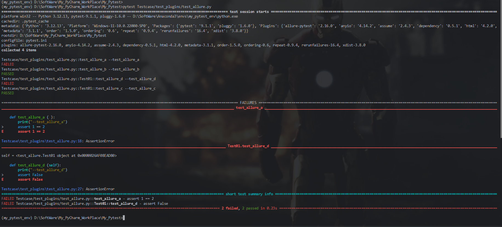

#### 3.1 运行测试并生成原始数据

```bash
pytest Testcase/test_plugins/test_allure.py --alluredir=./allure-results --clean-alluredir
```

`--alluredir` 参数指定测试结果数据的输出目录，Allure 会将每个测试用例的元信息、步骤、附件等以 JSON 格式保存到该目录下。

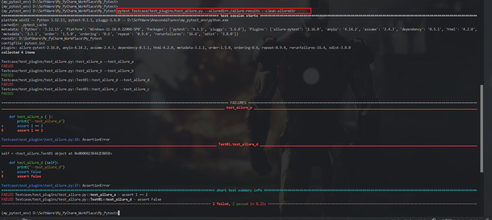

结果：生成测试元数据

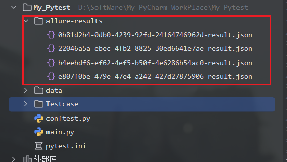

#### 3.2 生成并查看 HTML 报告

##### **方式一：`allure serve`（推荐）** —— 生成报告并自动在浏览器中打开（查看在线测试报告）：

```bashbash
allure serve allure-results
```

##### **方式二：`allure generate`** —— 仅生成报告，不自动打开：

```bash
## 生成报告
allure generate allure-results -o allure-report --clean

## 打开（也可以选择手动打开）
allure open allure-report
```

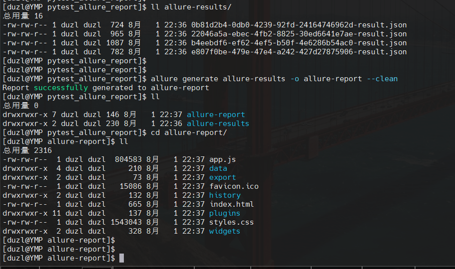

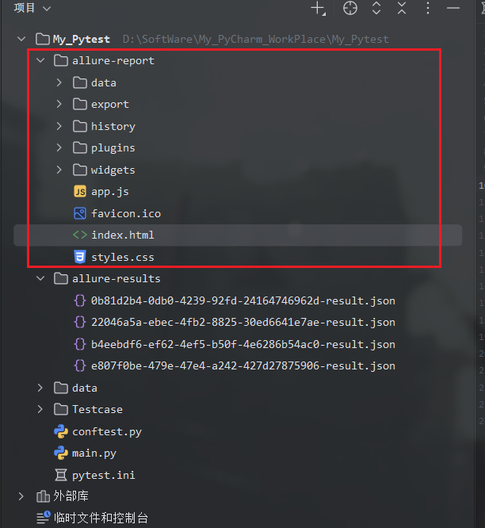

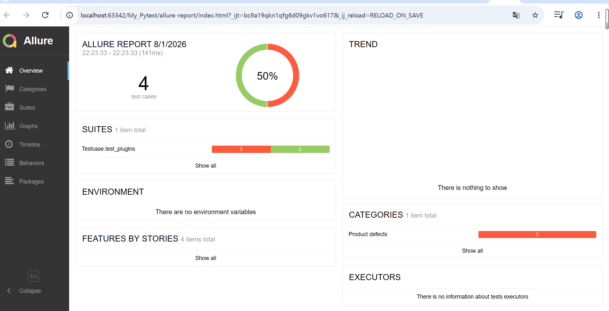

#### 3.3 allure报告结构

```python
class Test02:
    def test_allure_success(self):
        assert 1==1
 
    def test_allure_fail(self):
        assert 1==2
 
def test_allure_skip():
    pytest.skip("---skip")
 
@pytest.mark.xfail(1==1, reason="---xfail")
def test_allure_xfail():
    # pytest.xfail("---xfail")
    1==2
 
def test_allure_broken():
    raise Exception("---exception")
 
def test_allure_error():
    assert a=="asfssfcs"
```

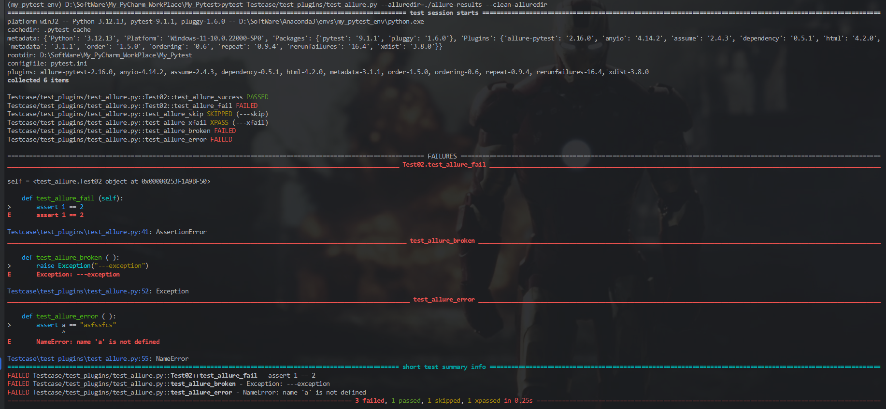

##### Overview

总览，包含用例数、各种结果统计、SUITES等


##### Categories

类别，默认情况下，有两类缺陷：

- Product defects，测试结果：failed
- Test defects，测试结果：error/broken

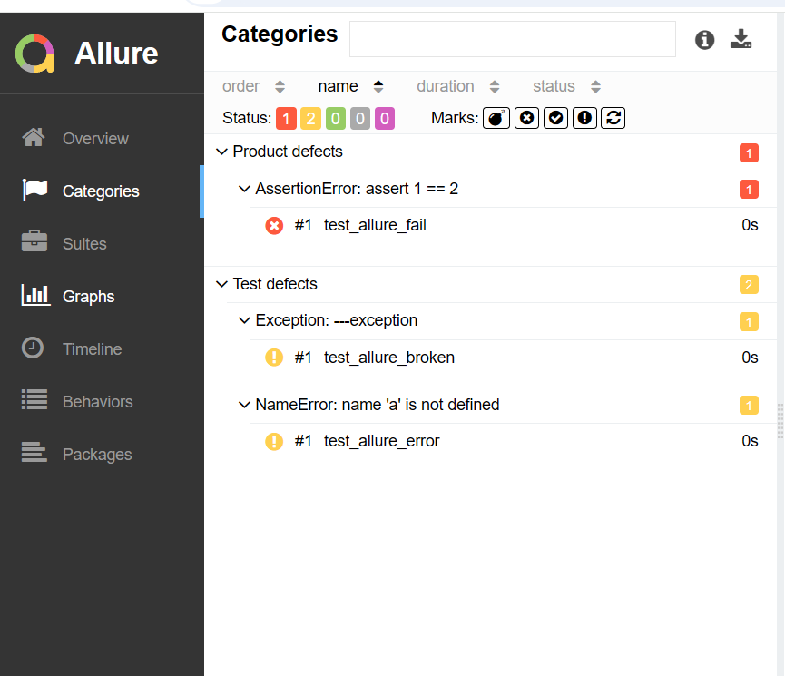


##### Suites

测试套件，所有用例的层级关系，可以根据package、module、类、方法、函数来查找用例

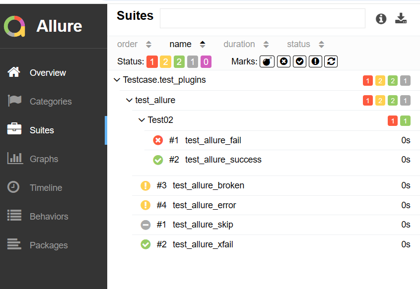

##### Graphs

测试结果图形化，包括用例执行结果的比例，不同优先级(severity)测试用例运行的统计数据，耗时等

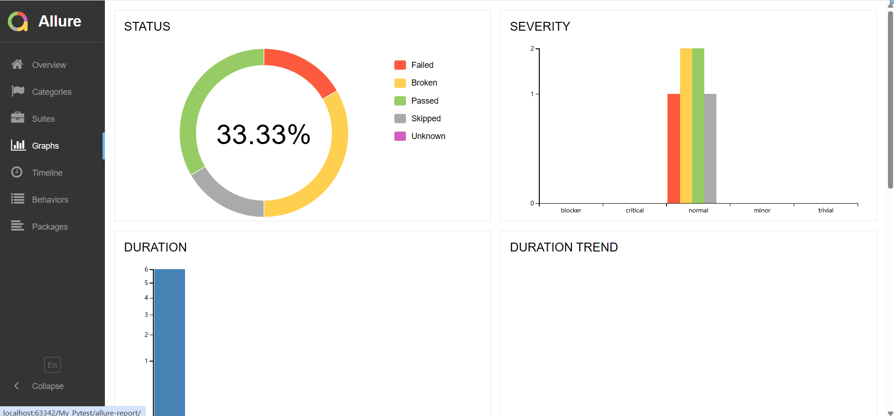

##### Timeline

测试用例的执行顺序及执行时间


##### Behaviors

行为驱动，根据epic、feature、story来对测试用例分组

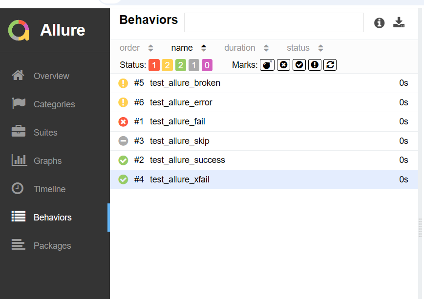

##### Packages

按照package、module来分组测试用例

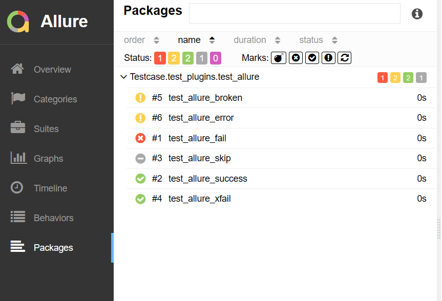


### 四、核心特性详解

Allure Pytest 不仅收集 pytest 标准功能提供的数据，还提供了额外特性来编写更优质的测试。其特性主要通过**装饰器**（静态声明）和**动态 API**（运行时设置）两种方式使用。

#### 常用装饰器

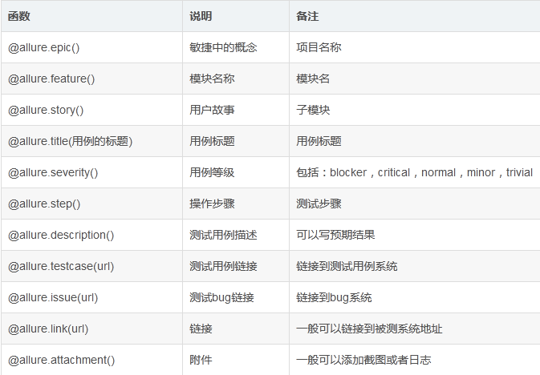

说明：

- feature和story类似于父子关系
- 如果不加 @allure.feature、@allure.story，在Behaviors下测试用例就不会分类显示
- 如果没有添加 @allure.title() ，测试用例的标题默认就是函数名

#### 4.1 测试元数据（Metadata）

##### （1）标题（Title）

为测试用例设置自定义标题，支持参数化值的动态替换：

```python
import allure
import pytest

class Test03:
    # 静态方式：使用装饰器
    @allure.title("测试用户登录功能")
    def test_login(self):
        pass

    # 参数化测试中动态替换标题
    @pytest.mark.parametrize("username", ["admin", "guest"])
    @allure.title("登录测试 - 用户 {username}")
    def test_login_with_params(self,username):
        pass

    # 动态方式：在函数体内设置
    def test_dynamic_title(self):
        allure.dynamic.title("动态设置的测试标题")
        assert True
```

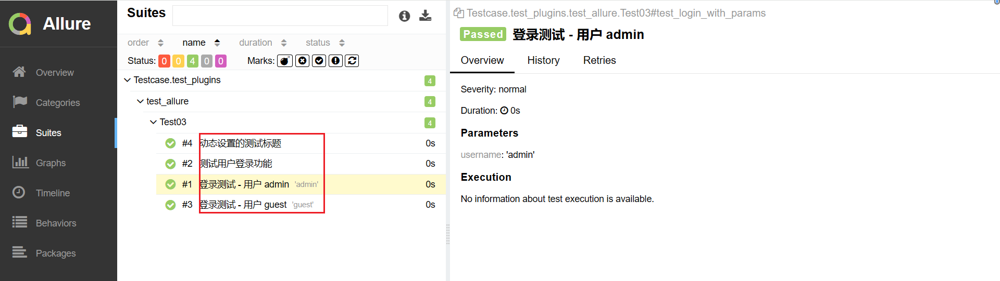

##### （2）描述（Description）

为测试用例添加详细描述，支持 **Markdown 格式**：

```python
import allure

class Test04:
    @allure.description("""
    # 登录功能测试

    ## 测试步骤
    1. 打开登录页面
    2. 输入用户名和密码
    3. 点击登录按钮

    ## 预期结果
    登录成功，跳转到首页
    """)
    def test_login_description (self):
        pass

    # 动态方式
    def test_dynamic_description (self):
        allure.dynamic.description("测试失败时截图保存")
        assert True
```

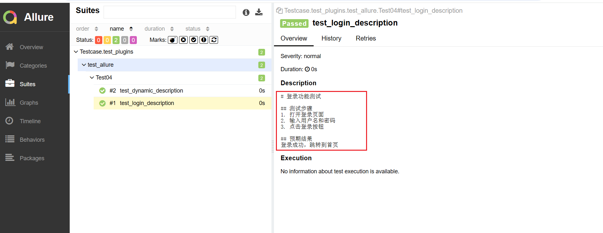

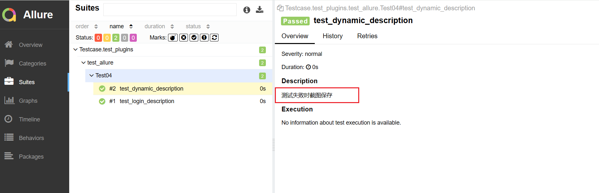

##### （3）标签（Tag）

为测试用例添加分类标签，便于筛选和分组：

```python
import allure

class Test05:
    @allure.tag("冒烟测试", "回归测试", "登录模块")
    def test_login (self):
        pass
```

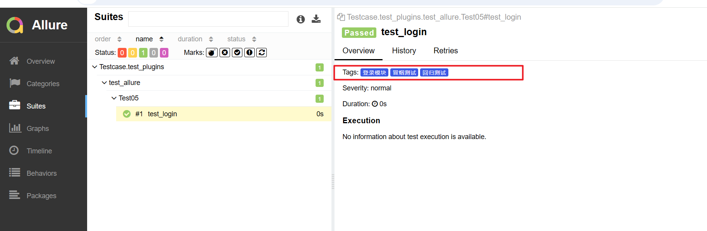

##### （4）严重级别（Severity）

标记测试用例的重要程度，便于优先关注关键问题：

```python
import allure
from allure_commons.types import Severity

class Test06:
    @allure.severity(Severity.CRITICAL)
    def test_critical_function(self):
        pass

    @allure.severity(Severity.BLOCKER)
    def test_blocker_function(self):
        pass

    @allure.severity(Severity.MINOR)
    def test_minor_function(self):
        pass
```

可选级别：`trivial`、`minor`、`normal`、`critical`、`blocker`。

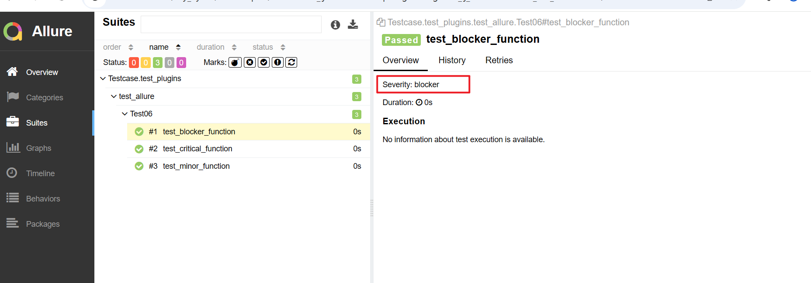

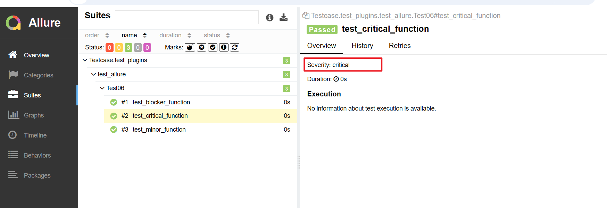

##### （5）链接（Link）

将测试用例与需求文档、Bug 追踪系统、TMS 等外部系统关联：

```python
import allure

class Test07:
    @allure.link("https://docs.example.com/api", name="API文档")
    @allure.issue("BUG-12345", name="关联缺陷")
    @allure.testcase("TC-67890", name="测试用例")
    def test_with_links(self):
        pass
```

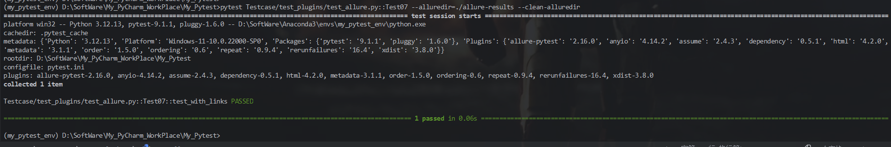

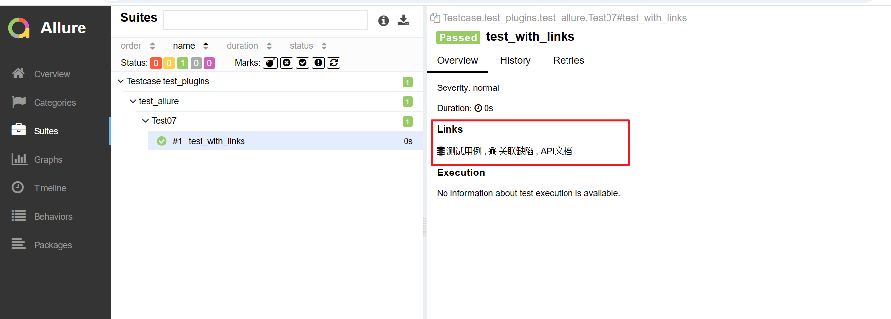

##### （6）自定义标签（Label）

使用 `@allure.label` 添加任意自定义元数据：

```python
import allure
from allure_commons.types import LabelType

class Test08:
    @allure.label(LabelType.LANGUAGE, "python")
    @allure.label(LabelType.FRAMEWORK, "pytest")
    @allure.label("owner", "测试团队")
    def test_with_custom_label (self):
        pass
```

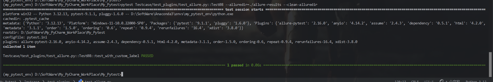

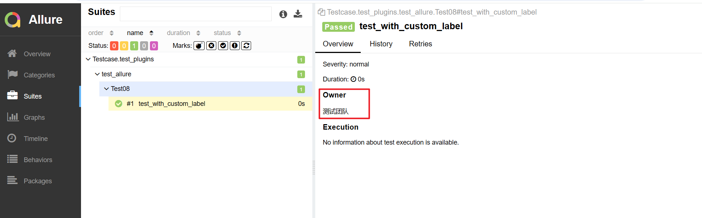

#### 4.2 测试组织（Organize Tests）

Allure 提供两套层级体系来组织测试报告。

##### （1）行为层级（Behavior-based Hierarchy）

按照 **Epic → Feature → Story** 三层结构组织测试：

```python
import allure

class Test09:
    @allure.epic("电商平台")
    @allure.feature("订单管理")
    @allure.story("创建订单")
    def test_create_order (self):
        pass

    @allure.epic("电商平台")
    @allure.feature("订单管理")
    @allure.story("取消订单")
    def test_cancel_order (self):
        pass
```

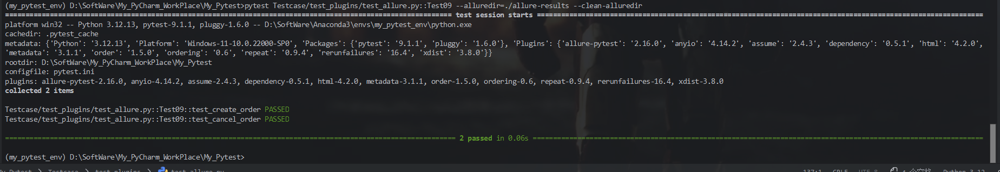

报告中将按照此层级展示测试用例的分布情况。

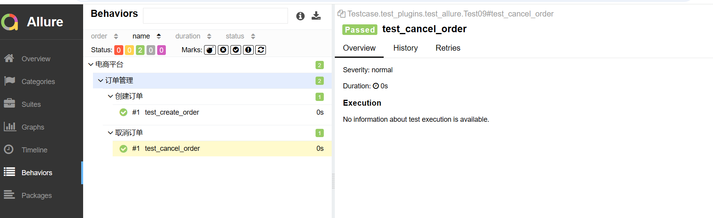

##### （2）套件层级（Suite-based Hierarchy）

按照 **Parent Suite → Suite → Sub-Suite** 组织：

```python
import allure

class Test10:
    @allure.parent_suite("Web接口测试")
    @allure.suite("用户模块")
    @allure.sub_suite("登录相关")
    def test_login_api (self):
        pass
```

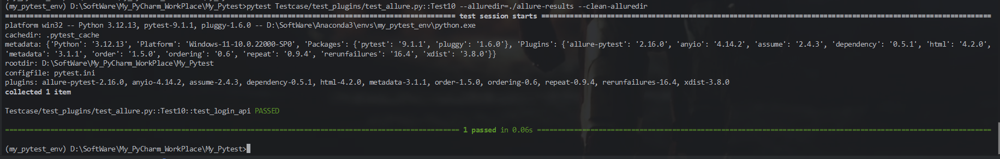

默认情况下，Allure Pytest 会根据测试所在的模块自动设置 parent_suite 和 suite

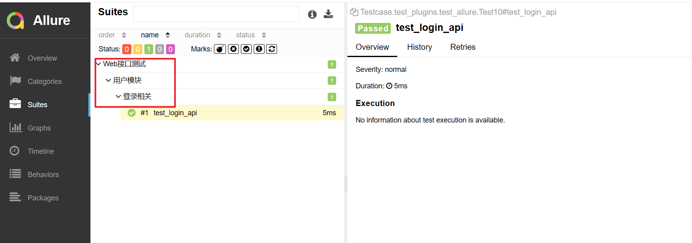

#### 4.3 测试步骤（Test Steps）

将测试用例拆分为多个步骤，让报告清晰展示每个步骤的执行情况。

##### （1）装饰器步骤（Decorated Steps）

```python
import allure

class TestShopping:
    @allure.step("步骤1：打开商品详情页")
    def open_product_page(self, product_id):
        print(f"打开商品 {product_id}")
    
    @allure.step("步骤2：点击加入购物车")
    def add_to_cart(self):
        print("加入购物车")
    
    @allure.step("步骤3：验证购物车数量")
    def verify_cart_count(self, expected):
        print(f"验证购物车数量为 {expected}")
    
    def test_shopping_flow(self):
        self.open_product_page("P001")
        self.add_to_cart()
        self.verify_cart_count(1)
```

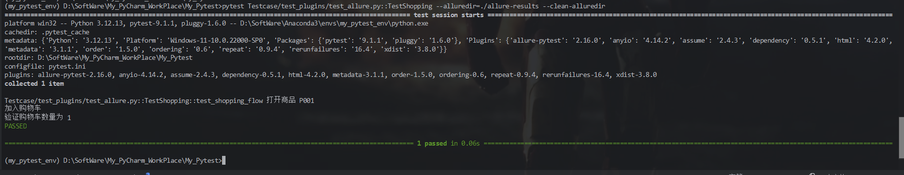

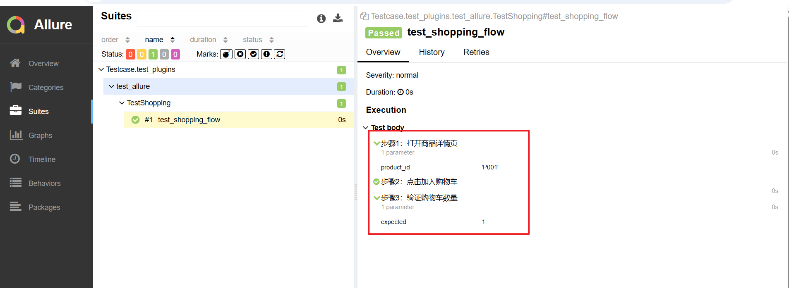

##### （2）上下文步骤（Context Steps）

使用 `with allure.step()` 创建步骤上下文：

```python
import allure

def test_login_flow():
    with allure.step("打开登录页面"):
        print("打开 https://example.com/login")
    
    with allure.step("输入用户名和密码"):
        print("输入 admin / 123456")
    
    with allure.step("点击登录按钮"):
        print("点击登录")
    
    with allure.step("验证登录成功"):
        assert True
```

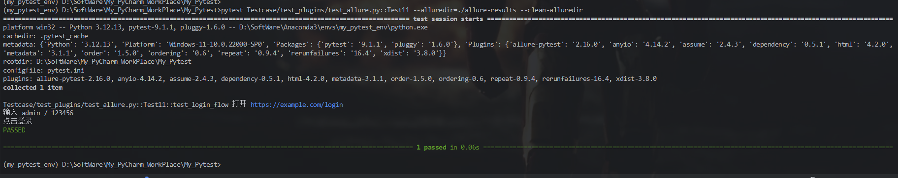

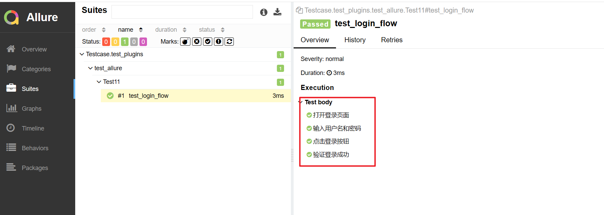

步骤标题支持参数值动态替换：

```python
@allure.step("用户 {username} 尝试登录")
def login_step(username, password):
    pass
```

#### 4.4 参数化测试（Parametrized Tests）

Allure 自动在报告中展示参数化测试的每个参数组合及其值。

```python
import allure
import pytest

class Test12:
    @pytest.mark.parametrize("username,password", [
        ("admin", "正确密码"),
        ("admin", "错误密码"),
    ])
    @allure.title("登录测试 - {username} / {password}")
    def test_login_parametrized (self, username, password):
        pass
```

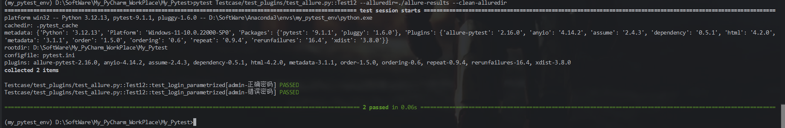

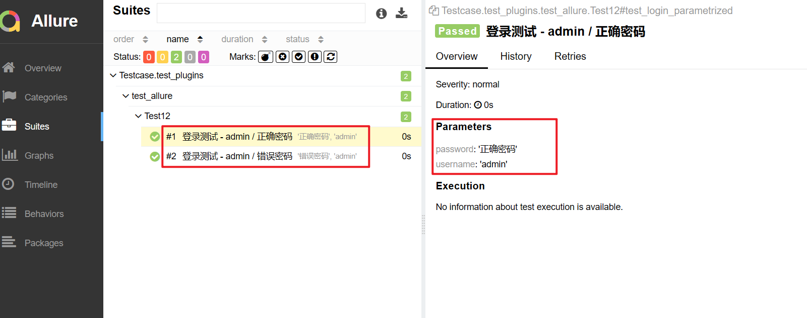

##### 动态添加参数

即使不使用 pytest 的参数化功能，也可以通过 `allure.dynamic.parameter()` 手动添加参数：

```python
import allure
from os.path import basename

class Test13:
    def test_with_dynamic_param (self):
        allure.dynamic.parameter("环境", "预发布环境")
        allure.dynamic.parameter("浏览器", "Chrome")
        assert True
```

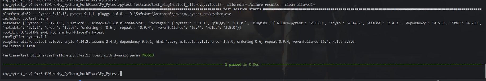

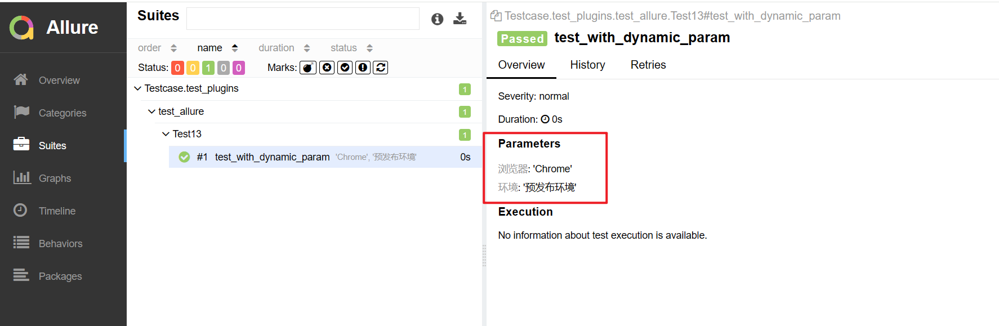

##### 敏感参数脱敏

对于密码、Token 等敏感参数，可以设置为 **MASKED**（隐藏值）或 **HIDDEN**（完全隐藏）：

```python
import allure
from allure_commons.types import ParameterMode

class Test14:
    def test_with_sensitive_param (self):
        allure.dynamic.parameter(
            "password",
            "********",
            mode=ParameterMode.MASKED
        )
        assert True
```

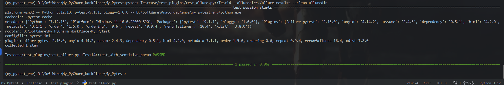

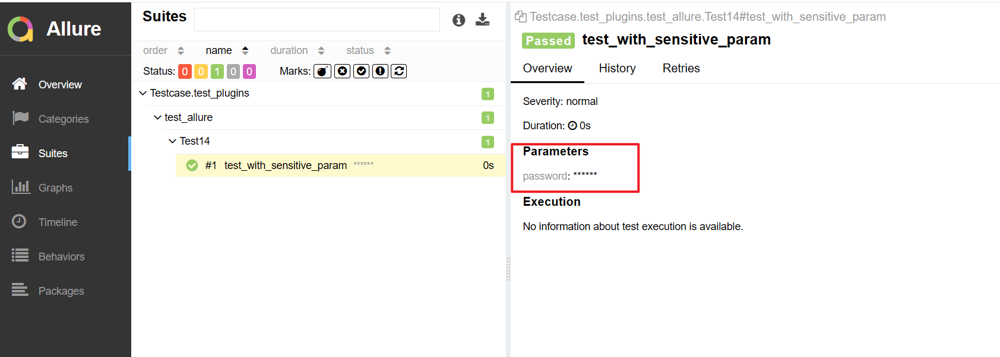

#### 4.5 Fixture 描述

为 pytest fixture 添加标题，让报告更清晰地展示 fixture 的作用：

```python
import allure
import pytest

class Test15:
    @pytest.fixture()
    @allure.title("准备测试数据 - 创建测试用户")
    def test_user (self):
        user = { "name": "test_user", "email": "test@example.com" }
        yield user
        # 清理操作

    def test_with_fixture (self, test_user):
        assert test_user["name"] == "test_user"
```

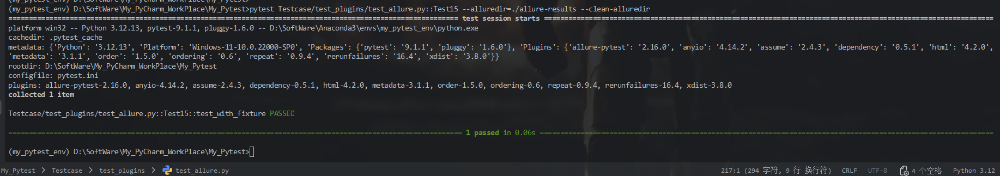

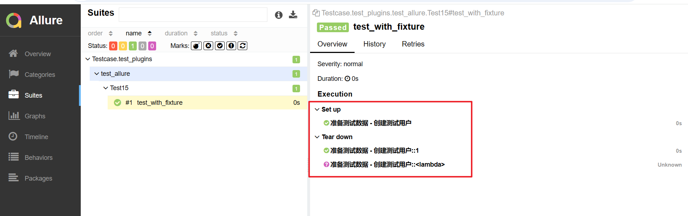

#### 4.6 附件（Attachments）

Allure 支持在测试报告中添加各种类型的附件，如截图、日志、JSON 数据等。

##### （1）从变量附加内容

使用 `allure.attach()` 从变量附加内容：

```python
import allure

class Test16:
    def test_with_attachments(self):
        # 附加文本
        allure.attach("这是一条日志信息", name="执行日志", attachment_type=allure.attachment_type.TEXT)

        # 附加 JSON
        import json
        data = { "status": "success", "code": 0 }
        allure.attach(
            json.dumps(data, indent=2),
            name="响应数据",
            attachment_type=allure.attachment_type.JSON
        )

        # 附加 HTML
        allure.attach(
            "<div style='color:green'>测试通过</div>",
            name="HTML片段",
            attachment_type=allure.attachment_type.HTML
        )

        assert True
```

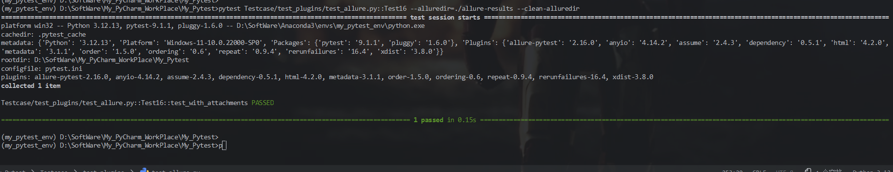

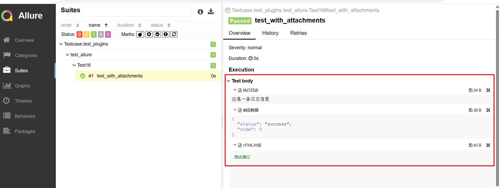

##### （2）从文件附加

使用 `allure.attach.file()` 从文件读取内容：

```python
import allure

class Test17:
    def test_with_file_attachment(self):
        # 附加截图文件
        allure.attach.file(
            "screenshot.png",
            name="页面截图",
            attachment_type=allure.attachment_type.PNG
        )

        # 附加日志文件
        allure.attach.file(
            "test.log",
            name="测试日志",
            attachment_type=allure.attachment_type.TEXT
        )
```

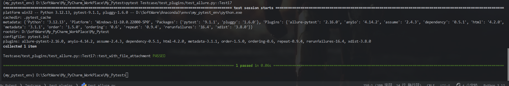


##### （3）UI 自动化中的截图

在 Selenium 或 Playwright 等 UI 自动化测试中，可以在关键步骤或失败时截图：

```python
import allure

def test_ui_with_screenshot(page):
    page.goto("https://example.com")
    
    # 操作后截图
    png_bytes = page.screenshot()
    allure.attach(
        png_bytes,
        name="登录后页面",
        attachment_type=allure.attachment_type.PNG
    )
    
    assert "欢迎" in page.text_content()
```


##### （4）默认捕获的输出

默认情况下，Allure Pytest 会自动捕获以下内容作为附件：

| 附件名称 | 内容                                |
| :------- | :---------------------------------- |
| `stdout` | `sys.stdout` 的输出（如 `print()`） |
| `stderr` | `sys.stderr` 的输出                 |
| `log`    | Python 标准 `logging` 模块的日志    |

可通过 `--allure-no-capture` 参数禁用此行为


#### 4.7 环境信息（Environment Information）

在报告首页展示测试执行的环境信息，便于问题复现。

在 `allure-results` 目录下创建 `environment.properties` 文件：

```properties
# environment.properties
Python_Version=3.12.4
OS=Ubuntu 22.04
Browser=Chrome 115.0
测试环境=预发布环境
构建编号=2026-07-23-001
```

### 五、高级用法

#### 5.1 测试选择（Test Selection via Test Plan）

通过 `ALLURE_TESTPLAN_PATH` 环境变量指定测试计划文件，pytest 将只运行文件中列出的测试：

```bash
export ALLURE_TESTPLAN_PATH=testplan.json
pytest --alluredir=allure-results
```

`testplan.json` 示例：

```json
{
  "tests": [
    {"id": "test_login"},
    {"id": "test_logout"}
  ]
}
```

#### 5.2 标记手工测试（Manual）

使用 `@allure.manual` 标记，告诉 Allure TestOps 将该测试结果作为手工测试用例处理：

```python
import allure

@allure.manual
def test_manual_case():
    # 此测试在 Allure TestOps 中将被标记为手工测试
    pass
```

#### 5.3 Allure ID（与 Allure TestOps 集成）

为测试用例设置唯一 ID，便于与 Allure TestOps 中的测试用例关联：

```python
import allure

@allure.id("123")
def test_with_allure_id():
    pass
```

### 六、Allure 与 pytest-html 对比

| 对比维度       | pytest-html              | Allure                                     |
| :------------- | :----------------------- | :----------------------------------------- |
| **报告美观度** | 简洁实用                 | 精美、可视化强                             |
| **元数据支持** | 有限（环境信息、额外列） | 丰富（标题、描述、标签、严重级别、链接等） |
| **测试步骤**   | 不支持                   | 支持多级步骤展示                           |
| **附件支持**   | 基础（extras）           | 强大（图片、JSON、HTML、日志等）           |
| **测试组织**   | 仅表格展示               | Epic/Feature/Story + Suite 多维度导航      |
| **参数化展示** | 基础                     | 自动展示每个参数组合，支持脱敏             |
| **历史趋势**   | 不支持                   | 支持（需配置）                             |
| **学习成本**   | 低                       | 中等（需学习装饰器体系）                   |
| **适用场景**   | 快速查看测试结果         | 深度测试分析、团队协作、CI/CD 集成         |

### 七、常用命令速查

| 场景                       | 命令                                                      |
| :------------------------- | :-------------------------------------------------------- |
| 运行测试并生成 Allure 数据 | `pytest --alluredir=allure-results`                       |
| 生成并打开报告             | `allure serve allure-results`                             |
| 仅生成报告（不打开）       | `allure generate allure-results -o allure-report`         |
| 打开已生成的报告           | `allure open allure-report`                               |
| 清理历史数据               | `allure generate --clean allure-results -o allure-report` |
| 禁用 stdout/stderr 捕获    | `pytest --alluredir=allure-results --allure-no-capture`   |

### 八、总结

allure-pytest 提供了以下核心能力：

| 能力             | 说明                                                       |
| :--------------- | :--------------------------------------------------------- |
| **丰富的元数据** | 通过装饰器为测试添加标题、描述、标签、严重级别、链接等     |
| **多维度组织**   | 支持 Epic/Feature/Story 行为层级和 Suite 套件层级          |
| **测试步骤分解** | 通过 `@allure.step` 和上下文步骤将测试拆分为清晰的执行步骤 |
| **参数化展示**   | 自动展示参数组合，支持敏感参数脱敏                         |
| **Fixture 描述** | 为 fixture 添加标题，让报告更清晰                          |
| **附件支持**     | 支持截图、JSON、HTML、日志等多种附件类型                   |
| **环境信息**     | 在报告首页展示测试执行环境                                 |
| **测试选择**     | 通过测试计划文件选择性执行测试                             |
| **CI/CD 集成**   | 支持与 Jenkins 等 CI 工具集成，自动生成和发布报告          |

