# 第十章 面向对象（上）

## 10.1 面向对象的基本概念

### 一、类与对象

#### 1.1 什么是类与对象

-   **类（Class）**：是对一类事物的抽象描述，定义了这类事物共有的属性（数据）和行为（方法）。类相当于“模板”或“蓝图”。
-   **对象（Object）**：是类的一个具体实例（instance）。对象拥有类所定义的属性和方法，并且每个对象都有自己独立的数据。

例如：

-   “狗”是一个类，它有属性：名字、年龄；有行为：叫、跑。
-   “旺财”是“狗”类的一个具体对象。

#### 1.2 定义类与创建对象

Python 使用 `class` 关键字定义类，类名通常采用大驼峰命名法。

```python
class Dog:
    # 类属性：所有实例共享
    species = "Canis lupus familiaris"

    # 构造方法：创建实例时自动调用
    def __init__(self, name, age):
        # 实例属性：每个实例独有
        self.name = name
        self.age = age

    # 实例方法
    def bark(self):
        return f"{self.name} 说：汪汪！"

# 创建对象（实例化）
d1 = Dog("旺财", 3)
d2 = Dog("来福", 5)

print(d1.name)        # 旺财
print(d2.name)        # 来福
print(d1.bark())      # 旺财 说：汪汪！
print(Dog.species)    # Canis lupus familiaris
print(d1.species)     # Canis lupus familiaris
```

**代码解析：**

| 代码                             | 说明                                                 |
| :------------------------------- | :--------------------------------------------------- |
| `class Dog:`                     | 定义一个名为 `Dog` 的类                              |
| `species = "..."`                | 类属性，属于类本身，所有实例共享                     |
| `def __init__(self, name, age):` | 构造方法，创建实例时自动调用，用于初始化实例属性     |
| `self.name = name`               | 将参数 `name` 绑定到当前实例的 `name` 属性上         |
| `self`                           | 表示当前实例对象，由 Python 自动传入，不需要手动传递 |
| `d1 = Dog("旺财", 3)`            | 创建 `Dog` 的实例，自动调用 `__init__`               |
| `d1.bark()`                      | 调用实例方法，`self` 自动绑定为 `d1`                 |

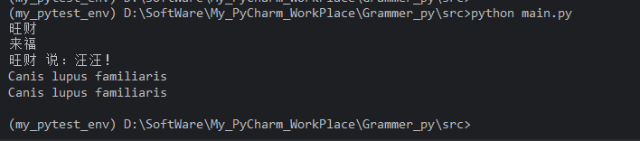

#### 1.3 `self` 是什么？

`self` 是实例方法的第一个参数，代表调用该方法的实例对象本身。Python 在调用实例方法时，会自动把实例作为第一个参数传入。

```python
class Person:
    def __init__(self, name):
        self.name = name

    def greet(self):
        return f"你好，我是 {self.name}"

p = Person("Alice")
print(p.greet())  # 你好，我是 Alice
```

等价于：

```python
print(Person.greet(p))  # 你好，我是 Alice
```

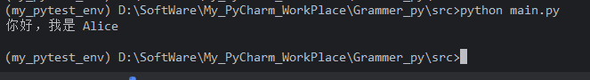

#### 1.4 类对象与实例对象

在 Python 中，类本身也是一个对象（类对象），而通过类创建出来的对象称为实例对象。

```python
class MyClass:
    pass

print(type(MyClass))      # <class 'type'>
print(type(MyClass()))    # <class '__main__.MyClass'>
```

-   `MyClass` 是类对象，它的类型是 `type`。
-   `MyClass()` 创建了一个实例对象。

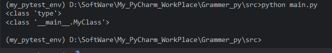

每个对象都有自己的 `__dict__`，用于存储属性：

```python
class Dog:
    species = "犬科"

    def __init__(self, name):
        self.name = name

d = Dog("旺财")
print(d.__dict__)      # {'name': '旺财'}
print(Dog.__dict__)    # 包含 species、__init__ 等类级别内容
```

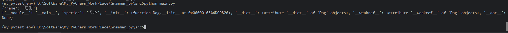


### 二、属性与方法

#### 2.1 实例属性与类属性

**实例属性**：定义在 `__init__` 或其他实例方法中，通过 `self.属性名` 赋值。每个实例独立拥有。

**类属性**：定义在类体中，不在任何方法内。所有实例共享同一份。

```python
class Student:
    school = "第一中学"          # 类属性

    def __init__(self, name, score):
        self.name = name         # 实例属性
        self.score = score       # 实例属性

s1 = Student("小明", 90)
s2 = Student("小红", 95)

print(s1.school)   # 第一中学
print(s2.school)   # 第一中学
print(Student.school)  # 第一中学

# 修改类属性
Student.school = "第二中学"
print(s1.school)   # 第二中学
print(s2.school)   # 第二中学

# 给实例单独设置同名属性，会遮蔽类属性
s1.school = "第三中学"
print(s1.school)   # 第三中学
print(s2.school)   # 第二中学
print(Student.school)  # 第二中学
```

**属性查找顺序**：实例 `__dict__` → 类 `__dict__` → 父类 `__dict__`。

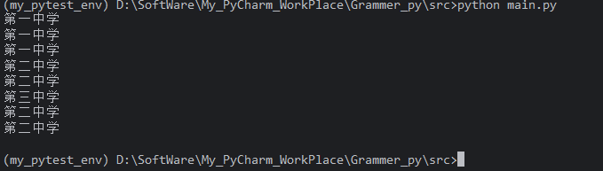

#### 2.2 方法

Python 中的方法主要分为三种：实例方法、类方法、静态方法。

##### 2.2.1 实例方法

最常用，第一个参数为 `self`，可以访问实例属性和类属性。

-   最普通的方法，定义时第一个参数必须是 `self`（名称约定，代表实例本身）。
-   不需要任何装饰器。

###### 调用

-   通过**实例**调用：`obj.instance_method(10)`，Python 自动将 `obj` 作为 `self` 传入。
-   通过**类**调用：`MyClass.instance_method(obj, 10)`，需要手动传入实例。

###### 访问权限

-   可以访问**实例属性**（`self.attr`）。
-   可以访问**类属性**（`self.__class__.attr` 或 `MyClass.attr`）。
-   可以修改实例状态。

###### 使用场景

-   需要操作或读取实例特有的数据时。

```python
class Circle:
    pi = 3.14159

    def __init__(self, radius):
        self.radius = radius

    def area(self):
        return self.pi * self.radius ** 2

c = Circle(5)
print(c.area())  # 78.53975
```

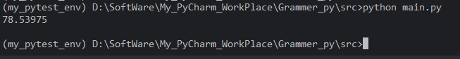

##### 2.2.2 类方法

使用 `@classmethod` 装饰，第一个参数为 `cls`，表示类本身。常用于定义备选构造函数或操作类属性。

-   使用 `@classmethod` 装饰器。
-   第一个参数必须是 `cls`（名称约定，代表类本身）。

###### 调用

-   通过**类**调用：`MyClass.class_method(10)`，Python 自动将 `MyClass` 作为 `cls` 传入。
-   通过**实例**调用：`obj.class_method(10)`，Python 自动将 `obj.__class__`（即所属类）作为 `cls` 传入。

###### 访问权限

-   可以访问**类属性**（`cls.class_attr`）。
-   不能直接访问**实例属性**（因为没有实例引用），但可以通过 `cls` 创建新实例或接收实例参数。
-   可以修改类级别状态。

###### 使用场景

-   工厂方法：根据不同的输入创建类的实例。
-   操作类级别的配置或计数器。
-   在继承中实现多态：`cls` 始终是实际调用的类，而非定义时的类。

```python
class Circle:
    pi = 3.14159

    def __init__(self, radius):
        self.radius = radius

    @classmethod
    def from_diameter(cls, diameter):
        return cls(diameter / 2)

c = Circle.from_diameter(10)
print(c.radius)  # 5.0
```

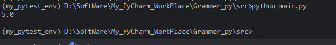

##### 2.2.3 静态方法

使用 `@staticmethod` 装饰，不需要 `self` 或 `cls`，本质上是定义在类命名空间中的普通函数。

-   使用 `@staticmethod` 装饰器。
-   不需要 `self` 或 `cls` 参数，参数列表与普通函数完全一致。

###### 调用

-   通过**类**调用：`MyClass.static_method(10)`。
-   通过**实例**调用：`obj.static_method(10)`。
-   **不会自动传入任何特殊参数**（既不是实例也不是类）。

###### 访问权限

-   不能访问实例属性或类属性（除非显式通过类名访问，如 `MyClass.class_attr`）。
-   本质上就是一个普通函数，只是放在类的命名空间中。

###### 使用场景

-   工具函数：逻辑上属于这个类，但不依赖类或实例的状态。
-   例如：数据验证、格式转换、辅助计算等。

```python
class MathUtils:
    @staticmethod
    def add(a, b):
        return a + b

print(MathUtils.add(3, 5))  # 8
```

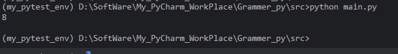

##### ⭐三种方法对比

| 特性         | 实例方法                              | 类方法                             | 静态方法                           |
| :----------- | :------------------------------------ | :--------------------------------- | :--------------------------------- |
| 装饰器       | 无                                    | `@classmethod`                     | `@staticmethod`                    |
| 第一个参数   | `self`（实例）                        | `cls`（类）                        | 无                                 |
| 自动传入     | 实例对象                              | 类对象                             | 无                                 |
| 调用方式     | `obj.method()` 或 `Class.method(obj)` | `Class.method()` 或 `obj.method()` | `Class.method()` 或 `obj.method()` |
| 访问实例属性 | ✅                                     | ❌（除非手动传入实例）              | ❌                                  |
| 访问类属性   | ✅（通过 `self.__class__` 或类名）     | ✅（通过 `cls`）                    | ❌（除非显式写类名）                |
| 继承行为     | 正常                                  | `cls` 是实际调用的类，支持多态     | 无多态，固定函数                   |
| 典型用途     | 操作实例状态                          | 工厂方法、类级别操作               | 工具函数、辅助逻辑                 |

#### 2.3 `@property`：把方法变成属性

`@property` 可以将方法伪装成属性，访问时不需要加括号，常用于封装 getter/setter。

```python
class Person:
    def __init__(self, name, age):
        self.name = name
        self._age = age      # 受保护属性

    @property
    def age(self):
        return self._age

    @age.setter
    def age(self, value):
        if not isinstance(value, int):
            raise TypeError("年龄必须是整数")
        if value < 0:
            raise ValueError("年龄不能为负数")
        self._age = value

        
# 使用
p = Person("Alice", 25)
print(p.age)      # 25

# 如果直接通过实例修改类属性age,则会抛出ValueError。
p.age = -5      # 抛出 ValueError
```

解析：

-   @property 装饰器将 age 方法变成一个属性描述符。这意味着：
-   当外部代码读取 p.age 时，Python 会自动调用这个 age 方法，并返回其返回值。
-   不需要加括号，像访问普通属性一样。
-   这个方法返回 self._age，即受保护的实际存储值。
-   此时 age 是一个只读属性（如果没有定义 setter，尝试赋值会抛 AttributeError）。

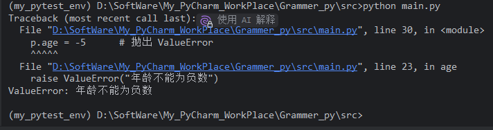

可以在类外调用 setter方法 修改类属性

```python
p.age = 30        # 调用 setter
print(p.age)      # 30
```

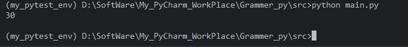

解析：

-   外部使用 `p.age` 就像访问普通属性，但内部执行的是方法。
-   `@age.setter` 是 `@property` 的配套装饰器，用于定义**设置属性值**时执行的逻辑。`@age.setter` 定义了赋值时的逻辑，可以进行数据校验。
-   装饰器名必须与 getter 方法名相同（这里是 `age`）。
-   当外部代码执行 `p.age = 某个值` 时，Python 会自动调用这个 setter 方法，并将赋值右侧的值作为 `value` 传入。
-   方法内部进行校验：
    1.  `isinstance(value, int)`：检查是否为整数，不是则抛出 `TypeError`。
    2.  `value < 0`：检查是否为负数，是则抛出 `ValueError`。
    3.  校验通过后，将值赋给 `self._age`，完成实际存储。
-   通过这种方式，外部无法绕过校验直接修改 `_age`（除非直接操作 `_age`，但按约定不应这样做）。

#### 2.4 私有属性与名称改写

Python 没有真正的私有成员，但可以通过命名约定实现“受保护”和“私有”。

-   `_attr`：单下划线，约定为受保护属性，提示外部不要直接访问。
-   `__attr`：双下划线，会触发**名称改写**（name mangling），变成 `_类名__attr`。

```python
class Employee:
    def __init__(self, name, salary):
        self.name = name
        self.__salary = salary   # 私有属性

    def get_salary(self):
        return self.__salary

    def set_salary(self, value):
        if value < 0:
            raise ValueError("工资不能为负")
        self.__salary = value

e = Employee("Bob", 10000)
print(e.get_salary())        # 10000
# print(e.__salary)          # AttributeError
print(e._Employee__salary)   # 10000（仍可强制访问，但不推荐）
```

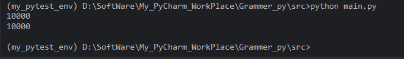

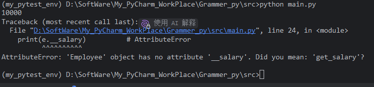


### 三、封装、继承、多态

面向对象三大特性：封装、继承、多态。

#### 3.1 封装

**封装**：将数据（属性）和操作数据的方法（行为）包装在类中，并控制外部对内部数据的访问。

**目的**：

-   隐藏实现细节
-   防止外部随意修改内部数据
-   提供统一的访问接口

**实现方式**：

-   使用 `_` 和 `__` 命名约定
-   使用 `@property` 提供 getter/setter
-   提供公开方法操作私有属性

```python
class BankAccount:
    def __init__(self, owner, balance=0):
        self.owner = owner
        self.__balance = balance   # 私有属性

    def deposit(self, amount):
        if amount <= 0:
            raise ValueError("存款金额必须大于 0")
        self.__balance += amount

    def withdraw(self, amount):
        if amount > self.__balance:
            raise ValueError("余额不足")
        self.__balance -= amount

    @property
    def balance(self):
        return self.__balance

account = BankAccount("Alice", 1000)
account.deposit(500)
account.withdraw(200)

## 通过@property将类方法balance伪装成属性，在类外可以直接访问。
print(account.balance)  # 1300
```

外部不能直接修改 `__balance`，只能通过 `deposit`、`withdraw` 等方法操作，保证了数据安全。

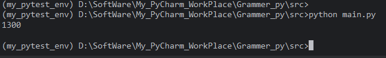

#### 3.2 继承

**继承**：子类可以继承父类的属性和方法，从而实现代码复用和扩展。

##### 3.2.1 单继承

```python
class Animal:
    def __init__(self, name):
        self.name = name

    def speak(self):
        raise NotImplementedError("子类必须实现 speak 方法")

    def intro(self):
        return f"我是 {self.name}"

class Dog(Animal):
    def speak(self):
        return "汪汪"

class Cat(Animal):
    def speak(self):
        return "喵喵"

d = Dog("旺财")
c = Cat("咪咪")

print(d.intro())   # 我是 旺财
print(d.speak())   # 汪汪
print(c.speak())   # 喵喵
```

-   `Dog` 和 `Cat` 继承自 `Animal`。
-   它们自动拥有 `intro` 方法。
-   `speak` 在父类中抛出 `NotImplementedError`，要求子类必须重写。

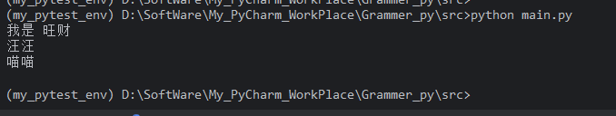

##### 3.2.2 `super()` 调用父类方法

子类可以通过 `super()` 调用父类的方法，常用于扩展父类初始化逻辑。

```python
class Puppy(Dog):
    def __init__(self, name, age):
        super().__init__(name)   # 调用 Dog 的 __init__，进而调用 Animal 的 __init__
        self.age = age

    def speak(self):
        return "呜呜"

p = Puppy("小旺", 1)
print(p.intro())   # 我是 小旺
print(p.speak())   # 呜呜
print(p.age)       # 1
```

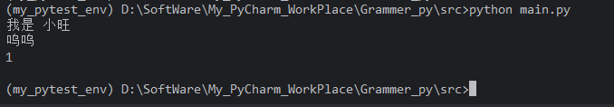

##### 3.2.3 方法重写

子类定义与父类同名的方法，会覆盖父类方法。

```python
class Animal:
    def __init__(self, name):
        self.name = name

    def speak(self):
        raise NotImplementedError("子类必须实现 speak 方法")

    def intro(self):
        return f"我是 {self.name}"
      
class Cat(Animal):
    def speak(self):
        return "喵喵"

class Cat(Animal):
    def speak(self):
        return "喵喵喵"

c = Cat("咪咪")

print(c.intro())
print(c.speak())
```

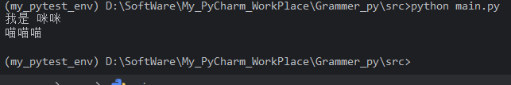


##### 3.2.4 多继承与 MRO

Python 支持多继承，即一个类可以继承多个父类。

```python
class A:
    def hello(self):
        return "A"

class B(A):
    def hello(self):
        return "B"

class C(A):
    def hello(self):
        return "C"

class D(B, C):
    pass

d = D()
print(d.hello())   # B
print(D.mro())     # [D, B, C, A, object]
```

**MRO（Method Resolution Order）**：方法解析顺序，决定了多继承时调用哪个父类的方法。Python 使用 C3 线性化算法，可以通过 `类名.mro()` 或 `类名.__mro__` 查看。

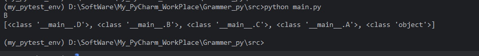

###### 代码解析

-   `A` 是基类，定义了 `hello` 返回 `"A"`。
-   `B` 继承 `A`，重写 `hello` 返回 `"B"`。
-   `C` 继承 `A`，重写 `hello` 返回 `"C"`。
-   `D` 继承 `B` 和 `C`（注意顺序：`B` 在前，`C` 在后），没有定义自己的 `hello`。

执行时：

-   `d = D()` 创建 `D` 的实例。
-   `d.hello()` 需要在 `D` 及其父类中查找 `hello` 方法。
-   查找顺序由 `D` 的 MRO 决定。

调用结果：

 `d.hello()` 返回 `"B"`

当调用 `d.hello()` 时，Python 按照 MRO 顺序查找 `hello` 方法：

1.  `D` 中没有定义 `hello` → 跳过。
2.  `B` 中定义了 `hello`，返回 `"B"` → 找到，停止查找并调用。
3.  因此输出 `"B"`。

虽然 `C` 也定义了 `hello`，但由于 `B` 在 MRO 中排在 `C` 前面，所以 `B` 的方法优先。


###### MRO（方法解析顺序）

Python 使用 **C3 线性化算法** 来确定 MRO。对于 `D(B, C)`，计算过程如下：

a) 各个类的 MRO

-   `A` 的 MRO：`[A, object]`
-   `B` 的 MRO：`[B, A, object]`
-   `C` 的 MRO：`[C, A, object]`

b) 计算 `D` 的 MRO

`D` 的 MRO 是 `D` 加上 `merge(L(B), L(C), [B, C])`：

```text
L(D) = D + merge([B, A, object], [C, A, object], [B, C])
```

**merge 算法**：依次从各个列表的头部选取一个元素，要求该元素不能出现在其他列表的非头部位置（即尾部），否则跳过，取下一个列表的头部。重复直到所有列表为空。

-   第一个列表头部是 `B`，检查 `B` 是否在其他列表的尾部：
    -   第二个列表 `[C, A, object]` 中没有 `B`。
    -   第三个列表 `[B, C]` 中 `B` 是头部，不是尾部。
    -   所以 `B` 可选，取出 `B`。
-   剩余：`merge([A, object], [C, A, object], [C])`
-   第一个列表头部是 `A`，检查 `A`：
    -   第二个列表 `[C, A, object]` 中 `A` 在第二个位置，不是尾部（尾部是 `object`），但算法要求候选元素不能出现在任何列表的**非头部位置**。这里 `A` 在第二个列表的非头部位置，所以 `A` 不能选。
    -   跳过第一个列表，看第二个列表头部 `C`：`C` 在第三个列表 `[C]` 中是头部，在其他列表中也没有出现在非头部位置。所以 `C` 可选，取出 `C`。
-   剩余：`merge([A, object], [A, object], [])`
-   现在两个列表头部都是 `A`，`A` 没有出现在其他列表的非头部位置，取出 `A`。
-   最后取出 `object`。

所以 `D` 的 MRO 为：

```
[<class '__main__.D'>, <class '__main__.B'>, <class '__main__.C'>, <class '__main__.A'>, <class 'object'>][D, B, C, A, object]
```


##### 3.2.5 抽象基类

使用 `abc` 模块可以定义抽象基类，强制子类实现特定方法。

```python
from abc import ABC, abstractmethod

class Shape(ABC):
    @abstractmethod
    def area(self):
        pass

    @abstractmethod
    def perimeter(self):
        pass

class Rectangle(Shape):
    def __init__(self, width, height):
        self.width = width
        self.height = height

    def area(self):
        return self.width * self.height

    def perimeter(self):
        return 2 * (self.width + self.height)

# shape = Shape()  # TypeError: 不能实例化抽象类
rect = Rectangle(3, 4)
print(rect.area())       # 12
print(rect.perimeter())  # 14
```

结果：

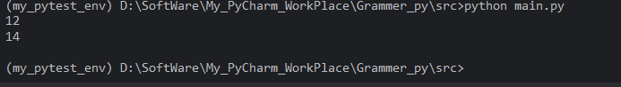

###### 继承抽象基类的子类，必须实现抽象基类中使用`@abstractmethod`修饰的基类方法，否则报错。

```python
from abc import ABC, abstractmethod

class Shape(ABC):
    @abstractmethod
    def area(self):
        pass

    @abstractmethod
    def perimeter(self):
        pass

class Rectangle(Shape):
    def __init__(self, width, height):
        self.width = width
        self.height = height

    # def area(self):
    #     return self.width * self.height
    # 
    # def perimeter(self):
    #     return 2 * (self.width + self.height)

rect = Rectangle(3, 4)
print(rect.area())      
print(rect.perimeter())  
```

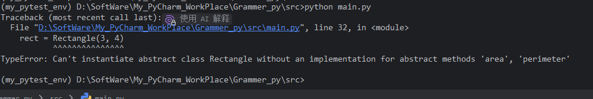

#### 3.3 多态

**多态**：不同类的对象对同一消息（方法调用）做出不同的响应。多态让程序具有更好的扩展性。

##### 3.3.1 通过方法重写实现多态

```python
class Animal:
    def speak(self):
        raise NotImplementedError

class Dog(Animal):
    def speak(self):
        return "汪汪"

class Cat(Animal):
    def speak(self):
        return "喵喵"

class Duck(Animal):
    def speak(self):
        return "嘎嘎"

def animal_sound(animal):
    print(animal.speak())

animal_sound(Dog())   # 汪汪
animal_sound(Cat())   # 喵喵
animal_sound(Duck())  # 嘎嘎
```

`animal_sound` 函数不关心传入的是哪种动物，只要它有 `speak` 方法，就能正确调用。这就是多态。

###### a) 代码解析：

-   `Animal` 是基类，定义了 `speak` 方法，但方法体抛出 `NotImplementedError`，表示子类必须重写该方法。
-   `Dog`、`Cat`、`Duck` 都继承 `Animal`，并分别重写了 `speak`，返回不同的字符串。
-   `animal_sound` 是一个普通函数，接收一个 `animal` 参数，并调用其 `speak()` 方法。

多态的字面意思是“多种形态”。在面向对象编程中，它指：

>   **同一个接口（方法名），在不同的对象上有不同的实现，调用时根据对象的实际类型执行对应的方法。**

在这段代码中：

-   接口是 `speak()`。
-   不同的对象（`Dog`、`Cat`、`Duck` 实例）对 `speak()` 有不同的实现。
-   `animal_sound` 函数只依赖于 `animal` 具有 `speak()` 方法，而不关心它具体是哪个类。

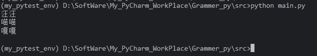

###### b) 运行过程分析

(1) 创建对象并传入函数

```python
animal_sound(Dog())
```

-   创建 `Dog` 实例。
-   调用 `animal_sound`，参数 `animal` 指向这个 `Dog` 实例。
-   在函数内部执行 `animal.speak()`。
-   Python 在运行时查找 `animal` 实际所属的类，发现是 `Dog`，于是调用 `Dog.speak()`。
-   返回 `"汪汪"`，打印输出。

类似地：

```python
animal_sound(Cat())   # animal 指向 Cat 实例，调用 Cat.speak() → "喵喵"
animal_sound(Duck())  # animal 指向 Duck 实例，调用 Duck.speak() → "嘎嘎"
```

(2) 动态绑定（后期绑定）

方法调用 `animal.speak()` 不是在编译时决定的，而是在**运行时**根据 `animal` 引用的对象类型动态解析。这称为**动态绑定**或**后期绑定**。

-   如果 `animal` 是 `Dog` 实例，就调用 `Dog.speak`。
-   如果 `animal` 是 `Cat` 实例，就调用 `Cat.speak`。
-   以此类推。


###### 小结：多态的关键点

| 要素     | 说明                                                 |
| :------- | :--------------------------------------------------- |
| 继承     | 子类继承基类，获得相同的接口（方法名）。             |
| 方法重写 | 子类重新定义基类的方法，提供自己的实现。             |
| 统一接口 | 调用者只通过基类或共同接口调用方法，不关心具体子类。 |
| 动态绑定 | 运行时根据对象实际类型选择方法。                     |

在上述代码中：

-   `Animal` 定义了统一接口 `speak`。
-   `Dog`、`Cat`、`Duck` 重写了 `speak`。
-   `animal_sound` 只调用 `speak`，不关心具体类型。
-   Python 在运行时动态决定调用哪个类的 `speak`。


##### 3.3.2 鸭子类型

Python 是动态类型语言，多态不依赖继承，而依赖“鸭子类型”：

>   如果它走起来像鸭子，叫起来也像鸭子，那么它就是鸭子。

```python
class Animal:
    def speak(self):
        raise NotImplementedError
        
class Duck:
    def speak(self):
        return "嘎嘎"

class Robot:
    def speak(self):
        return "滴滴"

def make_sound(obj):
    print(obj.speak())

make_sound(Duck())    # 嘎嘎
make_sound(Robot())   # 滴滴
```

`Robot` 并没有继承 `Animal`，但它实现了 `speak` 方法，因此也能被 `make_sound` 接受。

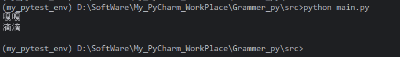

##### 3.3.3 多态与继承结合

多态通常与继承结合使用，父类定义接口，子类提供不同实现。

```python
class Payment:
    def pay(self, amount):
        raise NotImplementedError

class Alipay(Payment):
    def pay(self, amount):
        print(f"使用支付宝支付 {amount} 元")

class WeChatPay(Payment):
    def pay(self, amount):
        print(f"使用微信支付 {amount} 元")

def checkout(payment_method, amount):
    payment_method.pay(amount)

checkout(Alipay(), 100)      # 使用支付宝支付 100 元
checkout(WeChatPay(), 200)   # 使用微信支付 200 元
```

#### 综合示例：图书管理系统

下面用一个综合示例把类与对象、属性与方法、封装、继承、多态串起来。

```python
class Book:
    def __init__(self, title, author, isbn):
        self.title = title
        self.author = author
        self.__isbn = isbn          # 私有属性

    @property
    def isbn(self):
        return self.__isbn

    def info(self):
        return f"《{self.title}》- {self.author}"

class EBook(Book):
    def __init__(self, title, author, isbn, file_size):
        super().__init__(title, author, isbn)
        self.file_size = file_size

    def info(self):
        return f"{super().info()} [电子书, {self.file_size}MB]"

class AudioBook(Book):
    def __init__(self, title, author, isbn, duration):
        super().__init__(title, author, isbn)
        self.duration = duration

    def info(self):
        return f"{super().info()} [有声书, {self.duration}分钟]"

def print_book_info(book):
    print(book.info())

books = [
    Book("Python编程", "张三", "978-1"),
    EBook("流畅的Python", "李四", "978-2", 15),
    AudioBook("算法导论", "王五", "978-3", 600),
]

for b in books:
    print_book_info(b)
```

**解析：**

-   `Book` 是父类，封装了 `__isbn` 私有属性，并提供 `isbn` 属性访问。
-   `EBook` 和 `AudioBook` 继承 `Book`，通过 `super().__init__` 初始化父类部分。
-   子类重写 `info` 方法，实现多态。
-   `print_book_info` 接收任意 `Book` 子类对象，调用其 `info` 方法，表现出不同行为。

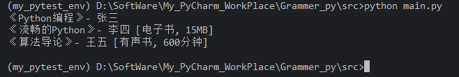

### 四、小结

| 概念       | 核心要点                                                     |
| :--------- | :----------------------------------------------------------- |
| 类与对象   | 类是模板，对象是实例；`__init__` 初始化；`self` 代表实例     |
| 属性与方法 | 实例属性独立，类属性共享；实例方法、类方法、静态方法；`@property` 将方法变为属性 |
| 封装       | 隐藏内部细节，控制访问；`_` 约定受保护，`__` 名称改写，`@property` 提供安全接口 |
| 继承       | 子类复用父类代码；`super()` 调用父类；多继承与 MRO；抽象基类强制接口 |
| 多态       | 同一接口，不同实现；方法重写；鸭子类型；运行时动态绑定       |


## 10.2 类的定义与实例化

### 一、类的定义

#### 1.1 基本语法

使用 `class` 关键字定义类，类名通常采用**大驼峰命名法**（每个单词首字母大写）。

```python
class MyClass:
    """这是一个简单的类示例。"""
    pass
```

-   `class MyClass:`：定义名为 `MyClass` 的类。
-   `"""..."""`：可选的文档字符串，描述类的用途，可通过 `MyClass.__doc__` 访问。
-   `pass`：占位语句，表示类体为空。

#### 1.2 类体：属性与方法

类体中可以定义**类属性**和**方法**。

```python
class Dog:
    # 类属性：所有实例共享
    species = "Canis lupus familiaris"

    # 构造方法：实例化时自动调用
    def __init__(self, name, age):
        # 实例属性：每个实例独有
        self.name = name
        self.age = age

    # 实例方法
    def bark(self):
        return f"{self.name} 说：汪汪！"
```

**解析：**

| 组成部分                         | 说明                                                         |
| :------------------------------- | :----------------------------------------------------------- |
| `species = "..."`                | 类属性，定义在类体中，不在任何方法内，属于类本身，所有实例共享。 |
| `def __init__(self, name, age):` | 构造方法，创建实例时自动调用，用于初始化实例属性。           |
| `self.name = name`               | 将参数绑定到当前实例的 `name` 属性上。                       |
| `self.age = age`                 | 同上。                                                       |
| `def bark(self):`                | 实例方法，第一个参数必须是 `self`，代表调用该方法的实例。    |

#### 1.3 类属性的特点

-   类属性属于类，不属于任何实例。
-   可以通过 `类名.属性` 或 `实例.属性` 访问。
-   所有实例共享同一份类属性。
-   如果实例对类属性赋值，会在实例中创建一个同名属性，从而“遮蔽”类属性。

```python
class Dog:
    # 类属性：所有实例共享
    species = "Canis lupus familiaris"

    # 构造方法：实例化时自动调用
    def __init__(self, name, age):
        # 实例属性：每个实例独有
        self.name = name
        self.age = age

    # 实例方法
    def bark(self):
        return f"{self.name} 说：汪汪！"

d1 = Dog("旺财", 3)
d2 = Dog("来福", 5)

print(Dog.species)   # Canis lupus familiaris
print(d1.species)    # Canis lupus familiaris
print(d2.species)    # Canis lupus familiaris

d1.species = "犬科"  # 给实例 d1 创建同名实例属性
print(d1.species)    # 犬科
print(d2.species)    # Canis lupus familiaris（不受影响）
print(Dog.species)   # Canis lupus familiaris（类属性未变）
```

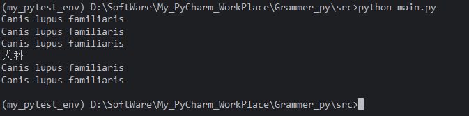

### 二、实例化

#### 2.1 创建实例

实例化就是调用类对象，创建该类的具体对象。

```python
d = Dog("旺财", 3)
```

-   `Dog("旺财", 3)` 会触发实例化流程。
-   返回一个 `Dog` 类的实例，赋值给变量 `d`。

#### 2.2 `__init__` 初始化方法

`__init__` 是实例方法，在实例创建后自动调用，用于初始化实例属性。

```python
class Person:
    def __init__(self, name, age):
        self.name = name
        self.age = age

p = Person("Alice", 25)
print(p.name)  # Alice
print(p.age)   # 25
```

-   `__init__` 的第一个参数是 `self`，由 Python 自动传入新创建的实例。
-   后续参数由实例化时传递。
-   `__init__` **不能有返回值**（或只能返回 `None`），否则会引发 `TypeError`。

#### 2.3 `__new__` 构造方法

`__new__` 是真正的构造方法，负责**创建并返回实例**。它是在 `__init__` 之前被调用的。

```python
class MyClass:
    def __new__(cls, *args, **kwargs):
        print("__new__ 被调用")
        instance = super().__new__(cls)
        return instance

    def __init__(self, value):
        print("__init__ 被调用")
        self.value = value

obj = MyClass(10)
```

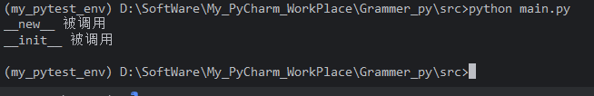

**解析：**

| 方法       | 作用       | 调用时机                 | 返回值           |
| :--------- | :--------- | :----------------------- | :--------------- |
| `__new__`  | 创建实例   | 实例化时最先调用         | 必须返回实例对象 |
| `__init__` | 初始化实例 | `__new__` 返回实例后调用 | 必须返回 `None`  |

**大多数情况下不需要重写 `__new__`**，除非需要控制实例的创建过程（如单例模式、不可变类型子类等）。

#### 2.4 实例化完整流程

当执行 `obj = MyClass(args)` 时，Python 内部大致执行以下步骤：

1.  查找 `MyClass` 的 `__new__` 方法（通常继承自 `object`）。
2.  调用 `__new__(cls, *args, **kwargs)`，传入类对象和参数，返回一个新实例。
3.  如果 `__new__` 返回的是 `cls` 的实例，则调用 `__init__(self, *args, **kwargs)` 进行初始化。
4.  如果 `__new__` 返回的不是 `cls` 的实例，则不会调用 `__init__`。
5.  返回最终实例。

```python
class Demo:
    def __new__(cls, *args, **kwargs):
        print("执行 __new__")
        return super().__new__(cls)

    def __init__(self, x):
        print("执行 __init__")
        self.x = x

d = Demo(5)
```

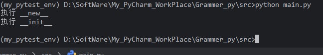


## 10.3 实例属性与类属性

### 3.1 定义与区别

-   **实例属性**：在 `__init__` 或其他实例方法中通过 `self.属性名` 赋值。每个实例独立拥有。
-   **类属性**：直接在类体中定义，属于类，所有实例共享。

```python
class Student:
    school = "第一中学"          # 类属性

    def __init__(self, name, score):
        self.name = name         # 实例属性
        self.score = score       # 实例属性
```

**区分：**

| 属性类型 | 定义位置             | 赋值方式           | 所属                 |
| :------- | :------------------- | :----------------- | :------------------- |
| 类属性   | 类体中，方法外       | `属性名 = 值`      | 类本身，所有实例共享 |
| 实例属性 | 通常在 `__init__` 中 | `self.属性名 = 值` | 每个实例独立         |


### 3.2 存储位置：`__dict__`

每个类和每个实例都有自己的 `__dict__` 字典，用于存储属性。

-   实例属性存储在实例的 `__dict__` 中。
-   类属性存储在类的 `__dict__` 中。
-   实例的 `__dict__` 只包含实例自己的属性，不包含类属性。

```python
class Dog:
    species = "犬科"

    def __init__(self, name):
        self.name = name

d1 = Dog("旺财")
d2 = Dog("来福")

print(d1.__dict__)        # {'name': '旺财'}
print(d2.__dict__)        # {'name': '来福'}
print(Dog.__dict__)       # 包含 species、__init__ 等类级别内容
```

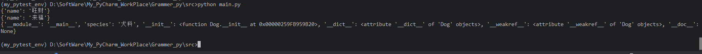


### 3.2 属性访问顺序

当访问 `实例.属性` 时，Python 的查找顺序为：

1.  实例的 `__dict__`（实例属性）
2.  类的 `__dict__`（类属性）
3.  父类的 `__dict__`
4.  如果都没找到，抛出 `AttributeError`

```python
class Dog:
    species = "犬科"

    def __init__(self, name):
        self.name = name

d = Dog("旺财")

print(d.name)      # 旺财（从实例 __dict__ 找到）
print(d.species)   # 犬科（从类 __dict__ 找到）
```

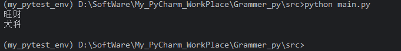

**注意**：实例属性会“遮蔽”同名的类属性。

```python
d.species = "猫科"   # 给实例 d 创建同名实例属性
print(d.species)     # 猫科（实例属性优先）
print(Dog.species)   # 犬科（类属性未变）
print(d.__dict__)    # {'name': '旺财', 'species': '猫科'}
```

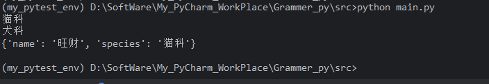

### 3.4 修改行为

-   修改类属性：`类名.属性 = 新值`，会影响所有实例（除非实例已遮蔽该属性）。
-   修改实例属性：`实例.属性 = 新值`，只影响该实例。

**（1）修改类属性**

通过 `类名.属性 = 新值` 修改类属性，会影响所有未遮蔽该属性的实例。

```python
class Student:
    school = "第一中学"

    def __init__(self, name):
        self.name = name

s1 = Student("小明")
s2 = Student("小红")

print(s1.school)   # 第一中学
print(s2.school)   # 第一中学

Student.school = "第二中学"
print(s1.school)   # 第二中学
print(s2.school)   # 第二中学
```

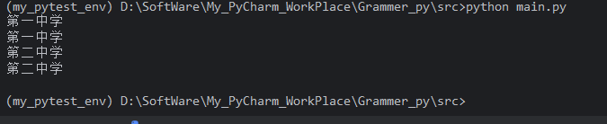

**（2）修改实例属性**

通过 `实例.属性 = 新值` 修改，只影响该实例，并会在实例 `__dict__` 中创建或更新该属性。

```python
s1 = Student("小明")
s2 = Student("小红")

Student.school = "第二中学"

s1.school = "第三中学"   # 给 s1 创建实例属性
print(s1.school)         # 第三中学
print(s2.school)         # 第二中学（不受影响）
print(Student.school)    # 第二中学（类属性未变）
```

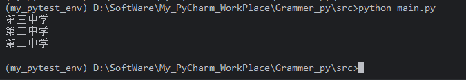

**（3）删除实例属性**

删除实例属性后，再次访问会回退到类属性。

```python
s1 = Student("小明")
s2 = Student("小红")

Student.school = "第二中学"

s1.school = "第三中学"   # 给 s1 创建实例属性

del s1.school
print(s1.school)   # 第二中学（恢复为类属性）
```

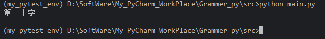


### 3.5 可变类属性的陷阱

如果类属性是可变对象（如列表、字典），所有实例共享同一份，修改会影响所有实例。

```python
class Bug:
    tricks = []   # 可变类属性

    def add_trick(self, trick):
        self.tricks.append(trick)

b1 = Bug()
b2 = Bug()
b1.add_trick("翻滚")
b2.add_trick("握手")
print(b1.tricks)  # ['翻滚', '握手']
print(b2.tricks)  # ['翻滚', '握手']
```

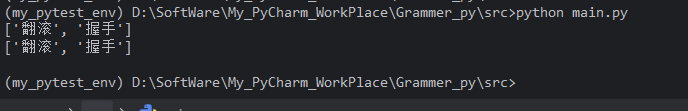

**正确做法**：将可变对象放在 `__init__` 中作为实例属性。

```python
class Fixed:
    def __init__(self):
        self.tricks = []   # 每个实例独立

    def add_trick(self, trick):
        self.tricks.append(trick)
        
b1 = Fixed()
b2 = Fixed()
b1.add_trick("翻滚")
b2.add_trick("握手")
print(b1.tricks)  # ['翻滚']
print(b2.tricks)  # ['握手']
```

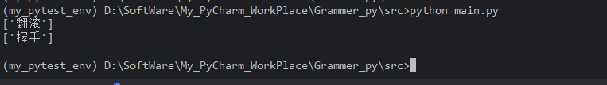

### 使用场景区别

| 场景                             | 推荐使用         | 理由                                                         |
| :------------------------------- | :--------------- | :----------------------------------------------------------- |
| 所有实例共享的常量、配置         | 类属性           | 只需一份，节省内存，修改方便                                 |
| 每个实例独有的状态（姓名、年龄） | 实例属性         | 每个对象独立，互不干扰                                       |
| 统计实例数量                     | 类属性           | 通过 `类名.计数器 += 1` 在 `__init__` 中累加                 |
| 可变集合（列表、字典）           | 实例属性         | 避免所有实例共享同一对象                                     |
| 默认值                           | 类属性或实例属性 | 若默认值不可变，可用类属性；若需每个实例独立修改，用实例属性 |

### 小结：类属性与实例属性的选择

| 特性         | 实例属性                             | 类属性                   |
| :----------- | :----------------------------------- | :----------------------- |
| 定义位置     | 通常在 `__init__` 中通过 `self` 赋值 | 类体中直接赋值           |
| 存储位置     | 实例的 `__dict__`                    | 类的 `__dict__`          |
| 所属         | 每个实例独立                         | 类本身，所有实例共享     |
| 访问顺序     | 优先于类属性                         | 实例属性不存在时访问     |
| 修改影响     | 只影响该实例                         | 影响所有未遮蔽的实例     |
| 可变对象陷阱 | 安全                                 | 共享，修改会影响所有实例 |
| 典型用途     | 对象独有状态                         | 常量、共享数据、计数器   |

**核心原则**：

-   如果数据是每个对象独有的，使用**实例属性**。
-   如果数据是所有对象共享的，使用**类属性**。
-   类属性中避免放置可变对象，除非你明确需要共享。
-   通过 `实例.属性 = 值` 会创建实例属性并遮蔽类属性，而不是修改类属性。
-   修改类属性应使用 `类名.属性 = 值`。


## 10.4 实例方法、类方法、静态方法

### 一、概述

| 方法类型 | 装饰器          | 第一个参数 | 绑定对象 | 调用方式                         |
| :------- | :-------------- | :--------- | :------- | :------------------------------- |
| 实例方法 | 无              | `self`     | 实例     | `实例.方法()` 或 `类.方法(实例)` |
| 类方法   | `@classmethod`  | `cls`      | 类       | `类.方法()` 或 `实例.方法()`     |
| 静态方法 | `@staticmethod` | 无         | 无       | `类.方法()` 或 `实例.方法()`     |

三种方法都定义在类体中，但它们的绑定对象和用途不同。

### 二、实例方法

#### 2.1 定义与特点

实例方法是最常见的方法。第一个参数必须是 `self`，代表调用该方法的实例对象。Python 在调用时自动将实例作为第一个参数传入。

-   可以访问和修改**实例属性**（通过 `self`）。
-   可以访问**类属性**（通过 `self.__class__` 或 `类名`）。
-   可以调用其他实例方法、类方法和静态方法。

#### 2.2 语法

```python
class Dog:
    species = "犬科"   # 类属性

    def __init__(self, name, age):
        self.name = name   # 实例属性
        self.age = age

    def bark(self):        # 实例方法
        return f"{self.name} 说：汪汪！"

    def get_species(self):
        return self.species   # 通过 self 访问类属性
```


#### 2.3 调用方式

```python
d = Dog("旺财", 3)

# 通过实例调用（推荐）
print(d.bark())           # 旺财 说：汪汪！
print(d.get_species())    # 犬科

# 通过类调用，需显式传入实例
print(Dog.bark(d))        # 旺财 说：汪汪！
```

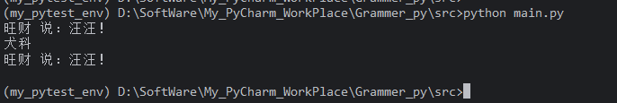

#### 2.4 代码详解

| 代码              | 说明                                       |
| :---------------- | :----------------------------------------- |
| `def bark(self):` | 定义实例方法，`self` 是第一个参数          |
| `self.name`       | 访问实例属性                               |
| `self.species`    | 访问类属性（实例没有 `species`，回退到类） |
| `d.bark()`        | Python 自动将 `d` 作为 `self` 传入         |
| `Dog.bark(d)`     | 通过类调用时需手动传入实例                 |

#### 2.5 实例方法访问类属性的两种方式

```python
class Counter:
    count = 0

    def increment(self):
        # 方式一：通过 self.__class__
        self.__class__.count += 1

        # 方式二：通过类名（硬编码，不利于继承）
        # Counter.count += 1
```

**推荐使用 `self.__class__` 或 `type(self)`**，因为子类调用时会动态绑定到子类。

### 三、类方法

#### 3.1 定义与特点

类方法使用 `@classmethod` 装饰，第一个参数是 `cls`，代表**类本身**（而不是实例）。

-   可以访问和修改**类属性**。
-   不能直接访问实例属性（因为没有实例引用）。
-   可以通过 `cls(...)` 创建实例。
-   常用于**备选构造函数**、**工厂方法**、**操作类状态**。

#### 3.2 语法

```python
class Person:
    count = 0   # 类属性

    def __init__(self, name, age):
        self.name = name
        self.age = age
        Person.count += 1

    @classmethod
    def from_birth_year(cls, name, birth_year):
        """备选构造函数"""
        age = 2025 - birth_year
        return cls(name, age)

    @classmethod
    def get_count(cls):
        """访问类属性"""
        return cls.count
```


#### 3.3 调用方式

```python
# 通过类调用（推荐）
p1 = Person.from_birth_year("Alice", 1995)
print(p1.age)   # 30

# 通过实例调用
p2 = Person("Bob", 25)
print(p2.get_count())   # 2
```

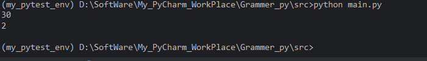

#### 3.4 代码详解

| 代码                            | 说明                                             |
| :------------------------------ | :----------------------------------------------- |
| `@classmethod`                  | 装饰器，声明类方法                               |
| `def from_birth_year(cls, ...)` | 第一个参数 `cls` 是类对象                        |
| `cls(name, age)`                | 调用构造函数创建实例，等价于 `Person(name, age)` |
| `cls.count`                     | 访问类属性                                       |
| `Person.from_birth_year(...)`   | 通过类名调用，`cls` 自动绑定为 `Person`          |

#### 3.5 类方法在继承中的动态绑定

类方法的核心优势是 `cls` 会动态绑定为实际调用时的类，这使得继承时行为正确。

```python
class Animal:
    species = "动物"

    @classmethod
    def identify(cls):
        print(f"我是 {cls.species}，类名是 {cls.__name__}")

class Dog(Animal):
    species = "犬科"

Animal.identify()   # 我是 动物，类名是 Animal
Dog.identify()      # 我是 犬科，类名是 Dog
```

**解析**：`Dog.identify()` 时，`cls` 自动绑定为 `Dog`，因此 `cls.species` 访问的是 `Dog.species`。如果用静态方法硬编码 `Animal.species`，就无法正确获取子类的属性。

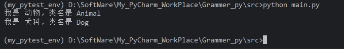

#### 3.6 类方法作为备选构造函数

这是类方法最常见的用途之一：

```python
class Date:
    def __init__(self, year, month, day):
        self.year = year
        self.month = month
        self.day = day

    @classmethod
    def from_string(cls, date_str):
        """从 '2025-01-15' 格式创建实例"""
        year, month, day = map(int, date_str.split('-'))
        return cls(year, month, day)

    @classmethod
    def today(cls):
        """从当前日期创建实例"""
        import datetime
        now = datetime.date.today()
        return cls(now.year, now.month, now.day)

d1 = Date(2025, 1, 15)
d2 = Date.from_string("2025-01-15")
d3 = Date.today()
```

**优势**：

-   提供了多种创建实例的方式，接口清晰。
-   使用 `cls` 而非硬编码类名，子类继承时也能正确创建子类实例。

### 四、静态方法

#### 4.1 定义与特点

静态方法使用 `@staticmethod` 装饰，不需要 `self` 或 `cls` 参数。它本质上就是一个定义在类命名空间中的普通函数。

-   不能访问实例属性。
-   不能访问类属性（除非通过类名显式访问）。
-   与类和实例没有绑定关系。
-   通常用于与类逻辑相关但不需要访问类或实例状态的**工具函数**。

#### 4.2 语法

```python
class MathUtils:
    @staticmethod
    def add(a, b):
        return a + b

    @staticmethod
    def is_even(n):
        return n % 2 == 0
```


#### 4.3 调用方式

```python
# 通过类调用（推荐）
print(MathUtils.add(3, 5))       # 8
print(MathUtils.is_even(4))      # True

# 通过实例调用（不推荐，但可行）
util = MathUtils()
print(util.add(2, 4))            # 6
```

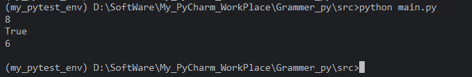

#### 4.4 代码详解

| 代码                  | 说明                               |
| :-------------------- | :--------------------------------- |
| `@staticmethod`       | 装饰器，声明静态方法               |
| `def add(a, b):`      | 没有 `self` 或 `cls`，就是普通函数 |
| `MathUtils.add(3, 5)` | 通过类名调用，不自动传递任何参数   |
| `util.add(2, 4)`      | 通过实例调用，但不会传入实例       |

#### 4.5 静态方法 vs 模块级函数

静态方法和模块级函数功能相似，区别在于：

-   静态方法定义在类命名空间内，通过类名访问，组织性更强。
-   模块级函数定义在模块命名空间内，通过模块名访问。
-   当函数与某个类逻辑紧密相关时，使用静态方法更合适。

```python
# 方式一：模块级函数
def is_valid_email(email):
    return "@" in email and "." in email

# 方式二：静态方法
class Validator:
    @staticmethod
    def is_valid_email(email):
        return "@" in email and "." in email
```


#### 4.6 静态方法不能访问类状态的原因

静态方法没有 `cls` 参数，因此无法动态获取调用时的类。如果硬编码类名，继承时会出现问题：

```python
class Base:
    value = 10

    @staticmethod
    def get_value():
        return Base.value   # 硬编码，子类无法覆盖

class Child(Base):
    value = 20

print(Child.get_value())   # 10（而不是 20）
```

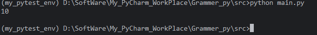

如果希望动态绑定类，应使用类方法：

```python
class Base:
    value = 10

    @classmethod
    def get_value(cls):
        return cls.value

class Child(Base):
    value = 20

print(Child.get_value())   # 20
```

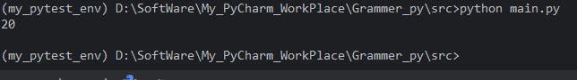


#### 4.7 继承中的行为差异

```python
class Base:
    class_attr = "Base"

    def instance_method(self):
        return f"实例方法: {self.__class__.__name__}"

    @classmethod
    def class_method(cls):
        return f"类方法: {cls.__name__}, class_attr={cls.class_attr}"

    @staticmethod
    def static_method():
        return "静态方法: 与类无关"

class Child(Base):
    class_attr = "Child"

c = Child()

print(c.instance_method())   # 实例方法: Child
print(c.class_method())      # 类方法: Child, class_attr=Child
print(c.static_method())     # 静态方法: 与类无关
```

**解析**：

-   实例方法的 `self` 是 `Child` 实例，因此 `self.__class__.__name__` 为 `Child`。
-   类方法的 `cls` 动态绑定为 `Child`，因此 `cls.class_attr` 为 `"Child"`。
-   静态方法不与类绑定，行为固定。

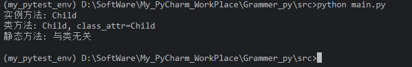


#### 4.8 综合演示

```python
class Temperature:
    unit = "摄氏度"   # 类属性

    def __init__(self, value):
        self.value = value   # 实例属性

    # 实例方法：操作实例属性
    def to_fahrenheit(self):
        return self.value * 9 / 5 + 32

    def describe(self):
        return f"{self.value} {self.unit}"

    # 类方法：备选构造函数
    @classmethod
    def from_fahrenheit(cls, f_value):
        c_value = (f_value - 32) * 5 / 9
        return cls(c_value)

    @classmethod
    def set_unit(cls, new_unit):
        cls.unit = new_unit

    # 静态方法：工具函数
    @staticmethod
    def is_freezing(celsius):
        return celsius <= 0

    @staticmethod
    def is_boiling(celsius):
        return celsius >= 100


# 实例方法
t1 = Temperature(25)
print(t1.describe())            # 25 摄氏度
print(t1.to_fahrenheit())       # 77.0

# 类方法作为备选构造函数
t2 = Temperature.from_fahrenheit(212)
print(t2.describe())            # 100.0 摄氏度

# 类方法修改类属性
Temperature.set_unit("℃")
print(t1.describe())            # 25 ℃（类属性已变）
print(t2.describe())            # 100.0 ℃

# 静态方法
print(Temperature.is_freezing(0))    # True
print(Temperature.is_boiling(100))   # True
```

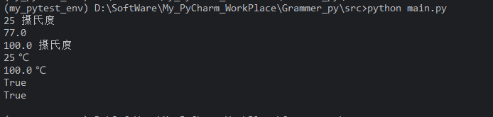

解析：

| 方法              | 类型     | 作用                            |
| :---------------- | :------- | :------------------------------ |
| `to_fahrenheit`   | 实例方法 | 使用 `self.value` 计算华氏度    |
| `describe`        | 实例方法 | 返回实例状态描述                |
| `from_fahrenheit` | 类方法   | 备选构造函数，用 `cls` 创建实例 |
| `set_unit`        | 类方法   | 修改类属性 `unit`               |
| `is_freezing`     | 静态方法 | 纯工具函数，不依赖类或实例状态  |
| `is_boiling`      | 静态方法 | 同上                            |


#### 三者对比表

| 特性         | 实例方法          | 类方法                       | 静态方法                     |
| :----------- | :---------------- | :--------------------------- | :--------------------------- |
| 装饰器       | 无                | `@classmethod`               | `@staticmethod`              |
| 第一个参数   | `self`（实例）    | `cls`（类）                  | 无                           |
| 自动传递参数 | 实例对象          | 类对象                       | 无                           |
| 访问实例属性 | 是                | 否                           | 否                           |
| 访问类属性   | 是（通过 `self`） | 是（通过 `cls`）             | 否（除非硬编码类名）         |
| 调用方式     | `实例.方法()`     | `类.方法()` 或 `实例.方法()` | `类.方法()` 或 `实例.方法()` |
| 继承动态绑定 | 是（`self`）      | 是（`cls`）                  | 否                           |
| 典型用途     | 操作实例状态      | 工厂方法、操作类状态         | 工具函数                     |

**选择原则**：

1.  需要操作实例数据 → 实例方法。
2.  需要操作类数据或创建实例 → 类方法。
3.  既不需要实例数据也不需要类数据，只是逻辑上属于该类 → 静态方法。


## 10.5 构造函数（**init**）与析构函数（**del**）

在 Python 面向对象编程中，`__init__` 和 `__del__` 是两个非常重要的特殊方法（魔术方法）。它们分别在对象的**创建**和**销毁**阶段被自动调用，用于初始化和清理资源。

### 一、构造函数 `__init__`

#### 1.1 定义与作用

`__init__` 是 Python 类的**初始化方法**，通常被称为“构造函数”。它的作用是在创建实例后，对实例属性进行初始化。

```python
class Person:
    def __init__(self, name, age):
        self.name = name
        self.age = age

p = Person("Alice", 25)
print(p.name)  # Alice
print(p.age)   # 25
```


#### 1.2 调用时机

当执行 `类名(参数)` 创建实例时，Python 会自动调用 `__init__` 方法。

具体流程：

1.  调用 `__new__` 创建实例（通常由 `object.__new__` 完成）。
2.  如果 `__new__` 返回的是该类的实例，则自动调用 `__init__`，并将实例作为第一个参数 `self` 传入。
3.  `__init__` 执行初始化逻辑。

```python
class Demo:
    def __new__(cls, *args, **kwargs):
        print("执行 __new__")
        return super().__new__(cls)

    def __init__(self, value):
        print("执行 __init__")
        self.value = value

d = Demo(10)
```

**输出：**

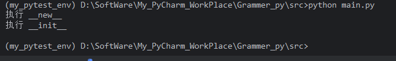


#### 1.3 参数与 `self`

-   `__init__` 的第一个参数必须是 `self`，代表当前创建的实例。
-   后续参数由实例化时传递，用于初始化实例属性。
-   `self` 由 Python 自动传入，不需要手动传递。

```python
class Point:
    def __init__(self, x, y):
        self.x = x
        self.y = y

p = Point(3, 4)   # self 自动绑定为 p，x=3，y=4
```


#### 1.4 返回值

`__init__` **必须返回 `None`**（或者不写 `return`，隐式返回 `None`）。如果返回其他值，会引发 `TypeError`。

```python
class Demo:
    def __new__(cls, *args, **kwargs):
        print("执行 __new__")
        return super().__new__(cls)

    def __init__(self, value):
        print("执行 __init__")
        self.value = value
        return 10  # TypeError: __init__() should return None

d = Demo(10)
```

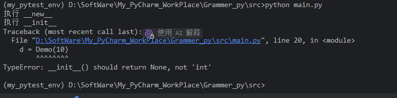

#### 1.5 与 `__new__` 的区别

| 特性         | `__new__`                        | `__init__`         |
| :----------- | :------------------------------- | :----------------- |
| 作用         | 创建并返回实例                   | 初始化实例         |
| 调用顺序     | 先调用                           | 后调用             |
| 第一个参数   | `cls`（类对象）                  | `self`（实例对象） |
| 返回值       | 必须返回实例                     | 必须返回 `None`    |
| 是否需要重写 | 通常不需要                       | 经常需要           |
| 典型用途     | 控制实例创建（单例、不可变类型） | 初始化实例属性     |

**注意**：如果 `__new__` 返回的不是当前类的实例，`__init__` 不会被调用。

```python
class A:
    def __new__(cls):
        return "我不是 A 的实例"

    def __init__(self):
        print("__init__ 被调用")   # 不会执行

a = A()
print(a)  # 我不是 A 的实例
```

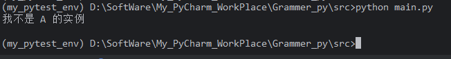

#### 1.6 继承中的 `__init__`

子类如果定义了自己的 `__init__`，需要显式调用父类的 `__init__`，否则父类的初始化逻辑不会执行。

```python
class Animal:
    def __init__(self, name):
        self.name = name

class Dog(Animal):
    def __init__(self, name, breed):
        super().__init__(name)   # 调用父类 __init__
        self.breed = breed

d = Dog("旺财", "金毛")
print(d.name)   # 旺财
print(d.breed)  # 金毛
```

**推荐使用 `super().__init__(...)`**，而不是 `Animal.__init__(self, ...)`，因为 `super()` 遵循 MRO，在多继承中更安全。

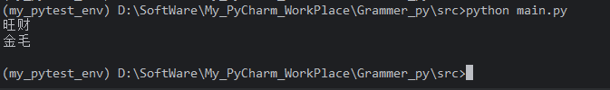

#### 1.7 默认参数与可变参数

```python
class Config:
    def __init__(self, name, options=None):
        self.name = name
        self.options = options if options is not None else {}

c1 = Config("A")
c2 = Config("B", {"debug": True})
```

**避免使用可变对象作为默认参数**：

```python
class Bad:
    def __init__(self, items=[]):   # 错误！所有实例共享同一个列表
        self.items = items
```


应改为：

```python
class Good:
    def __init__(self, items=None):
        self.items = items if items is not None else []
```


#### 1.8 示例：完整的构造函数

```python
class BankAccount:
    def __init__(self, owner, balance=0):
        self.owner = owner
        self.balance = balance
        self.transactions = []

    def deposit(self, amount):
        self.balance += amount
        self.transactions.append(("deposit", amount))

    def withdraw(self, amount):
        if amount > self.balance:
            raise ValueError("余额不足")
        self.balance -= amount
        self.transactions.append(("withdraw", amount))

account = BankAccount("Alice", 1000)
account.deposit(500)
account.withdraw(200)
print(account.balance)       # 1300
print(account.transactions)  # [('deposit', 500), ('withdraw', 200)]
```

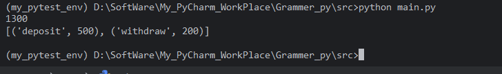

### 二、析构函数 `__del__`

#### 2.1 定义与作用

`__del__` 是 Python 类的**析构方法**，在对象被垃圾回收（销毁）时自动调用。它通常用于释放对象占用的资源，如关闭文件、断开网络连接、释放锁等。

```python
class Resource:
    def __init__(self, name):
        self.name = name
        print(f"资源 {self.name} 已创建")

    def __del__(self):
        print(f"资源 {self.name} 已销毁")

r = Resource("文件句柄")
del r   # 手动删除引用，触发 __del__
```

**输出：**

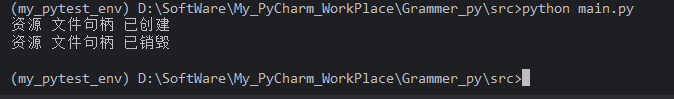

#### 2.2 调用时机

`__del__` 的调用时机**不确定**，由 Python 的垃圾回收机制决定。具体来说：

-   当对象的引用计数降为 0 时，对象会被立即回收，`__del__` 被调用。
-   如果对象存在循环引用，需要垃圾回收器（GC）介入，`__del__` 的调用时间不确定。
-   程序退出时，所有剩余对象会被回收，`__del__` 可能被调用，但顺序不确定。
-   如果解释器正在关闭，某些模块可能已被销毁，`__del__` 中访问全局变量可能失败。

**绝对不要依赖 `__del__` 来执行必须发生的清理操作**。


#### 2.3 引用计数与 `del` 语句

`del` 语句删除的是**变量名对对象的引用**，而不是对象本身。只有当引用计数为 0 时，对象才会被销毁。

```python
class Demo:
    def __del__(self):
        print("Demo 被销毁")

a = Demo()
b = a          # 引用计数为 2
del a          # 引用计数减为 1，__del__ 不会调用
del b          # 引用计数减为 0，__del__ 调用
```

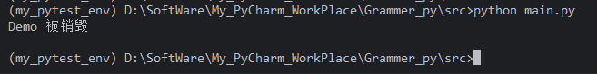

#### 2.4 循环引用问题

如果对象之间存在循环引用，即使没有外部引用，引用计数也不会降为 0，需要垃圾回收器处理。

```python
class Node:
    def __init__(self, name):
        self.name = name
        self.ref = None

    def __del__(self):
        print(f"Node {self.name} 被销毁")

a = Node("A")
b = Node("B")
a.ref = b
b.ref = a
del a
del b
# 此时两个对象互相引用，引用计数不为 0，__del__ 可能不会立即调用
# 垃圾回收器最终会处理，但时机不确定
```

**建议**：在 `__del__` 中避免创建新的循环引用，或使用 `weakref` 打破循环。


#### 2.5 `__del__` 中的异常

`__del__` 中抛出的异常**不会被传播**，而是被忽略，并打印到 `sys.stderr`。因为对象销毁时可能处于不稳定状态，抛出异常会导致不可预测的行为。

```python
class Bad:
    def __del__(self):
        raise Exception("析构异常")

b = Bad()
del b   # 异常被忽略，打印到 stderr
```

**因此，`__del__` 中的代码应尽量简单、安全，避免抛出异常。**

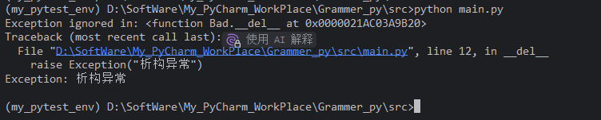


#### 2.6 `__del__` 与上下文管理器

由于 `__del__` 的不确定性，Python 提供了**上下文管理器**（`with` 语句）作为更可靠的资源清理方式。

```python
class Resource:
    def __init__(self, name):
        self.name = name
        print(f"资源 {self.name} 已打开")

    def __enter__(self):
        return self

    def __exit__(self, exc_type, exc_val, exc_tb):
        print(f"资源 {self.name} 已关闭")
        # 返回 False 表示不抑制异常

with Resource("文件") as r:
    print("正在使用资源")
# 离开 with 块时，__exit__ 一定被调用
```

**输出：**

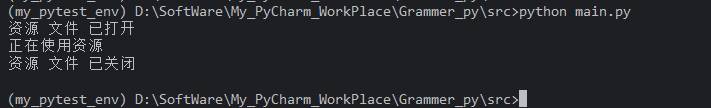

**对比**：

-   `__del__`：调用时机不确定，不适合管理必须释放的资源。
-   `__exit__`：由 `with` 语句保证调用，即使发生异常也会执行，是资源管理的推荐方式。

#### 2.7 示例：`__del__` 的正确使用场景

`__del__` 适合用于**调试、日志记录**或**最后的兜底清理**，而不应作为主要的资源释放手段。

```python
class Connection:
    def __init__(self, host):
        self.host = host
        self.connected = True
        print(f"连接到 {host}")

    def close(self):
        if self.connected:
            self.connected = False
            print(f"断开与 {self.host} 的连接")

    def __del__(self):
        # 仅作为兜底，提醒开发者忘记调用 close()
        if self.connected:
            print(f"警告：连接 {self.host} 未显式关闭！")
            self.close()
```

**使用建议**：显式调用 `close()` 或使用 `with` 语句，`__del__` 只作为安全网。


### 三、`__init__` 与 `__del__` 对比总结

| 特性       | `__init__`                          | `__del__`                             |
| :--------- | :---------------------------------- | :------------------------------------ |
| 别名       | 构造函数、初始化方法                | 析构函数                              |
| 调用时机   | 实例创建后自动调用                  | 对象被垃圾回收时调用                  |
| 确定性     | 确定（实例化时立即调用）            | 不确定（由 GC 决定）                  |
| 主要作用   | 初始化实例属性                      | 释放资源、清理操作                    |
| 参数       | `self` 及初始化参数                 | 仅 `self`                             |
| 返回值     | 必须返回 `None`                     | 无返回值要求                          |
| 是否可重写 | 是                                  | 是                                    |
| 继承       | 子类需显式调用 `super().__init__()` | 子类可重写，但通常不需要              |
| 异常处理   | 异常会传播                          | 异常被忽略                            |
| 替代方案   | 无                                  | 上下文管理器（`with`）、`try/finally` |


### 四、最佳实践

#### 4.1 构造函数 `__init__`

1.  **始终使用 `self` 作为第一个参数**。
2.  **不要在 `__init__` 中返回非 `None` 值**。
3.  **使用 `super().__init__()` 调用父类初始化**，尤其是在多继承中。
4.  **避免使用可变对象作为默认参数**，使用 `None` 作为占位符。
5.  **保持 `__init__` 简洁**，复杂的初始化可以拆分为工厂方法或类方法。
6.  **不要在 `__init__` 中执行耗时或可能失败的操作**，除非有明确的异常处理。

#### 4.2 析构函数 `__del__`

1.  **不要依赖 `__del__` 来释放关键资源**，应使用 `with` 语句或显式 `close()` 方法。
2.  **保持 `__del__` 简单**，避免抛出异常，避免访问可能已销毁的全局变量。
3.  **注意循环引用**，必要时使用 `weakref`。
4.  **`__del__` 中不要创建新的引用**，以免阻止对象被回收。
5.  **优先使用上下文管理器**（`__enter__` / `__exit__`）管理资源。


### 五、综合示例

```python
class FileHandler:
    def __init__(self, filename, mode='r'):
        self.filename = filename
        self.mode = mode
        self.file = None
        self._open()
        print(f"文件 {filename} 已打开")

    def _open(self):
        try:
            self.file = open(self.filename, self.mode)
        except IOError as e:
            print(f"打开文件失败: {e}")
            raise

    def read(self):
        if self.file:
            return self.file.read()
        return None

    def close(self):
        if self.file and not self.file.closed:
            self.file.close()
            print(f"文件 {self.filename} 已关闭")

    def __enter__(self):
        return self

    def __exit__(self, exc_type, exc_val, exc_tb):
        self.close()

    def __del__(self):
        # 兜底清理：如果用户忘记 close()
        if self.file and not self.file.closed:
            print(f"警告：文件 {self.filename} 未显式关闭，正在自动关闭...")
            self.close()

# 推荐用法：with 语句
with FileHandler("test.txt", "w") as f:
    f.file.write("Hello, World!")
# 离开 with 块，__exit__ 调用 close()

# 不推荐用法：依赖 __del__
fh = FileHandler("test.txt", "r")
data = fh.read()
# 忘记调用 fh.close()，依赖 __del__ 兜底（时机不确定）
```


## 10.6 属性访问控制

### 1、公有属性与私有属性（名称修饰）

#### 1.1 Python 的访问控制哲学

Python 不强制阻止外部访问内部属性，而是通过命名约定提示开发者“这是内部实现，请勿随意访问”。如果开发者执意访问，Python 也不会阻止。

Python 中的属性按命名分为三类：

| 命名方式   | 示例     | 约定含义                   | 外部可访问性                   |
| :--------- | :------- | :------------------------- | :----------------------------- |
| 公有属性   | `name`   | 公开接口                   | 完全可访问                     |
| 受保护属性 | `_name`  | 内部使用，提示不要直接访问 | 语法上可访问，靠约定           |
| 私有属性   | `__name` | 类内部使用，触发名称修饰   | 语法上可访问（被改名），靠约定 |

### 1.2 公有属性

公有属性是最普通的属性，没有下划线前缀，可以被外部自由访问和修改。

```python
class Person:
    def __init__(self, name, age):
        self.name = name   # 公有属性
        self.age = age     # 公有属性

p = Person("Alice", 25)
print(p.name)    # Alice
p.name = "Bob"   # 可直接修改
print(p.name)    # Bob
```

**特点**：

-   没有任何访问限制。
-   适合作为类的公开接口。
-   如果后续需要添加校验逻辑，可以改为 `property`，外部调用方式不变。


### 1.3 受保护属性（单下划线 `_`）

以单下划线开头的属性称为**受保护属性**。这是一种**命名约定**，表示“这是内部属性，不建议外部直接访问”，但 Python **不会**在语法上阻止访问。

```python
class Person:
    def __init__(self, name, age):
        self.name = name
        self._age = age   # 受保护属性

p = Person("Alice", 25)
print(p._age)    # 25（语法上可以访问，但不推荐）
p._age = 30      # 语法上可以修改，但不推荐
```

**特点**：

-   只是约定，没有强制力。
-   通常用于内部实现细节，或者希望子类可以访问但不希望外部直接访问的属性。
-   `from module import *` 时，以 `_` 开头的名称不会被导入（除非在 `__all__` 中显式列出）。


```python
# module.py
_private_var = 10
public_var = 20

# 另一个文件
from module import *
print(public_var)    # 20
# print(_private_var)  # NameError
```


### 1.4 私有属性（双下划线 `__`）与名称修饰

以双下划线开头（且不以双下划线结尾）的属性会触发 Python 的**名称修饰**（name mangling）机制：Python 会自动将其重命名为 `_类名__属性名`。

```python
class Person:
    def __init__(self, name, age):
        self.name = name
        self.__age = age   # 私有属性

p = Person("Alice", 25)

# 直接访问会失败
# print(p.__age)   # AttributeError: 'Person' object has no attribute '__age'

# 实际名称被改为 _Person__age
print(p._Person__age)   # 25（仍可强制访问，但不推荐）
```


**名称修饰的规则**：

-   在类定义中，任何形如 `__name` 的标识符（至少两个前导下划线，至多一个尾随下划线）会被文本替换为 `_类名__name`。
-   修饰只在**类定义体内**发生，不影响外部代码。

```python
class Demo:
    def __init__(self):
        self.__value = 42

    def get_value(self):
        return self.__value   # 类内部访问，自动修饰为 self._Demo__value

d = Demo()
print(d.get_value())        # 42（通过方法访问）
print(d._Demo__value)       # 42（强制访问）
print(d.__dict__)           # {'_Demo__value': 42}
```


### 1.5 名称修饰的目的

名称修饰的主要目的**不是**阻止外部访问，而是**避免子类意外覆盖父类的私有属性**。

python

```
class Base:
    def __init__(self):
        self.__value = "Base"

    def get_base_value(self):
        return self.__value

class Child(Base):
    def __init__(self):
        super().__init__()
        self.__value = "Child"   # 实际是 _Child__value，与父类的 _Base__value 不同

    def get_child_value(self):
        return self.__value

c = Child()
print(c.get_base_value())    # Base（父类方法访问的是 _Base__value）
print(c.get_child_value())   # Child（子类方法访问的是 _Child__value）
print(c.__dict__)            # {'_Base__value': 'Base', '_Child__value': 'Child'}
```


**关键点**：父类的 `__value` 和子类的 `__value` 被修饰为不同的名称，因此互不干扰。如果使用单下划线 `_value`，子类的赋值会覆盖父类的属性，可能导致意外的行为。

### 1.6 双下划线前后都有：魔术方法

如果名称以双下划线开头**且**以双下划线结尾（如 `__init__`、`__str__`、`__add__`），则**不会**触发名称修饰。这些是 Python 的**魔术方法**（dunder methods），由 Python 内部调用。

python

```
class Demo:
    def __init__(self):       # 不会修饰
        self.__value__ = 10   # 不会修饰（前后都有双下划线）

d = Demo()
print(d.__value__)   # 10
```


### 1.7 名称修饰的边界情况

python

```
class Demo:
    def __method(self):   # 方法名也会被修饰
        return "private method"

    def call_private(self):
        return self.__method()   # 内部调用，修饰为 self._Demo__method()

d = Demo()
print(d.call_private())        # private method
# d.__method()                 # AttributeError
print(d._Demo__method())       # private method（强制访问）
```


**注意**：名称修饰适用于属性名、方法名、类变量名等所有标识符。

### 1.8 访问控制总结

| 类型   | 命名       | 修饰行为             | 外部访问   | 继承影响                 |
| :----- | :--------- | :------------------- | :--------- | :----------------------- |
| 公有   | `name`     | 无                   | 自由访问   | 子类可直接覆盖           |
| 受保护 | `_name`    | 无                   | 约定不访问 | 子类可访问，可能覆盖     |
| 私有   | `__name`   | 修饰为 `_类名__name` | 需强制访问 | 子类无法覆盖（名称不同） |
| 魔术   | `__name__` | 无                   | 自由访问   | 通常不覆盖               |

**核心原则**：

-   单下划线是**约定**，双下划线是**名称修饰**。
-   两者都不是真正的访问限制，只是提示和避免冲突。
-   如果需要真正的访问控制，应使用 `property` 或自定义描述符。

-   公有属性与私有属性（名称修饰）
-   property装饰器与属性管理


## 10.7 继承


-   单继承
-   方法重写（override）
-   super()函数


## 10.8 多继承与MRO（方法解析顺序）


## 10.9 抽象基类（abc模块）

