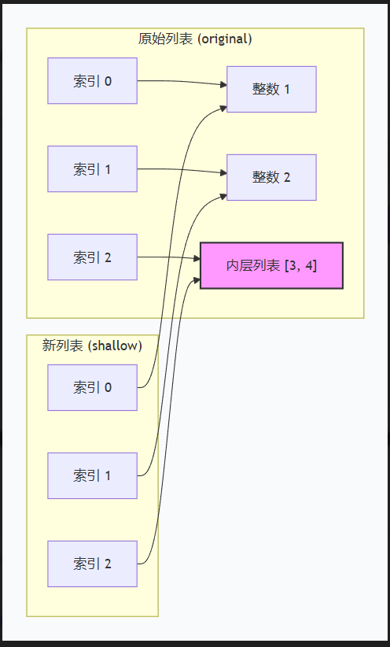
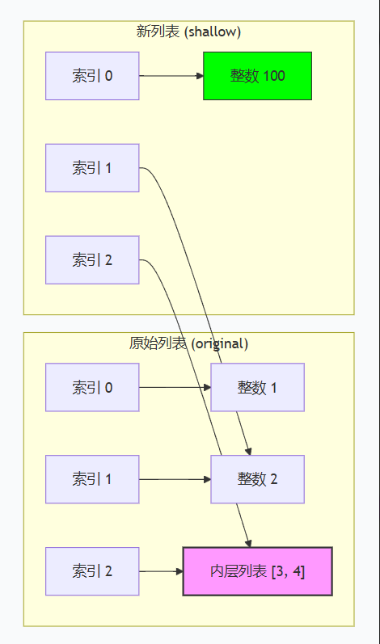
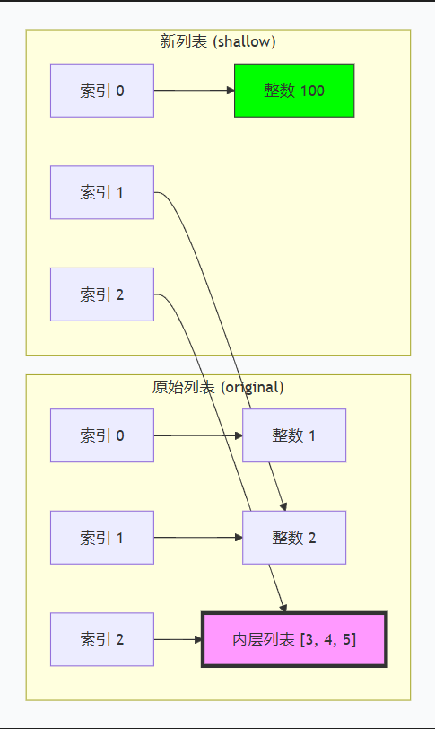
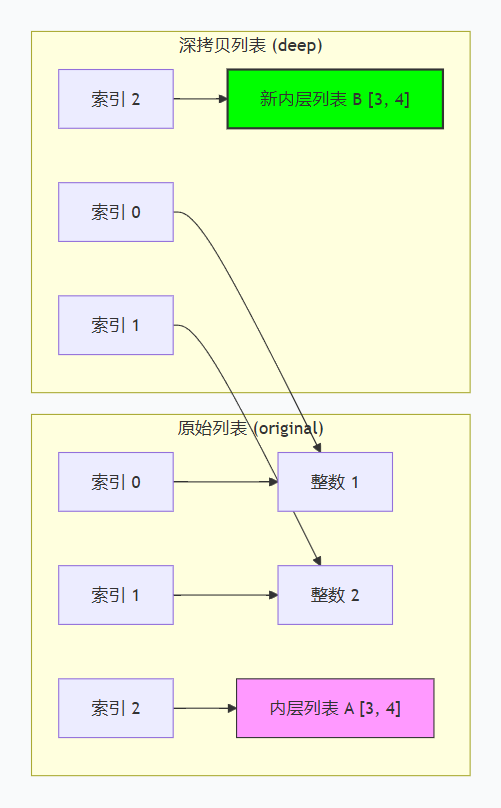

# 第5章 列表、元组与序列


## 5.1 列表（list）的定义与操作

列表（List）是 Python 中最常用的**可变序列**（Mutable Sequence），可容纳任意类型元素，支持增删改查等操作。

### 创建列表

```python
# 空列表
empty = []

mylist = ['aaa','bbb','ccc']
print(mylist)
print(type(mylist))

# 包含元素的列表
numbers = [1, 2, 3, 4, 5]
mixed = [1, "hello", 3.14, True]
nested = [[1, 2], [3, 4]]  # 嵌套列表

# 使用 list() 构造函数
chars = list("Python")   # ['P', 'y', 't', 'h', 'o', 'n']
range_list = list(range(5))  # [0, 1, 2, 3, 4]
```

### 索引与切片

#### 1. 索引（Indexing）

- **定义**：通过**单个位置编号**（整数）访问序列中的**单个元素**。
- **语法**：`sequence[index]`
- **方向规则**：
  - **正向索引**：从 `0` 开始（第一个元素），依次递增。
  - **负向索引**：从 `-1` 开始（最后一个元素），依次递减。
- **越界处理**：索引超出有效范围（如长度为 5，访问 `fruits[5]`）会**直接抛出 `IndexError`** 异常

#### 2. 切片（Slicing）

- **定义**：通过**起始和结束位置**（以及可选的步长），返回一个**新的子序列**（包含多个元素）。
- **语法**：`sequence[start:stop:step]`
- **三大核心规则**：
  1. **左闭右开**：包含 `start` 位置的元素，**不包含** `stop` 位置的元素。
  2. **索引可省略**：
     - `start` 省略 → 默认从开头（索引 0）开始。
     - `stop` 省略 → 默认到末尾（包含最后一位）。
     - `step` 省略 → 默认步长为 1。
  3. **容错性强（越界不报错）**：即使 `start` 或 `stop` 超出列表长度，Python 会自动将其**截断**到有效边界，不会引发异常（除非步长为 0）。
- **步长（Step）**：正数表示从左到右切，负数表示从右到左切（可实现反转）。

```python
fruits = ["apple", "banana", "orange", "grape", "mango"]

# 索引
print(fruits[0])    # "apple"
print(fruits[-1])   # "mango"

# 切片，遵循所闭右开原则
print(fruits[1:4])  # ["banana", "orange", "grape"]
print(fruits[:3])   # ["apple", "banana", "orange"]
print(fruits[::2])  # ["apple", "orange", "mango"]

lst = [1, 2, 3, 4, 5]
# 索引赋值：只能替换单个元素，列表长度不变
lst[0] = 100       # 结果：[100, 2, 3, 4, 5]

# 切片赋值：替换部分元素，可以替换为任意长度的可迭代对象，列表长度会动态变化
lst[1:3] = [20, 30, 40]  # 结果：[100, 20, 30, 40, 4, 5] （长度变长了）

# 通过切片删除元素
lst[2:4] = []            # 结果：[100, 20, 5] （删除元素，长度变短）

# 通过切片插入（将空切片替换为新列表）
fruits[2:2] = ["blueberry"]
print(fruits)       # ["apple", "kiwi", "blueberry", "peach", "grape", "mango"]
```

### 拼接与重复

```python
a = [1, 2, 3]
b = [4, 5, 6]

print(a + b)        # [1, 2, 3, 4, 5, 6]（创建新列表）
print(a * 2)        # [1, 2, 3, 1, 2, 3]
```

### 添加元素（append / extend / insert）

| 方法               | 说明                             | 示例                |
| ------------------ | -------------------------------- | ------------------- |
| `append(x)`        | 在列表末尾添加单个元素 x         | `lst.append(4)`     |
| `extend(iterable)` | 将可迭代对象的所有元素添加到末尾 | `lst.extend([4,5])` |
| `insert(i, x)`     | 在索引 i 处插入元素 x            | `lst.insert(1, 10)` |

```python
lst = [1, 2, 3]

# append
lst.append(4)
print(lst)          # [1, 2, 3, 4]

# extend
lst.extend([5, 6])
print(lst)          # [1, 2, 3, 4, 5, 6]

# insert
lst.insert(1, 10)   # 在索引1处插入10
print(lst)          # [1, 10, 2, 3, 4, 5, 6]
```

> **注意**：`append` 和 `extend` 的区别——`append` 将参数整体作为一个元素添加，而 `extend` 将参数中的元素逐一添加。

```python
lst = [1, 2]
lst.append([3, 4])   # 添加一个列表元素
print(lst)           # [1, 2, [3, 4]]

lst = [1, 2]
lst.extend([3, 4])   # 添加两个元素
print(lst)           # [1, 2, 3, 4]
```

| 对比维度             | **`append`**                           | **`extend`**                                           |
| :------------------- | :------------------------------------- | :----------------------------------------------------- |
| **参数类型**         | 任意类型（数字、字符串、列表、对象等） | **必须是可迭代对象**（list, tuple, str, dict, set 等） |
| **加入元素的个数**   | 每次只加 **1个** 元素                  | 一次性加入 **N个** 元素（视可迭代对象长度而定）        |
| **列表长度变化**     | 长度 **+1**                            | 长度 **+ N**（N为可迭代对象的元素个数）                |
| **传入列表时的效果** | 产生**嵌套**（子列表原样放入）         | **不嵌套**（子列表元素被拆散后平铺加入）               |
| **返回值**           | 都是 `None`（原地修改，不返回新列表）  | 都是 `None`（原地修改，不返回新列表）                  |
| **时间复杂度**       | O(1)（均摊）                           | O(N)（N为被添加的可迭代对象长度）                      |


### 删除元素（remove / pop / del / clear）

| 方法        | 说明                                                 | 示例                           |
| ----------- | ---------------------------------------------------- | ------------------------------ |
| `remove(x)` | 删除第一个值为 x 的元素（若不存在则引发 ValueError） | `lst.remove(3)`                |
| `pop(i=-1)` | 删除并返回索引 i 处的元素（默认最后一个）            | `lst.pop()`                    |
| `del` 语句  | 删除切片或特定索引                                   | `del lst[0]` 或 `del lst[1:3]` |
| `clear()`   | 清空所有元素                                         | `lst.clear()`                  |

```python
lst = [10, 20, 30, 20, 40]

# remove
lst.remove(20)        # 删除第一个20
print(lst)            # [10, 30, 20, 40]

# pop
removed = lst.pop()   # 删除并返回最后一个
print(removed, lst)   # 40 [10, 30, 20]

removed2 = lst.pop(1) # 删除索引1
print(removed2, lst)  # 30 [10, 20]

# del
del lst[0]
print(lst)            # [20]

# clear
lst.clear()
print(lst)            # []
```

### 排序与反转（sort / sorted / reverse）

- `list.sort(key=None, reverse=False)`：原地排序，改变原列表。
- `sorted(iterable, key=None, reverse=False)`：返回新排序列表，原列表不变。
- `reverse()`：原地反转列表。

```python
nums = [3, 1, 4, 1, 5, 9, 2]

# sort 原地排序
nums.sort()
print(nums)           # [1, 1, 2, 3, 4, 5, 9]

# 降序
nums.sort(reverse=True)
print(nums)           # [9, 5, 4, 3, 2, 1, 1]

# sorted 不改变原列表
original = [3, 1, 2]
new_sorted = sorted(original)
print(original)       # [3, 1, 2]
print(new_sorted)     # [1, 2, 3]

# 自定义排序（按长度）
words = ["python", "java", "c", "javascript"]
words.sort(key=len)
print(words)          # ['c', 'java', 'python', 'javascript']

# reverse
words.reverse()
print(words)          # ['javascript', 'python', 'java', 'c']
```

### 列表推导式（List Comprehension）

列表推导式是 Python 中简洁高效的构造列表的方式，基本语法：

`[表达式 for 变量 in 可迭代对象 if 条件]`

- **表达式**：对每个元素要执行的操作（可以是运算、函数调用等）。
- **for 变量 in 可迭代对象**：标准的循环。
- **if 条件**：（可选）用于过滤元素，只有满足条件的才保留。

```python
# 生成平方数列表
squares = [x**2 for x in range(10)]
print(squares)        # [0, 1, 4, 9, 16, 25, 36, 49, 64, 81]

# 带条件过滤（只取偶数平方）
even_squares = [x**2 for x in range(10) if x % 2 == 0]
print(even_squares)   # [0, 4, 16, 36, 64]

# 嵌套循环（展开二维列表）
matrix = [[1, 2, 3], [4, 5, 6], [7, 8, 9]]
flatten = [num for row in matrix for num in row]
print(flatten)        # [1, 2, 3, 4, 5, 6, 7, 8, 9]

# 嵌套推导式（生成坐标对）
coords = [(x, y) for x in range(3) for y in range(2)]
print(coords)         # [(0,0), (0,1), (1,0), (1,1), (2,0), (2,1)]

# 结合 enumerate（获取索引和值）
# enumerate 是 Python 的内置函数，它的作用是给可迭代对象（如列表）自动生成一个“计数器”。当执行 enumerate(words) 时，它返回一个枚举对象（迭代器）。这个迭代器每次吐出一个元组（Tuple），格式固定为 (索引, 元素)。
words = ["apple", "banana", "cherry"]
indexed = [(i, word) for i, word in enumerate(words)]
print(indexed)        # [(0, 'apple'), (1, 'banana'), (2, 'cherry')]

####练习
#① 只有循环（最简单的映射）
#把字符串都变成大写：
fruits = ["apple", "banana", "orange"]
new = [fruit.upper() for fruit in fruits]
print(new)  # ['APPLE', 'BANANA', 'ORANGE']

#② 带 if 过滤（筛选）
#只取长度大于 5 的水果：
fruits = ["apple", "banana", "orange", "grape"]
new = [fruit for fruit in fruits if len(fruit) > 5]
print(new)  # ['banana', 'orange']

#③ 带 if...else 的条件表达式（注意位置！）
#如果要把偶数变平方、奇数保留原数，if...else 要写在表达式的位置（放在 for 前面）：
nums = [1, 2, 3, 4, 5]
new = [x ** 2 if x % 2 == 0 else x for x in nums]
print(new)  # [1, 4, 3, 16, 5]
#易错点：if 过滤写在 for 后面（去掉不要的）；if...else 写在 for 前面（改变值）。
```


## 5.2 元组（tuple）的定义与特性

元组（Tuple）是**不可变序列**（Immutable Sequence），一旦创建就不能修改。元组通常用于存储固定结构的数据。

### 创建元组

```python
# 1、元组定义两种方式
# (1) 使用圆括号
t1 = (1, 2, 3)
t2 = ("a", "b", "c")

# (2) 使用 tuple() 构造函数
t3_1 = tuple([1, 2, 3])   # (1, 2, 3)
t3_2 = tuple((1,2,3))     # (1, 2, 3)
# 注意：tuple() 是 Python 的内置类型构造器，它的参数要求是一个可迭代对象（iterable），而列表 [1, 2, 3] 和元组 (1, 2, 3) 都是可迭代对象。因此上述两种方式都可以定义元组

t2 = tuple("Python")    # ('P', 'y', 't', 'h', 'o', 'n')

# 空元组
t3 = ()
# 单元素元组（必须加逗号）
t3 = (42,)      # 正确，类型为 tuple
t4 = (42)       # 这是整数，不是元组

# 省略括号（逗号分隔）
t5 = 1, 2, 3    # 等同于 (1, 2, 3)
```

### 不可变性的含义

元组一旦创建，其**长度固定**，且**元素不可重新赋值**。但如果元素是可变对象（如列表），该对象本身可以被修改。

```python
t = (1, 2, [3, 4])

# 以下操作均会引发 TypeError
# t[0] = 10          # TypeError: 'tuple' object does not support item assignment
# t.append(5)        # AttributeError: 'tuple' object has no attribute 'append'

# 但可以修改可变元素的内容
t[2].append(5)
print(t)            # (1, 2, [3, 4, 5])
```

> **核心**：元组的“不可变”是指**引用的不可变**，即不能替换元组中的元素对象。但元素对象本身的可变性不受影响。

### 元组拆包（Tuple Unpacking）

元组拆包允许将元组中的元素直接赋值给多个变量，是 Python 中极其实用的特性。

```python
# 基本拆包
coordinates = (10, 20)
x, y = coordinates
print(x, y)         # 10 20

# 交换变量（利用拆包）
a, b = 5, 10
a, b = b, a
print(a, b)         # 10 5

# 带星号 * 的可迭代对象解包（俗称“星号表达式”或“扩展解包”）。
# 带 * 的打包（收集剩余元素）
first, *rest = (1, 2, 3, 4)
print(first, rest)  # 1 [2, 3, 4] 含义：把第一个元素单独给 first，剩下的所有元素都打包给 rest。

*start, last = (1, 2, 3, 4)
print(start, last)  # [1, 2, 3] 4 含义：把最后一个元素单独给 last，前面的所有元素都打包给 start。

first, *middle, last = (1, 2, 3, 4, 5)
print(first, middle, last)  # 1 [2, 3, 4] 5 含义：取第一个给 first，取最后一个给 last，中间剩余的所有元素（无论多少个）都打包给 middle。

# 忽略某些值（使用 _）
_, b, _ = (1, 2, 3)
print(b)            # 2
```

**在同一个赋值语句中，`*` 变量只能出现一次（顶级解包时）。**

带 `*` 的变量**可以出现在任何位置**（开头、中间、结尾），且它永远会被赋值为一个**列表**。

- 哪怕它一个元素都没吸到，它也是一个**空列表** `[]`，而不会报错

```python
a, *b, c = (1, 2)  
print(a, b, c)     # 1 [] 2  （b 中间没有多余元素，就是个空列表）
```


### 具名元组（namedtuple）

`namedtuple` 是 `collections` 模块提供的工厂函数，用于创建类似类的元组，可通过字段名访问元素，兼具元组的轻量和类的可读性。

```python
from collections import namedtuple

# 定义一个具名元组类型
Point = namedtuple('Point', ['x', 'y'])
p = Point(10, 20)

# 通过字段名访问
print(p.x, p.y)     # 10 20

# 通过索引访问（仍支持）
print(p[0], p[1])   # 10 20

# 拆包
x, y = p
print(x, y)         # 10 20

# 其他特性
print(p._fields)    # ('x', 'y')
# 转换为字典
print(p._asdict())  # OrderedDict([('x', 10), ('y', 20)])

# 替换字段值（返回新实例）
p2 = p._replace(x=99)
print(p2)           # Point(x=99, y=20)

# 更复杂的示例：人员信息
Person = namedtuple('Person', 'name age city')
alice = Person('Alice', 25, 'Beijing')
print(f"{alice.name} is {alice.age} years old, lives in {alice.city}")
```


## 5.3 序列的通用操作

Python 中的序列类型（list, tuple, str, range, bytes 等）共享一组通用操作。以下操作适用于所有序列。

| 操作                         | 说明                 | 示例                      |
| ---------------------------- | -------------------- | ------------------------- |
| `len(s)`                     | 长度                 | `len([1,2,3])` → 3        |
| `min(s)`                     | 最小值               | `min([1,2,3])` → 1        |
| `max(s)`                     | 最大值               | `max([1,2,3])` → 3        |
| `sum(s)`                     | 求和（数值序列）     | `sum([1,2,3])` → 6        |
| `x in s`                     | 成员测试             | `3 in [1,2,3]` → True     |
| `x not in s`                 | 非成员测试           | `4 not in [1,2,3]` → True |
| `s.count(x)`                 | 统计 x 出现次数      | `[1,2,2,3].count(2)` → 2  |
| `s.index(x[, start[, end]])` | 返回第一个匹配的索引 | `[1,2,3].index(2)` → 1    |
| `s[i]`                       | 索引取值             | `(1,2,3)[1]` → 2          |
| `s[i:j:k]`                   | 切片                 | `[1,2,3,4][1:3]` → [2,3]  |
| `s + t`                      | 拼接（同类序列）     | `[1,2]+[3]` → [1,2,3]     |
| `s * n`                      | 重复                 | `[1,2]*2` → [1,2,1,2]     |

```python
# 通用操作演示
lst = [3, 1, 4, 1, 5]
tpl = (1, 2, 3, 2, 2)

print(len(lst))            # 5
print(max(lst))            # 5
print(min(lst))            # 1
print(sum(lst))            # 14

print(4 in lst)            # True
print(6 not in lst)        # True

print(tpl.count(2))        # 3
print(tpl.index(2))        # 1（第一次出现的位置）
print(tpl.index(2, 2))     # 3（从索引2开始查找）

# 切片同样适用于元组和字符串
s = "Hello"
print(s[1:4])              # "ell"
```

> **注意**：并非所有序列都支持所有操作（例如元组不支持 `sort`，因为它是不可变的），但上述列出的通用操作为所有序列所共有。


## 5.4 深拷贝与浅拷贝（copy 模块）

### 浅拷贝（Shallow Copy）

浅拷贝创建一个新对象，但新对象内部的元素**引用原对象中的元素**（不复制子对象本身）。

常见的浅拷贝方式：
- 列表的 `copy()` 方法
- 列表切片 `lst[:]`
- `list(lst)` 构造函数
- `copy.copy()`（需导入 copy 模块）

```python
import copy

# 浅拷贝示例
original = [1, 2, [3, 4]]

# 1、进行浅拷贝
shallow = original.copy()   # 或 copy.copy(original)

# 2、修改不可变元素（原列表不受影响）
shallow[0] = 100
print(original)   # [1, 2, [3, 4]]
print(shallow)    # [100, 2, [3, 4]]

# 3、修改可变子对象（原列表会受影响，因为子对象是同一个引用）
shallow[2].append(5)
print(original)   # [1, 2, [3, 4, 5]]
print(shallow)    # [100, 2, [3, 4, 5]]
```

1、当执行 `shallow = original.copy()` 时：

- **创建了一个新的外层列表**（`shallow`）。
- 但这个新列表 `shallow` 里放的三个元素，**直接复制了 `original` 里面的引用地址**。



2、当执行修改时：

- **修改 `shallow[0] = 100`（不可变元素）**：

  - 整数是不可变对象。这一操作并不是把 `1` 改成 `100`，而是**把 `shallow` 的第 0 个标签，撕下来贴到了新的整数 `100` 身上**。
  - 因为 `original` 的第 0 个标签还贴在 `1` 身上，所以 `original` 不受影响。（两兄弟分道扬镳了）

  

- **修改 `shallow[2].append(5)`（可变子对象）**：
  - `shallow[2]` 和 `original[2]` 指向的是**同一个**内层列表 `[3,4]`。
  - 调用 `.append(5)` 是**修改列表 `[3,4]` 的内部数据**，而不是改变 `[3,4]` 的引用地址。
  - 因为你俩指向的是同一个列表 `[3,4]`，所以 `original` 和 `shallow` 同时看到了新加进去的 `5`。（两兄弟还在共用同一个书包，书包里多了本书，两边都能看到）



### 深拷贝（Deep Copy）

深拷贝递归地复制对象及其所有子对象，完全独立于原对象。

```python
import copy

original = [1, 2, [3, 4]]
deep = copy.deepcopy(original)

# 修改任意层次均不影响原对象
deep[2].append(5)
deep[0] = 100

print(original)   # [1, 2, [3, 4]]
print(deep)       # [100, 2, [3, 4, 5]]
```

当执行 `deep = copy.deepcopy(original)` 时，Python 会做**递归遍历**：

1. 创建一个新的外层列表。
2. 遍历到内层列表 `[3, 4]` 时，发现它也是一个可变对象，于是**重新创建一个全新的内层列表**。
3. 对于不可变的整数 `1` 和 `2`，Python 则直接复用原来的引用（因为整数不可变，省内存且安全）。




### 何时使用？

- **浅拷贝**：适用于对象结构简单、不包含可变子对象，或希望共享子对象的情况（节省内存）。
- **深拷贝**：适用于需要完全独立副本的场景（如保护原始数据不被意外修改）。

### 自定义对象的拷贝

对于自定义类，可以实现 `__copy__()` 和 `__deepcopy__()` 方法以控制拷贝行为。

```python
import copy

class MyClass:
    def __init__(self, data):
        self.data = data
    
    def __repr__(self):
        return f"MyClass({self.data})"

obj = MyClass([1, 2, 3])
shallow_copy = copy.copy(obj)          # 默认浅拷贝
deep_copy = copy.deepcopy(obj)         # 递归深拷贝

print(shallow_copy.data is obj.data)   # True（浅拷贝共享列表）
print(deep_copy.data is obj.data)      # False（深拷贝独立）
```


### 综合练习

```python
# 练习：统计文本中单词出现频率（使用列表和字典）
text = "apple banana apple orange banana apple"
words = text.split()

# 使用列表推导式去重（保留顺序）
unique = []
[unique.append(w) for w in words if w not in unique]

# 统计频率
freq = {w: words.count(w) for w in unique}
print(freq)  # {'apple': 3, 'banana': 2, 'orange': 1}

# 按频率降序排序
sorted_freq = sorted(freq.items(), key=lambda x: x[1], reverse=True)
print(sorted_freq)  # [('apple', 3), ('banana', 2), ('orange', 1)]

# 使用元组拆包打印
for word, count in sorted_freq:
    print(f"{word}: {count}次")
```