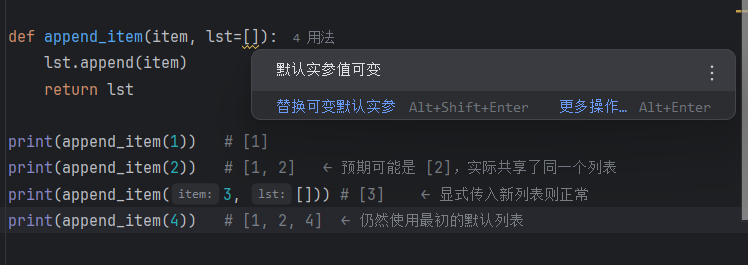
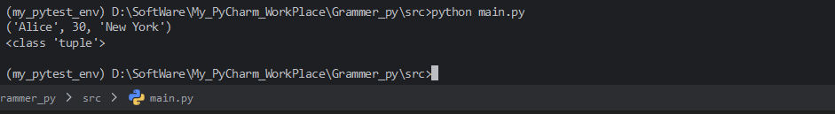
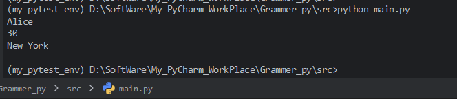
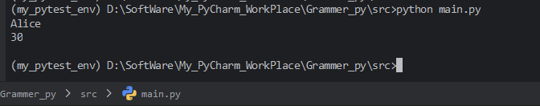
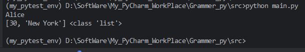
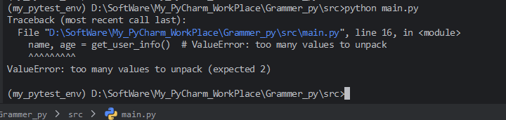
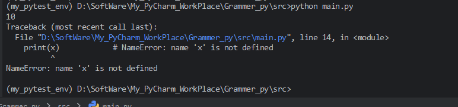
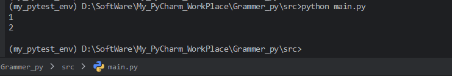
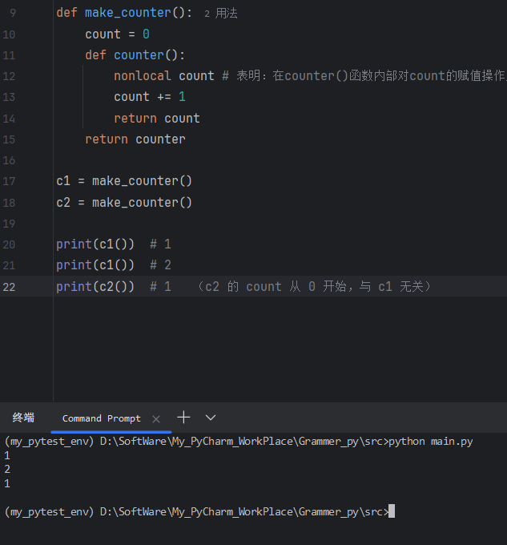
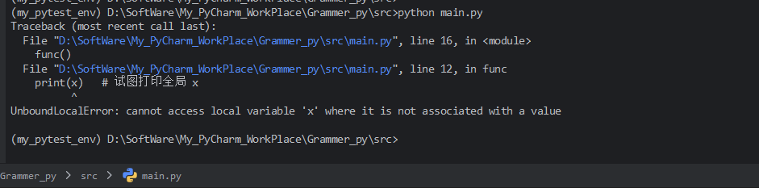

## 7.1 函数的定义与调用

### 1. 函数定义的基本语法

在 Python 中，使用 `def` 关键字定义函数，基本语法如下：

```python
def function_name(parameters):
    """docstring（可选）"""
    # 函数体
    return [表达式]
```

-   `def`：定义函数的关键字。
-   `function_name 函数名`：遵循标识符命名规则，通常使用小写字母和下划线（如 `my_function`）。
-   `parameters 参数列表`：放在圆括号内，可以是零个或多个参数，参数之间用逗号分隔。参数用于接收调用函数时传入的值。
-   `docstring 文档字符串`：可选的字符串，用于描述函数的功能，通常放在函数体的第一行，用三引号括起来，可以通过 `函数名.__doc__` 访问。
-   `函数体`：缩进的代码块，实现具体功能。
-   `return`：可选，用于返回一个值或表达式。如果没有 `return` 或只有 `return` 而没有表达式，函数默认返回 `None`。

### 2. 函数调用

语法：通过函数名加括号调用，传入实际参数

```python
result = function_name(arguments)
```

定义函数后，通过 `函数名(实际参数)` 的方式调用。调用时，实际参数（实参）会传递给形参（定义时的参数）。

```python
def greet(name):
    """打印问候语"""
    print(f"Hello, {name}!")
    
greet("Alice")   # 输出：Hello, Alice!
```

调用一个函数会执行函数体内的代码，执行到 `return` 时结束并返回值（如果有）。如果没有 `return`，则执行完所有语句后返回 `None`。

```python
result = greet("Bob")   # 函数没有 return，result 为 None
print(result)           # 输出：None
```


## 7.2 参数传递机制

Python 参数传递采用 **引用传递**（更准确地说是“对象引用传递”），但表现类似于传对象（不可变对象表现为值传递，可变对象表现为引用传递）

### 1. 位置参数（Positional Arguments）

**定义**：调用函数时，按照参数定义的顺序依次传入的实参，称为位置参数。形参与实参一一对应，数量必须匹配。

**示例**：

```python
def func(a, b, c):
    print(a, b, c)

func(1, 2, 3)   # 输出：1 2 3
```

**特点**：

-   必须按定义顺序传递。
-   实参个数必须与形参个数相同，否则会抛出 `TypeError`。
-   最常用、最直观的参数传递方式。

### 2. 默认参数（Default Arguments）

#### **定义**

在定义函数时，可以为某些参数指定默认值。调用函数时，若未提供该参数，则使用默认值；若提供了，则覆盖默认值。

```python
def func(a, b=2, c=3):
    print(a, b, c)
    
# 调用
func(1)            # 输出：1 2 3
func(1, 10)        # 输出：1 10 3
func(1, c=20)      # 输出：1 2 20
```

#### **规则**

-   默认参数必须放在非默认参数之后（即所有位置参数之后）。
-   调用时既可以按位置传参，也可以按关键字传参。

#### ⚠️ 默认参数的陷阱

默认参数的值在**函数定义时**就被计算并保存，而不是在每次调用时重新计算。如果默认参数是**可变对象**（如列表、字典、集合），那么多次调用函数时，该默认对象会被共享和修改，产生意料之外的结果。

**错误示例**：

```python
def append_item(item, lst=[]):
    lst.append(item)
    return lst

print(append_item(1))   # [1]
print(append_item(2))   # [1, 2]   ← 预期可能是 [2]，实际共享了同一个列表
print(append_item(3, [])) # [3]    ← 显式传入新列表则正常
print(append_item(4))   # [1, 2, 4]  ← 仍然使用最初的默认列表
```



**原因**：`lst=[]` 在函数定义时创建了一个空列表，并作为默认值绑定到参数 `lst`。每次调用若未传入 `lst`，则都使用同一个列表对象。

**解决方法**：将默认值设为 `None`，并在函数内部创建新的可变对象。

```python
def append_item(item, lst=None):
    if lst is None:
        lst = []
    lst.append(item)
    return lst
```

这样每次调用都会创建一个新的列表，避免共享。


### 3. 关键字参数（Keyword Arguments）

**定义**：调用函数时，通过 `参数名=值` 的形式传递实参，称为关键字参数。它不依赖于参数顺序，增强了可读性。

**示例**：

```python
def introduce(name, age, city):
    print(f"{name} is {age} years old, from {city}")

introduce(age=30, city="New York", name="Alice")# 输出：Alice is 30 years old, from New York
```

**规则**：

-   关键字参数必须在位置参数之后。
-   不能对同一个形参重复赋值（例如 `func(1, a=2)` 会报错，因为 `a` 同时被位置参数和关键字参数赋值）。
-   关键字参数可以增加代码的可读性，尤其是参数较多时。


### 4. 可变参数（Variable Arguments）

可变参数允许函数接受任意数量的参数，分为两种：`*args` 和 `**kwargs`。

#### 4.1 `*args` : 接收任意数量的位置参数

-   在形参名前加一个 `*`，表示将所有多余的位置参数打包成一个**元组**。
-   调用时可以传入任意数量的位置参数（包括零个）。
-   常用于参数数量不确定的场景。

**示例**：

```python
def sum_all(*args):
    total = 0
    for num in args:
        total += num
    return total

print(sum_all(1, 2, 3))       # 6
print(sum_all(10, 20, 30, 40))# 100
print(sum_all())              # 0
```

**注意**：`args` 是一个元组，不可修改。


#### 4.2 `**kwargs` : 接收任意数量的关键字参数

-   在形参名前加两个 `*`，表示将所有多余的关键字参数打包成一个**字典**。
-   调用时可以传入任意数量的关键字参数（键值对）。
-   常用于处理可选配置项或扩展接口。

**示例**：

```python
def print_info(**kwargs):
    for key, value in kwargs.items():
        print(f"{key}: {value}")

print_info(name="Alice", age=25, city="London")
# 输出：
# name: Alice
# age: 25
# city: London
```

**注意**：`kwargs` 是一个字典，键是字符串类型。

#### 4.3 `*args` 和 `**kwargs` 的组合

两者可以同时使用，但顺序必须是 `*args` 在前，`**kwargs` 在后。

```python
def func(*args, **kwargs):
    print("args:", args)
    print("kwargs:", kwargs)

func(1, 2, 3, name="Alice", age=25)
# args: (1, 2, 3)
# kwargs: {'name': 'Alice', 'age': 25}
```


### 5. 命名关键字参数（Keyword-Only Arguments）

**定义**：命名关键字参数是必须通过关键字（而不是位置）传递的参数。它位于 `*` 或 `*args` 之后，强制调用者使用参数名来传值，提高可读性、避免顺序混淆。

**语法**：

-   使用一个单独的 `*` 作为分隔符，其后的参数均为命名关键字参数。
-   或者在 `*args` 之后定义的参数也是命名关键字参数。

**示例1：单独的 `\*`**

```python
def func(a, b, *, c, d):
    print(a, b, c, d)

func(1, 2, c=3, d=4)     # 正确
# func(1, 2, 3, 4)       # 错误，c 和 d 必须用关键字传递
```


**示例2：`\*args` 之后的参数**

```python
def func(a, *args, c, d):
    print(a, args, c, d)

func(1, 2, 3, c=4, d=5)  # 正确，2,3 被 args 收集
# func(1, 2, 3, 4, 5)    # 错误，c 和 d 必须用关键字
```

**规则**：

-   命名关键字参数可以有默认值，如 `def func(a, *, b=2, c=3)`。
-   调用时必须使用 `参数名=值` 的形式，否则报错。
-   这种参数常用于需要明确指定含义的配置项，防止调用时因位置错误而导致逻辑错误。

### 小结

| 参数类型       | 定义方式                                 | 调用方式               | 内部表现形式 |
| :------------- | :--------------------------------------- | :--------------------- | :----------- |
| 位置参数       | `def f(a, b)`                            | `f(1, 2)`              | 普通变量     |
| 默认参数       | `def f(a, b=2)`                          | `f(1)` 或 `f(1, b=3)`  | 普通变量     |
| 关键字参数     | 调用时使用 `参数名=值`                   | `f(a=1, b=2)`          | —            |
| 可变位置参数   | `def f(*args)`                           | `f(1, 2, 3)`           | 元组         |
| 可变关键字参数 | `def f(**kwargs)`                        | `f(x=1, y=2)`          | 字典         |
| 命名关键字参数 | `def f(*, c, d)` 或 `def f(*args, c, d)` | 必须 `f(c=..., d=...)` | 普通变量     |


## 7.3 返回值与返回多个值

在 Python 中，函数通过 `return` 语句将结果返回给调用者。返回值可以是任意对象，包括数字、字符串、列表、字典、自定义类的实例，甚至可以是另一个函数。当需要同时返回多个结果时，Python 提供了非常简洁的语法——直接使用逗号分隔多个值，实际上这些值会被自动打包成一个**元组**返回。

### 1. 返回单个值

函数可以返回一个任意类型的对象，例如：

```python
def add(a, b):
    return a + b

result = add(3, 5)
print(result,type(result))  # 8,<class 'int'>
```

如果函数中没有 `return` 语句，或者 `return` 后不跟任何值，函数会默认返回 `None`：

```python
def greet(name):
    print(f"Hello, {name}")

result = greet("Alice")  # 输出 Hello, Alice
print(result)            # None
```

### 2. 返回多个值（本质是返回元组）

Python 允许在 `return` 语句中直接列出多个值，用逗号分隔，语法非常直观：

```python
def get_user_info ():
    name = "Alice"
    age = 30
    city = "New York"
    return name, age, city

# 返回实际上是一个元组
info = get_user_info()
print(info)  # ('Alice', 30, 'New York')
print(type(info))  # <class 'tuple'>
```



注意：`return a, b, c` 完全等价于 `return (a, b, c)`，逗号只是元组构造的语法糖。

---

### 3. 接收多个返回值的方式

#### 3.1 解包赋值

最常见的方式是用多个变量同时接收，Python 会自动将返回的元组解包：

```python
def get_user_info ():
    name = "Alice"
    age = 30
    city = "New York"
    return name, age, city

name, age, city = get_user_info()
print(name)  # Alice
print(age)   # 30
print(city)  # New York
```



#### 3.2 接收整个元组

如果不希望解包，也可以用一个变量接收整个元组：

```python
def get_user_info ():
    name = "Alice"
    age = 30
    city = "New York"
    return name, age, city

info = get_user_info()
print(info[0])  # Alice
print(info[1])  # 30
```



#### 3.3 忽略部分返回值

有时我们只关心其中几个值，可以用下划线 `_` 作为占位符忽略不需要的值：

```python
def get_user_info ():
    name = "Alice"
    age = 30
    city = "New York"
    return name, age, city

name, _, city = get_user_info()  # 忽略年龄
print(name, city)  # Alice New York
```

也可以使用 `*` 收集剩余值（Python 3+）：

```python
def get_user_info ():
    name = "Alice"
    age = 30
    city = "New York"
    return name, age, city

first, *rest = get_user_info()
print(first)  # Alice
print(rest)   # [30, 'New York']  # 注意：rest 是列表
```



---

### 4. 返回多个值的其他方式

虽然直接返回元组是最常用的方式，但也可以返回其他容器类型（如列表、字典、自定义对象）来传递多个值：

```python
def get_data_list():
    return [1, 2, 3]

def get_data_dict():
    return {'name': 'Alice', 'age': 30}
```

但这样返回的是容器对象本身，调用方需要按容器类型的方式访问，不如元组解包方便。

**一般约定：**当需要返回固定个数、语义不同的值时，优先使用元组；当值的数量可变或语义相同，则使用列表或其他集合。

---

### 5. 注意事项

#### 5.1 返回值顺序必须与接收顺序一致

解包时变量数量必须与返回值数量一致，否则会抛出 `ValueError`：

```python
def get_user_info ():
    name = "Alice"
    age = 30
    city = "New York"
    return name, age, city

name, age = get_user_info()  # ValueError: too many values to unpack
```



#### 5.2 返回可变对象时要小心

如果返回的是列表、字典等可变对象，调用方修改该对象会影响原函数内部的数据（如果该对象是从函数外部传入或函数内部创建的）。**通常建议返回不可变类型（如元组）**或者返回副本。

#### 5.3 多个 return 语句

函数中可以有多个 `return`，但执行到第一个 `return` 时函数立即结束：

```python
def check_number(n):
    if n > 0:
        return "positive", n
    elif n < 0:
        return "negative", n
    else:
        return "zero", n
```

---

### 小结

- Python 函数的返回值可以是任意对象，包括 `None`。
- 返回多个值实际上是将多个值打包成一个**元组**返回。
- 接收时可以通过**解包赋值**将元组中的值分别赋给多个变量。
- 也可以用一个变量接收整个元组，或使用 `_` 忽略部分值。
- 类型注解使用 `tuple`（或 `Tuple`）来标注多返回值。
- 返回值顺序、数量需要和解包变量匹配，否则会出错。


## 7.4 作用域与命名空间

在 Python 中，**命名空间（Namespace）** 是从名字到对象的映射，它决定了程序中一个名字（变量名、函数名、类名等）具体指向哪个对象。**作用域（Scope）** 则是命名空间的可访问范围，即程序文本中的某个区域，在该区域内可以直接访问某个命名空间中的名字而无需额外前缀。Python 中的作用域遵循 **LEGB 规则**，即按 **Local → Enclosing → Global → Built-in** 的顺序查找名字。

### 1. 命名空间（Namespace）

命名空间是一个从名字到对象的映射，类似于字典。Python 中常见的命名空间有：

- **内置命名空间**：包含 Python 内置函数（如 `len`、`print`）和异常等，在解释器启动时创建，一直存在。
- **全局命名空间**：每个模块都有自己的全局命名空间，记录模块级别的变量、函数、类等。当模块被导入时创建，通常持续到程序结束。
- **局部命名空间**：每当函数被调用时创建，记录函数内部的变量、参数等。函数返回或异常时销毁。
- **嵌套命名空间**：当函数定义在另一个函数内部时，外层函数的局部命名空间对于内层函数来说就是“嵌套作用域”。

这些命名空间相互独立，但通过作用域规则可以互相访问。

### 2. 作用域（Scope）

作用域是命名空间的可见区域，决定了在程序的哪个位置可以“看到”某个命名空间中的名字。Python 的作用域是**静态作用域（词法作用域）**，也就是说作用域由代码的文本结构决定，与函数在哪里被调用无关。

Python 中主要有四种作用域：

1. **局部作用域（Local, L）**：函数内部定义的名字。
2. **嵌套作用域（Enclosing, E）**：外层函数（非全局）的局部作用域，用于嵌套函数的情况。
3. **全局作用域（Global, G）**：模块级别定义的名字。
4. **内置作用域（Built-in, B）**：Python 内置的名字。

### 3. 四种作用域详解

#### 3.1 局部作用域（Local）

在函数内部定义的变量、参数等属于局部作用域。这些名字只能在函数内部直接访问，函数外部无法访问。

==局部作用域的生命周期从函数调用开始，到函数返回或抛出异常时结束。==

```python
def func():
    x = 10          # 局部变量 x
    print(x)        # 在函数内部可以访问

# 正常返回值
func()
# 返回错误，因为变量x是func()函数内部定义的，函数运行结束后，该变量销毁。因此外部继续访问时会报错
print(x)            # NameError: name 'x' is not defined
```



#### 3.2 嵌套作用域（Enclosing）

当一个函数定义在另一个函数内部时，内层函数可以访问外层函数的局部作用域中的名字，这种作用域称为嵌套作用域。

```python
def outer():
    y = 20          # 外层函数的局部变量，对于 inner 来说是嵌套作用域
    def inner():
        print(y)    # 可以访问外层函数的 y
    inner()

outer()             # 输出 20
```

嵌套作用域使得**闭包**成为可能：**内层函数可以记住外层函数的作用域，即使外层函数已经返回**。

闭包是指一个函数对象，它记住了其定义时所在的外部函数作用域中的变量，即使外部函数已经执行完毕返回了。

```python
# 在本例中：
# counter 是内层函数，它引用了外层函数 make_counter 的局部变量 count。
# 当 make_counter() 被调用并执行完毕时，它返回了 counter 函数对象。按照正常的局部变量生命周期，count 本应该在 make_counter 返回后被销毁，但由于 counter 函数引用了它，Python 会保留这个变量，并将其与 counter 函数绑定在一起，形成一个闭包。

def make_counter():
    count = 0
    def counter():
        nonlocal count # 表明：在counter()函数内部对count的赋值操作应该作用于外层函数make_counter()的局部变量 count，而不是在 counter()函数内部新建一个局部变量。
        count += 1
        return count
    return counter


c = make_counter()
print(c())  # 1
print(c())  # 2
```



执行 `c = make_counter()` 时：

1.  **进入 `make_counter` 函数**：创建局部变量 `count` 并初始化为 `0`。
2.  **定义内层函数 `counter`**：此时 `counter` 函数对象被创建，但它不会立即执行。注意，`counter` 的定义中使用了 `nonlocal count`，这告诉 Python：在 `counter` 内部对 `count` 的赋值操作应该作用于**外层函数 `make_counter` 的局部变量 `count`**，而不是在 `counter` 内部新建一个局部变量。
3.  **返回 `counter`**：`make_counter` 执行 `return counter`，函数执行完毕。但是，由于返回的 `counter` 函数对象仍然引用着 `count`，Python 不会释放 `count` 的内存，而是将其保存在闭包中。
4.  **将返回的函数对象赋给变量 `c`**：此时 `c` 就是那个闭包函数，它携带着 `count = 0` 的状态。


为什么 `count` 能保持累加？

关键在于 **`make_counter()` 只被调用了一次**。我们只执行了一次 `c = make_counter()`，所以 `count = 0` 只初始化了一次。之后，`count` 变量被闭包捕获并保存在内存中，每次调用 `c()` 都是操作**同一个 `count` 对象**，因此它的值会持续累加。

如果我们再次调用 `make_counter()`，会创建一个全新的、独立的 `count` 和闭包：

```python
c1 = make_counter()
c2 = make_counter()

print(c1())  # 1
print(c1())  # 2
print(c2())  # 1   （c2 的 count 从 0 开始，与 c1 无关）
```



#### 3.3 全局作用域（Global）

在模块顶层定义的变量、函数、类等属于全局作用域。模块中的所有函数都可以访问这些名字。

```python
x = 100  # 全局变量

def func():
    print(x)  # 可以读取全局变量

func()  # 输出 100
```

但是，如果在函数内部**赋值**给一个与全局变量同名的名字，Python 会默认将其视为创建局部变量，而不是修改全局变量，这可能导致 `UnboundLocalError`：

```python
x = 100

def func():
    print(x)   # 试图打印全局 x
    x = 200    # 赋值导致 x 被视为局部变量，整个函数作用域内 x 都是局部的
    print(x)

func()  # 报错：UnboundLocalError: local variable 'x' referenced before assignment
```

这是因为 Python 在编译函数时，如果发现函数内对某个名字有赋值操作，就会将该名字视为局部变量，除非显式声明 `global`。


#### 3.4 内置作用域（Built-in）

内置作用域包含 Python 解释器预定义的名字，如 `len`、`range`、`print`、`Exception` 等。这些名字在程序任何位置都可以使用（除非被局部或全局名字遮蔽）。

```python
print(len([1, 2, 3]))  # 直接使用内置函数
```

内置作用域的查找顺序在最后，因此可以在局部或全局定义同名变量来“遮蔽”内置名字（通常不推荐这样做）：

```python
len = 5  # 全局定义 len，遮蔽了内置 len
print(len)  # 5
```


### 4. LEGB 规则与名字解析

当 Python 在代码中遇到一个名字（如变量 `x`）时，它会按照 **L → E → G → B** 的顺序在各级作用域中查找：

1. **L (Local)**：当前函数的局部作用域。
2. **E (Enclosing)**：外层函数的局部作用域（从内向外逐层查找）。
3. **G (Global)**：当前模块的全局作用域。
4. **B (Built-in)**：内置作用域。

如果所有作用域中都找不到该名字，则抛出 `NameError`。

**查找是动态的**，即在运行时根据调用链进行，但作用域的嵌套关系在定义时就已经确定。示例：

```python
x = "global"

def outer():
    x = "enclosing"
    def inner():
        x = "local"
        print(x)      # 局部作用域找到，输出 local
    inner()

outer()               # 输出 local
```

**为什么整个程序只返回一个 `local` 结果**：

-   整个程序**只调用了一次 `outer()`**（在最后一行）
-   `outer` 函数体内**只调用了一次 `inner()`**
-   因此，`print(x)` 只被执行一次，所以控制台只打印出一行 `local`

逐层分析：

```python
x = "global"

def outer():
    x = "enclosing"
    def inner():
        print(x)      # 没有局部 x，向上找到 enclosing
    inner()

outer()               # 输出 enclosing
```

如果所有层都没有，则查找内置：

```python
def func():
    print(len)       # 没有局部、嵌套、全局 len，找到内置 len

func()               # <built-in function len>
```

---

### 5. 变量赋值与作用域的关系

#### 5.1 默认行为：赋值创建局部变量

在函数内部，对一个名字进行赋值（包括 `=`、`+=`、`for` 循环变量等）会**默认将该名字视为局部变量**，除非明确声明为 `global` 或 `nonlocal`。这一行为在函数编译时确定，因此可能导致上面提到的 `UnboundLocalError`。

#### 5.2 `global` 声明

如果需要在函数内部修改全局变量，必须使用 `global` 关键字声明该名字是全局的：

```python
x = 10

def modify():
    global x
    x = 20

modify()
print(x)  # 20
```

`global` 也可以用于在函数内部**创建**一个新的全局变量。

#### 5.3 `nonlocal` 声明

在嵌套函数中，如果需要修改外层函数（非全局）的变量，使用 `nonlocal` 关键字：

```python
def outer():
    count = 0
    def inner():
        nonlocal count
        count += 1
    inner()
    print(count)  # 1

outer()
```

`nonlocal` 会从最近的嵌套作用域开始向外查找变量，但不会查找全局作用域。

#### 5.4 读取与修改的区别

- **读取**：直接使用名字，按照 LEGB 顺序查找。
- **修改**：赋值操作默认创建局部变量；若需修改外部变量，必须使用 `global` 或 `nonlocal` 声明。

---

### 6. 示例：综合演示 LEGB

```python
# 全局作用域
name = "Global"

def outer():
    # 嵌套作用域
    name = "Enclosing"
    def inner():
        # 局部作用域
        name = "Local"
        print("Inside inner:", name)  # Local
    inner()
    print("Inside outer:", name)      # Enclosing

outer()
print("Outside:", name)               # Global
```

输出：

```
Inside inner: Local
Inside outer: Enclosing
Outside: Global
```

---

### 7. 总结

- **命名空间**是名字到对象的映射，主要有内置、全局、局部三类。
- **作用域**是命名空间的可访问范围，Python 采用静态作用域，由代码结构决定。
- **四种作用域**：局部（L）、嵌套（E）、全局（G）、内置（B），查找顺序为 **LEGB**。
- **赋值默认创建局部变量**；修改全局变量用 `global`，修改嵌套变量用 `nonlocal`。
- 理解 LEGB 规则有助于避免变量遮蔽、未定义错误，并正确使用闭包和嵌套函数。


7.5 global与nonlocal关键字

7.6 递归函数
-   递归的设计原则
-   递归深度限制
-   尾递归（Python中的限制）

7.7 匿名函数（lambda表达式）

7.8 文档字符串（docstring）

7.9 类型注解（type hints）

你是一个python专家，就上面列出的知识点进行整理，内容要求详细专业但不冗余。

你是一个python专家，就上面列出的知识点进行整理，内容要求详细专业但不冗余。

