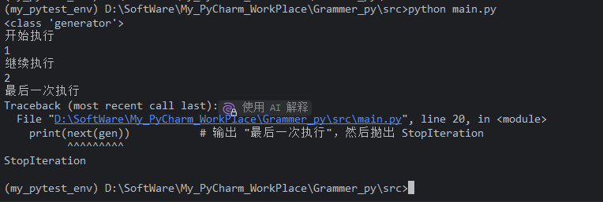
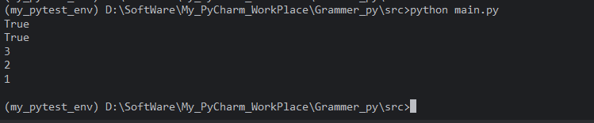

## 8.1 迭代协议（**iter** / **next**）

------

### 1. 什么是迭代协议？

迭代协议定义了两个基本方法：

-   **`__iter__(self)`**：返回一个迭代器对象。
-   **`__next__(self)`**：返回迭代器中的下一个元素，当没有元素时抛出 `StopIteration` 异常。

任何实现了这两个方法的对象都被称为**迭代器（Iterator）**。而实现了 `__iter__` 方法（或实现 `__getitem__` 的旧式协议）的对象被称为**可迭代对象（Iterable）**。

迭代协议的核心思想是：可迭代对象提供迭代器，迭代器负责逐个产生元素，直到耗尽。


### 2. 可迭代对象 vs 迭代器

#### 2.1 可迭代对象（Iterable）

-   实现了 `__iter__` 方法，该方法返回一个迭代器。
-   或者实现了 `__getitem__` 方法（从索引 0 开始，直到 `IndexError`），但这是一种旧式协议，Python 也会识别它。
-   可以被 `for` 循环直接使用。
-   常见的可迭代对象：列表、元组、字符串、字典、集合、文件对象、生成器等。

#### 2.2 迭代器（Iterator）

-   同时实现了 `__iter__` 和 `__next__` 方法。
-   `__iter__` 通常返回 `self`（即迭代器自身）。
-   维护迭代状态，每次调用 `__next__` 返回下一个元素，直到元素耗尽，抛出 `StopIteration`。
-   迭代器是一次性的：一旦耗尽，不能重新开始（除非重新获取新的迭代器）。
-   常见的迭代器：`iter(list)`、生成器对象、文件对象等。

>   注意：可迭代对象不一定是迭代器，但迭代器一定是可迭代对象。例如，列表是可迭代对象但不是迭代器，`iter([1,2,3])` 返回的才是迭代器。

------

### 3. `__iter__` 方法

`__iter__(self)` 方法应返回一个迭代器对象。对于迭代器自身，它通常返回 `self`：

```python
class MyIterator:
    def __iter__(self):
        return self
```

对于可迭代对象（如列表），它返回一个全新的迭代器对象：

```python
class MyIterable:
    def __iter__(self):
        return MyIterator(self.data)   # 返回一个迭代器实例
```

内置函数 `iter(obj)` 会调用 `obj.__iter__()` 并返回结果。

### 4. `__next__` 方法

`__next__(self)` 方法返回迭代器的下一个元素。如果没有更多元素，则必须抛出 `StopIteration` 异常。

```python
class MyIterator:
    def __init__(self, data):
        self.data = data
        self.index = 0

    def __iter__(self):
        return self

    def __next__(self):
        if self.index >= len(self.data):
            raise StopIteration
        value = self.data[self.index]
        self.index += 1
        return value
```

内置函数 `next(iterator)` 会调用迭代器的 `__next__()` 方法。当耗尽时会抛出 `StopIteration`。

### 5. 迭代协议的工作流程

当 Python 执行 `for x in iterable:` 时，实际执行了以下步骤：

1.  调用 `iter(iterable)`，获取迭代器。
2.  反复调用 `next(iterator)`，获取下一个元素，并赋值给变量 `x`。
3.  当 `next(iterator)` 抛出 `StopIteration` 时，`for` 循环捕获该异常并正常结束。

等同于：

```python
iterator = iter(iterable)
while True:
    try:
        x = next(iterator)
    except StopIteration:
        break
    # 处理 x
```

### 6. 自定义迭代器示例

下面创建一个可迭代的“倒计时”类，它本身也是迭代器：

```python
class Countdown:
    def __init__(self, start):
        self.current = start

    def __iter__(self):
        return self          # 迭代器返回自身

    def __next__(self):
        if self.current < 0:
            raise StopIteration
        value = self.current
        self.current -= 1
        return value

# 使用
for num in Countdown(3):
    print(num)   # 输出 3 2 1 0
```


如果希望可迭代对象每次迭代都重新开始，可以将 `__iter__` 设计为返回一个新的迭代器对象：

```python
class CountdownIterable:
    def __init__(self, start):
        self.start = start

    def __iter__(self):
        return CountdownIterator(self.start)

class CountdownIterator:
    def __init__(self, start):
        self.current = start

    def __iter__(self):
        return self

    def __next__(self):
        if self.current < 0:
            raise StopIteration
        value = self.current
        self.current -= 1
        return value

# 多次迭代
cd = CountdownIterable(2)
for num in cd:
    print(num)   # 2 1 0
for num in cd:
    print(num)   # 2 1 0 （重新开始）
```


### 7. 常见内置迭代器

-   `list_iterator`：`iter([1,2,3])` 返回的迭代器。
-   `dict_keyiterator`、`dict_valueiterator`、`dict_itemiterator`：字典的键、值、项迭代器。
-   `tuple_iterator`、`str_iterator`、`set_iterator` 等。
-   文件对象：文件对象本身就是迭代器，每次迭代返回一行。
-   `enumerate`、`zip`、`map`、`filter` 等返回的迭代器。

### 8. 注意事项

1.  **迭代器是一次性的**
    一旦迭代器耗尽（抛出 `StopIteration`），再次调用 `next()` 会继续抛出 `StopIteration`，不能重置。如需重新迭代，需要重新获取迭代器（如再次调用 `iter()`）。
2.  **可迭代对象可以多次迭代**
    如果可迭代对象的 `__iter__` 每次返回新的迭代器，则可以多次进行 `for` 循环。例如列表、字符串等。但如果一个对象本身是迭代器且 `__iter__` 返回 `self`，则只能迭代一次。
3.  **不要混用可迭代对象和迭代器**
    如果将一个迭代器传递给需要可迭代对象的地方，可能会因迭代器已被耗尽而导致意外行为。
4.  **避免在迭代时修改容器**
    在 `for` 循环中修改列表等容器（如增删元素）可能导致不可预测的行为或跳过元素。通常应使用副本或生成器。
5.  **`StopIteration` 异常不应被手动捕获并用于控制流**（在普通代码中），`for` 循环会自动处理。但在自定义迭代器实现中必须使用它来标志结束。
6.  **旧式协议 `__getitem__`**
    如果没有定义 `__iter__`，Python 会尝试使用 `__getitem__`（从索引 0 开始直到 `IndexError`）进行迭代。但这已不推荐，请尽量使用 `__iter__`。

### 小结

-   迭代协议由 `__iter__` 和 `__next__` 两个特殊方法组成。
-   可迭代对象实现 `__iter__`，返回迭代器。
-   迭代器实现 `__iter__`（通常返回 `self`）和 `__next__`（返回元素或抛出 `StopIteration`）。
-   `for` 循环在底层使用迭代协议，自动处理 `StopIteration`。
-   生成器是创建迭代器的简洁方式。
-   理解迭代协议有助于编写自定义可迭代类型，并理解 Python 中许多内置行为。


## 8.2 可迭代对象与迭代器的区别

### 1. 基本概念

-   **可迭代对象（Iterable）**：实现了 `__iter__` 方法（或旧式协议 `__getitem__`），能够返回一个迭代器的对象。可迭代对象表示“可以逐个访问其元素”的一组数据。
-   **迭代器（Iterator）**：同时实现了 `__iter__` 和 `__next__` 方法的对象。它维护了迭代状态，每次调用 `__next__` 返回下一个元素，直到抛出 `StopIteration` 异常。

根据定义，**迭代器一定是可迭代对象**（因为它实现了 `__iter__`），但可迭代对象不一定是迭代器（例如列表）。

### 2. 核心区别对比

| 特性                      | 可迭代对象 (Iterable)                               | 迭代器 (Iterator)                                            |
| :------------------------ | :-------------------------------------------------- | :----------------------------------------------------------- |
| **必须实现的方法**        | `__iter__`（或 `__getitem__`）                      | `__iter__` 和 `__next__`                                     |
| **`__iter__` 返回值**     | 返回一个迭代器对象（通常是一个新的对象）            | 通常返回自身 (`self`)                                        |
| **状态**                  | 通常无状态（每次 `__iter__` 创建新的迭代器）        | 有状态（记录当前迭代位置）                                   |
| **是否可以重复迭代**      | 可以（如果 `__iter__` 每次返回新迭代器）            | 否（一旦耗尽，无法重置，除非重新获取新迭代器）               |
| **惰性求值**              | 不一定（如列表已存储所有元素）                      | 通常是惰性的（如生成器按需产生元素）                         |
| **典型例子**              | 列表、元组、字符串、字典、集合、范围对象、文件对象* | 生成器、文件对象*、`enumerate`、`zip`、`map`、`filter` 返回的对象 |
| **能否直接使用 `next()`** | 不能（需先通过 `iter()` 获取迭代器）                | 可以                                                         |
| **内存占用**              | 可能较大（若存储全部数据）                          | 通常较小（按需生成）                                         |

*文件对象特殊：它既是可迭代对象（`__iter__` 返回自身），也是迭代器（实现了 `__next__`），但只能迭代一次。

### 3. 行为差异示例

#### 3.1 获取迭代器的方式

```python
lst = [1, 2, 3]          # 可迭代对象
it = iter(lst)           # 通过 iter() 获取迭代器
print(type(it))          # <class 'list_iterator'>
print(next(it))          # 1
```

迭代器可以直接使用 `iter()`，返回自身：

```python
gen = (x for x in range(3))   # 生成器（迭代器）
print(iter(gen) is gen)       # True
```


#### 3.2 重复迭代性

可迭代对象通常可以多次迭代：

```python
lst = [1, 2, 3]
for x in lst:
    print(x, end=' ')   # 1 2 3
print()
for x in lst:           # 再次迭代正常
    print(x, end=' ')   # 1 2 3
```


迭代器只能迭代一次：

```python
it = iter([1, 2, 3])
for x in it:
    print(x, end=' ')   # 1 2 3
print()
for x in it:            # 第二次迭代没有输出，因为迭代器已耗尽
    print(x, end=' ')
```


#### 3.3 状态性

可迭代对象本身不保存迭代状态（列表本身只是容器），而迭代器保存状态：

```python
lst = [10, 20, 30]
it = iter(lst)
print(next(it))   # 10
print(next(it))   # 20
# lst 本身没有改变，但 it 记住了下一个位置是索引 2
```


#### 3.4 内存与惰性

可迭代对象如列表，所有元素都存储在内存中；迭代器如生成器，按需生成元素，节省内存：

```python
import sys
lst = [i for i in range(1000000)]      # 占用大量内存
gen = (i for i in range(1000000))      # 惰性生成，几乎不占内存
print(sys.getsizeof(lst))  # 约 8 MB
print(sys.getsizeof(gen))  # 约 120 字节
```


### 4. 自定义类展示区别

#### 1、如何让判断是否是迭代器/生成器

```python
from collections.abc import Iterable, Iterator

def countdown(n):
    while n > 0:
        yield n
        n -= 1

gen = countdown(3)
# 判断是生成器/迭代器

print(isinstance(gen, Iterator))      # True
print(iter(gen) is gen)               # True
for num in gen:
    print(num)                        # 3 2 1
```

##### 1. `print(isinstance(gen, Iterator))`

意思是：判断 `gen` 是不是 `Iterator` 类型的实例。

生成器对象满足迭代器协议：

-   有 `__next__()` 方法，可以不断返回下一个值；
-   有 `__iter__()` 方法，返回迭代器。

所以 `isinstance(gen, Iterator)` 返回 `True`，说明：

>   **生成器是一种迭代器。**

------

##### 2. `print(iter(gen) is gen)`

这里有两个知识点：

###### `iter(gen)` 做了什么？

内置函数 `iter(obj)` 会调用 `obj.__iter__()`，返回一个迭代器。

###### `is` 在判断什么？

`is` 判断两个对象是否是同一个对象，即身份是否相同。

因此：

```python
iter(gen) is gen
```

的意思是：

>   对 `gen` 调用 `iter()` 后得到的对象，和 `gen` 本身是不是同一个对象？

结果是 `True`，说明：

>   **生成器的 `__iter__()` 返回的就是它自己。**

这也是迭代器的典型特征：迭代器返回自身作为迭代器。


#### 2、自定义迭代器&生成器

创建一个可迭代对象类和一个迭代器类，清晰展示它们的关系：

```python
# 在 Python 中，Iterable 和 Iterator 并不是内置的名字，它们定义在 collections.abc 模块中（Python 3.3+ 推荐使用 collections.abc，旧版本可能从 collections 导入）。
from collections.abc import Iterable, Iterator

class MyIterable:
    """可迭代对象：每次 iter() 返回一个新的迭代器"""
    def __init__(self, data):
        self.data = data

    def __iter__(self):
        return MyIterator(self.data)

class MyIterator:
    """迭代器：维护索引状态，实现 __next__"""
    def __init__(self, data):
        self.data = data
        self.index = 0

    def __iter__(self):
        return self

    def __next__(self):
        if self.index >= len(self.data):
            raise StopIteration
        value = self.data[self.index]
        self.index += 1
        return value

# 使用
obj = MyIterable([1, 2, 3])
print(isinstance(obj, Iterable))  # True
print(isinstance(obj, Iterator))  # False

it = iter(obj)
print(isinstance(it, Iterable))   # True
print(isinstance(it, Iterator))   # True

for x in obj:      # 第一次迭代
    print(x, end=' ')  # 1 2 3
print()
for x in obj:      # 第二次迭代仍然有效
    print(x, end=' ')  # 1 2 3
```


------

### 5. 为什么区分可迭代对象和迭代器？

1.  **资源管理**：迭代器常常对应着底层资源（如文件句柄、网络流），一次性遍历后释放，避免重复访问导致的问题。
2.  **状态隔离**：可迭代对象通过返回新迭代器，支持多个独立的迭代过程（例如同时两个 `for` 循环遍历同一个列表）。
3.  **内存效率**：迭代器支持惰性计算，适合处理超大数据集或无限序列。
4.  **协议清晰**：明确区分“能够产生迭代器”与“自身就是迭代器”有助于编写更清晰、可预测的代码。

------

### 6. 常见类型归类

| 类型                  | 可迭代对象？ | 迭代器？ | 备注                                   |
| :-------------------- | :----------- | :------- | :------------------------------------- |
| `list`                | ✅            | ❌        | 通过 `iter()` 获取迭代器               |
| `tuple`               | ✅            | ❌        | 同上                                   |
| `str`                 | ✅            | ❌        | 同上                                   |
| `dict`                | ✅            | ❌        | 迭代键                                 |
| `set` / `frozenset`   | ✅            | ❌        | 迭代元素                               |
| `range`               | ✅            | ❌        | 惰性序列，但不是迭代器                 |
| 文件对象              | ✅            | ✅        | 既是可迭代对象也是迭代器，只能遍历一次 |
| 生成器对象            | ✅            | ✅        | 迭代器，惰性生成                       |
| `enumerate` 对象      | ✅            | ✅        | 迭代器                                 |
| `zip` 对象            | ✅            | ✅        | 迭代器                                 |
| `map` / `filter` 对象 | ✅            | ✅        | 迭代器                                 |


## 8.3 生成器函数（yield关键字）

生成器（Generator）是 Python 中一种强大的惰性求值工具，它允许你创建迭代器，而无需一次性将所有值存储在内存中。生成器函数通过 `yield` 关键字定义，返回一个生成器对象，该对象支持迭代协议。

### 1. 什么是生成器函数？

生成器函数是一个包含 `yield` 关键字的函数。与普通函数不同，调用生成器函数**不会立即执行函数体**，而是返回一个生成器对象。当通过 `next()` 或 `for` 循环驱动时，函数体才会逐段执行，遇到 `yield` 时暂停并返回值，下次从暂停处继续执行。

**示例：一个简单的生成器函数**

```python
def simple_generator():
    print("开始执行")
    yield 1
    print("继续执行")
    yield 2
    print("最后一次执行")

gen = simple_generator()   # 返回生成器对象，函数体未执行
print(type(gen))           # <class 'generator'>

print(next(gen))           # 输出 "开始执行"，然后输出 1
print(next(gen))           # 输出 "继续执行"，然后输出 2
print(next(gen))           # 输出 "最后一次执行"，然后抛出 StopIteration
```



### 2. `yield` 关键字的工作原理

-   当生成器函数执行到 `yield` 语句时，函数会暂停，并将 `yield` 后面的值返回给调用者。
-   函数的状态（局部变量、指令指针等）被保存，下次通过 `next()` 或 `send()` 恢复时，从暂停点继续执行，直到遇到下一个 `yield` 或函数结束。
-   如果函数执行完（没有更多 `yield`），生成器会抛出 `StopIteration` 异常，迭代终止。

### 3. 生成器与迭代器的关系

生成器是迭代器的一种具体实现。生成器对象自动实现了 `__iter__` 和 `__next__` 方法，因此：

-   生成器可以直接用于 `for` 循环。
-   `iter(gen)` 返回生成器本身。
-   生成器只能被迭代一次，之后耗尽。

```python
from collections.abc import Iterable, Iterator

def countdown(n):
    while n > 0:
        yield n
        n -= 1

gen = countdown(3)

# 判断 gen 是不是 Iterator 类型的实例。
# True 表示是一个迭代器
print(isinstance(gen, Iterator))
         
# 对 gen 调用 iter() 后得到的对象，和 gen 本身是不是同一个对象 : 结果是 True 
# True表示：生成器的 __iter__() 返回的就是它自己（True表示迭代器返回自身作为迭代器）
print(iter(gen) is gen)      

for num in gen:
    print(num)                        # 3 2 1
```




#### ⭐如何判断是否为迭代器/生成器？

| 判断目标         | 推荐方法                                                   |
| :--------------- | :--------------------------------------------------------- |
| 是否可迭代       | `isinstance(obj, Iterable)`                                |
| 是否是迭代器     | `isinstance(obj, Iterator)`                                |
| 是否是生成器     | `isinstance(obj, Generator)` 或 `inspect.isgenerator(obj)` |
| 是否是生成器函数 | `inspect.isgeneratorfunction(func)`                        |


#### ⚠️ 问题：例子中为什么需要两句判断是否为迭代器？

**单凭 `isinstance(gen, Iterator)` 已经足够判断 `gen` 是不是迭代器**。那为什么还要写 `print(iter(gen) is gen)` 呢？

---

原因是这两句验证的是**不同的层面**：

##### 1. `isinstance(gen, Iterator)` 判断的是“结构”

`Iterator` 抽象基类（ABC）只要求对象**拥有** `__iter__` 和 `__next__` 方法。
它并不检查 `__iter__` 返回的是不是对象本身。

也就是说，如果一个类这样写：

```python
class Weird:
    def __iter__(self):
        return iter([1, 2, 3])   # 返回另一个迭代器
    def __next__(self):
        return 1
```

那么：

```python
w = Weird()
print(isinstance(w, Iterator))   # True，因为有两个方法
print(iter(w) is w)              # False，因为返回的不是自己
```

所以 `isinstance` 可能会把一些**不符合迭代器完整协议**的对象也判定为 `Iterator`。

------

##### 2. `iter(gen) is gen` 判断的是“行为”

迭代器协议规定：

>   迭代器的 `__iter__()` 必须返回迭代器对象自身。

`iter(gen)` 会调用 `gen.__iter__()`，然后用 `is` 判断返回的是不是同一个对象。

生成器满足这个条件，所以结果是 `True`。

这一句实际上是在**验证生成器遵守了迭代器协议中关于 `__iter__` 的那部分要求**。


##### 小结

| 语句                        | 检查内容                             | 是否完全等同于“是一个迭代器” |
| :-------------------------- | :----------------------------------- | :--------------------------- |
| `isinstance(gen, Iterator)` | 是否有 `__iter__` 和 `__next__` 方法 | 是（结构上）                 |
| `iter(gen) is gen`          | `__iter__` 是否返回自身              | 是（协议中的一部分）         |

实际编码中，如果只是想判断“能否用 `next()` 遍历”，用 `isinstance(obj, Iterator)` 就够了。

但如果你要确保对象完全符合迭代器协议，可以两个都检查，或者用 `iter(obj) is obj` 来辅助验证。


## 8.4 生成器表达式

生成器表达式是一种简洁的创建生成器的方式，语法类似列表推导式，但使用圆括号而不是方括号。它是惰性求值的，不会一次性生成所有元素。

**语法** : `(expression for item in iterable if condition)`

**示例**

```python
# 生成器表达式
gen = (x ** 2 for x in range(5))
print(type(gen))          # <class 'generator'>
print(next(gen))          # 0
print(next(gen))          # 1

# 用于 sum 等函数
total = sum(x for x in range(100) if x % 2 == 0)
print(total)              # 2450
```

生成器表达式比列表推导式更节省内存，特别适合处理大型数据集或无限流。


## 8.5 生成器方法

除了基本的 `next()`，生成器还支持三个特殊方法，允许与生成器进行双向通信。

### 1. `send(value)`

`send(value)` 将值发送到生成器内部，这个值会成为当前暂停的 `yield` 表达式的返回值，然后生成器继续执行到下一个 `yield`，并返回该 `yield` 的值。

-   首次调用必须使用 `send(None)` 或 `next()`，因为还没有暂停在 `yield` 上。
-   `send()` 使得生成器可以接收外部数据，常被用于协程。

**示例**

```python
def accumulator():
    total = 0
    while True:
        value = yield total       # 暂停，返回 total；接收 send 的值赋给 value
        if value is None:
            break
        total += value

gen = accumulator()
print(next(gen))          # 0，启动生成器
print(gen.send(10))       # total=10，返回 10
print(gen.send(20))       # total=30，返回 30
gen.close()
```


### 2. `throw(type[, value[, traceback]])`

在生成器暂停处抛出一个指定类型的异常。如果生成器内部没有捕获该异常，则会传递给调用者。

**示例**

```python
def my_gen():
    try:
        yield 1
    except ValueError:
        print("捕获到 ValueError")
        yield 2

g = my_gen()
print(next(g))            # 1
print(g.throw(ValueError)) # 捕获异常，输出提示，然后返回 2
```


### 3. `close()`

在生成器暂停处抛出 `GeneratorExit` 异常，用于终止生成器。如果生成器捕获了该异常，则必须重新抛出或直接结束；否则会引发 `RuntimeError`。

**示例**

```python
def gen():
    try:
        yield 1
        yield 2
    except GeneratorExit:
        print("生成器被关闭")

g = gen()
print(next(g))   # 1
g.close()        # 输出 "生成器被关闭"
```


## 8.5 yield from（Python 3.3+）


## 8.6 迭代器与生成器的内存效率


## 8.7 itertools模块常用工具