## 9.1 装饰器的本质（高阶函数）

装饰器（Decorator）是 Python 中一种强大的语法，它允许在不修改原函数代码的情况下，为函数增加新的功能。装饰器本质上是一种**高阶函数**，它接收一个函数作为参数，并返回一个新的函数（通常是对原函数的包装或增强）。

### 1. 函数是一等对象

在 Python 中，函数和其他对象（如整数、字符串、列表）一样，是一等公民。这意味着函数可以：

-   被赋值给变量
-   作为参数传递给其他函数
-   作为其他函数的返回值
-   存储在数据结构中

```python
def greet(name):
    return f"Hello, {name}"

# 赋值给变量
say_hello = greet
print(say_hello("Alice"))  # Hello, Alice

# 作为参数传递
def apply(func, arg):
    return func(arg)

print(apply(greet, "Bob"))  # Hello, Bob

# 作为返回值
def make_adder(n):
    def adder(x):
        return x + n
    return adder

add5 = make_adder(5)
print(add5(10))  # 15
```

正是因为函数是一等对象，我们才能写出高阶函数。

### 2. 高阶函数

**高阶函数**是指满足下列条件之一的函数：

-   接受一个或多个函数作为参数
-   返回一个函数

Python 内置的 `map`、`filter`、`sorted`（通过 `key` 参数）等都是高阶函数。例如：

```python
def double(x):
    return x * 2

nums = [1, 2, 3]
result = list(map(double, nums))  # map 接受函数 double 作为参数
print(result)  # [2, 4, 6]
```

装饰器就是一种典型的高阶函数：它接收一个函数，并返回一个新函数。

### 3. 装饰器的基本概念

装饰器本质上是一个**可调用对象**（通常是函数），它接收一个函数作为参数，并返回一个新的函数（通常是对原函数的包装）。装饰器的目标是在不改变原函数代码的前提下，扩展原函数的功能。

#### 1、普通写法

最简单的装饰器示例：在执行某个函数前后打印日志。

```python
def my_decorator(func):
    def wrapper():
        print("Before function call")
        func()
        print("After function call")
    return wrapper

def say_hello():
    print("Hello!")

# 手动应用装饰器
say_hello = my_decorator(say_hello)
say_hello()
```

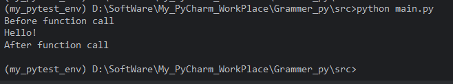

在上面的代码中：

-   `my_decorator` 是一个高阶函数，它接收函数 `func`，返回一个新的函数 `wrapper`。
-   `wrapper` 内部调用了原函数 `func`，并在调用前后添加了额外的打印。
-   最后我们将 `say_hello` 重新赋值为 `wrapper`，从而“装饰”了原函数。


#### 2、`@` 语法糖

Python 提供 `@` 符号作为装饰器的语法糖，使代码更简洁、易读。上面的手动装饰可以改写为：

```python
def my_decorator(func):
    def wrapper():
        print("Before function call")
        func()
        print("After function call")
    return wrapper

@my_decorator
def say_hello():
    print("Hello!")

say_hello()
```

`@my_decorator` 等价于 `say_hello = my_decorator(say_hello)`。`@` 符号后紧跟装饰器函数，Python 解释器会自动将下方定义的函数作为参数传给装饰器，并将返回的新函数重新绑定到原函数名。

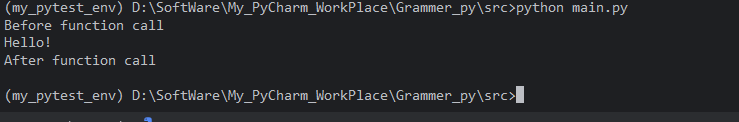


### 4. 装饰器与闭包

装饰器的实现通常依赖于**闭包**。闭包是指函数内部定义的函数，它可以访问外部函数的局部变量，即使外部函数已经执行完毕。在下面的例子中，`wrapper` 就是一个闭包，它捕获了外部函数 `my_decorator` 的参数 `func`（即原函数），并在 `wrapper` 内部使用它。

```python
def my_decorator(func):
    def wrapper():
        # 这里使用了 func，而 func 是外部函数的参数
        print("Before")
        func()
        print("After")
    return wrapper
  
def say_hello():
    print("Hello!")

# 手动应用装饰器
say_hello = my_decorator(say_hello)
say_hello()
```

当 `my_decorator(say_hello)` 返回后，`func` 本应被销毁，但因为 `wrapper` 闭包持有对它的引用，所以 `func` 仍然存活，可以在 `wrapper` 中调用。

### 5. 装饰器的高阶本质

从上述例子可以看出，装饰器就是高阶函数的一种具体应用：

-   **输入**：一个函数（被装饰的函数）
-   **输出**：一个新函数（包装后的函数）

装饰器本身可以看作是一个“函数工厂”，它接收一个函数，并返回一个增强后的函数。这种模式充分利用了函数是一等对象的特性，实现了对函数行为的动态扩展。

更进一步，装饰器还可以接受参数（即装饰器工厂），此时它不再是一个简单的高阶函数，而是一个返回装饰器的函数。但本质上仍然是高阶函数的组合。

```python
def repeat(times):
    def decorator(func):
        def wrapper(*args, **kwargs):
            for _ in range(times):
                result = func(*args, **kwargs)
            return result
        return wrapper
    return decorator

@repeat(3)
def greet():
    print("Hello")

greet()  # 打印三次 Hello
```

这里的 `repeat` 是一个函数，它接收参数 `times`，返回一个装饰器 `decorator`，而 `decorator` 才是真正的高阶函数（接收函数并返回函数）。因此，带参数的装饰器是“高阶函数的高阶函数”。

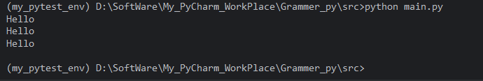

## 9.2 带参数的装饰器

普通的装饰器直接接收被装饰的函数作为参数，而**带参数的装饰器**则允许我们在应用装饰器时传入额外的配置参数，从而让装饰器的行为更加灵活。带参数的装饰器本质上是**装饰器工厂**：它接收参数，返回一个真正的装饰器，再由这个装饰器去包装目标函数。

### 1. 普通装饰器的回顾

普通装饰器是一个接收函数并返回新函数的可调用对象：

```python
def simple_decorator(func):
    def wrapper(*args, **kwargs):
        print("Before")
        result = func(*args, **kwargs)
        print("After")
        return result
    return wrapper

@simple_decorator
def greet():
    print("Hello!")

greet()
```

这里 `@simple_decorator` 等价于 `greet = simple_decorator(greet)`。

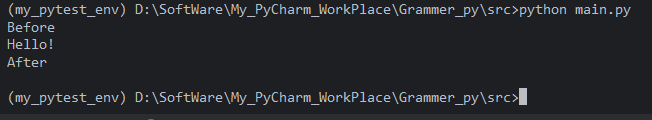

### 2. 带参数装饰器的本质：装饰器工厂

带参数装饰器实际上是一个**返回装饰器的函数**。它的语法是 `@decorator_factory(args)`，Python 会先调用 `decorator_factory(args)` 得到一个真正的装饰器，然后再用这个装饰器去装饰目标函数。

例如，我们想编写一个可以指定重复次数的装饰器：

```python
def repeat(times):
    def decorator(func):
        def wrapper(*args, **kwargs):
            for _ in range(times):
                result = func(*args, **kwargs)
            return result
        return wrapper
    return decorator

@repeat(3)
def say_hello():
    print("Hello!")

say_hello()
# 输出三次 Hello!
```

在这里：

-   `repeat` 是装饰器工厂，接收参数 `times`。
-   `repeat(3)` 返回了真正的装饰器 `decorator`。
-   `decorator(say_hello)` 返回了包装后的 `wrapper`。
-   最终 `say_hello` 被替换为 `wrapper`。

所以 `@repeat(3)` 实际上等价于：`say_hello = repeat(3)(say_hello)`

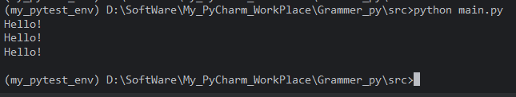

### 3. 带参数装饰器的实现模式

带参数装饰器通常包含**三层嵌套函数**：

1.  **最外层**：接收装饰器参数。
2.  **中间层**：接收被装饰的函数。
3.  **最内层**：实际的包装函数，负责调用原函数并添加额外逻辑。

通用模板：

```python
def decorator_factory(param1, param2, ...):
    def decorator(func):
        def wrapper(*args, **kwargs):
            # 使用 param1, param2, ... 以及 func
            result = func(*args, **kwargs)
            return result
        return wrapper
    return decorator
```

### 4. 带参数装饰器的常见应用场景

#### 4.1 重复执行

```python
def repeat(times):
    def decorator(func):
        def wrapper(*args, **kwargs):
            for _ in range(times):
                result = func(*args, **kwargs)
            return result
        return wrapper
    return decorator

@repeat(5)
def add(a, b):
    return a + b

print(add(2, 3))  # 执行5次后返回5（最后一次的返回值）
```

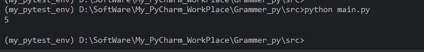

#### 4.2 日志级别控制

```python
import logging

def log(level):
    def decorator(func):
        def wrapper(*args, **kwargs):
            logging.log(level, f"Calling {func.__name__}")
            result = func(*args, **kwargs)
            logging.log(level, f"{func.__name__} returned {result}")
            return result
        return wrapper
    return decorator

@log(logging.INFO)
def compute(x):
    return x * 2

# Python 的 logging 模块默认的日志级别是 WARNING，而您使用的是 INFO 级别（数值较低），因此 INFO 级别的日志被过滤掉了。
# 可以使用 basicConfig 设置日志级别在程序开头（调用 compute 前）添加下面这行。这样会将根日志记录器的级别设置为 INFO，并添加一个默认的 StreamHandler（输出到控制台）
logging.basicConfig(level=logging.INFO)
compute(10))
```

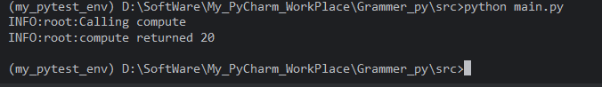

#### 4.3 权限校验

```python
def require_permission(permission):
    def decorator(func):
        def wrapper(user, *args, **kwargs):
            if user.has_permission(permission):
                return func(user, *args, **kwargs)
            else:
                raise PermissionError(f"缺少权限: {permission}")
        return wrapper
    return decorator

# 假设 user 对象有 has_permission 方法
@require_permission("admin")
def delete_user(user, user_id):
    print(f"删除用户 {user_id}")

# 使用时需要传入 user 对象
delete_user(current_user, 123)
```


#### 4.4 重试机制

```python
import time

def retry(max_attempts, delay=1):
    def decorator(func):
        def wrapper(*args, **kwargs):
            for attempt in range(max_attempts):
                try:
                    return func(*args, **kwargs)
                except Exception as e:
                    print(f"尝试 {attempt+1} 失败: {e}")
                    time.sleep(delay)
            raise Exception("所有尝试均失败")
        return wrapper
    return decorator

@retry(3, delay=0.5)
def unstable_network_call():
    # 模拟可能失败的操作
    pass
```


#### 4.5 缓存（带参数控制缓存大小等）

```python
from functools import lru_cache

# lru_cache 本身就是一个带参数的装饰器（或装饰器工厂）
@lru_cache(maxsize=128)
def fibonacci(n):
    if n < 2:
        return n
    return fibonacci(n-1) + fibonacci(n-2)
```


## 9.3 类装饰器

### 1. 装饰器基础回顾

在 Python 中，装饰器的本质是一个**可调用对象**（callable），它接收一个函数作为参数，并返回一个新的可调用对象（通常是函数）。使用 `@decorator` 语法时，解释器会执行以下操作：

```python
@decorator
def func():
    pass

# 等价于
func = decorator(func)
```

因此，任何可调用对象（函数、实现了 `__call__` 方法的类实例等）都可以作为装饰器。


### 2. 类作为装饰器的两种形式

#### 2.1 基本类装饰器（无参数）

最简单的类装饰器形式是：**类本身直接作为装饰器**，在 `__init__` 中接收被装饰的函数，并在 `__call__` 中实现额外的逻辑。

```python
class MyDecorator:
    def __init__(self, func):
        self.func = func

    def __call__(self, *args, **kwargs):
        print(f"Calling {self.func.__name__} with args={args}, kwargs={kwargs}")
        result = self.func(*args, **kwargs)
        print(f"Result: {result}")
        return result

@MyDecorator
def add(a, b):
    return a + b

add(3, 5)
# 输出：
# Calling add with args=(3, 5), kwargs={}
# Result: 8
```

**执行流程**：

-   `@MyDecorator` 相当于 `add = MyDecorator(add)`，此时 `MyDecorator.__init__` 被调用，`self.func` 保存原函数。
-   之后调用 `add(3, 5)` 时，由于 `add` 是 `MyDecorator` 的实例，会触发 `__call__` 方法，从而执行额外逻辑并调用原函数。

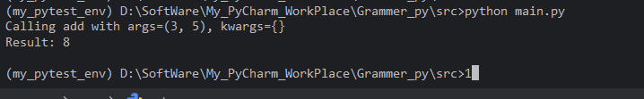


#### 2.2 带参数的类装饰器（装饰器工厂）

如果需要给装饰器传递参数（例如配置选项），则需要定义一个**装饰器工厂**。此时类通常用于保存配置参数，并在 `__call__` 中返回一个真正的装饰器函数（或另一个可调用对象）。

```python
class Repeat:
    def __init__(self, times):
        self.times = times

    def __call__(self, func):
        def wrapper(*args, **kwargs):
            for _ in range(self.times):
                result = func(*args, **kwargs)
            return result
        return wrapper

@Repeat(3)
def greet(name):
    print(f"Hello, {name}!")

greet("Alice")
# 输出三遍 Hello, Alice!
```

**执行流程**：

-   `Repeat(3)` 创建了一个 `Repeat` 实例，`times = 3`。
-   然后该实例被当作装饰器调用：`greet = Repeat(3)(greet)`，即调用 `__call__(greet)`。
-   `__call__` 接收原函数并返回一个包装函数 `wrapper`。
-   之后 `greet` 指向 `wrapper`，每次调用都会执行 `times` 次原函数。

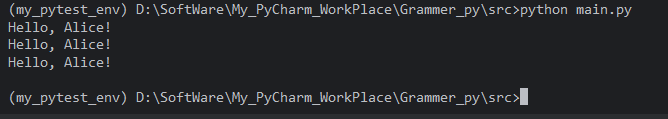

### 3. 类装饰器的优势

#### 3.1 自然地保存状态

函数装饰器若需要保存状态（如调用次数、缓存等），通常需要借助闭包、`nonlocal` 变量或外部容器。类装饰器可以直接使用实例属性来存储状态，代码更清晰。

```python
class CountCalls:
    def __init__(self, func):
        self.func = func
        self.count = 0

    def __call__(self, *args, **kwargs):
        self.count += 1
        print(f"Call {self.count} of {self.func.__name__}")
        return self.func(*args, **kwargs)

@CountCalls
def say_hi():
    print("Hi!")

say_hi()
say_hi()
# 输出：
# Call 1 of say_hi
# Hi!
# Call 2 of say_hi
# Hi!
```

-   `__init__`：初始化方法，接收一个函数对象 `func`，保存到 `self.func`，并把计数器 `self.count` 初始化为 `0`。

-   `__call__`：让类的实例可以像函数一样被调用。每当实例被调用时，会执行：

    1.  `self.count += 1`：计数器加一。
    2.  打印当前是第几次调用，以及原函数的名字 `self.func.__name__`。
    3.  调用并返回原函数 `self.func(*args, **kwargs)` 的结果。

-   使用 `@CountCalls` 装饰 `say_hi`

    ```python
    @CountCalls
    def say_hi():
        print("Hi!")
    ```

    装饰器语法 `@CountCalls` 等价于：

    ```python
    def say_hi():
        print("Hi!")
    
    say_hi = CountCalls(say_hi)
    ```

    也就是说：

    -   先定义了原始函数 `say_hi`。
    -   然后把这个函数对象传给 `CountCalls` 的构造函数，创建一个 `CountCalls` 实例。
    -   最后把变量名 `say_hi` 重新绑定到这个实例上。

    **此时 `say_hi` 不再是一个普通函数，而是一个 `CountCalls` 对象**，但它可以被调用，因为类中定义了 `__call__` 方法。

    此时实例内部状态：

    ```python
    say_hi.func   -> 原始函数对象
    say_hi.count  -> 0
    ```

-   第一次调用 `say_hi()`

    因为 `say_hi` 是 `CountCalls` 实例，调用它会触发 `__call__` 方法：

    1.  `self.count` 从 `0` 变为 `1`。

    2.  执行 `print(f"Call 1 of say_hi")`，输出：

        ```
        Call 1 of say_hi
        ```

    3.  调用原始函数 `self.func()`，原始函数体执行 `print("Hi!")`，输出：

        ```
        Hi!
        ```

    所以第一次调用后输出：

    ```text
    Call 1 of say_hi
    Hi!
    ```

-   第二次调用 `say_hi()`

    再次触发 `__call__`：

    1.  `self.count` 从 `1` 变为 `2`。

    2.  输出：

        ```text
        Call 2 of say_hi
        ```

    3.  再次调用原始函数，输出：

        ```text
        Hi!
        ```

    所以第二次调用后输出：

    ```text
    Call 2 of say_hi
    Hi!
    ```

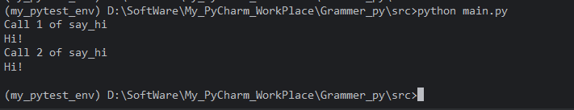

#### 3.2 逻辑组织更清晰

当装饰器内部逻辑较为复杂（多个方法、辅助函数、初始化操作）时，使用类可以将这些逻辑封装在类的方法中，提高可读性和可维护性。

#### 3.3 支持继承和扩展

类装饰器可以继承其他类，从而复用或扩展装饰器的功能。例如，可以定义一个基础装饰器类，然后通过继承添加特定行为。

```python
class BaseDecorator:
    def __init__(self, func):
        self.func = func

    def __call__(self, *args, **kwargs):
        return self.func(*args, **kwargs)

class LogDecorator(BaseDecorator):
    def __call__(self, *args, **kwargs):
        print(f"Logging: calling {self.func.__name__}")
        return super().__call__(*args, **kwargs)

@LogDecorator
def multiply(a, b):
    return a * b

multiply(4, 5)
# 输出：Logging: calling multiply
```

1、定义基础装饰器类 `BaseDecorator`

-   `__init__`：接收一个函数对象 `func`，保存到实例属性 `self.func`。
-   `__call__`：让实例可以像函数一样被调用，这里直接调用并返回原始函数的结果。
    这个类本身就是一个最简单的装饰器，作用相当于“原样转发”。

2、定义子类 `LogDecorator`，继承并扩展功能

-   `LogDecorator` 继承自 `BaseDecorator`，它覆盖了 `__call__` 方法。
-   在新的 `__call__` 中：
    1.  先打印一条日志，显示正在调用的函数名 `self.func.__name__`。
    2.  然后调用 `super().__call__(*args, **kwargs)`，也就是调用父类 `BaseDecorator` 的 `__call__` 方法。
    3.  父类的 `__call__` 会调用原始函数 `self.func` 并返回其结果。
-   这样，`LogDecorator` 在原有“直接调用原函数”的基础上，增加了日志打印功能。

3、使用 `@LogDecorator` 装饰 `multiply`

```python
@LogDecorator
def multiply(a, b):
    return a * b
```

装饰器语法 `@LogDecorator` 等价于：

```python
def multiply(a, b):
    return a * b

multiply = LogDecorator(multiply)
```

即：

1.  先定义原始函数 `multiply`。
2.  将该函数对象传给 `LogDecorator` 的构造函数（继承自 `BaseDecorator`，所以会执行 `BaseDecorator.__init__`），创建一个 `LogDecorator` 实例。
3.  将变量名 `multiply` 重新绑定到这个实例上。

此时，`multiply` 不再是一个普通函数，而是一个 `LogDecorator` 对象，但因为它实现了 `__call__`，所以仍然可以被调用。

实例内部状态：

```python
multiply.func   -> 原始 multiply 函数
```

4、调用 `multiply(4, 5)`

由于 `multiply` 是 `LogDecorator` 实例，调用它会触发 `LogDecorator.__call__` 方法：

1.  **执行日志打印**

    ```python
    print(f"Logging: calling {self.func.__name__}")
    ```

    `self.func.__name__` 是原始函数的名称，即 `"multiply"`，所以输出：

    ```text
    Logging: calling multiply
    ```

2.  **调用父类的 `__call__`**
    `super().__call__(*args, **kwargs)` 会找到 `BaseDecorator.__call__`，并将参数 `4` 和 `5` 传递给它。

3.  **父类 `BaseDecorator.__call__` 执行**

    ```python
    return self.func(*args, **kwargs)
    ```

    这里 `self.func` 是原始 `multiply` 函数，于是执行 `multiply(4, 5)`，计算 `4 * 5`，返回 `20`。

4.  **返回值传递**
    父类 `__call__` 返回 `20`，子类 `__call__` 将其返回给调用者。
    但在这个例子中，我们没有使用 `print` 或赋值，所以返回值被直接丢弃，控制台只显示了日志那一行。

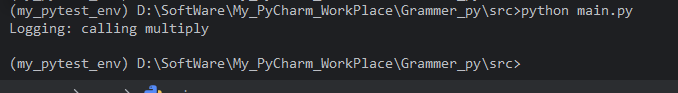

### 4. 保留原函数元信息

与函数装饰器一样，类装饰器也需要使用 `functools.wraps` 来保留被装饰函数的元数据（如 `__name__`、`__doc__` 等）。通常我们在 `__init__` 中使用 `wraps`，或者在返回的包装函数上使用。

**在 `__init__` 中使用 `wraps`**：

```python
from functools import wraps

class MyDecorator:
    def __init__(self, func):
        wraps(func)(self)  # 将 func 的元信息复制到 self 上
        self.func = func

    def __call__(self, *args, **kwargs):
        print("Before call")
        result = self.func(*args, **kwargs)
        print("After call")
        return result

@MyDecorator
def example():
    """Example docstring."""
    pass

print(example.__name__)   # example
print(example.__doc__)    # Example docstring.
```

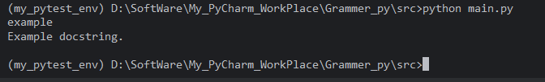

**在包装函数上使用 `wraps`**（适用于带参数的类装饰器）：

```python
from functools import wraps

class Repeat:
    def __init__(self, times):
        self.times = times

    def __call__(self, func):
        @wraps(func)
        def wrapper(*args, **kwargs):
            for _ in range(self.times):
                result = func(*args, **kwargs)
            return result
        return wrapper
```

### 5. 类装饰器 vs 函数装饰器

| 方面         | 函数装饰器                                | 类装饰器                                           |
| :----------- | :---------------------------------------- | :------------------------------------------------- |
| 状态保存     | 依赖闭包、`nonlocal` 或可变对象，稍显繁琐 | 直接使用实例属性，直观清晰                         |
| 代码结构     | 适合简单逻辑，嵌套函数可能降低可读性      | 适合复杂逻辑，可拆分为多个方法                     |
| 可扩展性     | 一般通过闭包嵌套或装饰器工厂实现          | 可通过继承、混入（Mixin）等方式扩展                |
| 额外参数     | 需要三层嵌套（工厂函数）                  | 天然支持：`__init__` 接收参数，`__call__` 接收函数 |
| 性能         | 略微优于类装饰器（函数调用开销更小）      | 类实例化与 `__call__` 调用有一定开销               |
| 习惯与简洁性 | 更常见、代码更短                          | 在需要状态或复杂逻辑时更具优势                     |

**选择建议**：

-   装饰器逻辑简单、无状态：优先使用函数装饰器。
-   需要保存状态、参数较多、逻辑复杂或需要继承扩展：使用类装饰器。

## 9.4 多个装饰器的叠加顺序

### 1. 装饰器叠加的语法与等价形式

假设有两个装饰器 `@decorator1` 和 `@decorator2`，它们同时应用于一个函数：

```python
@decorator1
@decorator2
def func():
    pass
```

**等价于以下代码**：

```python
func = decorator1(decorator2(func))
```

**关键点**：

-   装饰器的应用顺序是**自下而上**的：最靠近函数定义的装饰器（`decorator2`）最先被应用，然后才应用外层的装饰器（`decorator1`）。
-   从语法糖的角度看，`@decorator1` 位于上方，但它在 `decorator2` 之后才被调用，因为它要装饰的是 `decorator2(func)` 返回的结果。

**更一般的叠加形式**：

```python
@dec1
@dec2
@dec3
def f():
    pass

# 等价于
f = dec1(dec2(dec3(f)))
```

### 2. 装饰器链的执行顺序

当调用被装饰的函数时，装饰器链的执行顺序与装饰器的应用顺序**相反**，即**自上而下**。

以 `@decorator1` 和 `@decorator2` 为例，假设每个装饰器在调用原函数前后都打印信息：

```python
def decorator1(func):
    def wrapper(*args, **kwargs):
        print("Decorator 1 - before")
        result = func(*args, **kwargs)
        print("Decorator 1 - after")
        return result
    return wrapper

def decorator2(func):
    def wrapper(*args, **kwargs):
        print("Decorator 2 - before")
        result = func(*args, **kwargs)
        print("Decorator 2 - after")
        return result
    return wrapper

@decorator1
@decorator2
def greet():
    print("Hello!")

greet()
```

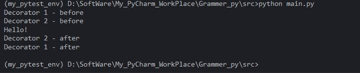

**输出**：

```text
Decorator 1 - before
Decorator 2 - before
Hello!
Decorator 2 - after
Decorator 1 - after
```

**解释**：

-   `greet` 被替换为 `decorator1(decorator2(original_greet))`。
-   调用 `greet()` 时，实际调用的是最外层的 `decorator1` 的 `wrapper` 函数。
-   `decorator1` 的 `wrapper` 打印 "before"，然后调用 `func`，而这里的 `func` 是 `decorator2` 的 `wrapper`。
-   `decorator2` 的 `wrapper` 打印 "before"，然后调用原始函数。
-   原始函数执行，打印 "Hello!"。
-   然后依次返回，`decorator2` 打印 "after"，`decorator1` 打印 "after"。

因此，**装饰器的执行顺序（调用过程）是从上到下，而返回过程是从下到上**，类似于洋葱模型或中间件的执行流程。

### 3. 带参数的装饰器叠加

带参数的装饰器本质上是**装饰器工厂**：先调用工厂函数（或类）获取真正的装饰器，然后再应用到函数上。当多个带参数的装饰器叠加时，要注意工厂函数的调用时机。

#### 示例：

```python
def repeat(times):
    def decorator(func):
        def wrapper(*args, **kwargs):
            for _ in range(times):
                result = func(*args, **kwargs)
            return result
        return wrapper
    return decorator

def log(prefix):
    def decorator(func):
        def wrapper(*args, **kwargs):
            print(f"{prefix} - before")
            result = func(*args, **kwargs)
            print(f"{prefix} - after")
            return result
        return wrapper
    return decorator

@log("LOG")
@repeat(3)
def say_hello():
    print("Hello!")

say_hello()
```

#### 代码详解

##### 1. 定义装饰器工厂

###### 1.1 `repeat(times)` 装饰器工厂

-   `repeat` 是一个**外层函数**，接收参数 `times`（希望重复执行的次数）。
-   它返回一个**装饰器函数** `decorator`。
-   `decorator` 接收被装饰的函数 `func`，并返回一个**包装函数** `wrapper`。
-   `wrapper` 在被调用时：
    -   循环 `times` 次，每次调用原函数 `func(*args, **kwargs)`，并将最后一次调用的返回值赋给 `result`。
    -   循环结束后返回 `result`。

由于闭包特性，`wrapper` 能够访问 `func` 和 `times`，即使外层函数已经执行完毕。

###### 1.2 `log(prefix)` 装饰器工厂

-   `log` 是外层函数，接收参数 `prefix`（日志前缀字符串）。
-   它返回一个装饰器函数 `decorator`。
-   `decorator` 接收被装饰的函数 `func`，返回包装函数 `wrapper`。
-   `wrapper` 在被调用时：
    -   打印 `"{prefix} - before"`。
    -   调用原函数 `func` 并保存返回值到 `result`。
    -   打印 `"{prefix} - after"`。
    -   返回 `result`。

同样，`wrapper` 闭包持有 `func` 和 `prefix`。

##### 2. 使用装饰器装饰 `say_hello`

```python
@log("LOG")
@repeat(3)
def say_hello():
    print("Hello!")
```

装饰器从**最靠近函数定义**的开始应用。因此，这等价于：

```python
def say_hello():
    print("Hello!")

say_hello = repeat(3)(say_hello)   # 先应用 repeat(3)
say_hello = log("LOG")(say_hello)  # 再应用 log("LOG")


## 最终等价代码
say_hello = log("LOG")(repeat(3)(say_hello))
```

###### 第一步：`@repeat(3)`

-   执行 `repeat(3)`，返回 `decorator` 函数。
-   将原始 `say_hello` 函数作为参数调用 `decorator`，即 `decorator(say_hello)`。
-   `decorator` 返回 `wrapper`，这个 `wrapper` 内部保存了 `func = 原始 say_hello` 和 `times = 3`。
-   此时变量 `say_hello` 被重新绑定为这个 `wrapper` 函数。

现在 `say_hello` 指向的 `wrapper` 功能是：循环 3 次调用原始 `say_hello`，并返回最后一次结果。

```python
say_hello = repeat(3)(say_hello)   # 先应用 repeat(3)
```

###### 第二步：@log("LOG")`

-   执行 `log("LOG")`，返回 `decorator` 函数。
-   将上一步得到的 `say_hello`（即 `repeat` 的 `wrapper`）作为参数调用 `decorator`，即 `decorator(wrapper_repeat)`。
-   `decorator` 返回一个新的 `wrapper`，这个 `wrapper` 内部保存了 `func = repeat的wrapper` 和 `prefix = "LOG"`。
-   变量 `say_hello` 再次被重新绑定为 `log` 的 `wrapper`。

最终，`say_hello` 指向的是 `log` 装饰器生成的包装函数，它的内部 `func` 是 `repeat` 的包装函数，而 `repeat` 包装函数的内部 `func` 才是原始的 `say_hello`。

```python
## 最终等价代码
say_hello = log("LOG")( repeat(3)(say_hello))  # 再应用 log("LOG")
```

结构图示：

```text
say_hello (log wrapper, prefix="LOG")
    └── func: repeat wrapper (times=3)
            └── func: 原始 say_hello
```

##### 3. 执行/调用过程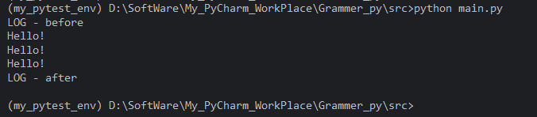


1.  `repeat(3)` 返回装饰器 `decorator_repeat`，然后 `decorator_repeat(say_hello)` 返回 `wrapper_repeat`。
2.  `log("LOG")` 返回装饰器 `decorator_log`，然后 `decorator_log(wrapper_repeat)` 返回 `wrapper_log`。
3.  最终 `say_hello` 指向 `wrapper_log`。

调用 `say_hello()` 时：

-   `wrapper_log` 打印 `LOG - before`，然后调用 `wrapper_repeat`。
-   `wrapper_repeat` 循环 3 次，每次调用原 `say_hello`（打印 "Hello!"）。
-   循环结束后返回，`wrapper_log` 打印 `LOG - after`。

### 4. 类装饰器叠加

类也可以作为装饰器，其叠加顺序与函数装饰器一致。但要注意类装饰器的 `__init__` 和 `__call__` 方法的调用时机。

#### **示例**：

```python
class DecoratorA:
    def __init__(self, func):
        print("DecoratorA __init__")
        self.func = func

    def __call__(self, *args, **kwargs):
        print("DecoratorA - before")
        result = self.func(*args, **kwargs)
        print("DecoratorA - after")
        return result

class DecoratorB:
    def __init__(self, func):
        print("DecoratorB __init__")
        self.func = func

    def __call__(self, *args, **kwargs):
        print("DecoratorB - before")
        result = self.func(*args, **kwargs)
        print("DecoratorB - after")
        return result

@DecoratorA
@DecoratorB
def my_func():
    print("Original function")

my_func()
```

#### 代码详解

##### 1. 定义两个类装饰器

###### 1.1 `DecoratorA`

-   `__init__` 接收被装饰的函数 `func`，打印一行初始化信息，并将 `func` 保存到实例属性。
-   `__call__` 让实例可以像函数一样被调用。调用时先打印 “before”，然后调用原始函数，最后打印 “after”，并返回结果。

###### 1.2 `DecoratorB`

结构与 `DecoratorA` 完全相同，只是打印的标识不同。 	

##### 2. 使用装饰器装饰 `my_func`

###### 第一步：`DecoratorB(my_func)`

-   执行 `DecoratorB` 的构造函数 `__init__`，传入原始 `my_func` 函数对象。

-   `__init__` 打印：

    ```text
    DecoratorB __init__
    ```

-   保存 `func`，并返回一个 `DecoratorB` 实例（记为 `b_instance`）。

-   此时 `my_func` 变量被重新绑定为 `b_instance`。

###### 第二步：`DecoratorA(b_instance)`

-   将上一步得到的 `b_instance` 作为参数传给 `DecoratorA` 的构造函数。

-   `__init__` 打印：

    ```text
    DecoratorA __init__
    ```

-   保存 `func = b_instance`，并返回一个 `DecoratorA` 实例（记为 `a_instance`）。

-   此时 `my_func` 变量最终被重新绑定为 `a_instance`。

**注意**：类装饰器的 `__init__` 在装饰阶段（即定义函数时）就执行了，所以这两行初始化打印会在调用 `my_func()` 之前输出。

##### 3. 调用 `my_func()`

由于 `my_func` 是 `DecoratorA` 的实例 `a_instance`，调用它会触发 `DecoratorA` 的 `__call__` 方法。

###### 3.1 进入 `DecoratorA.__call__`

```python
def __call__(self, *args, **kwargs):
    print("DecoratorA - before")      # ①
    result = self.func(*args, **kwargs)  # ② 调用 self.func，即 b_instance
    print("DecoratorA - after")       # ④
    return result
```

-   **①** 打印：

    ```
    DecoratorA - before
    ```

-   **②** 调用 `self.func`，也就是 `b_instance`（`DecoratorB` 实例）。这会触发 `DecoratorB.__call__`。

###### 3.2 进入 `DecoratorB.__call__`

```python
def __call__(self, *args, **kwargs):
    print("DecoratorB - before")      # ③
    result = self.func(*args, **kwargs)  # ④ 调用 self.func，即原始 my_func
    print("DecoratorB - after")       # ⑤
    return result
```

-   **③** 打印：

    ```
    DecoratorB - before
    ```

-   **④** 调用 `self.func`，即原始 `my_func` 函数。原始函数体执行 `print("Original function")`，输出：

    ```
    Original function
    ```

    原始函数没有显式返回值，因此返回 `None`。

-   **⑤** 打印：

    ```
    DecoratorB - after
    ```

-   返回 `None` 给 `DecoratorA.__call__` 中的 `result`。

###### 3.3 回到 `DecoratorA.__call__`

-   `result` 接收到 `None`。

-   **④** 打印：

    ```
    DecoratorA - after
    ```

-   返回 `None`，调用结束。

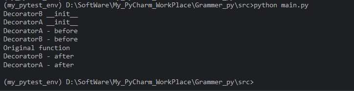


**解释**：

-   装饰时：先应用 `DecoratorB`（`DecoratorB(my_func)`），打印 `DecoratorB __init__`；然后应用 `DecoratorA` 到结果上，打印 `DecoratorA __init__`。
-   调用时：执行 `DecoratorA` 实例的 `__call__`，打印 `DecoratorA - before`，然后调用 `DecoratorB` 实例的 `__call__`，打印 `DecoratorB - before`，最后调用原函数。
-   返回过程从内到外。

带参数的类装饰器同理，先调用工厂创建实例，再应用装饰器。


## 9.5 functools.wraps与元数据保留

当我们使用装饰器时，如果不加处理，被装饰函数的元数据（如 `__name__`、`__doc__`、`__module__` 等）会丢失，被替换为装饰器内部包装函数的元数据。这会给调试、文档生成、内省等带来困扰。`functools.wraps` 正是为解决这一问题而设计的。

### 1. 装饰器带来的元数据问题

先看一个简单的装饰器示例：

```python
def my_decorator(func):
    def wrapper(*args, **kwargs):
        """Wrapper function"""
        print("Before calling...")
        result = func(*args, **kwargs)
        print("After calling...")
        return result
    return wrapper

@my_decorator
def say_hello():
    """Say hello to someone."""
    print("Hello!")

print(say_hello.__name__)   # 输出: wrapper
print(say_hello.__doc__)    # 输出: Wrapper function
```

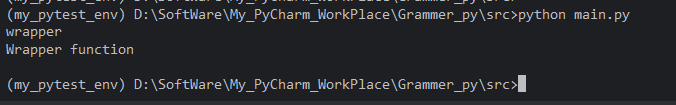

**问题**：`say_hello` 实际上已经不再是原来的函数，而是被 `wrapper` 替换了。因此，它的 `__name__` 变成了 `"wrapper"`，`__doc__` 变成了 `wrapper` 的文档字符串，而丢失了原函数的信息。

如果后续代码依赖于函数的名称（例如使用 `inspect` 模块、生成 API 文档、日志记录等），或者调试时查看堆栈，都会发现函数名不正确，带来困扰。

**解决方案**：在定义 `wrapper` 时，手动将原函数的元数据复制给 `wrapper`。但手动复制不仅繁琐，而且容易遗漏属性。`functools.wraps` 提供了一种简洁、标准化的方式来自动完成这一任务。

### 2. `functools.wraps` 的基本用法

`functools.wraps` 是一个装饰器工厂，它本身也是一个装饰器，用于装饰内部的包装函数。其基本用法如下：

```python
from functools import wraps

def my_decorator(func):
    @wraps(func)
    def wrapper(*args, **kwargs):
        """Wrapper function"""
        print("Before calling...")
        result = func(*args, **kwargs)
        print("After calling...")
        return result
    return wrapper

@my_decorator
def say_hello():
    """Say hello to someone."""
    print("Hello!")

print(say_hello.__name__)   # 输出: say_hello
print(say_hello.__doc__)    # 输出: Say hello to someone.
```

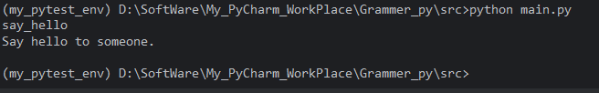

通过在 `wrapper` 函数定义前加上 `@wraps(func)`，`wraps` 会将原函数 `func` 的元数据复制到 `wrapper` 上。这样，`say_hello` 的元数据得以保留。


### 3. `functools.wraps` 的原理：`update_wrapper`

`functools.wraps` 实际上是一个简化版的 `functools.update_wrapper`。`update_wrapper` 是一个更底层的函数，负责将指定函数的元数据复制到另一个函数上。`wraps` 则是一个便捷的装饰器，方便在定义包装函数时直接使用。

`functools.update_wrapper` 的签名如下：

```python
functools.update_wrapper(wrapper, wrapped, assigned=WRAPPER_ASSIGNMENTS, updated=WRAPPER_UPDATES)
```

-   **`wrapper`**：包装函数（即要接收元数据的函数）。
-   **`wrapped`**：被包装的原函数（即提供元数据的函数）。
-   **`assigned`**：一个元组，指定要**直接赋值**给 `wrapper` 的属性名。默认值为 `functools.WRAPPER_ASSIGNMENTS`，即 `('__module__', '__name__', '__qualname__', '__doc__', '__annotations__')`。
-   **`updated`**：一个元组，指定要用 `wrapped` 的 `__dict__` 中的内容来**更新** `wrapper` 的 `__dict__` 的属性。默认值为 `functools.WRAPPER_UPDATES`，即 `('__dict__',)`。

`update_wrapper` 主要完成以下操作：

1.  对于 `assigned` 中的每个属性，如果 `wrapped` 存在该属性，则将其值赋给 `wrapper`（使用 `setattr`）。
2.  对于 `updated` 中的每个属性，如果 `wrapped` 存在该属性，则将对应的值（通常是 `__dict__`）更新到 `wrapper` 的 `__dict__` 中（即合并字典）。
3.  设置 `wrapper.__wrapped__ = wrapped`，用于记录被包装的原始函数。
4.  返回 `wrapper`。

`functools.wraps` 的实现可以简化为：

```python
def wraps(wrapped, assigned=WRAPPER_ASSIGNMENTS, updated=WRAPPER_UPDATES):
    return partial(update_wrapper, wrapped=wrapped, assigned=assigned, updated=updated)
```

它返回一个 `partial` 对象，该对象在作为装饰器使用时，会调用 `update_wrapper(wrapper, wrapped, ...)`。


### 4. `update_wrapper` 详细行为

让我们深入看一下 `update_wrapper` 默认复制和更新的属性。

#### 4.1 直接赋值 (`assigned`) 的属性

-   **`__module__`**：函数所属的模块名。
-   **`__name__`**：函数名。
-   **`__qualname__`**：函数的限定名称（Python 3.3+ 引入，包含类名等）。
-   **`__doc__`**：文档字符串。
-   **`__annotations__`**：函数参数和返回值的类型注解（Python 3 引入）。

这些属性直接通过 `getattr(wrapped, attr)` 获取并 `setattr(wrapper, attr, value)` 赋值，因此 `wrapper` 的这些属性将完全等同于 `wrapped` 的对应属性。

#### 4.2 更新 (`updated`) 的属性

-   **`__dict__`**：函数的属性字典。`update_wrapper` 会将 `wrapped.__dict__` 中的键值对更新到 `wrapper.__dict__` 中。这意味着原函数上自定义设置的属性（如 `func.custom_attr = 42`）也会被复制到包装函数上。

注意：这里使用的是 `wrapper.__dict__.update(wrapped.__dict__)`，而不是替换整个字典，因此包装函数自身的额外属性（例如装饰器添加的属性）可以保留。

#### 4.3 `__wrapped__` 属性

`update_wrapper` 会设置 `wrapper.__wrapped__ = wrapped`。这个属性用于记录被包装的原始函数，方便在需要时访问原始函数（例如使用 `inspect.unwrap` 或某些调试工具）。


### 5. 示例：查看元数据保留效果

#### 5.1 没有 `wraps` 的情况

```python
def decorator(func):
    def wrapper(*args, **kwargs):
        """Wrapper docstring"""
        return func(*args, **kwargs)
    return wrapper

@decorator
def my_func(a: int, b: int) -> int:
    """Add two numbers."""
    return a + b

print(my_func.__name__)          # wrapper
print(my_func.__doc__)           # Wrapper docstring
print(my_func.__annotations__)   # {}
print(my_func.__module__)        # __main__ (可能相同)
print(my_func.__qualname__)      # decorator.<locals>.wrapper
```

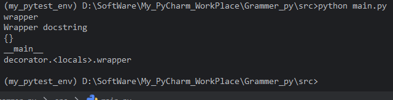

#### 5.2 使用 `wraps` 的情况

```python
from functools import wraps

def decorator(func):
    @wraps(func)
    def wrapper(*args, **kwargs):
        """Wrapper docstring"""
        return func(*args, **kwargs)
    return wrapper

@decorator
def my_func(a: int, b: int) -> int:
    """Add two numbers."""
    return a + b

print(my_func.__name__)          # my_func
print(my_func.__doc__)           # Add two numbers.
print(my_func.__annotations__)   # {'a': <class 'int'>, 'b': <class 'int'>, 'return': <class 'int'>}
print(my_func.__module__)        # __main__
print(my_func.__qualname__)      # my_func
print(my_func.__wrapped__)       # <function my_func at 0x...>
```

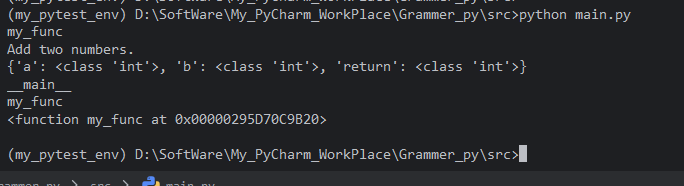

可以清楚看到，使用 `wraps` 后，所有重要的元数据都被保留，且 `__wrapped__` 指向原始函数。


### 6. 自定义 `assigned` 和 `updated`

在某些特殊情况下，你可能不想复制某些属性，或者想复制额外的属性。可以通过给 `wraps` 传递参数来定制。

```python
from functools import wraps

def my_decorator(func):
    @wraps(func, assigned=('__name__', '__doc__'))  # 只复制名称和文档
    def wrapper(*args, **kwargs):
        return func(*args, **kwargs)
    return wrapper
```

也可以扩展 `updated` 参数：

```python
@wraps(func, updated=('__dict__', '__custom_attr__'))
```

但通常使用默认值即可满足需求。


### 7. `wraps` 在类装饰器中的应用

类装饰器同样需要保留元数据。由于类装饰器在 `__init__` 中接收函数，通常使用 `update_wrapper` 或 `wraps` 来复制元数据到实例上。

**方法一：在 `__init__` 中使用 `update_wrapper`**

```python
from functools import update_wrapper

class MyDecorator:
    def __init__(self, func):
        update_wrapper(self, func)  # 将 func 的元数据复制到 self
        self.func = func

    def __call__(self, *args, **kwargs):
        print("Before")
        result = self.func(*args, **kwargs)
        print("After")
        return result

@MyDecorator
def greet():
    """Greet someone."""
    print("Hello!")

print(greet.__name__)  # greet
print(greet.__doc__)   # Greet someone.
```

`update_wrapper(self, func)` 会将 `func` 的元数据设置到实例 `self` 上，并设置 `self.__wrapped__ = func`。


**方法二：在 `__init__` 中使用 `wraps` 的变体**

由于 `wraps` 是装饰器工厂，不能直接用于实例，但可以这样：

```python
from functools import wraps

class MyDecorator:
    def __init__(self, func):
        wraps(func)(self)  # wraps(func) 返回 partial，调用它可更新 self
        self.func = func
```

这与 `update_wrapper(self, func)` 效果相同。


### 8. `functools.wraps` 与 `partial` 的交互

`functools.wraps` 返回一个 `partial` 对象，因此它本身也可以用于其他可调用对象，比如 `functools.partial` 对象。

```python
from functools import wraps, partial

def my_decorator(func):
    @wraps(func)
    def wrapper(*args, **kwargs):
        return func(*args, **kwargs)
    return wrapper

# 被装饰的函数可能是 partial 对象
original = partial(int, base=2)
decorated = my_decorator(original)
print(decorated('101'))  # 5
print(decorated.__name__)  # 输出什么？ 原 partial 对象没有 __name__，所以可能会报错？
```

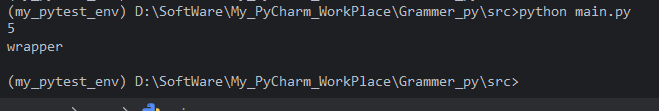

`partial` 对象本身没有 `__name__` 等属性，但 `wraps` 会尝试从 `wrapped` 获取这些属性。如果 `wrapped` 没有 `__name__`，`update_wrapper` 会设置一个默认值（例如 `wrapper.__name__ = 'partial'`），但不会出错。不过要注意，`partial` 对象通常没有 `__doc__` 等属性，复制时可能缺失。因此，在处理非函数可调用对象时，需要注意元数据的来源。


### 9. 多个装饰器叠加时的元数据保留

当多个装饰器叠加时，每个装饰器都应使用 `wraps`，以确保元数据在装饰器链中正确传递。

```python
from functools import wraps

def dec1(func):
    @wraps(func)
    def wrapper(*args, **kwargs):
        print("dec1")
        return func(*args, **kwargs)
    return wrapper

def dec2(func):
    @wraps(func)
    def wrapper(*args, **kwargs):
        print("dec2")
        return func(*args, **kwargs)
    return wrapper

@dec1
@dec2
def original():
    """Original doc"""
    pass

print(original.__name__)  # original
print(original.__doc__)   # Original doc
```

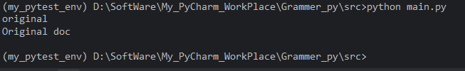

**原理**：

-   `dec2` 装饰 `original` 时，`@wraps(original)` 将 `original` 的元数据复制到 `dec2` 的 `wrapper` 上。
-   `dec1` 装饰的是 `dec2` 返回的 `wrapper`，但 `dec1` 的 `@wraps(func)` 中的 `func` 已经是那个 `wrapper`，而这个 `wrapper` 的元数据（由于 `wraps` 已经复制了原函数）就是 `original` 的元数据，所以最终元数据正确。

如果某个装饰器忘记使用 `wraps`，则从该层开始元数据会丢失。


### 10. `__wrapped__` 属性的作用

`__wrapped__` 属性提供了对原始函数的访问，它由 `update_wrapper` 自动设置。这个属性在很多场景中很有用：

-   **调试**：可以直接访问原始函数，绕过装饰器逻辑。
-   **测试**：使用 `inspect.unwrap` 可以递归剥离所有装饰器，获取最原始的函数。
-   **文档工具**：自动提取函数文档时，可以通过 `__wrapped__` 获取真实定义。

**示例：使用 `inspect.unwrap`**

```python
import inspect
from functools import wraps

def dec(func):
    @wraps(func)
    def wrapper(*args, **kwargs):
        """warpper statements"""
        return func(*args, **kwargs)
    return wrapper

@dec
def original():
  """original statements"""
    pass

print(original)                    # <function original at 0x...> (是 wrapper 的地址)
print(original.__wrapped__)        # <function original at 0x...> (是原始函数)
print(original is original.__wrapped__)      # False
print(inspect.unwrap(original) is original)  # False
print(inspect.unwrap(original) is original)  # False
```

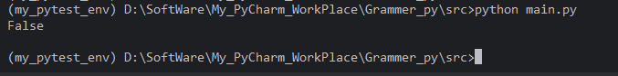

#### 代码解释

##### 1. 装饰器语法糖的本质

```python
@dec
def original():
    """original statements"""
    pass
```

等价于：

```python
def original():
    """original statements"""
    pass

original = dec(original)
```


-   先创建原始函数对象，并绑定到名字 `original`。
-   然后调用 `dec(original)`，将原始函数作为参数传入。
-   `dec` 内部定义了 `wrapper` 函数，并返回这个 `wrapper`。
-   最后将 `wrapper` 重新赋值给名字 `original`。

所以，**变量名 `original` 现在指向的是 `wrapper` 函数对象，而不再是原来的原始函数对象**。

##### 2. `functools.wraps` 的作用

`@wraps(func)` 装饰在 `wrapper` 上，做了以下事情：

-   将原始函数 `func` 的元信息（如 `__name__`、`__doc__`、`__module__` 等）复制到 `wrapper`，使其看起来像原始函数。
-   设置 `wrapper.__wrapped__ = func`，建立一条指向原始函数的引用链。

因此，`wrapper` 和原始函数是**两个不同的对象**，但 `wrapper` 拥有一个属性 `__wrapped__` 指向原始函数。

##### 3. `inspect.unwrap` 的工作原理

`inspect.unwrap(func)` 会沿着 `__wrapped__` 属性链递归查找，返回最里层的原始函数对象。

```python
inspect.unwrap(original)
```

此时 `original` 实际上是 `wrapper`，它有一个 `__wrapped__` 属性指向真正的原始函数，所以 `unwrap` 返回**真正的原始函数对象**。

##### 4. 为什么 `is` 比较结果是 `False`

-   `original` （变量） → 指向 `wrapper` 函数对象
-   `inspect.unwrap(original)` → 返回 `wrapper.__wrapped__`，即原始函数对象

这两个是不同的对象，因此 `is` 身份比较返回 `False`。


### 11. 最佳实践与注意事项

-   **始终在装饰器内部使用 `@wraps(func)`**，除非有特殊原因不保留元数据。
-   **在类装饰器中，应在 `__init__` 中使用 `update_wrapper(self, func)` 或 `wraps(func)(self)`**。
-   **当需要自定义元数据复制行为时，可以通过 `assigned` 和 `updated` 参数调整**。
-   **使用 `wraps` 保留元数据不仅是为了美观，更是为了代码的可维护性和可调试性**。
-   **注意：`wraps` 不会复制函数的闭包、默认参数等，这些属性不在标准元数据范围内**。如果需要保留默认参数，可能需要其他处理（例如使用 `__defaults__`），但默认参数通常不会被装饰器改变，因为包装函数调用原函数时会传递所有参数。


## 9.6 内置装饰器（@staticmethod / @classmethod / @property）

### 1. 背景：实例方法

在深入了解这三个装饰器之前，先回顾一下普通的**实例方法**。在类中定义的方法默认是实例方法，它的第一个参数是 `self`，表示实例对象本身。

```python
class MyClass:
    def instance_method(self, arg):
        print(f"Instance method called with self={self} and arg={arg}")

obj = MyClass()
obj.instance_method("hello")
```

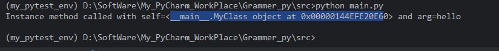

实例方法通过实例调用时，Python 会自动将实例对象作为第一个参数 `self` 传入。实例方法可以访问和修改实例的属性（通过 `self`），也可以访问类属性（通过 `self.__class__` 或直接使用类名）。


### 2. `@staticmethod`：静态方法

#### 2.1 定义与特点

`@staticmethod` 装饰的方法称为**静态方法**。静态方法不需要 `self` 或 `cls` 参数，它本质上就是一个普通的函数，只是因为逻辑上属于某个类而被定义在类的命名空间中。

-   静态方法**不能访问实例属性或类属性**（除非通过类名显式访问）。
-   调用方式：可以通过**类名**调用，也可以通过**实例**调用，但都不会自动传递任何特殊参数。
-   静态方法通常用于与类相关但不依赖于类或实例状态的工具函数。

#### 2.2 语法

```python
class MyClass:
    @staticmethod
    def static_method(arg1, arg2):
        print(f"Static method called with {arg1} and {arg2}")
```


#### 2.3 示例

```python
class MathUtils:
    @staticmethod
    def add(a, b):
        return a + b

    @staticmethod
    def multiply(a, b):
        return a * b

# 通过类名调用
print(MathUtils.add(3, 5))       # 8
print(MathUtils.multiply(3, 5))  # 15

# 通过实例调用（不推荐，但可行）
util = MathUtils()
print(util.add(2, 4))            # 6
```

**注意**：静态方法无法访问实例属性或类属性，如果尝试使用 `self` 或 `cls` 参数，会引发错误。

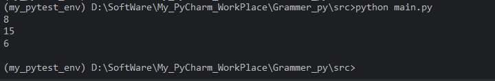

#### 2.4 何时使用静态方法？

-   方法与类有逻辑关联，但不需要访问类或实例的任何数据。
-   将相关函数组织在类内部，提高代码的内聚性和可读性。
-   有时用于替代模块级函数，使 API 更清晰。


### 3. `@classmethod`：类方法

#### 3.1 定义与特点

`@classmethod` 装饰的方法称为**类方法**。类方法的第一个参数是 `cls`，表示**类本身**（而不是实例）。通过 `cls`，类方法可以访问和修改类属性，甚至可以调用其他类方法或构造函数。

-   类方法可以访问类属性，但不能直接访问实例属性（因为没有实例引用）。
-   调用方式：可以通过**类名**调用，也可以通过**实例**调用，但无论哪种方式，Python 都会自动将**类对象**作为第一个参数 `cls` 传入。
-   类方法常用于定义**备选构造函数**、**工厂方法**，或者需要操作类状态的方法。

#### 3.2 语法

```python
class MyClass:
    class_attribute = 0

    @classmethod
    def class_method(cls, arg):
        print(f"Class method called with cls={cls} and arg={arg}")
        cls.class_attribute += 1
```


#### 3.3 示例

**示例 1：访问和修改类属性**

```python
class Counter:
    count = 0

    def __init__(self):
        Counter.increment_count()

    @classmethod
    def increment_count(cls):
        cls.count += 1

    @classmethod
    def get_count(cls):
        return cls.count

c1 = Counter()
c2 = Counter()
print(Counter.get_count())  # 2
```


**示例 2：备选构造函数（工厂方法）**

```python
class Person:
    def __init__(self, name, age):
        self.name = name
        self.age = age

    @classmethod
    def from_birth_year(cls, name, birth_year):
        age = 2025 - birth_year  # 假设当前年份
        return cls(name, age)

    @classmethod
    def from_dict(cls, data):
        return cls(data['name'], data['age'])

# 使用标准构造函数
p1 = Person("Alice", 30)

# 使用类方法作为备选构造函数
p2 = Person.from_birth_year("Bob", 1995)
p3 = Person.from_dict({"name": "Charlie", "age": 25})
```


#### 3.4 类方法与静态方法的区别

| 特性             | 类方法 (`@classmethod`)            | 静态方法 (`@staticmethod`)       |
| :--------------- | :--------------------------------- | :------------------------------- |
| 第一个参数       | `cls`（类对象）                    | 无特殊参数                       |
| 可以访问类属性   | 是                                 | 否（除非通过类名显式访问）       |
| 可以访问实例属性 | 否                                 | 否                               |
| 调用方式         | 类名或实例，均自动传入类对象       | 类名或实例，均不传入特殊参数     |
| 典型用途         | 工厂方法、修改类状态、继承相关操作 | 与类相关的实用函数，不依赖类状态 |

**继承行为**：类方法在继承时特别有用，因为 `cls` 是实际调用时的类，如果子类继承并调用了类方法，`cls` 将是子类，从而可以正确地创建子类实例或访问子类属性。静态方法则没有这种动态绑定。


## 9.7 装饰器的实际应用场景（日志、计时、缓存、权限）